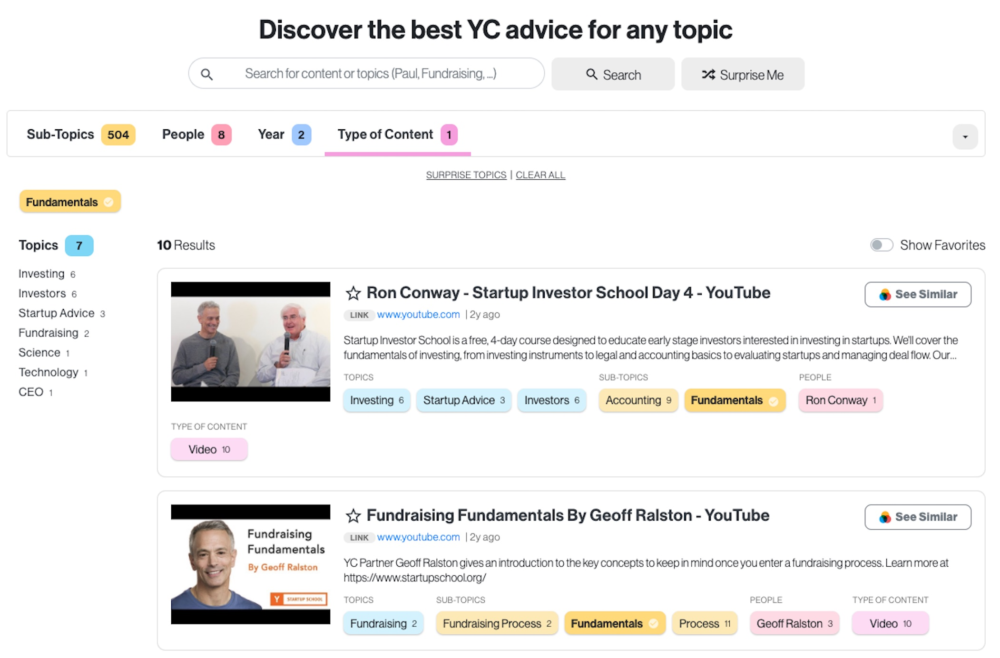

# awesome-ycombinator
A collection of awesome YCombinator resources for maximizing your startup and business.

These YC resources can also be conveniently browsed at [YCAdvice.com](ycadvice.com). Converted using [Polymer Search](http://polymersearch.com/beta), a search and insights engine that converts any set of structured data to a powerful experience.

  

* [Best resources by Topic](#best-resources-by-topic)
  * [Paul Graham Essays](#paul-graham-essays)
  * [Fundraising](#fundraising)
  * [Investors](#investors)
  * [Lessons Learned](#lessons-learned)
  * [Startup Advice](#startup-advice)
  * [Scale](#scale)
  * [Growth](#growth)
  * [Founder Story](#founder-story)
  * [Technology](#technology)
  * [New Markets](#new-markets)
  * [Ideas](#ideas)
  * [Finances](#finances)
  * [Building Companies](#building-companies)
  * [Strategy](#strategy)
  * [Misc](#misc)
  * [Product](#product)
  * [Marketing](#marketing)
  * [General Guidance](#general-guidance)
  * [Risk](#risk)
  * [Getting Started](#getting-started)
  * [Startup Management](#startup-management)
  * [CEO](#ceo)
  * [Interviews](#interviews)
  * [Investing](#investing)
  * [Female Founder](#female-founder)
  * [CoFounder](#cofounder)
  * [Science](#science)
  * [Sales And Marketing](#sales-and-marketing)
  * [How To](#how-to)
  * [User Acquisition](#user-acquisition)
  * [People And Culture](#people-and-culture)
  * [Decision Making](#decision-making)
* [Best resources by Sub-topic](#best-resources-by-sub-topic)
  * [Venture](#venture)
  * [Venture Capital](#venture-capital)
  * [Starting](#starting)
  * [Success](#success)
  * [Misc](#misc)
  * [HR](#hr)
  * [Equity](#equity)
  * [Valuations](#valuations)
  * [Mistakes](#mistakes)
  * [Angel Investing](#angel-investing)
  * [Startup Investing](#startup-investing)
  * [Building Technology](#building-technology)
  * [Hardware](#hardware)
  * [Execution](#execution)
  * [Employee Satisfaction](#employee-satisfaction)
  * [Startup](#startup)
  * [Metrics](#metrics)
  * [Hiring](#hiring)
  * [Software](#software)
  * [Design](#design)
  * [Market Fit](#market-fit)
  * [Keynote](#keynote)
  * [Product Launching](#product-launching)
  * [Machine Learning](#machine-learning)
  * [AI](#ai)
  * [Art](#art)
  * [Crowd Sourcing](#crowd-sourcing)
  * [AMA](#ama)
  * [Pitch](#pitch)
  * [Careers](#careers)
  * [CFO](#cfo)
  * [Biotech](#biotech)
  * [Platform](#platform)
  * [Sales](#sales)
  * [Accounting](#accounting)
  * [Research](#research)
  * [Analytics](#analytics)
  * [PR](#pr)
  * [Fundamentals](#fundamentals)
  * [User Retention](#user-retention)
  * [Process](#process)
  * [Legal And Finance](#legal-and-finance)
  * [Later Stage](#later-stage)
  * [Academia](#academia)
  * [Crypto Currency](#crypto-currency)
  * [Hard Tech](#hard-tech)
  * [Creators](#creators)
  * [Education](#education)
  * [SAFE](#safe)
  * [Discussion](#discussion)
  * [Raising Money](#raising-money)
  * [Staying Alive](#staying-alive)
  * [Relationships](#relationships)
  * [Slide Deck](#slide-deck)
  * [Profitability](#profitability)
  * [Leadership](#leadership)
  * [Building Products](#building-products)
  * [Early Stage](#early-stage)
  * [Applying To YC](#applying-to-yc)
* [Best resources by People](#best-resources-by-people)
  * [Paul Graham](#paul-graham)
  * [Jessica Livingston](#jessica-livingston)
  * [Ron Conway](#ron-conway)
  * [Sam Altman](#sam-altman)
  * [Adora Cheung](#adora-cheung)
  * [Elizabeth Iorns](#elizabeth-iorns)
  * [Justin Kan](#justin-kan)
  * [Kevin Hale](#kevin-hale)
  * [Paul Buchheit](#paul-buchheit)
  * [Eric Migicovsky](#eric-migicovsky)
  * [Reid Hoffman](#reid-hoffman)
  * [Kat Manalac](#kat-manalac)
  * [Carolynn Levy](#carolynn-levy)
  * [Kirsty Nathoo](#kirsty-nathoo)
  * [Craig Cannon](#craig-cannon)
  * [Daniel Gross](#daniel-gross)
  * [Ali Rowghani](#ali-rowghani)
  * [Anu Hariharan](#anu-hariharan)
  * [Dalton Caldwell](#dalton-caldwell)
  * [Michael Seibel](#michael-seibel)
  * [Jessica Livingstone](#jessica-livingstone)
  * [Gustaf Alstromer](#gustaf-alstromer)
  * [Aaron Harris](#aaron-harris)
  * [Geoff Ralston](#geoff-ralston)
  * [Elad Gil](#elad-gil)
  * [Holly Liu](#holly-liu)
  * [Jared Friedman](#jared-friedman)
* [Best resources by Year](#best-resources-by-year)
  * [2005](#2005)
  * [2006](#2006)
  * [2007](#2007)
  * [2008](#2008)
  * [2009](#2009)
  * [2010](#2010)
  * [2012](#2012)
  * [2013](#2013)
  * [2014](#2014)
  * [2015](#2015)
  * [2016](#2016)
  * [2017](#2017)
  * [2018](#2018)
  * [2019](#2019)
# Best resources by Topic
## Paul Graham Essays
* [After the Ladder](http://www.paulgraham.com/ladder.html)
* [Inequality and Risk](http://www.paulgraham.com/inequality.html)
* [The Venture Capital Squeeze](http://www.paulgraham.com/vcsqueeze.html)
* [How to Fund a Startup](http://www.paulgraham.com/startupfunding.html)
* [The Hardest Lessons for Startups to Learn](http://www.paulgraham.com/startuplessons.html)
* [The 18 Mistakes That Kill Startups](http://www.paulgraham.com/startupmistakes.html)
* [Learning from Founders](http://www.paulgraham.com/foundersatwork.html)
* [Why to Not Not Start a Startup](http://www.paulgraham.com/notnot.html)
* [The Hacker's Guide to Investors](http://www.paulgraham.com/guidetoinvestors.html)
* [The Equity Equation](http://www.paulgraham.com/equity.html)
* [You Weren't Meant to Have a Boss](http://www.paulgraham.com/boss.html)
* [Why There Aren't More Googles](http://www.paulgraham.com/googles.html)
* [The Pooled-Risk Company Management Company](http://www.paulgraham.com/prcmc.html)
* [Why to Start a Startup in a Bad Economy](http://www.paulgraham.com/badeconomy.html)
* [The Other Half of "Artists Ship"](http://www.paulgraham.com/artistsship.html)
* [Could VC be a Casualty of the Recession?](http://www.paulgraham.com/divergence.html)
* [Startups in 13 Sentences](http://www.paulgraham.com/13sentences.html)
* [What I've Learned from Hacker News](http://www.paulgraham.com/hackernews.html)
* [How to Be an Angel Investor](http://www.paulgraham.com/angelinvesting.html)
* [A Local Revolution?](http://www.paulgraham.com/revolution.html)
* [The Anatomy of Determination](http://www.paulgraham.com/determination.html)
* [What Startups Are Really Like](http://www.paulgraham.com/really.html)
* [Organic Startup Ideas](http://www.paulgraham.com/organic.html)
* [How to Lose Time and Money](http://www.paulgraham.com/selfindulgence.html)
* [The Future of Startup Funding](http://www.paulgraham.com/future.html)
* [High Resolution Fundraising](http://www.paulgraham.com/hiresfund.html)
* [The New Funding Landscape](http://www.paulgraham.com/superangels.html)
* [What We Look for in Founders](http://www.paulgraham.com/founders.html)
* [Founder Control](http://www.paulgraham.com/control.html)
* [Why Startup Hubs Work](http://www.paulgraham.com/hubs.html)
* [Schlep Blindness](http://www.paulgraham.com/schlep.html)
* [A Word to the Resourceful](http://www.paulgraham.com/word.html)
* [Frighteningly Ambitious Startup Ideas](http://www.paulgraham.com/ambitious.html)
* [Black Swan Farming](http://www.paulgraham.com/swan.html)
* [The Hardware Renaissance](http://www.paulgraham.com/hw.html)
* [Startup Investing Trends](http://www.paulgraham.com/invtrend.html)
* [Investor Herd Dynamics](http://www.paulgraham.com/herd.html)
* [How to Raise Money](http://www.paulgraham.com/fr.html)
* [Before the Startup](http://www.paulgraham.com/before.html)
* [The Fatal Pinch](http://www.paulgraham.com/pinch.html)
## Fundraising
* [The Venture Capital Squeeze](http://www.paulgraham.com/vcsqueeze.html)
* [The Hacker's Guide to Investors](http://www.paulgraham.com/guidetoinvestors.html)
* [Could VC be a Casualty of the Recession?](http://www.paulgraham.com/divergence.html)
* [The New Funding Landscape](http://www.paulgraham.com/superangels.html)
* [Founder Control](http://www.paulgraham.com/control.html)
* [Startup Investing Trends](http://www.paulgraham.com/invtrend.html)
* [Investor Herd Dynamics](http://www.paulgraham.com/herd.html)
* [How to Raise Money](http://www.paulgraham.com/fr.html)
* [The Fatal Pinch](http://www.paulgraham.com/pinch.html)
* [Valuation – AVC](https://avc.com/2004/07/valuation/)
* [Jessica Livingston at Startup School 2012 - YouTube](https://www.youtube.com/watch?v=KQJ6zsNCA-4)
* [Ron Conway at Startup School 2013 - YouTube](https://www.youtube.com/watch?v=7bm-Xj2jMCk)
* [Fundraising Panel at Female Founders Conference 2014 - YouTube](https://www.youtube.com/watch?v=WUr4J4XuRIo)
* [Office Hours at Startup School NY 2014 - YouTube](https://www.youtube.com/watch?v=wKaJPZMOWVg)
* [David Lee at Startup School NY 2014 - YouTube](https://www.youtube.com/watch?v=Dt-8Io0i_F4)
* [Shana Fisher at Startup School NY 2014 - YouTube](https://www.youtube.com/watch?v=Vp48ko2VJgE)
* [Fred Wilson Interview at Startup School NY 2014 - YouTube](https://www.youtube.com/watch?v=UTtnbT-YZqU)
* [Alfred Lin with Justin Kan - YouTube](https://www.youtube.com/watch?v=T-D-JqxQtIY)
* [Office Hours with Kevin & Qasar - YouTube](https://www.youtube.com/watch?v=Ud4Q1Lzh5c8)
* [Fundraising Panel at Female Founders Conference 2015 - YouTube](https://www.youtube.com/watch?v=8eKkwX9q_Lc)
* [Fundraising Panel at Female Founders Conference 2016 - YouTube](https://www.youtube.com/watch?v=Ts9SOxgsbtw)
* [Pitch Practice with Paul Buchheit and Sam Altman at Startup School SV 2016 - YouTube](https://www.youtube.com/watch?v=fcyf9z4gSeI)
* [Office Hours with Daniel Gross - YouTube](https://www.youtube.com/watch?v=DzjKcUtRkCU)
* [How to Raise Money with Marc Andreessen, Ron Conway, and Parker Conrad (HtSaS 2014: 9) - YouTube](https://www.youtube.com/watch?v=0JBOSmRo8js)
* [How to Be a Great Founder with Reid Hoffman (How to Start a Startup 2014: Lecture 13) - YouTube](https://www.youtube.com/watch?v=pkAum45ubWc)
* [Sales and Marketing + How to Talk to Investors with Tyler Bosmeny and YC Partners (HtSaS 2014: 19) - YouTube](https://www.youtube.com/watch?v=OdhmKqBfhEU)
* [Founders of Science Exchange, Goldbely, and The Flex Company Discuss Fundraising - YouTube](https://www.youtube.com/watch?v=i5DL6qsDd44)
* [Fundraising Advice from Female Founders - YouTube](https://www.youtube.com/watch?v=GHoTciAH8Uo)
* [Aaron Harris - Startup Investor School Day 4 - YouTube](https://www.youtube.com/watch?v=M79V8HRffvQ)
* [Pitch Practice with FlavorCloud, Holly Liu, and Adora Cheung - YouTube](https://www.youtube.com/watch?v=LfqUzQpGgww)
* [Funding Is an Outcome of Building a Good Business - Porter Braswell of Jopwell - YouTube](https://www.youtube.com/watch?v=EZgTD3pggpc)
* [Office Hours with Michael Seibel - YouTube](https://www.youtube.com/watch?v=JJ2BWOT4hfs)
* [Fundraising Fundamentals By Geoff Ralston - YouTube](https://www.youtube.com/watch?v=gcevHkNGrWQ&t=1s)
* [Understanding SAFEs and Priced Equity Rounds by Kirsty Nathoo - YouTube](https://www.youtube.com/watch?v=Dk6JNTDec9I)
* [How to Get Meetings with Investors and Raise Money by Aaron Harris - YouTube](https://www.youtube.com/watch?v=Jzz4AEIddzY&t=1s)
* [Increasing Healthy Human Lifespan, Laura Deming of The Longevity Fund - YouTube](https://www.youtube.com/watch?v=GtGlblrBMCU)
* [Why Does Your Company Deserve More Money? by Michael Seibel - YouTube](https://www.youtube.com/watch?v=xqSyeQ689WM)
* [Ryan Hoover on Product Hunt's Acquisition and Lessons Learned About Launches with Dalton Caldwell - YouTube](https://www.youtube.com/watch?v=JaqUUAYi_Yo)
* [How Investors Think About Ideas - Wufoo Cofounder Kevin Hale - YouTube](https://www.youtube.com/watch?v=haqjaY_0uEc&t=18s)
* [Max Rhodes of Faire with Anu Hariharan on Scaling and Fundraising - YouTube](https://www.youtube.com/watch?v=qajK1J1neAM)
* [Should You Move Your Company to Silicon Valley? - Eric Migicovsky, Pebble Founder - YouTube](https://www.youtube.com/watch?v=Zj1WyGpSbrM)
* [Anu Hariharan on Managing a Board - YouTube](https://www.youtube.com/watch?v=1J0n25kixSA)
* [Aaron Harris on Fundraising and Meeting with Investors - YouTube](https://www.youtube.com/watch?v=fNV3JIK0z-k)
* [Anu Hariharan and Adora Cheung - How Investors Measure Startups Q&A - YouTube](https://www.youtube.com/watch?v=zcG-kXH4mPk)
* [How Pitching Investors is Different Than Pitching Customers - Michael Seibel - YouTube](https://www.youtube.com/watch?v=pQnOBHNKlgs)
* [How Investors Think About Ideas - Wufoo Cofounder Kevin Hale - YouTube](https://www.youtube.com/watch?v=haqjaY_0uEc)
* [Tips on Formation and Fundraising](https://blog.ycombinator.com/startup-formation-and-fundraising/)
* [A Guide to Preemptive Funding Offers](https://blog.ycombinator.com/a-strategic-guide-to-preemptive-funding-offers/)
* [Don’t Over-Optimize Fundraising](https://blog.ycombinator.com/dont-over-optimize-fundraising/)
* [Max Rhodes of Faire with Anu Hariharan on Scaling and Fundraising](https://blog.ycombinator.com/max-rhodes-of-faire-with-anu-hariharan-on-scaling-and-fundraising/)
* [Fundraising Fundamentals By Geoff Ralston - YouTube](https://www.youtube.com/watch?v=gcevHkNGrWQ)
* [How to Get Meetings with Investors and Raise Money by Aaron Harris - YouTube](https://www.youtube.com/watch?v=Jzz4AEIddzY)
* [Lecture 9 - How to Raise Money (Marc Andreessen, Ron Conway, Parker Conrad) - YouTube](https://www.youtube.com/watch?time_continue=1&v=uFX95HahaUs)
* [Founders of Science Exchange, Goldbely, and The Flex Company Discuss Fundraising](https://blog.ycombinator.com/founders-of-science-exchange-goldbely-and-the-flex-company-discuss-fundraising/)
* [Why Does Your Company Deserve More Money?](https://blog.ycombinator.com/why-does-your-company-deserve-more-money/)
* [How to Email Early Stage Investors](https://blog.ycombinator.com/how-to-email-early-stage-investors/)
* [A Guide to Demo Day Presentations](https://blog.ycombinator.com/guide-to-demo-day-pitches/)
* [How to Pitch Your Company](https://blog.ycombinator.com/how-to-pitch-your-company/)
* [Advice on pitching - Aaron's Blog](http://www.aaronkharris.com/advice-on-pitching)
* [How to Design a Better Pitch Deck](https://blog.ycombinator.com/how-to-design-a-better-pitch-deck/)
* [Dilution](https://blog.ycombinator.com/dilution/)
* [Raising Money Online – Advice For Startups](https://blog.ycombinator.com/raising-money-online-advice-for-startups/)
* [A Guide to Seed Fundraising](https://blog.ycombinator.com/how-to-raise-a-seed-round/)
* [Fundraising Advice from Female Founders](https://blog.ycombinator.com/fundraising-advice-from-female-founders/)
* [How to Raise Money, and How to Succeed Long-Term - CS183F - YouTube](https://www.youtube.com/watch?time_continue=2382&v=5ZXU84_sGXo)
* [Process and Leverage in Fundraising](https://blog.ycombinator.com/process-and-leverage-in-fundraising/)
* [When to Raise a Series A](https://blog.ycombinator.com/when-to-raise-a-series-a/)
* [How to Fund a Startup](http://paulgraham.com/startupfunding.html)
* [The Hacker's Guide to Investors](http://paulgraham.com/guidetoinvestors.html)
* [How to Present to Investors](http://paulgraham.com/investors.html)
* [The Equity Equation](http://paulgraham.com/equity.html)
* [A Fundraising Survival Guide](http://www.paulgraham.com/fundraising.html)
* [The Venture Capital Squeeze](http://paulgraham.com/vcsqueeze.html)
* [Lecture 19 - Sales and Marketing; How to Talk to Investors (Tyler Bosmeny; YC Partners) - YouTube](https://www.youtube.com/watch?v=SHAh6WKBgiE)
* [How to Raise Money](http://paulgraham.com/fr.html)
* [How to Convince Investors](http://paulgraham.com/convince.html)
* [Understanding SAFEs and Priced Equity Rounds](https://www.startupschool.org/videos/49)
* [Startup Documents](https://www.ycombinator.com/documents/#safe)
* [Safes are not bad for entrepreneurs](https://blog.ycombinator.com/safes-are-not-bad-for-entrepreneurs/)
* [The YC Seed Deck Template](https://blog.ycombinator.com/intro-to-the-yc-seed-deck/)
* [YC’s Series A Diligence Checklist](https://blog.ycombinator.com/ycs-series-a-diligence-checklist/)
* [Startup Mechanics - Kirsty Nathoo](https://www.startupschool.org/videos/2)
* [Startup Playbook](https://playbook.samaltman.com/)
* [How to Raise Money, and How to Succeed Long-Term - Jess Lee, Aaron Harris, & Ali Rowghani](https://www.startupschool.org/videos/18)
* [Does YC Fund Solo Founders? - Jared Friedman - YouTube](https://www.youtube.com/watch?v=ygr3qcERyRM&feature=youtu.be)
* [What Y Combinator Looks for in Nonprofits](https://blog.ycombinator.com/what-y-combinator-looks-for-in-nonprofits/)
## Investors
* [How to Fund a Startup](http://www.paulgraham.com/startupfunding.html)
* [The Hacker's Guide to Investors](http://www.paulgraham.com/guidetoinvestors.html)
* [Why There Aren't More Googles](http://www.paulgraham.com/googles.html)
* [The Anatomy of Determination](http://www.paulgraham.com/determination.html)
* [How to Lose Time and Money](http://www.paulgraham.com/selfindulgence.html)
* [The Future of Startup Funding](http://www.paulgraham.com/future.html)
* [High Resolution Fundraising](http://www.paulgraham.com/hiresfund.html)
* [Black Swan Farming](http://www.paulgraham.com/swan.html)
* [Startup Investing Trends](http://www.paulgraham.com/invtrend.html)
* [Investor Herd Dynamics](http://www.paulgraham.com/herd.html)
* [How to Raise Money](http://www.paulgraham.com/fr.html)
* [The Fatal Pinch](http://www.paulgraham.com/pinch.html)
* [Valuation – AVC](https://avc.com/2004/07/valuation/)
* [Ron Conway at Startup School 2012 - YouTube](https://www.youtube.com/watch?v=1z87RGFGuxQ)
* [Ron Conway at Startup School 2013 - YouTube](https://www.youtube.com/watch?v=7bm-Xj2jMCk)
* [Jessica Livingston at Female Founders Conference 2014 - YouTube](https://www.youtube.com/watch?v=sNrDEIYAMjE)
* [David Lee at Startup School NY 2014 - YouTube](https://www.youtube.com/watch?v=Dt-8Io0i_F4)
* [Fred Wilson Interview at Startup School NY 2014 - YouTube](https://www.youtube.com/watch?v=UTtnbT-YZqU)
* [Alfred Lin with Justin Kan - YouTube](https://www.youtube.com/watch?v=T-D-JqxQtIY)
* [Paul Buchheit - YouTube](https://www.youtube.com/watch?v=v5w-0H-hq6E)
* [Ron Conway at Startup School SV 2014 - YouTube](https://www.youtube.com/watch?v=qvHhhIfu7Lo)
* [Fundraising Panel at Female Founders Conference 2016 - YouTube](https://www.youtube.com/watch?v=Ts9SOxgsbtw)
* [Pitch Practice with Paul Buchheit and Sam Altman at Startup School SV 2016 - YouTube](https://www.youtube.com/watch?v=fcyf9z4gSeI)
* [Sales and Marketing + How to Talk to Investors with Tyler Bosmeny and YC Partners (HtSaS 2014: 19) - YouTube](https://www.youtube.com/watch?v=OdhmKqBfhEU)
* [Erin Frey on Therapy - YouTube](https://www.youtube.com/watch?v=LEgbK735lfw)
* [Ben Huh on Therapy - YouTube](https://www.youtube.com/watch?v=e2644ylntQQ)
* [Building Your Board | Glenn Kelman - YouTube](https://www.youtube.com/watch?v=MdLgVgJkOlQ)
* [Blockchain Investing - Olaf Carlson-Wee and Aaron Harris - YouTube](https://www.youtube.com/watch?v=9SYVX2wcMVM)
* [The Two Most Common Mistakes Growth Stage Founders Make - YouTube](https://www.youtube.com/watch?v=vbu-DlUGnkk)
* [Fundraising Advice from Female Founders - YouTube](https://www.youtube.com/watch?v=GHoTciAH8Uo)
* [Geoff Ralston's Intro - Startup Investor School Day 1 - YouTube](https://www.youtube.com/watch?v=7aiJlRS2i_w)
* [Sam Altman - Startup Investor School Day 1 - YouTube](https://www.youtube.com/watch?v=s-4QqHHE16s)
* [Carolynn Levy and Kirsty Nathoo - Startup Investor School Day 1 - YouTube](https://www.youtube.com/watch?v=Sk5B2Ud1DVg)
* [Startup Investor School Day 2 Live Stream - YouTube](https://www.youtube.com/watch?v=IvttzQnsxls)
* [Michael Seibel - Startup Investor School Day 2 - YouTube](https://www.youtube.com/watch?v=ugmjf0fJY84)
* [Dalton Caldwell - Startup Investor School Day 2 - YouTube](https://www.youtube.com/watch?v=uyTOFU0Pn6E)
* [Paul Buchheit - Startup Investor School Day 2 - YouTube](https://www.youtube.com/watch?v=bSbPXrQ9Wf8)
* [Elad Gil and Pejman Nozad - Startup Investor School Day 3 - YouTube](https://www.youtube.com/watch?v=VThN7kpjRpM)
* [Jeff Clavier and Andrea Zurek - Startup Investor School Day 3 - YouTube](https://www.youtube.com/watch?v=86AblikwSlg)
* [Ali Partovi - Startup Investor School Day 3 - YouTube](https://www.youtube.com/watch?v=-NwcwC3l3uk)
* [Aaron Harris - Startup Investor School Day 4 - YouTube](https://www.youtube.com/watch?v=M79V8HRffvQ)
* [Andy Bromberg - Startup Investor School Day 4 - YouTube](https://www.youtube.com/watch?v=T6g2D92H1FQ)
* [Ron Conway - Startup Investor School Day 4 - YouTube](https://www.youtube.com/watch?v=bgwqM6J3WeM)
* [Pitch Practice with FlavorCloud, Holly Liu, and Adora Cheung - YouTube](https://www.youtube.com/watch?v=LfqUzQpGgww)
* [YC Partner Panel at the Seattle Female Founders Conference - YouTube](https://www.youtube.com/watch?v=k9umGp_bQtY)
* [CoinList Cofounder Andy Bromberg and Ramon Recuero - YouTube](https://www.youtube.com/watch?v=Xen6AOu8lko)
* [Elad Gil Shares Advice from the High Growth Handbook, a Guide to Scaling Startups - YouTube](https://www.youtube.com/watch?v=6bhlwWJDhtk)
* [Office Hours with Michael Seibel - YouTube](https://www.youtube.com/watch?v=JJ2BWOT4hfs)
* [Fundraising Fundamentals By Geoff Ralston - YouTube](https://www.youtube.com/watch?v=gcevHkNGrWQ&t=1s)
* [How to Get Meetings with Investors and Raise Money by Aaron Harris - YouTube](https://www.youtube.com/watch?v=Jzz4AEIddzY&t=1s)
* [Increasing Healthy Human Lifespan, Laura Deming of The Longevity Fund - YouTube](https://www.youtube.com/watch?v=GtGlblrBMCU)
* [Why Does Your Company Deserve More Money? by Michael Seibel - YouTube](https://www.youtube.com/watch?v=xqSyeQ689WM)
* [Ryan Hoover on Product Hunt's Acquisition and Lessons Learned About Launches with Dalton Caldwell - YouTube](https://www.youtube.com/watch?v=JaqUUAYi_Yo)
* [Caterina Fake on Her New Podcast, Should This Exist? With Kat Manalac - YouTube](https://www.youtube.com/watch?v=Xn1rcjojZZc)
* [How Investors Think About Ideas - Wufoo Cofounder Kevin Hale - YouTube](https://www.youtube.com/watch?v=haqjaY_0uEc&t=18s)
* [Kevin Hale - How to Evaluate Startup Ideas Pt . 1 - YouTube](https://www.youtube.com/watch?v=DOtCl5PU8F0)
* [Aaron Harris on Fundraising and Meeting with Investors - YouTube](https://www.youtube.com/watch?v=fNV3JIK0z-k)
* [Anu Hariharan and Adora Cheung - How Investors Measure Startups Q&A - YouTube](https://www.youtube.com/watch?v=zcG-kXH4mPk)
* [How Pitching Investors is Different Than Pitching Customers - Michael Seibel - YouTube](https://www.youtube.com/watch?v=pQnOBHNKlgs)
* [How Investors Think About Ideas - Wufoo Cofounder Kevin Hale - YouTube](https://www.youtube.com/watch?v=haqjaY_0uEc)
* [A Guide to Preemptive Funding Offers](https://blog.ycombinator.com/a-strategic-guide-to-preemptive-funding-offers/)
* [How to Get Meetings with Investors and Raise Money by Aaron Harris - YouTube](https://www.youtube.com/watch?v=Jzz4AEIddzY)
* [Why Does Your Company Deserve More Money?](https://blog.ycombinator.com/why-does-your-company-deserve-more-money/)
* [How to Email Early Stage Investors](https://blog.ycombinator.com/how-to-email-early-stage-investors/)
* [A Guide to Demo Day Presentations](https://blog.ycombinator.com/guide-to-demo-day-pitches/)
* [How to Pitch Your Company](https://blog.ycombinator.com/how-to-pitch-your-company/)
* [The Hacker's Guide to Investors](http://paulgraham.com/guidetoinvestors.html)
* [How to Present to Investors](http://paulgraham.com/investors.html)
* [Lecture 19 - Sales and Marketing; How to Talk to Investors (Tyler Bosmeny; YC Partners) - YouTube](https://www.youtube.com/watch?v=SHAh6WKBgiE)
* [How to Raise Money](http://paulgraham.com/fr.html)
* [How to Convince Investors](http://paulgraham.com/convince.html)
* [Safes are not bad for entrepreneurs](https://blog.ycombinator.com/safes-are-not-bad-for-entrepreneurs/)
* [On Shutting Down](https://blog.ycombinator.com/shutting-down/)
* [Why VCs sometimes push companies to burn too fast](https://blog.ycombinator.com/why-vcs-sometimes-push-companies-to-burn-too-fast/)
* [Transparency in Startup Investing](https://blog.ycombinator.com/transparency-in-startup-investing/)
* [The Ronco Principle](http://paulgraham.com/ronco.html)
* [Overtime with Michael Seibel](https://www.startupschool.org/videos/25)
* [Hardware Founders: (When) Should You Try To Raise VC Money?](https://medium.com/@ericmigi/hardware-founders-when-should-you-try-to-raise-vc-money-17bb01cbc1ee)
## Lessons Learned
* [The Hardest Lessons for Startups to Learn](http://www.paulgraham.com/startuplessons.html)
* [Startups in 13 Sentences](http://www.paulgraham.com/13sentences.html)
* [What I've Learned from Hacker News](http://www.paulgraham.com/hackernews.html)
* [How to Lose Time and Money](http://www.paulgraham.com/selfindulgence.html)
* [Schlep Blindness](http://www.paulgraham.com/schlep.html)
* [A Word to the Resourceful](http://www.paulgraham.com/word.html)
* [Jessica Livingston](http://www.paulgraham.com/jessica.html)
* [What the Bubble Got Right](http://paulgraham.com/bubble.html)
* [Ben Silbermann at Startup School 2012 - YouTube](https://www.youtube.com/watch?v=KYQHPHYs2Os)
* [Balaji Srinivasan at Startup School 2013 - YouTube](https://www.youtube.com/watch?v=cOubCHLXT6A)
* [Chase Adam at Startup School 2013 - YouTube](https://www.youtube.com/watch?v=WlT3UhC7NwQ)
* [Julia Hartz at Female Founders Conference 2014 - YouTube](https://www.youtube.com/watch?v=fxIN9J3Vcv4)
* [Kathryn Minshew at Female Founders Conference 2014 - YouTube](https://www.youtube.com/watch?v=zoF10tFmNmY)
* [Michael Seibel - Startup Investor School Day 2 - YouTube](https://www.youtube.com/watch?v=ugmjf0fJY84)
* [Jessica Livingston Shares 9 Things She Learned From Founding YC - YouTube](https://www.youtube.com/watch?v=8d-cApFHjeY)
* [Brian Donohue on Operating Instapaper Through an Acquisition - YouTube](https://www.youtube.com/watch?v=u3Gu0EX98Cg)
* [What Shutting Down Your Startup Feels Like - Avni Patel Thompson of Poppy with Kat Manalac - YouTube](https://www.youtube.com/watch?v=FyhlY7XRxCo)
* [Ryan Hoover on Product Hunt's Acquisition and Lessons Learned About Launches with Dalton Caldwell - YouTube](https://www.youtube.com/watch?v=JaqUUAYi_Yo)
* [Startup Technology - Technical Founder Advice - YouTube](https://www.youtube.com/watch?v=tSW-GePDwn4)
* [Be Wary of Solving a Small, Rare Problem – Des Traynor of Intercom](https://blog.ycombinator.com/be-wary-of-solving-a-small-rare-problem-des-traynor-of-intercom/)
* [How to Build a Product IV - Jan Koum - CS183F - YouTube](https://www.youtube.com/watch?v=s1Rd4UShDxQ)
* [How to Build a Product III - Jason Lemkin, Solomon Hykes, Tracy Young and Harry Zhang - CS183F - YouTube](https://www.youtube.com/watch?v=09GRs0FXdWQ)
* [How Investors Think About Ideas - Wufoo Cofounder Kevin Hale - YouTube](https://www.youtube.com/watch?v=haqjaY_0uEc)
* [Fundraising Advice from Female Founders](https://blog.ycombinator.com/fundraising-advice-from-female-founders/)
* [The Hacker's Guide to Investors](http://paulgraham.com/guidetoinvestors.html)
* [Lecture 12 - Building for the Enterprise (Aaron Levie) - YouTube](https://www.youtube.com/watch?v=tFVDjrvQJdw)
* [The Hardest Lessons for Startups to Learn](http://paulgraham.com/startuplessons.html)
* [Lecture 20 - Later-stage Advice (Sam Altman) - YouTube](https://www.youtube.com/watch?time_continue=1786&v=59ZQ-rf6iIc)
* [YC Application Advice from African Startups](https://blog.ycombinator.com/yc-application-advice-from-african-startups/)
* [Athelas: Our Road From Hack To Product](https://blog.ycombinator.com/athelas-our-road-from-hack-to-product/)
## Startup Advice
* [The Hardest Lessons for Startups to Learn](http://www.paulgraham.com/startuplessons.html)
* [The 18 Mistakes That Kill Startups](http://www.paulgraham.com/startupmistakes.html)
* [Why to Not Not Start a Startup](http://www.paulgraham.com/notnot.html)
* [Why There Aren't More Googles](http://www.paulgraham.com/googles.html)
* [The Pooled-Risk Company Management Company](http://www.paulgraham.com/prcmc.html)
* [Why to Start a Startup in a Bad Economy](http://www.paulgraham.com/badeconomy.html)
* [Startups in 13 Sentences](http://www.paulgraham.com/13sentences.html)
* [The Anatomy of Determination](http://www.paulgraham.com/determination.html)
* [What Startups Are Really Like](http://www.paulgraham.com/really.html)
* [Why Startup Hubs Work](http://www.paulgraham.com/hubs.html)
* [Before the Startup](http://www.paulgraham.com/before.html)
* [The Fatal Pinch](http://www.paulgraham.com/pinch.html)
* [How to Be an Expert in a Changing World](http://www.paulgraham.com/ecw.html)
* [Don't Talk to Corp Dev](http://www.paulgraham.com/corpdev.html)
* [What Doesn't Seem Like Work?](http://www.paulgraham.com/work.html)
* [Change Your Name](http://www.paulgraham.com/name.html)
* [Why It's Safe for Founders to Be Nice](http://www.paulgraham.com/safe.html)
* [A Way to Detect Bias](http://www.paulgraham.com/bias.html)
* [Economic Inequality](http://www.paulgraham.com/ineq.html)
* [Life is Short](http://www.paulgraham.com/vb.html)
* [General and Surprising](http://www.paulgraham.com/sun.html)
* [The cult of the NDA](http://www.frozennorth.org/C509291565/E1939404619/index.html)
* [The High-Res Society](http://www.paulgraham.com/highres.html)
* [What Business Can Learn from Open Source](http://paulgraham.com/opensource.html)
* [How to Make Wealth](http://paulgraham.com/wealth.html)
* [ArsDigita: From Start-Up to Bust-Up](https://random.waxy.org/arsdigita/)
* [How to Start a Startup](http://paulgraham.com/start.html)
* [Mark Zuckerberg at Startup School 2012 - YouTube](https://www.youtube.com/watch?v=5bJi7k-y1Lo)
* [Tom Preston Werner at Startup School 2012 - YouTube](https://www.youtube.com/watch?v=mGTpU5XUAA8)
* [Jessica Livingston at Startup School 2012 - YouTube](https://www.youtube.com/watch?v=KQJ6zsNCA-4)
* [Joel Spolksy at Startup School 2012 - YouTube](https://www.youtube.com/watch?v=pPJf8KrvJXU)
* [Balaji Srinivasan at Startup School 2013 - YouTube](https://www.youtube.com/watch?v=cOubCHLXT6A)
* [Chris Dixon at Startup School 2013 - YouTube](https://www.youtube.com/watch?v=akOazwgDiSI)
* [Diane Greene at Startup School 2013 - YouTube](https://www.youtube.com/watch?v=zSEeFxq2X_c)
* [Jack Dorsey at Startup School 2013 - YouTube](https://www.youtube.com/watch?v=wEQawgkCMOU)
* [Mark Zuckerberg at Startup School 2013 - YouTube](https://www.youtube.com/watch?v=MGsalg2f9js)
* [Phil Libin at Startup School 2013 - YouTube](https://www.youtube.com/watch?v=KEy_ocXnrdY)
* [Jessica Livingston at Female Founders Conference 2014 - YouTube](https://www.youtube.com/watch?v=sNrDEIYAMjE)
* [Adora Cheung at Female Founders Conference 2014 - YouTube](https://www.youtube.com/watch?v=7eP3-ra8nZY)
* [Fundraising Panel at Female Founders Conference 2014 - YouTube](https://www.youtube.com/watch?v=WUr4J4XuRIo)
* [Office Hours at Startup School NY 2014 - YouTube](https://www.youtube.com/watch?v=wKaJPZMOWVg)
* [David Lee at Startup School NY 2014 - YouTube](https://www.youtube.com/watch?v=Dt-8Io0i_F4)
* [Zach Sims at Startup School NY 2014 - YouTube](https://www.youtube.com/watch?v=ypLoGFaKdbU)
* [Adora Cheung - YouTube](https://www.youtube.com/watch?v=lVDmyRxeGCo)
* [Ian Hogarth - YouTube](https://www.youtube.com/watch?v=GYtBR-APb7E)
* [Paul Buchheit - YouTube](https://www.youtube.com/watch?v=v5w-0H-hq6E)
* [Y Combinator Partners Q&A - YouTube](https://www.youtube.com/watch?v=ZTv4iO7e8bQ)
* [Michelle Zatlyn and Matthew Prince at Startup School SV 2014 - YouTube](https://www.youtube.com/watch?v=l58rp7JoVYQ)
* [Jessica Livingston Introduces Startup School SV 2014 - YouTube](https://www.youtube.com/watch?v=8K1VXyoz7MQ)
* [Andrew Mason at Startup School SV 2014 - YouTube](https://www.youtube.com/watch?v=uX9ldi32Xnc)
* [Emmett Shear at Startup School SV 2014 - YouTube](https://www.youtube.com/watch?v=cQ3tZ05KCtw)
* [Danae Ringelmann at Startup School SV 2014 - YouTube](https://www.youtube.com/watch?v=QPbHf4i6CrQ)
* [Ron Conway at Startup School SV 2014 - YouTube](https://www.youtube.com/watch?v=qvHhhIfu7Lo)
* [Hosain Rahman at Startup School SV 2014 - YouTube](https://www.youtube.com/watch?v=ZpINPjfSlZc)
* [Ruchi Sanghvi Speaks at Female Founders Conference 2015 - YouTube](https://www.youtube.com/watch?v=01FjJyBAOUE)
* [Tracy Young Speaks at Female Founders Conference 2015 - YouTube](https://www.youtube.com/watch?v=-pKR212H5vQ)
* [Kimberly Bryant Speaks at Female Founders Conference 2015 - YouTube](https://www.youtube.com/watch?v=qeeRsWofAv0)
* [YC Panel at Female Founders Conference 2015 - YouTube](https://www.youtube.com/watch?v=bJ2rUa_pHxo)
* [Gobble founder Ooshma Garg speaks at Female Founders Conference 2016 - YouTube](https://www.youtube.com/watch?v=A21qyXsAfME)
* [Reshma Shetty Speaks at Y Combinator's Female Founders Conference 2016 - YouTube](https://www.youtube.com/watch?v=JoqKkXv6-gI)
* [Selina Tobaccowala at the Female Founders Conference 2016 - YouTube](https://www.youtube.com/watch?v=EHVzyc_Jl3Q)
* [Q&A with YC at the Female Founders Conference 2016 - YouTube](https://www.youtube.com/watch?v=FI9eyGXsD5s)
* [Office Hours with Kevin Hale and Qasar Younis at Startup School SV 2016 - YouTube](https://www.youtube.com/watch?v=TZLlcyJfZBs)
* [Q&A with YC Partners at Startup School SV 2016 - YouTube](https://www.youtube.com/watch?v=bpJQN2WyD8g)
* [Office Hours with Sam Altman - YouTube](https://www.youtube.com/watch?v=45BvnJgwYjk)
* [Office Hours with Daniel Gross - YouTube](https://www.youtube.com/watch?v=DzjKcUtRkCU)
* [Drew Houston : How to Build the Future - YouTube](https://www.youtube.com/watch?v=U_g-fBfPOF8)
* [Kat Manalac's Whale AMA - YouTube](https://www.youtube.com/watch?v=0eWRcwmjNBQ)
* [How to Get Started, Doing Things that Don't Scale, and Press (How to Start a Startup 2014: 8) - YouTube](https://www.youtube.com/watch?v=sr0UabJd8qE)
* [How to Raise Money with Marc Andreessen, Ron Conway, and Parker Conrad (HtSaS 2014: 9) - YouTube](https://www.youtube.com/watch?v=0JBOSmRo8js)
* [Culture with Brian Chesky and Alfred Lin (How to Start a Startup 2014: Lecture 10) - YouTube](https://www.youtube.com/watch?v=px5rgcNjOTc)
* [Building for the Enterprise with Aaron Levie (How to Start a Startup 2014: Lecture 12) - YouTube](https://www.youtube.com/watch?v=Kd3CLs-vLtw)
* [How to Be a Great Founder with Reid Hoffman (How to Start a Startup 2014: Lecture 13) - YouTube](https://www.youtube.com/watch?v=pkAum45ubWc)
* [How to Operate with Keith Rabois (How to Start a Startup 2014: Lecture 14) - YouTube](https://www.youtube.com/watch?v=w19IBxDu2Y4)
* [How to Design Hardware Products with Hosain Rahman (How to Start a Startup 2014: Lecture 17) - YouTube](https://www.youtube.com/watch?v=9u6-BL-Fskc)
* [Legal and Accounting Basics for Startups with Kirsty Nathoo and Carolynn Levy (HtSaS 2014: 18) - YouTube](https://www.youtube.com/watch?v=sd9yLmJ1Jfk)
* [Later Stage Advice with Sam Altman (How to Start a Startup 2014: Lecture 20) - YouTube](https://www.youtube.com/watch?v=d2GglPzOXfM)
* [Jessica Livingston's Advice For Founders - YouTube](https://www.youtube.com/watch?v=V7G-VHYg0Cc)
* [Know Why You're Starting a Company - Danae Ringelmann of Indiegogo - YouTube](https://www.youtube.com/watch?v=Q4GJKcP_2FQ)
* [Ruchi Sanghvi on Sweating the Details - YouTube](https://www.youtube.com/watch?v=JdC-wFSZhSU)
* [The Technical Advisor for Silicon Valley on HBO: Ed McManus - YouTube](https://www.youtube.com/watch?v=6kk03M3XfVY)
* [Jessica Livingston on Cofounder Disputes and Making Something People Want - YouTube](https://www.youtube.com/watch?v=ax24RdYqM54)
* [How Should Business Schools Prepare Students for Startups? – Jeff Bussgang and Michael Seibel - YouTube](https://www.youtube.com/watch?v=KxN9dJKPbD8)
* [Diane Greene's Advice for Founders - YouTube](https://www.youtube.com/watch?v=bNvUW_IBz0g)
* [The Two Most Common Mistakes Growth Stage Founders Make - YouTube](https://www.youtube.com/watch?v=vbu-DlUGnkk)
* [Your Whole Goal Is to Not Quit - Courtland Allen of Indie Hackers - YouTube](https://www.youtube.com/watch?v=HR4nKgDnPHs)
* [Don't Start a Blog, Start a Cult - Mr. Money Mustache - YouTube](https://www.youtube.com/watch?v=5gj7Qb9w_Kk)
* [Be Wary of Solving a Small, Rare Problem - Des Traynor of Intercom - YouTube](https://www.youtube.com/watch?v=P6pQyB6ACrk)
* [Uncut Interview with Sam Altman on Masters of Scale [Audio] - YouTube](https://www.youtube.com/watch?v=mUZKAhcxXWI)
* [The Number One Goal is Getting Started - Avni Patel Thompson of Poppy - YouTube](https://www.youtube.com/watch?v=EOw6izSfzSA)
* [Geoff Ralston's Intro - Startup Investor School Day 1 - YouTube](https://www.youtube.com/watch?v=7aiJlRS2i_w)
* [Startup Investor School Day 2 Live Stream - YouTube](https://www.youtube.com/watch?v=IvttzQnsxls)
* [Dalton Caldwell - Startup Investor School Day 2 - YouTube](https://www.youtube.com/watch?v=uyTOFU0Pn6E)
* [Jeff Clavier and Andrea Zurek - Startup Investor School Day 3 - YouTube](https://www.youtube.com/watch?v=86AblikwSlg)
* [Ron Conway - Startup Investor School Day 4 - YouTube](https://www.youtube.com/watch?v=bgwqM6J3WeM)
* [Pitch Practice with FlavorCloud, Holly Liu, and Adora Cheung - YouTube](https://www.youtube.com/watch?v=LfqUzQpGgww)
* [Advice for Students and Recent Graduates on Finding Jobs – Liz Wessel of WayUp - YouTube](https://www.youtube.com/watch?v=c-beGCkpcMs)
* [Office Hours with Adora Cheung - YouTube](https://www.youtube.com/watch?v=JoxhCC9ZBxc)
* [Henrique Dubugras and Anu Hariharan Discuss Brex's Corporate Card For Startups - YouTube](https://www.youtube.com/watch?v=Mtbk19ZbChQ)
* [Essential Startup Advice with Adora Chung, Reham Fagiri, Tiffani Ashley Bell, and Alana Branston - YouTube](https://www.youtube.com/watch?v=hC4O_vzIv1I)
* [Jessica Livingston Shares 9 Things She Learned From Founding YC - YouTube](https://www.youtube.com/watch?v=8d-cApFHjeY)
* [Elad Gil Shares Advice from the High Growth Handbook, a Guide to Scaling Startups - YouTube](https://www.youtube.com/watch?v=6bhlwWJDhtk)
* [A Conversation with Elizabeth Iorns - Advice for Biotech Founders - YouTube](https://www.youtube.com/watch?v=e_pN0P0zD8g)
* [Startup Technology - Technical Founder Advice - YouTube](https://www.youtube.com/watch?v=tSW-GePDwn4&t=1s)
* [How to Get Meetings with Investors and Raise Money by Aaron Harris - YouTube](https://www.youtube.com/watch?v=Jzz4AEIddzY&t=1s)
* [The Path to $100B by Paul Buchheit - YouTube](https://www.youtube.com/watch?v=Ir3hGtg0Wog&t=2s)
* [Sam Altman on Choosing Projects, Creating Value, and Finding Purpose - YouTube](https://www.youtube.com/watch?v=uEl2KUZ3JWA)
* [Why Does Your Company Deserve More Money? by Michael Seibel - YouTube](https://www.youtube.com/watch?v=xqSyeQ689WM)
* [Vinod Khosla on How to Build the Future - YouTube](https://www.youtube.com/watch?v=TYt5yuiGk9E)
* [Cindy Mi and Qi Lu Share Advice for Entrepreneurs Building Global Companies - YouTube](https://www.youtube.com/watch?v=EoffBerre24)
* [Paul Buchheit: If your product is Great, it doesn't need to be Good.](http://paulbuchheit.blogspot.com/2010/02/if-your-product-is-great-it-doesnt-need.html)
* [The Customization Curve](https://blog.ycombinator.com/the-customization-curve/)
* [How to Build a Product IV - Jan Koum - CS183F - YouTube](https://www.youtube.com/watch?v=s1Rd4UShDxQ)
* [How to Get Meetings with Investors and Raise Money by Aaron Harris - YouTube](https://www.youtube.com/watch?v=Jzz4AEIddzY)
* [How to Pitch Your Company](https://blog.ycombinator.com/how-to-pitch-your-company/)
* [When to Raise a Series A](https://blog.ycombinator.com/when-to-raise-a-series-a/)
* [Startup Legal Mechanics](https://www.startupschool.org/videos/35)
* [Startup Mechanics - Kirsty Nathoo](https://www.startupschool.org/videos/2)
* [How to Win](https://www.startupschool.org/videos/53)
* [Advice for Companies With Less Than 1 Year of Runway](https://blog.ycombinator.com/advice-startups-running-out-of-money/)
* [How Not to Die](http://www.paulgraham.com/die.html)
* [Lecture 20 - Later-stage Advice (Sam Altman) - YouTube](https://www.youtube.com/watch?time_continue=1786&v=59ZQ-rf6iIc)
* [Later Stage Advice for Startups](https://blog.ycombinator.com/later-stage-advice-for-startups/)
* [Early Stage Investing: Past Present and Future](https://www.startupschool.org/videos/28)
* [Overtime with Michael Seibel](https://www.startupschool.org/videos/25)
* [Everything I Know About Picking Startups](https://www.startupschool.org/videos/23)
* [YC Application Advice from African Startups](https://blog.ycombinator.com/yc-application-advice-from-african-startups/)
* [Five Ways Non-Profits Can Think Like Startups](https://blog.ycombinator.com/advice-for-startup-nonprofits/)
* [What working on Pebble taught me about building hardware | TechCrunch](https://techcrunch.com/2017/09/19/what-working-on-pebble-taught-me-about-building-hardware/)
* [A Conversation with Elizabeth Iorns: Advice for Biotech Founders](https://www.startupschool.org/videos/58)
* [Founder Stories: Blake Scholl of Boom Technology](https://blog.ycombinator.com/founder-stories-blake-scholl-of-boom-technology/)
## Scale
* [Learning from Founders](http://www.paulgraham.com/foundersatwork.html)
* [A Local Revolution?](http://www.paulgraham.com/revolution.html)
* [Nate Blecharczyk at Startup School 2013 - YouTube](https://www.youtube.com/watch?v=Ya0I6oz7q9U)
* [Office Hours with Kevin & Qasar at Startup School SV 2014 - YouTube](https://www.youtube.com/watch?v=9cWPxuxqdGQ)
* [Adora Cheung Speaks at Female Founders Conference 2015 - YouTube](https://www.youtube.com/watch?v=Z9C1kBmEdtY)
* [Gitlab's Secret to Managing 160 Employees in 160 Locations - YouTube](https://www.youtube.com/watch?v=e56PbkJdmZ8)
* [How to Get Started, Doing Things that Don't Scale, and Press (How to Start a Startup 2014: 8) - YouTube](https://www.youtube.com/watch?v=sr0UabJd8qE)
* [From Startup to Scaleup | Sam Altman and Reid Hoffman - YouTube](https://www.youtube.com/watch?v=PB64IQrkID8)
* [Scaling Product | Fireside with Joe Gebbia and Reid Hoffman - YouTube](https://www.youtube.com/watch?v=TCA_7RVo7Uo)
* [The Job of a CFO at a Scaling Company | Sarah Friar (CFO of Square) & Jason Child (CFO of Opendoor) - YouTube](https://www.youtube.com/watch?v=A9MqV4ULMuM)
* [Scaling Growth | Gustaf Alstromer, YC Partner (formerly Airbnb) & Ed Baker (formerly Uber) - YouTube](https://www.youtube.com/watch?v=bYf43D4nUPk)
* [The Two Most Common Mistakes Growth Stage Founders Make - YouTube](https://www.youtube.com/watch?v=vbu-DlUGnkk)
* [Tencent's Chief eXploration Officer, David Wallerstein on WeChat, QQ, and Gaming - YouTube](https://www.youtube.com/watch?v=s3kqRU9XVZY)
* [Growth Office Hours: Round 2 - YouTube](https://www.youtube.com/watch?v=AUbBAiTE0v4)
* [Uncut Interview with Sam Altman on Masters of Scale [Audio] - YouTube](https://www.youtube.com/watch?v=mUZKAhcxXWI)
* [Elad Gil Shares Advice from the High Growth Handbook, a Guide to Scaling Startups - YouTube](https://www.youtube.com/watch?v=6bhlwWJDhtk)
* [The Path to $100B by Paul Buchheit - YouTube](https://www.youtube.com/watch?v=Ir3hGtg0Wog&t=2s)
* [After PMF: People, Customers, Sales by Mathilde Collin - YouTube](https://www.youtube.com/watch?v=S2YCcdb1rG4&t=1s)
* [Google Photos Product Lead and Bump Cofounder David Lieb with Gustaf Alströmer - YouTube](https://www.youtube.com/watch?v=fDcW_qb-uew)
* [Max Rhodes of Faire with Anu Hariharan on Scaling and Fundraising - YouTube](https://www.youtube.com/watch?v=qajK1J1neAM)
* [Tracy Young on Scaling PlanGrid to 400+ People with YC Partner Kat Manalac - YouTube](https://www.youtube.com/watch?v=QzUQiIMtHSE)
* [Work at a Startup Expo 2019 - YouTube](https://www.youtube.com/watch?v=7bGZAj7G4WI)
* [Paul Graham: What does it mean to do things that don't scale? - YouTube](https://www.youtube.com/watch?v=5-TgqZ8nado)
* [Toy Markets](https://blog.ycombinator.com/toy-markets/)
* [How to Invent the Future II - CS183F - YouTube](https://www.youtube.com/watch?time_continue=33&v=1e8VZlPBx_0)
* [How to Create Luck - Dalton Caldwell, Y Combinator Partner - YouTube](https://www.youtube.com/watch?v=NmEyx9TEkRw)
* [I’m a Cofounder of Gusto, Here’s the Advice I Give Every Startup Founder](https://blog.ycombinator.com/im-a-cofounder-of-gusto-heres-the-advice-i-give-every-startup-founder/)
* [The Path to $100B by Paul Buchheit - YouTube](https://www.youtube.com/watch?time_continue=1&v=Ir3hGtg0Wog)
* [Gustaf Alströmer - Growth for Startups - YouTube](https://www.youtube.com/watch?v=6lY9CYIY4pQ)
* [Elad Gil Shares Advice from the High Growth Handbook, a Guide to Scaling Startups](https://blog.ycombinator.com/elad-gil-shares-advice-from-the-high-growth-handbook-a-guide-to-scaling-startups/)
* [Scaling Product at Airbnb with Joe Gebbia and Reid Hoffman](https://blog.ycombinator.com/scaling-product-airbnb/)
* [The Customization Curve](https://blog.ycombinator.com/the-customization-curve/)
* [Athelas: Our Road From Hack To Product](https://blog.ycombinator.com/athelas-our-road-from-hack-to-product/)
## Growth
* [Learning from Founders](http://www.paulgraham.com/foundersatwork.html)
* [Travis Kalanick at Startup School 2012 - YouTube](https://www.youtube.com/watch?v=rQ6GoY2_Ujw)
* [Chris Dixon at Startup School 2013 - YouTube](https://www.youtube.com/watch?v=akOazwgDiSI)
* [Jack Dorsey at Startup School 2013 - YouTube](https://www.youtube.com/watch?v=wEQawgkCMOU)
* [Nate Blecharczyk at Startup School 2013 - YouTube](https://www.youtube.com/watch?v=Ya0I6oz7q9U)
* [Chase Adam at Startup School NY 2014 - YouTube](https://www.youtube.com/watch?v=Z8_8jNLsZms)
* [Hiroki Takeuchi - YouTube](https://www.youtube.com/watch?v=s4RBfIwUBgY)
* [Office Hours with Kevin & Qasar at Startup School SV 2014 - YouTube](https://www.youtube.com/watch?v=9cWPxuxqdGQ)
* [Andrew Mason at Startup School SV 2014 - YouTube](https://www.youtube.com/watch?v=uX9ldi32Xnc)
* [Ron Conway at Startup School SV 2014 - YouTube](https://www.youtube.com/watch?v=qvHhhIfu7Lo)
* [Adora Cheung Speaks at Female Founders Conference 2015 - YouTube](https://www.youtube.com/watch?v=Z9C1kBmEdtY)
* [How to Get Started, Doing Things that Don't Scale, and Press (How to Start a Startup 2014: 8) - YouTube](https://www.youtube.com/watch?v=sr0UabJd8qE)
* [How to Be a Great Founder with Reid Hoffman (How to Start a Startup 2014: Lecture 13) - YouTube](https://www.youtube.com/watch?v=pkAum45ubWc)
* [From Startup to Scaleup | Sam Altman and Reid Hoffman - YouTube](https://www.youtube.com/watch?v=PB64IQrkID8)
* [Scaling Product | Fireside with Joe Gebbia and Reid Hoffman - YouTube](https://www.youtube.com/watch?v=TCA_7RVo7Uo)
* [The Job of a CFO at a Scaling Company | Sarah Friar (CFO of Square) & Jason Child (CFO of Opendoor) - YouTube](https://www.youtube.com/watch?v=A9MqV4ULMuM)
* [Scaling Growth | Gustaf Alstromer, YC Partner (formerly Airbnb) & Ed Baker (formerly Uber) - YouTube](https://www.youtube.com/watch?v=bYf43D4nUPk)
* [Q&A with YC Partners at the Female Founders Conference - YouTube](https://www.youtube.com/watch?v=ByZgO3siv8E)
* [Emily Weiss on the Insights That Grew Glossier - With Amy Buechler at the Female Founders Conference - YouTube](https://www.youtube.com/watch?v=ex-fXyRJTU8)
* [The Two Most Common Mistakes Growth Stage Founders Make - YouTube](https://www.youtube.com/watch?v=vbu-DlUGnkk)
* [Tencent's Chief eXploration Officer, David Wallerstein on WeChat, QQ, and Gaming - YouTube](https://www.youtube.com/watch?v=s3kqRU9XVZY)
* [Keith Schacht and Doug Peltz on What Traction Feels Like - at YC Edtech Night - YouTube](https://www.youtube.com/watch?v=2H15qBGa3Hs)
* [Growth Office Hours: Round 2 - YouTube](https://www.youtube.com/watch?v=AUbBAiTE0v4)
* [Avni Patel Thompson at the Seattle Female Founders Conference - YouTube](https://www.youtube.com/watch?v=Octm_7llbGA)
* [Elad Gil Shares Advice from the High Growth Handbook, a Guide to Scaling Startups - YouTube](https://www.youtube.com/watch?v=6bhlwWJDhtk)
* [After PMF: People, Customers, Sales by Mathilde Collin - YouTube](https://www.youtube.com/watch?v=S2YCcdb1rG4&t=1s)
* [Marques Brownlee on Building an Audience and Other Advice for Creators - YouTube](https://www.youtube.com/watch?v=lM3jtRAwJlM)
* [Google Photos Product Lead and Bump Cofounder David Lieb with Gustaf Alströmer - YouTube](https://www.youtube.com/watch?v=fDcW_qb-uew)
* [Max Rhodes of Faire with Anu Hariharan on Scaling and Fundraising - YouTube](https://www.youtube.com/watch?v=qajK1J1neAM)
* [Software Engineer Turned Youtuber - Jarvis Johnson - YouTube](https://www.youtube.com/watch?v=dy_QmBSSMqc)
* [Vidit Aatrey on Building Meesho, India's Top Reselling Platform, with Adora Cheung - YouTube](https://www.youtube.com/watch?v=L325PVEvm7Q)
* [Tracy Young on Scaling PlanGrid to 400+ People with YC Partner Kat Manalac - YouTube](https://www.youtube.com/watch?v=QzUQiIMtHSE)
* [Should You Move Your Company to Silicon Valley? - Eric Migicovsky, Pebble Founder - YouTube](https://www.youtube.com/watch?v=Zj1WyGpSbrM)
* [Jeremy Rossmann of Make School on Income Share Agreements and the Future of College - YouTube](https://www.youtube.com/watch?v=jiEtVpTE40g)
* [Work at a Startup Expo 2019 - YouTube](https://www.youtube.com/watch?v=7bGZAj7G4WI)
* [Paul Buchheit: What traits do startups need to succeed? - YouTube](https://www.youtube.com/watch?v=zVY-NF6ZvEQ)
* [Paul Graham: What does it mean to do things that don't scale? - YouTube](https://www.youtube.com/watch?v=5-TgqZ8nado)
* [Ooshma Garg: What is your advice for those starting out as a single founder? - YouTube](https://www.youtube.com/watch?v=8LvRLPJwmeM)
* [Camille Fournier on Managing Technical Teams - YouTube](https://www.youtube.com/watch?v=oxgfehnJ7GE)
* [Dalton Caldwell - All About Pivoting - YouTube](https://www.youtube.com/watch?v=8pNxKX1SUGE)
* [How to Get and Test Startup Ideas - Michael Seibel - YouTube](https://www.youtube.com/watch?v=vDXkpJw16os)
* [Toy Markets](https://blog.ycombinator.com/toy-markets/)
* [Why Toys?](https://blog.ycombinator.com/why-toys/)
* [Elon Musk on How to Build the Future](https://blog.ycombinator.com/elon-musk-on-how-to-build-the-future/)
* [Drew Houston on How to Build the Future](https://blog.ycombinator.com/drew-houston-on-how-to-build-the-future/)
* [How to Invent the Future II - CS183F - YouTube](https://www.youtube.com/watch?time_continue=33&v=1e8VZlPBx_0)
* [Ideas for Startups](http://paulgraham.com/ideas.html)
* [How to Create Luck - Dalton Caldwell, Y Combinator Partner - YouTube](https://www.youtube.com/watch?v=NmEyx9TEkRw)
* [I’m a Cofounder of Gusto, Here’s the Advice I Give Every Startup Founder](https://blog.ycombinator.com/im-a-cofounder-of-gusto-heres-the-advice-i-give-every-startup-founder/)
* [The Path to $100B by Paul Buchheit - YouTube](https://www.youtube.com/watch?time_continue=1&v=Ir3hGtg0Wog)
* [Diane Greene’s Advice for Founders](https://blog.ycombinator.com/diane-greenes-advice-for-founders/)
* [A Conversation with Paul Graham - Moderated by Geoff Ralston - YouTube](https://www.youtube.com/watch?v=4WO5kJChg3w)
* [Why Should I Start a Startup?](https://blog.ycombinator.com/why-should-i-start-a-startup/)
* [A Student's Guide to Startups](http://paulgraham.com/mit.html)
* [Gustaf Alströmer - Growth for Startups - YouTube](https://www.youtube.com/watch?v=6lY9CYIY4pQ)
* [How SketchDeck Went Back to Basics on Growth](https://blog.ycombinator.com/sketchdeck-chris-finneral-customer-growth/)
* [Scaling Growth | Gustaf Alstromer (YC Partner + Airbnb) & Ed Baker (Uber)](https://blog.ycombinator.com/scaling-growth-panel/)
* [Elad Gil Shares Advice from the High Growth Handbook, a Guide to Scaling Startups](https://blog.ycombinator.com/elad-gil-shares-advice-from-the-high-growth-handbook-a-guide-to-scaling-startups/)
* [SEO Advice from SurveyMonkey Director of SEO and Growth, Eli Schwartz](https://blog.ycombinator.com/seo-advice-from-surveymonkey-director-of-seo-and-growth-eli-schwartz/)
* [After PMF: People, Customers, Sales by Mathilde Collin - YouTube](https://www.youtube.com/watch?v=S2YCcdb1rG4)
* [9 Ways to Build Virality into your Product - Gabor Cselle - Medium](https://medium.com/gabor/9-ways-to-build-virality-into-your-product-5975e1fe74e3)
* [SEO Advice from SurveyMonkey Director of SEO and Growth, Eli Schwartz - YouTube](https://www.youtube.com/watch?v=4hfSS2Avc6E)
* [How to Monetize a Freemium Business](https://blog.ycombinator.com/how-to-monetize-a-freemium-business/)
* [Laying The Foundation for Sustainable Growth by Gustaf Alströmer - YouTube](https://www.youtube.com/watch?v=3sVcqcRvhIQ)
* [On Growing: 7 Lessons from the Story of WeChat](https://blog.ycombinator.com/lessons-from-wechat/)
* [Growth Guide: How to Set Up, Staff and Scale a Growth Program](https://blog.ycombinator.com/growth-guide2017/)
* [Anu Hariharan on Network Effects](https://blog.ycombinator.com/anu-hariharan-on-network-effects/)
* [How to Get Users and Grow - Alex Schultz - CS183F - YouTube](https://www.youtube.com/watch?v=URiIsrdplbo)
* [Startup = Growth](http://www.paulgraham.com/growth.html)
* [How to Sell by Tyler Bosmeny - YouTube](https://www.youtube.com/watch?v=xZi4kTJG-LE)
* [Why Startups Need to Focus on Sales, Not Marketing - Jessica Livingston](http://foundersatwork.posthaven.com/why-startups-need-to-focus-on-sales-not-marketing)
* [Camille Fournier on Managing Technical Teams](https://blog.ycombinator.com/camille-fournier-on-managing-technical-teams/)
* [Running Your Company by Patrick Collison - YouTube](https://www.youtube.com/watch?v=NprBQi0cSHU)
* [What’s the Second Job of a Startup CEO?](https://blog.ycombinator.com/the-second-job-of-a-startup-ceo/)
* [How to Hire Your First Engineer](https://blog.ycombinator.com/how-to-hire-your-first-engineer/)
* [Adora Cheung - How to Set KPIs and Goals - YouTube](https://www.youtube.com/watch?time_continue=3&v=lL6GdUHIBsM)
* [Lecture 4 - Building Product, Talking to Users, and Growing (Adora Cheung) - YouTube](https://www.youtube.com/watch?v=yP176MBG9Tk)
* [The Art of Shipping Early and Often](https://blog.ycombinator.com/tips-ship-early-and-often/)
* [Before You Grow](https://blog.ycombinator.com/before-you-grow/)
* [The Customization Curve](https://blog.ycombinator.com/the-customization-curve/)
* [A Guide to Seed Fundraising](https://blog.ycombinator.com/how-to-raise-a-seed-round/)
* [How to Fund a Startup](http://paulgraham.com/startupfunding.html)
* [How to Raise Money](http://paulgraham.com/fr.html)
* [Startup Playbook](https://playbook.samaltman.com/)
* [Relentlessly Resourceful](http://www.paulgraham.com/relres.html)
* [The Two Most Common Mistakes Growth Stage Founders Make](https://blog.ycombinator.com/the-two-most-common-mistakes-growth-founders-make/)
* [Growth Office Hours: Round 2](https://blog.ycombinator.com/growth-office-hours-round-2/)
* [Growth Office Hours with Anu Hariharan and Gustaf Alstromer](https://blog.ycombinator.com/growth-office-hours-with-anu-hariharan-and-gustaf-alstromer/)
* [Applying to YC - Sam Altman](http://blog.samaltman.com/applying-to-yc)
* [Hardware Founders: (When) Should You Try To Raise VC Money?](https://medium.com/@ericmigi/hardware-founders-when-should-you-try-to-raise-vc-money-17bb01cbc1ee)
* [Athelas: Our Road From Hack To Product](https://blog.ycombinator.com/athelas-our-road-from-hack-to-product/)
* [Think about Equity - Jessica Livingston](http://foundersatwork.posthaven.com/think-about-equity)
* [Lecture 6 - Growth (Alex Schultz) - YouTube](https://www.youtube.com/watch?v=n_yHZ_vKjno)
* [Gustaf Alstromer - How to Get Users and Grow - YouTube](https://www.youtube.com/watch?v=T9ikpoF2GH0)
## Founder Story
* [The Hacker's Guide to Investors](http://www.paulgraham.com/guidetoinvestors.html)
* [Jessica Livingston](http://www.paulgraham.com/jessica.html)
* [David Rusenko at Startup School 2012 - YouTube](https://www.youtube.com/watch?v=ZOeyYAfKXLI)
* [Mark Zuckerberg at Startup School 2012 - YouTube](https://www.youtube.com/watch?v=5bJi7k-y1Lo)
* [Tom Preston Werner at Startup School 2012 - YouTube](https://www.youtube.com/watch?v=mGTpU5XUAA8)
* [Hiroshi Mikitani at Startup School 2012 - YouTube](https://www.youtube.com/watch?v=tF7HXJJjRvY)
* [Jessica Livingston at Startup School 2012 - YouTube](https://www.youtube.com/watch?v=KQJ6zsNCA-4)
* [Travis Kalanick at Startup School 2012 - YouTube](https://www.youtube.com/watch?v=rQ6GoY2_Ujw)
* [Joel Spolksy at Startup School 2012 - YouTube](https://www.youtube.com/watch?v=pPJf8KrvJXU)
* [Ben Silbermann at Startup School 2012 - YouTube](https://www.youtube.com/watch?v=KYQHPHYs2Os)
* [Balaji Srinivasan at Startup School 2013 - YouTube](https://www.youtube.com/watch?v=cOubCHLXT6A)
* [Dan Siroker at Startup School 2013 - YouTube](https://www.youtube.com/watch?v=k4_3uluQsq4)
* [Jack Dorsey at Startup School 2013 - YouTube](https://www.youtube.com/watch?v=wEQawgkCMOU)
* [Mark Zuckerberg at Startup School 2013 - YouTube](https://www.youtube.com/watch?v=MGsalg2f9js)
* [Nate Blecharczyk at Startup School 2013 - YouTube](https://www.youtube.com/watch?v=Ya0I6oz7q9U)
* [Phil Libin at Startup School 2013 - YouTube](https://www.youtube.com/watch?v=KEy_ocXnrdY)
* [Office Hours at Startup School 2013 with Paul Graham and Sam Altman - YouTube](https://www.youtube.com/watch?v=syoqjYLDs48)
* [Chase Adam at Startup School 2013 - YouTube](https://www.youtube.com/watch?v=WlT3UhC7NwQ)
* [Jessica Livingston at Female Founders Conference 2014 - YouTube](https://www.youtube.com/watch?v=sNrDEIYAMjE)
* [Adora Cheung at Female Founders Conference 2014 - YouTube](https://www.youtube.com/watch?v=7eP3-ra8nZY)
* [Julia Hartz at Female Founders Conference 2014 - YouTube](https://www.youtube.com/watch?v=fxIN9J3Vcv4)
* [Elli Sharef at Female Founders Conference 2014 - YouTube](https://www.youtube.com/watch?v=97nJPjZwK2Y)
* [Kathryn Minshew at Female Founders Conference 2014 - YouTube](https://www.youtube.com/watch?v=zoF10tFmNmY)
* [Apoorva Mehta at Startup School NY 2014 - YouTube](https://www.youtube.com/watch?v=wkmR7TYUt_c)
* [Chase Adam at Startup School NY 2014 - YouTube](https://www.youtube.com/watch?v=Z8_8jNLsZms)
* [Shana Fisher at Startup School NY 2014 - YouTube](https://www.youtube.com/watch?v=Vp48ko2VJgE)
* [Zach Sims at Startup School NY 2014 - YouTube](https://www.youtube.com/watch?v=ypLoGFaKdbU)
* [Adora Cheung - YouTube](https://www.youtube.com/watch?v=lVDmyRxeGCo)
* [Ian Hogarth - YouTube](https://www.youtube.com/watch?v=GYtBR-APb7E)
* [Hiroki Takeuchi - YouTube](https://www.youtube.com/watch?v=s4RBfIwUBgY)
* [Urska Srsen - YouTube](https://www.youtube.com/watch?v=QWB8zO9yl24)
* [Paul Buchheit - YouTube](https://www.youtube.com/watch?v=v5w-0H-hq6E)
* [Jim Goetz and Jan Koum at Startup School SV 2014 - YouTube](https://www.youtube.com/watch?v=8-pJa11YvCs)
* [Eric Migicovsky at Startup School SV 2014 - YouTube](https://www.youtube.com/watch?v=0-JL7bbQ0tw)
* [Kevin Systrom at Startup School SV 2014 - YouTube](https://www.youtube.com/watch?v=_h_6xM36Z4g)
* [Emmett Shear at Startup School SV 2014 - YouTube](https://www.youtube.com/watch?v=cQ3tZ05KCtw)
* [Danae Ringelmann at Startup School SV 2014 - YouTube](https://www.youtube.com/watch?v=QPbHf4i6CrQ)
* [Hosain Rahman at Startup School SV 2014 - YouTube](https://www.youtube.com/watch?v=ZpINPjfSlZc)
* [Tracy Young Speaks at Female Founders Conference 2015 - YouTube](https://www.youtube.com/watch?v=-pKR212H5vQ)
* [Jessica Livingston Speaks at Female Founders Conference 2015 - YouTube](https://www.youtube.com/watch?v=NEp9aaQuYp4)
* [Olga Vidisheva Speaks at Female Founders Conference 2015 - YouTube](https://www.youtube.com/watch?v=z7S7Kf88jog)
* [Reshma Shetty Speaks at Y Combinator's Female Founders Conference 2016 - YouTube](https://www.youtube.com/watch?v=JoqKkXv6-gI)
* [Urska Srsen Speaks at Y Combinator Female Founder Conference 2016 - YouTube](https://www.youtube.com/watch?v=rHOm01lWd1o)
* [Ooshma Garg at Startup School SV 2016 - YouTube](https://www.youtube.com/watch?v=KmfuIt96vU4)
* [Office Hours with Kat Manalac - YouTube](https://www.youtube.com/watch?v=K8tcouVhtI8)
* [Drew Houston : How to Build the Future - YouTube](https://www.youtube.com/watch?v=U_g-fBfPOF8)
* [How to Design Hardware Products with Hosain Rahman (How to Start a Startup 2014: Lecture 17) - YouTube](https://www.youtube.com/watch?v=9u6-BL-Fskc)
* [Sales and Marketing + How to Talk to Investors with Tyler Bosmeny and YC Partners (HtSaS 2014: 19) - YouTube](https://www.youtube.com/watch?v=OdhmKqBfhEU)
* [Jessica Livingston's Advice For Founders - YouTube](https://www.youtube.com/watch?v=V7G-VHYg0Cc)
* [Ruchi Sanghvi on Sweating the Details - YouTube](https://www.youtube.com/watch?v=JdC-wFSZhSU)
* [Building Your Board | Glenn Kelman - YouTube](https://www.youtube.com/watch?v=MdLgVgJkOlQ)
* [Morgan DeBaun on Reaching 20M Millennials - With Kat Manalac at the Female Founders Conference - YouTube](https://www.youtube.com/watch?v=hgzThPwCyHQ)
* [Keith Schacht and Doug Peltz on What Traction Feels Like - at YC Edtech Night - YouTube](https://www.youtube.com/watch?v=2H15qBGa3Hs)
* [Ali Partovi - Startup Investor School Day 3 - YouTube](https://www.youtube.com/watch?v=-NwcwC3l3uk)
* [Gaming Studio Founders - Patrick Moberg and Holly Liu - YouTube](https://www.youtube.com/watch?v=szj-0iLZnlM)
* [Avni Patel Thompson at the Seattle Female Founders Conference - YouTube](https://www.youtube.com/watch?v=Octm_7llbGA)
* [Reshma Shetty, Founder of Ginkgo Bioworks at the Female Founders Conference - YouTube](https://www.youtube.com/watch?v=OSZidU6R_mU)
* [Essential Startup Advice with Adora Chung, Reham Fagiri, Tiffani Ashley Bell, and Alana Branston - YouTube](https://www.youtube.com/watch?v=hC4O_vzIv1I)
* [Jessica Livingston Shares 9 Things She Learned From Founding YC - YouTube](https://www.youtube.com/watch?v=8d-cApFHjeY)
* [Mariya Nurislamova, Founder of Scentbird at the Female Founders Conference - YouTube](https://www.youtube.com/watch?v=gmA-BOIVKQU)
* [A Conversation with Elizabeth Iorns - Advice for Biotech Founders - YouTube](https://www.youtube.com/watch?v=e_pN0P0zD8g)
* [Cannabis Startup Founders David Hua and Vincent Ning on Legalization, Banking, and Industry Trends - YouTube](https://www.youtube.com/watch?v=yhnP0LUXHBI)
* [A Conversation on Hard Tech with Eric Migicovsky - YouTube](https://www.youtube.com/watch?v=7atClUTkR3A)
* [Helping African Businesses Get Paid, Shola Akinlade of Paystack - YouTube](https://www.youtube.com/watch?v=3_t7kHENrxg)
* [Brian Donohue on Operating Instapaper Through an Acquisition - YouTube](https://www.youtube.com/watch?v=u3Gu0EX98Cg)
* [Why Should I Start a Startup? by Michael Seibel - YouTube](https://www.youtube.com/watch?v=qh8sHetf-Nk&t=12s)
* [Starting a Startup After Business School - Reham Fagiri and Kalam Dennis of AptDeco - YouTube](https://www.youtube.com/watch?v=uPrIsSWhW7o)
* [What Shutting Down Your Startup Feels Like - Avni Patel Thompson of Poppy with Kat Manalac - YouTube](https://www.youtube.com/watch?v=FyhlY7XRxCo)
* [Jay Reno of Feather, a Furniture Subscription Startup - YouTube](https://www.youtube.com/watch?v=GurelYsSFeM)
* [A Conversation with Paul Graham - Moderated by Geoff Ralston - YouTube](https://www.youtube.com/watch?v=4WO5kJChg3w)
* [How SketchDeck Went Back to Basics on Growth](https://blog.ycombinator.com/sketchdeck-chris-finneral-customer-growth/)
* [Elad Gil Shares Advice from the High Growth Handbook, a Guide to Scaling Startups](https://blog.ycombinator.com/elad-gil-shares-advice-from-the-high-growth-handbook-a-guide-to-scaling-startups/)
* [A Conversation with Werner Vogels - YouTube](https://www.youtube.com/watch?v=adtuntQ8rh4)
* [Creating Good Company Culture (and Sticking to It)](https://blog.ycombinator.com/kathryn-minshew-muse-female-founders/)
* [Startup Technology - Technical Founder Advice - YouTube](https://www.youtube.com/watch?v=tSW-GePDwn4)
* [Scaling Product at Airbnb with Joe Gebbia and Reid Hoffman](https://blog.ycombinator.com/scaling-product-airbnb/)
* [Lecture 9 - How to Raise Money (Marc Andreessen, Ron Conway, Parker Conrad) - YouTube](https://www.youtube.com/watch?time_continue=1&v=uFX95HahaUs)
* [Founders of Science Exchange, Goldbely, and The Flex Company Discuss Fundraising](https://blog.ycombinator.com/founders-of-science-exchange-goldbely-and-the-flex-company-discuss-fundraising/)
* [The Hacker's Guide to Investors](http://paulgraham.com/guidetoinvestors.html)
* [Lecture 5 - Competition is for Losers (Peter Thiel) - YouTube](https://www.youtube.com/watch?time_continue=1321&v=5_0dVHMpJlo)
* [Lecture 12 - Building for the Enterprise (Aaron Levie) - YouTube](https://www.youtube.com/watch?v=tFVDjrvQJdw)
* [YC Application Advice from African Startups](https://blog.ycombinator.com/yc-application-advice-from-african-startups/)
* [Female Founder Stories: Grace Garey, Founder of Watsi (YC W13)](https://blog.ycombinator.com/female-founder-stories-grace-garey-founder-of-watsi-yc-w13/)
* [Founder Stories: Detroit Water Project’s Tiffani Ashley Bell](https://blog.ycombinator.com/qa-with-tiffani-ashley-bell/)
* [Hardware, Less Hard](https://blog.ycombinator.com/hardware-less-hard/)
* [A Conversation with Elizabeth Iorns: Advice for Biotech Founders](https://www.startupschool.org/videos/58)
* [Startup School](https://www.startupschool.org/videos/59)
* [Founder Stories: Blake Scholl of Boom Technology](https://blog.ycombinator.com/founder-stories-blake-scholl-of-boom-technology/)
* [Work at a Startup Expo 2018 - YouTube](https://www.youtube.com/watch?v=cN62reafxLg&feature=youtu.be&t=15m45s)
## Technology
* [You Weren't Meant to Have a Boss](http://www.paulgraham.com/boss.html)
* [The Hardware Renaissance](http://www.paulgraham.com/hw.html)
* [Dan Siroker at Startup School 2013 - YouTube](https://www.youtube.com/watch?v=k4_3uluQsq4)
* [Urska Srsen - YouTube](https://www.youtube.com/watch?v=QWB8zO9yl24)
* [Office Hours with Sam Altman - YouTube](https://www.youtube.com/watch?v=45BvnJgwYjk)
* [Office Hours with Daniel Gross - YouTube](https://www.youtube.com/watch?v=DzjKcUtRkCU)
* [How to Design Hardware Products with Hosain Rahman (How to Start a Startup 2014: Lecture 17) - YouTube](https://www.youtube.com/watch?v=9u6-BL-Fskc)
* [An AI Primer with Wojciech Zaremba - YouTube](https://www.youtube.com/watch?v=hHpKa2iamF0)
* [At the Intersection of AI, Governments, and Google - Tim Hwang - YouTube](https://www.youtube.com/watch?v=kEgeHOtsxrE)
* [Making Music and Art Through Machine Learning - Doug Eck of Magenta - YouTube](https://www.youtube.com/watch?v=yz-fHidp1M8)
* [Baidu's AI Lab Director on Advancing Speech Recognition and Simulation - YouTube](https://www.youtube.com/watch?v=X6ndbpY2TYI)
* [Mr. Robot's Co-Producer and Writer - Kor Adana - YouTube](https://www.youtube.com/watch?v=JitMHNVr-RA)
* [Experiments in Art and Technology with Artforum Editor Michelle Kuo - YouTube](https://www.youtube.com/watch?v=tQ21eMrEP6c)
* [Robotics and 3D Printing with Voodoo Manufacturing - YouTube](https://www.youtube.com/watch?v=x86QJQQy17s)
* [Building Dota Bots That Beat Pros - OpenAI's Greg Brockman, Szymon Sidor, and Sam Altman - YouTube](https://www.youtube.com/watch?v=UdIPveR__jw)
* [Microbes, Robots, and Ambition - Robin Sloan on His Novel Sourdough - YouTube](https://www.youtube.com/watch?v=muWW7QWUnGk)
* [Tim Urban of Wait But Why - YouTube](https://www.youtube.com/watch?v=7a9lsGtVziM)
* [3D Home Printing for the Developing World – Alexandria Lafci and Brett Hagler of New Story Charity - YouTube](https://www.youtube.com/watch?v=rvDvGM70oy4)
* [A.I. Policy and Public Perception - Miles Brundage and Tim Hwang - YouTube](https://www.youtube.com/watch?v=be0NSfPRoWg)
* [Simon Benjamin on Architectures for Quantum Computing - YouTube](https://www.youtube.com/watch?v=LHZKDTJJknE)
* [Jessica Brillhart, Immersive Director, on VR and AR - YouTube](https://www.youtube.com/watch?v=GTUUVqee_yI)
* [Caterina Fake on Her New Podcast, Should This Exist? With Kat Manalac - YouTube](https://www.youtube.com/watch?v=Xn1rcjojZZc)
* [How to Build a Product II, Aaron Levie - Box - CS183F - YouTube](https://www.youtube.com/watch?v=qRt7mFuKwQY)
* [What working on Pebble taught me about building hardware | TechCrunch](https://techcrunch.com/2017/09/19/what-working-on-pebble-taught-me-about-building-hardware/)
* [How to Design Hardware Products](http://startupclass.samaltman.com/courses/lec17/)
* [Hardware Founders: (When) Should You Try To Raise VC Money?](https://medium.com/@ericmigi/hardware-founders-when-should-you-try-to-raise-vc-money-17bb01cbc1ee)
* [Hardware, Less Hard](https://blog.ycombinator.com/hardware-less-hard/)
* [Baidu's COO, Qi Lu Discusses AI with Daniel Gross - YouTube](https://www.youtube.com/watch?v=WSydk0XzxEE)
* [YC AI](https://blog.ycombinator.com/yc-ai/)
* [Jeff Dean’s Lecture for YC AI](https://blog.ycombinator.com/jeff-deans-lecture-for-yc-ai/)
* [Work at a Startup Expo 2018 - YouTube](https://www.youtube.com/watch?v=cN62reafxLg&feature=youtu.be&t=15m45s)
## New Markets
* [Could VC be a Casualty of the Recession?](http://www.paulgraham.com/divergence.html)
* [Jeremy Rossmann of Make School on Income Share Agreements and the Future of College - YouTube](https://www.youtube.com/watch?v=jiEtVpTE40g)
* [Updates for Startup School 2019 and Office Hours with Kevin Hale - YouTube](https://www.youtube.com/watch?v=kyYHUXxyjvI)
* [Paul Graham: When should you launch your startup? - YouTube](https://www.youtube.com/watch?v=F_wwJYcJSIA)
* [Elad Gil: When do you know you have Product Market Fit? - YouTube](https://www.youtube.com/watch?v=9v0v5TLZKzA)
* [EconTalk Host Russ Roberts on Key Economic Concepts for Founders - YouTube](https://www.youtube.com/watch?v=gzLXS9DAI0A)
* [Dalton Caldwell - All About Pivoting - YouTube](https://www.youtube.com/watch?v=8pNxKX1SUGE)
* [Kevin Hale - How to Evaluate Startup Ideas Pt . 1 - YouTube](https://www.youtube.com/watch?v=DOtCl5PU8F0)
* [How to Get and Test Startup Ideas - Michael Seibel - YouTube](https://www.youtube.com/watch?v=vDXkpJw16os)
* [Toy Markets](https://blog.ycombinator.com/toy-markets/)
* [Lecture 1 - How to Start a Startup (Sam Altman, Dustin Moskovitz) - YouTube](https://www.youtube.com/watch?v=CBYhVcO4WgI)
* [Why Toys?](https://blog.ycombinator.com/why-toys/)
* [Mark Zuckerberg on How to Build the Future](https://blog.ycombinator.com/mark-zuckerberg-future-interview/)
* [Sam Altman on How to Build the Future](https://blog.ycombinator.com/sam-altman-on-how-to-build-the-future/)
* [Drew Houston on How to Build the Future](https://blog.ycombinator.com/drew-houston-on-how-to-build-the-future/)
* [Ideas for Startups](http://paulgraham.com/ideas.html)
* [The Biggest Mistakes First-Time Founders Make - Michael Seibel - YouTube](https://www.youtube.com/watch?v=D56QeyyQMLI)
* [Eric Migicovsky - How to Talk to Users - YouTube](https://www.youtube.com/watch?v=MT4Ig2uqjTc)
* [What to Do with Too Much Advice](https://blog.ycombinator.com/what-to-do-with-too-much-advice/)
* [What Makes Founders Succeed - Jessica Livingston](http://foundersatwork.posthaven.com/what-makes-founders-succeed)
* [Grow the Puzzle Around You - Jessica Livingston](http://foundersatwork.posthaven.com/grow-the-puzzle-around-you)
* [One Order of Operations for Starting a Startup](https://blog.ycombinator.com/one-order-of-operations-for-starting-a-startup/)
* [A Student's Guide to Startups](http://paulgraham.com/mit.html)
* [Do Things that Don't Scale](http://paulgraham.com/ds.html)
* [How and Why to Start A Startup - Sam Altman & Dustin Moskovitz - CS183F - YouTube](https://www.youtube.com/watch?v=ZoqgAy3h4OM)
* [Gustaf Alströmer - Growth for Startups - YouTube](https://www.youtube.com/watch?v=6lY9CYIY4pQ)
* [9 Ways to Build Virality into your Product - Gabor Cselle - Medium](https://medium.com/gabor/9-ways-to-build-virality-into-your-product-5975e1fe74e3)
* [On Growing: 7 Lessons from the Story of WeChat](https://blog.ycombinator.com/lessons-from-wechat/)
* [Growth Guide: How to Set Up, Staff and Scale a Growth Program](https://blog.ycombinator.com/growth-guide2017/)
* [Most Startups Are Undercharging - Dalton Caldwell - YouTube](https://www.youtube.com/watch?v=RxjZbmr1d1w)
* [Kat Mañalac - How to Launch (Again and Again) - YouTube](https://www.youtube.com/watch?v=3xU050kMbHM)
* [Michael Seibel - How to Plan an MVP - YouTube](https://www.youtube.com/watch?v=1hHMwLxN6EM)
* [Should I Use a Dev Shop? - Michael Seibel - YouTube](https://www.youtube.com/watch?v=QAJQOXMM7ak&feature=youtu.be)
* [Common Misconceptions About Applying To YC](https://blog.ycombinator.com/common-misconceptions-about-applying-to-yc/)
* [What working on Pebble taught me about building hardware | TechCrunch](https://techcrunch.com/2017/09/19/what-working-on-pebble-taught-me-about-building-hardware/)
* [Why You Should or Should Not Work at a Startup by Justin Kan - YouTube](https://www.youtube.com/watch?time_continue=2&v=YzyatiQrQlQ)
* [Jared Friedman and Matt Long Discuss Work at a Startup](https://blog.ycombinator.com/jared-friedman-and-matt-long-discuss-work-at-a-startup/)
* [(58) Diana Hu on Augmented Reality and Building a Startup in a New Market - YouTube](https://www.youtube.com/watch?v=USyurlvZr68)
## Ideas
* [Startups in 13 Sentences](http://www.paulgraham.com/13sentences.html)
* [Organic Startup Ideas](http://www.paulgraham.com/organic.html)
* [What We Look for in Founders](http://www.paulgraham.com/founders.html)
* [Frighteningly Ambitious Startup Ideas](http://www.paulgraham.com/ambitious.html)
* [Black Swan Farming](http://www.paulgraham.com/swan.html)
* [What Microsoft Is this the Altair Basic of?](http://www.paulgraham.com/altair.html)
* [General and Surprising](http://www.paulgraham.com/sun.html)
* [The cult of the NDA](http://www.frozennorth.org/C509291565/E1939404619/index.html)
* [The High-Res Society](http://www.paulgraham.com/highres.html)
* [What Business Can Learn from Open Source](http://paulgraham.com/opensource.html)
* [Chris Dixon at Startup School 2013 - YouTube](https://www.youtube.com/watch?v=akOazwgDiSI)
* [Jessica Livingston on Cofounder Disputes and Making Something People Want - YouTube](https://www.youtube.com/watch?v=ax24RdYqM54)
* [Communicate with Users, Build Something They Want - Ryan Hoover of Product Hunt - YouTube](https://www.youtube.com/watch?v=tckGI4C7k10)
* [Dan Lewis, CEO of Convoy, on the Future of Freight - YouTube](https://www.youtube.com/watch?v=FTe9d-PbtvU)
* [Sam Altman on Choosing Projects, Creating Value, and Finding Purpose - YouTube](https://www.youtube.com/watch?v=uEl2KUZ3JWA)
* [One Order of Operations for Starting a Startup by Michael Seibel - YouTube](https://www.youtube.com/watch?v=5fmDKGV0TnQ)
* [How Investors Think About Ideas - Wufoo Cofounder Kevin Hale - YouTube](https://www.youtube.com/watch?v=haqjaY_0uEc&t=18s)
* [Craig Cannon on Podcasting with Adora Cheung - YouTube](https://www.youtube.com/watch?v=jVeF7icABR8)
* [Google Photos Product Lead and Bump Cofounder David Lieb with Gustaf Alströmer - YouTube](https://www.youtube.com/watch?v=fDcW_qb-uew)
* [Software Engineer Turned Youtuber - Jarvis Johnson - YouTube](https://www.youtube.com/watch?v=dy_QmBSSMqc)
* [HubSpot CEO and Cofounder Brian Halligan with Wufoo Cofounder Kevin Hale - YouTube](https://www.youtube.com/watch?v=eygWnDC1zgg)
* [Working at Big Tech Companies Can Be a Trap - Michael Seibel - YouTube](https://www.youtube.com/watch?v=6amgO4dIotk)
* [Request for Startups: Government 2.0 - Michael Seibel - YouTube](https://www.youtube.com/watch?v=MFqMaVn5r-Y)
* [Analyzing Billions of Transactions to Understand Consumer Behavior - Michael Babineau and Kevin Hale - YouTube](https://www.youtube.com/watch?v=hsMePYTcIik)
* [Work at a Startup Expo 2019 - YouTube](https://www.youtube.com/watch?v=7bGZAj7G4WI)
* [Startup School Q&A Week 1 - YouTube](https://www.youtube.com/watch?v=vqgnifnlLMI)
* [Jay Reno of Feather, a Furniture Subscription Startup - YouTube](https://www.youtube.com/watch?v=GurelYsSFeM)
* [Kevin Hale - How to Evaluate Startup Ideas Pt . 1 - YouTube](https://www.youtube.com/watch?v=DOtCl5PU8F0)
* [How to Get and Test Startup Ideas - Michael Seibel - YouTube](https://www.youtube.com/watch?v=vDXkpJw16os)
* [Toy Markets](https://blog.ycombinator.com/toy-markets/)
* [Lecture 1 - How to Start a Startup (Sam Altman, Dustin Moskovitz) - YouTube](https://www.youtube.com/watch?v=CBYhVcO4WgI)
* [Lecture 2 - Team and Execution (Sam Altman) - YouTube](https://www.youtube.com/watch?v=CVfnkM44Urs)
* [Why Toys?](https://blog.ycombinator.com/why-toys/)
* [Requests for Startups](https://www.ycombinator.com/rfs/)
* [Mark Zuckerberg on How to Build the Future](https://blog.ycombinator.com/mark-zuckerberg-future-interview/)
* [Elon Musk on How to Build the Future](https://blog.ycombinator.com/elon-musk-on-how-to-build-the-future/)
* [Sam Altman on How to Build the Future](https://blog.ycombinator.com/sam-altman-on-how-to-build-the-future/)
* [Drew Houston on How to Build the Future](https://blog.ycombinator.com/drew-houston-on-how-to-build-the-future/)
* [Anne Wojcicki on How to Build the Future](https://blog.ycombinator.com/anne-wojcicki-on-how-to-build-the-future/)
* [How to Invent the Future II - CS183F - YouTube](https://www.youtube.com/watch?time_continue=33&v=1e8VZlPBx_0)
* [How to Invent the Future I - CS183F - YouTube](https://www.youtube.com/watch?v=id1WShzzMCQ)
* [Ideas for Startups](http://paulgraham.com/ideas.html)
* [How to Get Startup Ideas](http://www.paulgraham.com/startupideas.html)
* [Why Smart People Have Bad Ideas](http://paulgraham.com/bronze.html)
* [A Minimum Viable Product Is Not a Product, It’s a Process](https://blog.ycombinator.com/minimum-viable-product-process/)
* [How to Find Product Market Fit - CS183F - YouTube](https://www.youtube.com/watch?v=_6pl5GG8RQ4)
* [How to Build a Product IV - Jan Koum - CS183F - YouTube](https://www.youtube.com/watch?v=s1Rd4UShDxQ)
* [How to Build a Product II, Aaron Levie - Box - CS183F - YouTube](https://www.youtube.com/watch?v=qRt7mFuKwQY)
* [How to Get Ideas and How to Measure - Stewart Butterfield & Adam D'Angelo - CS183F - YouTube](https://www.youtube.com/watch?v=zsBjAuexPq4)
* [How Investors Think About Ideas - Wufoo Cofounder Kevin Hale - YouTube](https://www.youtube.com/watch?v=haqjaY_0uEc)
* [Startup Playbook](https://playbook.samaltman.com/)
* [Growth Office Hours: Round 2](https://blog.ycombinator.com/growth-office-hours-round-2/)
* [Growth Office Hours with Anu Hariharan and Gustaf Alstromer](https://blog.ycombinator.com/growth-office-hours-with-anu-hariharan-and-gustaf-alstromer/)
## Finances
* [How to Lose Time and Money](http://www.paulgraham.com/selfindulgence.html)
* [The New Funding Landscape](http://www.paulgraham.com/superangels.html)
* [How to Raise Money](http://www.paulgraham.com/fr.html)
* [The Fatal Pinch](http://www.paulgraham.com/pinch.html)
* [How to Start a Startup](http://paulgraham.com/start.html)
* [Jessica Livingston at Startup School 2012 - YouTube](https://www.youtube.com/watch?v=KQJ6zsNCA-4)
* [Ron Conway at Startup School 2013 - YouTube](https://www.youtube.com/watch?v=7bm-Xj2jMCk)
* [Fundraising Panel at Female Founders Conference 2014 - YouTube](https://www.youtube.com/watch?v=WUr4J4XuRIo)
* [Fred Wilson Interview at Startup School NY 2014 - YouTube](https://www.youtube.com/watch?v=UTtnbT-YZqU)
* [Alfred Lin with Justin Kan - YouTube](https://www.youtube.com/watch?v=T-D-JqxQtIY)
* [Fundraising Panel at Female Founders Conference 2016 - YouTube](https://www.youtube.com/watch?v=Ts9SOxgsbtw)
* [Discussing Basic Income with Y Combinator Research - YouTube](https://www.youtube.com/watch?v=tTnRZ26U9SI)
* [Legal and Accounting Basics for Startups with Kirsty Nathoo and Carolynn Levy (HtSaS 2014: 18) - YouTube](https://www.youtube.com/watch?v=sd9yLmJ1Jfk)
* [CoinList Cofounder Andy Bromberg and Ramon Recuero - YouTube](https://www.youtube.com/watch?v=Xen6AOu8lko)
* [Jeremy Rossmann of Make School on Income Share Agreements and the Future of College - YouTube](https://www.youtube.com/watch?v=jiEtVpTE40g)
* [EconTalk Host Russ Roberts on Key Economic Concepts for Founders - YouTube](https://www.youtube.com/watch?v=gzLXS9DAI0A)
* [Kirsty Nathoo - Startup Finance Pitfalls and How to Avoid Them - YouTube](https://www.youtube.com/watch?v=LBC16jhiwak)
* [Tips on Formation and Fundraising](https://blog.ycombinator.com/startup-formation-and-fundraising/)
* [Why Does Your Company Deserve More Money?](https://blog.ycombinator.com/why-does-your-company-deserve-more-money/)
* [Raising Money Online – Advice For Startups](https://blog.ycombinator.com/raising-money-online-advice-for-startups/)
* [When to Raise a Series A](https://blog.ycombinator.com/when-to-raise-a-series-a/)
* [How to Fund a Startup](http://paulgraham.com/startupfunding.html)
* [A Fundraising Survival Guide](http://www.paulgraham.com/fundraising.html)
* [Startup Finance Pitfalls and How to Avoid Them](https://www.startupschool.org/videos/70)
* [Lecture 18 - Legal and Accounting Basics for Startups (Kirsty Nathoo, Carolynn Levy) - YouTube](https://www.youtube.com/watch?v=EHzvmyMJEK4)
* [How to Raise Money, and How to Succeed Long-Term - Jess Lee, Aaron Harris, & Ali Rowghani](https://www.startupschool.org/videos/18)
* [Does YC Fund Solo Founders? - Jared Friedman - YouTube](https://www.youtube.com/watch?v=ygr3qcERyRM&feature=youtu.be)
## Building Companies
* [The Hardware Renaissance](http://www.paulgraham.com/hw.html)
* [David Rusenko at Startup School 2012 - YouTube](https://www.youtube.com/watch?v=ZOeyYAfKXLI)
* [Gobble founder Ooshma Garg speaks at Female Founders Conference 2016 - YouTube](https://www.youtube.com/watch?v=A21qyXsAfME)
* [Selina Tobaccowala at the Female Founders Conference 2016 - YouTube](https://www.youtube.com/watch?v=EHVzyc_Jl3Q)
* [Reham Fagiri and Kalam Dennis at Startup School SV 2016 - YouTube](https://www.youtube.com/watch?v=ANrzH3ra8e8)
* [Dalton Caldwell's Whale AMA - YouTube](https://www.youtube.com/watch?v=PJge-MV3Z5w)
* [Culture with Brian Chesky and Alfred Lin (How to Start a Startup 2014: Lecture 10) - YouTube](https://www.youtube.com/watch?v=px5rgcNjOTc)
* [Building for the Enterprise with Aaron Levie (How to Start a Startup 2014: Lecture 12) - YouTube](https://www.youtube.com/watch?v=Kd3CLs-vLtw)
* [How to Be a Great Founder with Reid Hoffman (How to Start a Startup 2014: Lecture 13) - YouTube](https://www.youtube.com/watch?v=pkAum45ubWc)
* [Morgan DeBaun on Reaching 20M Millennials - With Kat Manalac at the Female Founders Conference - YouTube](https://www.youtube.com/watch?v=hgzThPwCyHQ)
* [Communicate with Users, Build Something They Want - Ryan Hoover of Product Hunt - YouTube](https://www.youtube.com/watch?v=tckGI4C7k10)
* [The Most Important Decision is Getting Started – Laura Behrens Wu - YouTube](https://www.youtube.com/watch?v=ZAkzs4rgjOo)
* [The Number One Goal is Getting Started - Avni Patel Thompson of Poppy - YouTube](https://www.youtube.com/watch?v=EOw6izSfzSA)
* [Funding Is an Outcome of Building a Good Business - Porter Braswell of Jopwell - YouTube](https://www.youtube.com/watch?v=EZgTD3pggpc)
* [Henrique Dubugras and Anu Hariharan Discuss Brex's Corporate Card For Startups - YouTube](https://www.youtube.com/watch?v=Mtbk19ZbChQ)
* [Reshma Shetty, Founder of Ginkgo Bioworks at the Female Founders Conference - YouTube](https://www.youtube.com/watch?v=OSZidU6R_mU)
* [Essential Startup Advice with Adora Chung, Reham Fagiri, Tiffani Ashley Bell, and Alana Branston - YouTube](https://www.youtube.com/watch?v=hC4O_vzIv1I)
* [Jessica Livingston Shares 9 Things She Learned From Founding YC - YouTube](https://www.youtube.com/watch?v=8d-cApFHjeY)
* [Mariya Nurislamova, Founder of Scentbird at the Female Founders Conference - YouTube](https://www.youtube.com/watch?v=gmA-BOIVKQU)
* [Ryan Petersen on Building Flexport, a Modern Freight Forwarder - YouTube](https://www.youtube.com/watch?v=hjUs7o-TnjY)
* [Vinod Khosla on How to Build the Future - YouTube](https://www.youtube.com/watch?v=TYt5yuiGk9E)
* [Cindy Mi and Qi Lu Share Advice for Entrepreneurs Building Global Companies - YouTube](https://www.youtube.com/watch?v=EoffBerre24)
* [Tips on Formation and Fundraising](https://blog.ycombinator.com/startup-formation-and-fundraising/)
* [Lecture 12 - Building for the Enterprise (Aaron Levie) - YouTube](https://www.youtube.com/watch?v=tFVDjrvQJdw)
* [How To Be A Good Investor](https://www.startupschool.org/videos/29)
## Strategy
* [Investor Herd Dynamics](http://www.paulgraham.com/herd.html)
* [How to Get Meetings with Investors and Raise Money by Aaron Harris - YouTube](https://www.youtube.com/watch?v=Jzz4AEIddzY&t=1s)
* [Google Photos Product Lead and Bump Cofounder David Lieb with Gustaf Alströmer - YouTube](https://www.youtube.com/watch?v=fDcW_qb-uew)
* [Tracy Young on Scaling PlanGrid to 400+ People with YC Partner Kat Manalac - YouTube](https://www.youtube.com/watch?v=QzUQiIMtHSE)
* [Should You Move Your Company to Silicon Valley? - Eric Migicovsky, Pebble Founder - YouTube](https://www.youtube.com/watch?v=Zj1WyGpSbrM)
* [Advice on Organizing and Running Growth Teams from Dan Hockenmaier and Gustaf Alströmer - YouTube](https://www.youtube.com/watch?v=tsg4vcDUyJA)
* [Work at a Startup Expo 2019 - YouTube](https://www.youtube.com/watch?v=7bGZAj7G4WI)
* [What Successful Founders Focus On - Dalton Caldwell - YouTube](https://www.youtube.com/watch?v=Cmzwq7hg17M)
* [Paul Buchheit: What traits do startups need to succeed? - YouTube](https://www.youtube.com/watch?v=zVY-NF6ZvEQ)
* [Paul Graham: When should you launch your startup? - YouTube](https://www.youtube.com/watch?v=F_wwJYcJSIA)
* [Michael Seibel: How do you decide what to build next? - YouTube](https://www.youtube.com/watch?v=lI7wslGWIn0)
* [Ooshma Garg: What are some of the challenges you face as the CEO of your startup? - YouTube](https://www.youtube.com/watch?v=coPCKJZ3CRA)
* [Paul Graham: What does it mean to do things that don't scale? - YouTube](https://www.youtube.com/watch?v=5-TgqZ8nado)
* [Camille Fournier on Managing Technical Teams - YouTube](https://www.youtube.com/watch?v=oxgfehnJ7GE)
* [Geoff Ralston: The Story of Your Startup - YouTube](https://www.youtube.com/watch?v=yjOyMqYEX_8)
* [Startup School 2019 Orientation - YouTube](https://www.youtube.com/watch?v=k4krrYOEJlQ)
* [Anu Hariharan on Managing a Board - YouTube](https://www.youtube.com/watch?v=1J0n25kixSA)
* [Jay Reno of Feather, a Furniture Subscription Startup - YouTube](https://www.youtube.com/watch?v=GurelYsSFeM)
* [Kirsty Nathoo - Startup Finance Pitfalls and How to Avoid Them - YouTube](https://www.youtube.com/watch?v=LBC16jhiwak)
* [Dalton Caldwell - All About Pivoting - YouTube](https://www.youtube.com/watch?v=8pNxKX1SUGE)
* [Kevin Hale - How to Evaluate Startup Ideas Pt . 1 - YouTube](https://www.youtube.com/watch?v=DOtCl5PU8F0)
* [How to Get and Test Startup Ideas - Michael Seibel - YouTube](https://www.youtube.com/watch?v=vDXkpJw16os)
* [Toy Markets](https://blog.ycombinator.com/toy-markets/)
* [Lecture 2 - Team and Execution (Sam Altman) - YouTube](https://www.youtube.com/watch?v=CVfnkM44Urs)
* [Why Toys?](https://blog.ycombinator.com/why-toys/)
* [Mark Zuckerberg on How to Build the Future](https://blog.ycombinator.com/mark-zuckerberg-future-interview/)
* [Elon Musk on How to Build the Future](https://blog.ycombinator.com/elon-musk-on-how-to-build-the-future/)
* [Anne Wojcicki on How to Build the Future](https://blog.ycombinator.com/anne-wojcicki-on-how-to-build-the-future/)
* [How to Invent the Future I - CS183F - YouTube](https://www.youtube.com/watch?v=id1WShzzMCQ)
* [How to Get Startup Ideas](http://www.paulgraham.com/startupideas.html)
* [The Biggest Mistakes First-Time Founders Make - Michael Seibel - YouTube](https://www.youtube.com/watch?v=D56QeyyQMLI)
* [Eric Migicovsky - How to Talk to Users - YouTube](https://www.youtube.com/watch?v=MT4Ig2uqjTc)
* [How to Create Luck - Dalton Caldwell, Y Combinator Partner - YouTube](https://www.youtube.com/watch?v=NmEyx9TEkRw)
* [Advice for First Time Founders](https://blog.ycombinator.com/advice-for-first-time-founders/)
* [What to Do with Too Much Advice](https://blog.ycombinator.com/what-to-do-with-too-much-advice/)
* [A Conversation with Elad Gil - YouTube](https://www.youtube.com/watch?v=t6fYl5f9iis)
* [The Path to $100B by Paul Buchheit - YouTube](https://www.youtube.com/watch?time_continue=1&v=Ir3hGtg0Wog)
* [What Makes Founders Succeed - Jessica Livingston](http://foundersatwork.posthaven.com/what-makes-founders-succeed)
* [Diane Greene’s Advice for Founders](https://blog.ycombinator.com/diane-greenes-advice-for-founders/)
* [Lecture 8 - How to Get Started, Doing Things that Don't Scale, Press - YouTube](https://www.youtube.com/watch?v=oQOC-qy-GDY)
* [Sam Altman - How to Succeed with a Startup - YouTube](https://www.youtube.com/watch?v=0lJKucu6HJc)
* [YC’s Essential Startup Advice](https://blog.ycombinator.com/ycs-essential-startup-advice/)
* [A Letter to College Students](https://blog.ycombinator.com/letter-to-college-students/)
* [Three Paths in the Tech Industry: Founder, Executive, or Employee](https://blog.ycombinator.com/three-paths-in-the-tech-industry-founder-executive-or-employee/)
* [One Order of Operations for Starting a Startup](https://blog.ycombinator.com/one-order-of-operations-for-starting-a-startup/)
* [Do Things that Don't Scale](http://paulgraham.com/ds.html)
* [How and Why to Start A Startup - Sam Altman & Dustin Moskovitz - CS183F - YouTube](https://www.youtube.com/watch?v=ZoqgAy3h4OM)
* [How Do You Convince Someone to Join Your Startup? - Dalton Caldwell - YouTube](https://www.youtube.com/watch?v=N8deM6B4eE4)
* [How to Find a Cofounder - Kat Manalac - YouTube](https://www.youtube.com/watch?v=CRLzkbtKPGM)
* [How Much Equity to Give Your Cofounder - Michael Seibel - YouTube](https://www.youtube.com/watch?v=9NhEBVPlJs4)
* [How to Split Equity Among Co-Founders](https://blog.ycombinator.com/splitting-equity-among-founders/)
* [Turning a Best Friend into a Co-Founder](https://blog.ycombinator.com/ask-yc-best-friends-cofounders/)
* [Finding a Co-founder in College](https://blog.ycombinator.com/advice-on-finding-a-cofounder/)
* [Elad Gil Shares Advice from the High Growth Handbook, a Guide to Scaling Startups](https://blog.ycombinator.com/elad-gil-shares-advice-from-the-high-growth-handbook-a-guide-to-scaling-startups/)
* [SEO Advice from SurveyMonkey Director of SEO and Growth, Eli Schwartz](https://blog.ycombinator.com/seo-advice-from-surveymonkey-director-of-seo-and-growth-eli-schwartz/)
* [9 Ways to Build Virality into your Product - Gabor Cselle - Medium](https://medium.com/gabor/9-ways-to-build-virality-into-your-product-5975e1fe74e3)
* [SEO Advice from SurveyMonkey Director of SEO and Growth, Eli Schwartz - YouTube](https://www.youtube.com/watch?v=4hfSS2Avc6E)
* [How to Monetize a Freemium Business](https://blog.ycombinator.com/how-to-monetize-a-freemium-business/)
* [Laying The Foundation for Sustainable Growth by Gustaf Alströmer - YouTube](https://www.youtube.com/watch?v=3sVcqcRvhIQ)
* [On Growing: 7 Lessons from the Story of WeChat](https://blog.ycombinator.com/lessons-from-wechat/)
* [Growth Guide: How to Set Up, Staff and Scale a Growth Program](https://blog.ycombinator.com/growth-guide2017/)
* [Anu Hariharan on Network Effects](https://blog.ycombinator.com/anu-hariharan-on-network-effects/)
* [Startup = Growth](http://www.paulgraham.com/growth.html)
* [Most Startups Are Undercharging - Dalton Caldwell - YouTube](https://www.youtube.com/watch?v=RxjZbmr1d1w)
* [The Counter-Intuitive Pricing of Enterprise Sales](https://blog.ycombinator.com/yuri-sagalov-enterprise-sales/)
* [Sales Advice for Technical Founders](https://blog.ycombinator.com/sales-advice-for-technical-founders/)
* [How to Sell by Tyler Bosmeny - YouTube](https://www.youtube.com/watch?v=xZi4kTJG-LE)
* [Big Deals](https://blog.ycombinator.com/big-deals/)
* [PR + Content for Growth by Kat Mañalac and Craig Cannon - YouTube](https://www.youtube.com/watch?v=JL9yoVFHx-Q)
* [Getting Press for Your Startup](https://blog.ycombinator.com/getting-press-for-your-startup/)
* [How to Think About PR - CS183F - YouTube](https://www.youtube.com/watch?v=KlekeNwOGHw)
* [Lecture 13 - How to be a Great Founder (Reid Hoffman) - YouTube](https://www.youtube.com/watch?v=dQ7ZvO5DpIw)
* [Building an Engineering Team by Ammon Bartram and Harj Taggar - YouTube](https://www.youtube.com/watch?v=AZidfpz9KfY)
* [How to Create an Employee Handbook](https://blog.ycombinator.com/how-to-create-an-employee-handbook/)
* [Anu Hariharan - Nine Business Models and the Metrics Investors Want - YouTube](https://www.youtube.com/watch?v=PTg3RZPXgLg)
* [Ilya Volodarsky - Analytics for Startups - YouTube](https://www.youtube.com/watch?v=LLerCc7MOQo)
* [Should I Use a Dev Shop? - Michael Seibel - YouTube](https://www.youtube.com/watch?v=QAJQOXMM7ak&feature=youtu.be)
* [Scaling Product at Airbnb with Joe Gebbia and Reid Hoffman](https://blog.ycombinator.com/scaling-product-airbnb/)
* [Understanding SAFEs and Priced Equity Rounds](https://www.startupschool.org/videos/49)
* [Lecture 5 - Competition is for Losers (Peter Thiel) - YouTube](https://www.youtube.com/watch?time_continue=1321&v=5_0dVHMpJlo)
* [Startup Playbook](https://playbook.samaltman.com/)
* [The Hardest Lessons for Startups to Learn](http://paulgraham.com/startuplessons.html)
* [Gustaf Alstromer - How to Get Users and Grow - YouTube](https://www.youtube.com/watch?v=T9ikpoF2GH0)
## Misc
* [Let the Other 95% of Great Programmers In](http://www.paulgraham.com/95.html#f1n)
* [The Refragmentation](http://www.paulgraham.com/re.html)
* [How to Make Pittsburgh a Startup Hub](http://www.paulgraham.com/pgh.html)
* [Artist Lauren McCarthy Will Be Your Home's Brain - YouTube](https://www.youtube.com/watch?v=jRzsaVg_Cr4)
* [Casey Neistat and Matt Hackett on Live Video's Struggle for Interestingness - YouTube](https://www.youtube.com/watch?v=tvK-CgzxSdM)
* [Preston Silverman on Building out a Marketplace in Education - at YC Edtech Night - YouTube](https://www.youtube.com/watch?v=82MhV6S8a5s)
* [Breaking Down HackerRank's Survey of 40,000 Developers with Vivek Ravisankar - YouTube](https://www.youtube.com/watch?v=zYCU5s9Ed0M)
* [Jocko Willink and Mike Sarraille - Helping Veterans Transition into the Private Sector - YouTube](https://www.youtube.com/watch?v=NlhujkRroJY)
* [How to Win by Daniel Gross - YouTube](https://www.youtube.com/watch?v=LH1bewTg-P4)
* [Tracking Political Manipulation Through Social Media - Samantha Bradshaw - YouTube](https://www.youtube.com/watch?v=jkD2HxM1ZNY)
* [Transitioning from Academia to Data Science - Jake Klamka with Kevin Hale - YouTube](https://www.youtube.com/watch?v=u2SdmYuMMIg)
* [How Do You Measure Leadership?](https://blog.ycombinator.com/how-do-you-measure-leadership/)
* [Startup Advisor Equity? - Pebble Watch Founder Eric Migicovsky - YouTube](https://www.youtube.com/watch?v=XvlKwwKfS5c)
* [How to Sell Your Startup Company: Process, Valuation & Negotiation | Atrium](https://www.atrium.co/blog/the-founders-guide-to-selling-your-company/)
* [The Other Road Ahead](http://paulgraham.com/road.html)
* [Enterprise Sales for Hackers](https://blog.ycombinator.com/enterprise-sales-for-hackers/)
* [Default Alive or Default Dead?](http://paulgraham.com/aord.html)
* [Subtle Mid-Stage Startup Pitfalls - Jessica Livingston](http://foundersatwork.posthaven.com/subtle-mid-stage-pitfalls)
* [Early Decision](https://blog.ycombinator.com/early-decision/)
* [Frequently Asked Questions From YC Applicants](https://blog.ycombinator.com/frequently-asked-questions-from-yc-applicants/)
## Product
* [Change Your Name](http://www.paulgraham.com/name.html)
* [What the Bubble Got Right](http://paulgraham.com/bubble.html)
* [David Rusenko at Startup School 2012 - YouTube](https://www.youtube.com/watch?v=ZOeyYAfKXLI)
* [Mark Zuckerberg at Startup School 2012 - YouTube](https://www.youtube.com/watch?v=5bJi7k-y1Lo)
* [Tom Preston Werner at Startup School 2012 - YouTube](https://www.youtube.com/watch?v=mGTpU5XUAA8)
* [Travis Kalanick at Startup School 2012 - YouTube](https://www.youtube.com/watch?v=rQ6GoY2_Ujw)
* [Ben Silbermann at Startup School 2012 - YouTube](https://www.youtube.com/watch?v=KYQHPHYs2Os)
* [Balaji Srinivasan at Startup School 2013 - YouTube](https://www.youtube.com/watch?v=cOubCHLXT6A)
* [Chris Dixon at Startup School 2013 - YouTube](https://www.youtube.com/watch?v=akOazwgDiSI)
* [Jack Dorsey at Startup School 2013 - YouTube](https://www.youtube.com/watch?v=wEQawgkCMOU)
* [Nate Blecharczyk at Startup School 2013 - YouTube](https://www.youtube.com/watch?v=Ya0I6oz7q9U)
* [Phil Libin at Startup School 2013 - YouTube](https://www.youtube.com/watch?v=KEy_ocXnrdY)
* [Office Hours at Startup School 2013 with Paul Graham and Sam Altman - YouTube](https://www.youtube.com/watch?v=syoqjYLDs48)
* [Chase Adam at Startup School 2013 - YouTube](https://www.youtube.com/watch?v=WlT3UhC7NwQ)
* [Julia Hartz at Female Founders Conference 2014 - YouTube](https://www.youtube.com/watch?v=fxIN9J3Vcv4)
* [Kathryn Minshew at Female Founders Conference 2014 - YouTube](https://www.youtube.com/watch?v=zoF10tFmNmY)
* [Elizabeth Iorns at Female Founders Conference 2014 - YouTube](https://www.youtube.com/watch?v=CII2SmXOB60)
* [Jessica Mah at Female Founders Conference 2014 - YouTube](https://www.youtube.com/watch?v=bBGmSDQ1mAs)
* [Apoorva Mehta at Startup School NY 2014 - YouTube](https://www.youtube.com/watch?v=wkmR7TYUt_c)
* [Chase Adam at Startup School NY 2014 - YouTube](https://www.youtube.com/watch?v=Z8_8jNLsZms)
* [Shana Fisher at Startup School NY 2014 - YouTube](https://www.youtube.com/watch?v=Vp48ko2VJgE)
* [Kathryn Minshew at Startup School NY 2014 - YouTube](https://www.youtube.com/watch?v=XS-kKX9wQk0)
* [Adora Cheung - YouTube](https://www.youtube.com/watch?v=lVDmyRxeGCo)
* [Ian Hogarth - YouTube](https://www.youtube.com/watch?v=GYtBR-APb7E)
* [Hiroki Takeuchi - YouTube](https://www.youtube.com/watch?v=s4RBfIwUBgY)
* [Reid Hoffman at Startup School SV 2014 - YouTube](https://www.youtube.com/watch?v=nef6uTa2a5w)
* [Jessica Livingston Speaks at Female Founders Conference 2015 - YouTube](https://www.youtube.com/watch?v=NEp9aaQuYp4)
* [Grace Garey Speaks at Female Founders Conference 2015 - YouTube](https://www.youtube.com/watch?v=ftpoG2fSZBY)
* [The Muse's Kathryn Minshew Speaks at the Female Founders Conference 2016 - YouTube](https://www.youtube.com/watch?v=Cmd5yOjnOqo)
* [Reham Fagiri and Kalam Dennis at Startup School SV 2016 - YouTube](https://www.youtube.com/watch?v=ANrzH3ra8e8)
* [Reid Hoffman at Startup School SV 2016 - YouTube](https://www.youtube.com/watch?v=ysz1xLMd37Y)
* [How to Design Hardware Products with Hosain Rahman (How to Start a Startup 2014: Lecture 17) - YouTube](https://www.youtube.com/watch?v=9u6-BL-Fskc)
* [Scaling Product | Fireside with Joe Gebbia and Reid Hoffman - YouTube](https://www.youtube.com/watch?v=TCA_7RVo7Uo)
* [Jessica Livingston - What's Different about "Unicorns" - YouTube](https://www.youtube.com/watch?v=Ygr3rx4hSsc)
* [Morgan DeBaun on Reaching 20M Millennials - With Kat Manalac at the Female Founders Conference - YouTube](https://www.youtube.com/watch?v=hgzThPwCyHQ)
* [The Future of Bike Sharing with Ofo Cofounder Yanqi Zhang and Anu Hariharan - YouTube](https://www.youtube.com/watch?v=8RaZ5QaTiWE)
* [There's an Art to Getting Brilliant People to Surprise Themselves - Kevin Slavin of The Shed - YouTube](https://www.youtube.com/watch?v=xamF4CBk69Y)
* [Jake Rosenberg of LendUp with Ali Rowghani - YouTube](https://www.youtube.com/watch?v=oHvEUDJhBmk)
* [Cost vs Quality in Edtech – Keith Schacht, Avichal Garg, and Geoff Ralston - YouTube](https://www.youtube.com/watch?v=ajO-h8NEcqQ)
* [CoinList Cofounder Andy Bromberg and Ramon Recuero - YouTube](https://www.youtube.com/watch?v=Xen6AOu8lko)
* [Gaming Studio Founders - Patrick Moberg and Holly Liu - YouTube](https://www.youtube.com/watch?v=szj-0iLZnlM)
* [Helping Landlords Find Tenants – Sean Mitchell of Rezi - YouTube](https://www.youtube.com/watch?v=q0dzmQ1HvGY)
* [Avni Patel Thompson at the Seattle Female Founders Conference - YouTube](https://www.youtube.com/watch?v=Octm_7llbGA)
* [Cadran Cowansage Announces Leap at the Seattle Female Founders Conference - YouTube](https://www.youtube.com/watch?v=9fzS6pZmO-w)
* [Kieran Snyder of Textio at the Seattle Female Founders Conference - YouTube](https://www.youtube.com/watch?v=OI29HkzUElE)
* [Henrique Dubugras and Anu Hariharan Discuss Brex's Corporate Card For Startups - YouTube](https://www.youtube.com/watch?v=Mtbk19ZbChQ)
* [Fermat's Library Cofounders João Batalha and Luís Batalha - YouTube](https://www.youtube.com/watch?v=_iM9Ts_3qEk)
* [Reshma Shetty, Founder of Ginkgo Bioworks at the Female Founders Conference - YouTube](https://www.youtube.com/watch?v=OSZidU6R_mU)
* [Mariya Nurislamova, Founder of Scentbird at the Female Founders Conference - YouTube](https://www.youtube.com/watch?v=gmA-BOIVKQU)
* [David Zeevi on Personalized Nutrition Based on Your Gut Microbiome - YouTube](https://www.youtube.com/watch?v=PE0W4kEpNHo)
* [Peter Reinhardt on Finding Product Market Fit at Segment - YouTube](https://www.youtube.com/watch?v=l-vfn97QTr0)
* [Andrew Kortina of Venmo and Fin on Technological Determinism and Work's Relationship to Dignity - YouTube](https://www.youtube.com/watch?v=aengRJUUNLw)
* [What Shutting Down Your Startup Feels Like - Avni Patel Thompson of Poppy with Kat Manalac - YouTube](https://www.youtube.com/watch?v=FyhlY7XRxCo)
* [Ryan Hoover on Product Hunt's Acquisition and Lessons Learned About Launches with Dalton Caldwell - YouTube](https://www.youtube.com/watch?v=JaqUUAYi_Yo)
* [Mike Knoop on Product and Design Processes for Remote Teams with Kevin Hale - YouTube](https://www.youtube.com/watch?v=zF84IMiSP7I&t=11s)
* [Craig Cannon on Podcasting with Adora Cheung - YouTube](https://www.youtube.com/watch?v=jVeF7icABR8)
* [Marques Brownlee on Building an Audience and Other Advice for Creators - YouTube](https://www.youtube.com/watch?v=lM3jtRAwJlM)
* [Google Photos Product Lead and Bump Cofounder David Lieb with Gustaf Alströmer - YouTube](https://www.youtube.com/watch?v=fDcW_qb-uew)
* [Harry Zhang with Kevin Hale on Building Lob to Automate the Offline World - YouTube](https://www.youtube.com/watch?v=O-LKD3yUnk0)
* [HubSpot CEO and Cofounder Brian Halligan with Wufoo Cofounder Kevin Hale - YouTube](https://www.youtube.com/watch?v=eygWnDC1zgg)
* [Request for Startups: Government 2.0 - Michael Seibel - YouTube](https://www.youtube.com/watch?v=MFqMaVn5r-Y)
* [Simone Giertz on Her Robots and Returning to Work After Brain Surgery - YouTube](https://www.youtube.com/watch?v=WmFJpv7-VyY)
* [Work at a Startup Expo 2019 - YouTube](https://www.youtube.com/watch?v=7bGZAj7G4WI)
* [Updates for Startup School 2019 and Office Hours with Kevin Hale - YouTube](https://www.youtube.com/watch?v=kyYHUXxyjvI)
* [What Successful Founders Focus On - Dalton Caldwell - YouTube](https://www.youtube.com/watch?v=Cmzwq7hg17M)
* [Paul Buchheit: What traits do startups need to succeed? - YouTube](https://www.youtube.com/watch?v=zVY-NF6ZvEQ)
* [Michael Seibel: How do you decide what to build next? - YouTube](https://www.youtube.com/watch?v=lI7wslGWIn0)
* [Ooshma Garg: What are some of the challenges you face as the CEO of your startup? - YouTube](https://www.youtube.com/watch?v=coPCKJZ3CRA)
* [Paul Graham: What does it mean to do things that don't scale? - YouTube](https://www.youtube.com/watch?v=5-TgqZ8nado)
* [Elad Gil: When do you know you have Product Market Fit? - YouTube](https://www.youtube.com/watch?v=9v0v5TLZKzA)
* [Geoff Ralston: The Story of Your Startup - YouTube](https://www.youtube.com/watch?v=yjOyMqYEX_8)
* [Startup School Q&A Week 1 - YouTube](https://www.youtube.com/watch?v=vqgnifnlLMI)
* [Jay Reno of Feather, a Furniture Subscription Startup - YouTube](https://www.youtube.com/watch?v=GurelYsSFeM)
* [Dalton Caldwell - All About Pivoting - YouTube](https://www.youtube.com/watch?v=8pNxKX1SUGE)
* [Kat Mañalac - How to Launch (Again and Again) - YouTube](https://www.youtube.com/watch?v=3xU050kMbHM)
* [Anu Hariharan - Nine Business Models and the Metrics Investors Want - YouTube](https://www.youtube.com/watch?v=PTg3RZPXgLg)
* [Ilya Volodarsky - Analytics for Startups - YouTube](https://www.youtube.com/watch?v=LLerCc7MOQo)
* [Adora Cheung - How to Set KPIs and Goals - YouTube](https://www.youtube.com/watch?time_continue=3&v=lL6GdUHIBsM)
* [Michael Seibel - How to Plan an MVP - YouTube](https://www.youtube.com/watch?v=1hHMwLxN6EM)
* [Should I Use a Dev Shop? - Michael Seibel - YouTube](https://www.youtube.com/watch?v=QAJQOXMM7ak&feature=youtu.be)
* [Mike Knoop on Product and Design Processes for Remote Teams with Kevin Hale](https://blog.ycombinator.com/mike-knoop-on-product-and-design-processes-for-remote-teams-with-kevin-hale/)
* [The More You Communicate with Users, the Higher Chance You’ll Build Something They Want – Ryan Hoover of Product Hunt](https://blog.ycombinator.com/the-more-you-communicate-with-users-the-higher-chance-youll-build-something-they-want-ryan-hoover-of-product-hunt/)
* [Building a Startup Is Not About Building a Product, It’s About Solving a Problem – Avni Patel Thompson of Poppy](https://blog.ycombinator.com/building-a-startup-is-not-about-building-a-product-its-about-solving-a-problem-avni-patel-thompson-of-poppy/)
* [Design for Startups by Garry Tan (Part 2) - YouTube](https://www.youtube.com/watch?v=O6uREh3G3sQ)
* [Design for Startups by Garry Tan (Part 1) - YouTube](https://www.youtube.com/watch?v=9urYWGx2uNk)
* [Startup Technology - Technical Founder Advice - YouTube](https://www.youtube.com/watch?v=tSW-GePDwn4)
* [Sarah Chou on Finding Product-Market Fit in the Education Industry – at YC Edtech Night](https://blog.ycombinator.com/sarah-chou-on-finding-product-market-fit-in-the-education-industry-at-yc-edtech-night/)
* [Peter Reinhardt on Finding Product Market Fit at Segment](https://blog.ycombinator.com/peter-reinhardt-on-finding-product-market-fit-at-segment/)
* [Paul Buchheit: If your product is Great, it doesn't need to be Good.](http://paulbuchheit.blogspot.com/2010/02/if-your-product-is-great-it-doesnt-need.html)
* [Startup Priorities - Geoff's Blog](http://blog.geoffralston.com/startup-priorities)
* [Lecture 4 - Building Product, Talking to Users, and Growing (Adora Cheung) - YouTube](https://www.youtube.com/watch?v=yP176MBG9Tk)
* [Lecture 7 - How to Build Products Users Love (Kevin Hale) - YouTube](https://www.youtube.com/watch?v=sz_LgBAGYyo)
* [Lecture 16 - How to Run a User Interview (Emmett Shear) - YouTube](https://www.youtube.com/watch?v=qAws7eXItMk)
* [Be Wary of Solving a Small, Rare Problem – Des Traynor of Intercom](https://blog.ycombinator.com/be-wary-of-solving-a-small-rare-problem-des-traynor-of-intercom/)
* [The Art of Shipping Early and Often](https://blog.ycombinator.com/tips-ship-early-and-often/)
* [Practical Design: User Observation](https://blog.ycombinator.com/practical-design-user-observation/)
* [Practical Design: Messaging](https://blog.ycombinator.com/practical-design-messaging/)
* [Practical Design: Pitching](https://blog.ycombinator.com/practical-design-pitching/)
* [Practical Design: Design Brief](https://blog.ycombinator.com/practical-design-design-brief/)
* [Practical Design: MVP Spec](https://blog.ycombinator.com/practical-design-mvp/)
* [The Real Product Market Fit](https://blog.ycombinator.com/the-real-product-market-fit/)
* [A Minimum Viable Product Is Not a Product, It’s a Process](https://blog.ycombinator.com/minimum-viable-product-process/)
* [Product Development Cycle Fundamentals](https://blog.ycombinator.com/product-development-cycle-fundamentals/)
* [Before You Grow](https://blog.ycombinator.com/before-you-grow/)
* [Scaling Product at Airbnb with Joe Gebbia and Reid Hoffman](https://blog.ycombinator.com/scaling-product-airbnb/)
* [The Customization Curve](https://blog.ycombinator.com/the-customization-curve/)
* [How to Find Product Market Fit - CS183F - YouTube](https://www.youtube.com/watch?v=_6pl5GG8RQ4)
* [How to Build a Product IV - Jan Koum - CS183F - YouTube](https://www.youtube.com/watch?v=s1Rd4UShDxQ)
* [How to Build a Product III - Jason Lemkin, Solomon Hykes, Tracy Young and Harry Zhang - CS183F - YouTube](https://www.youtube.com/watch?v=09GRs0FXdWQ)
* [How to Build a Product II, Aaron Levie - Box - CS183F - YouTube](https://www.youtube.com/watch?v=qRt7mFuKwQY)
* [How to Build a Product I, Michael Seibel, Steve Huffman, Emmett Shear - CS-183F - YouTube](https://www.youtube.com/watch?v=6IFR3WYSBFM)
* [How to Get Ideas and How to Measure - Stewart Butterfield & Adam D'Angelo - CS183F - YouTube](https://www.youtube.com/watch?v=zsBjAuexPq4)
## Marketing
* [Write Like You Talk](http://www.paulgraham.com/talk.html)
* [Office Hours with Kevin & Qasar - YouTube](https://www.youtube.com/watch?v=Ud4Q1Lzh5c8)
* [Ruchi Sanghvi Speaks at Female Founders Conference 2015 - YouTube](https://www.youtube.com/watch?v=01FjJyBAOUE)
* [Jessica Livingston Speaks at Female Founders Conference 2015 - YouTube](https://www.youtube.com/watch?v=NEp9aaQuYp4)
* [Anu Hariharan on Network Effects - YouTube](https://www.youtube.com/watch?v=vLsnYCPdNtc)
* [How to Get Started, Doing Things that Don't Scale, and Press (How to Start a Startup 2014: 8) - YouTube](https://www.youtube.com/watch?v=sr0UabJd8qE)
* [Sales and Marketing + How to Talk to Investors with Tyler Bosmeny and YC Partners (HtSaS 2014: 19) - YouTube](https://www.youtube.com/watch?v=OdhmKqBfhEU)
* [Marques Brownlee on Building an Audience and Other Advice for Creators - YouTube](https://www.youtube.com/watch?v=lM3jtRAwJlM)
* [HubSpot CEO and Cofounder Brian Halligan with Wufoo Cofounder Kevin Hale - YouTube](https://www.youtube.com/watch?v=eygWnDC1zgg)
* [Vidit Aatrey on Building Meesho, India's Top Reselling Platform, with Adora Cheung - YouTube](https://www.youtube.com/watch?v=L325PVEvm7Q)
* [Advice on Organizing and Running Growth Teams from Dan Hockenmaier and Gustaf Alströmer - YouTube](https://www.youtube.com/watch?v=tsg4vcDUyJA)
* [Paul Buchheit: What traits do startups need to succeed? - YouTube](https://www.youtube.com/watch?v=zVY-NF6ZvEQ)
* [Paul Graham: What are some common mistakes founders make? - YouTube](https://www.youtube.com/watch?v=845O4RE1XDM)
* [Ooshma Garg: What is your advice for those starting out as a single founder? - YouTube](https://www.youtube.com/watch?v=8LvRLPJwmeM)
* [EconTalk Host Russ Roberts on Key Economic Concepts for Founders - YouTube](https://www.youtube.com/watch?v=gzLXS9DAI0A)
* [Lecture 8 - How to Get Started, Doing Things that Don't Scale, Press - YouTube](https://www.youtube.com/watch?v=oQOC-qy-GDY)
* [Gustaf Alströmer - Growth for Startups - YouTube](https://www.youtube.com/watch?v=6lY9CYIY4pQ)
* [How SketchDeck Went Back to Basics on Growth](https://blog.ycombinator.com/sketchdeck-chris-finneral-customer-growth/)
* [Scaling Growth | Gustaf Alstromer (YC Partner + Airbnb) & Ed Baker (Uber)](https://blog.ycombinator.com/scaling-growth-panel/)
* [Elad Gil Shares Advice from the High Growth Handbook, a Guide to Scaling Startups](https://blog.ycombinator.com/elad-gil-shares-advice-from-the-high-growth-handbook-a-guide-to-scaling-startups/)
* [SEO Advice from SurveyMonkey Director of SEO and Growth, Eli Schwartz](https://blog.ycombinator.com/seo-advice-from-surveymonkey-director-of-seo-and-growth-eli-schwartz/)
* [After PMF: People, Customers, Sales by Mathilde Collin - YouTube](https://www.youtube.com/watch?v=S2YCcdb1rG4)
* [9 Ways to Build Virality into your Product - Gabor Cselle - Medium](https://medium.com/gabor/9-ways-to-build-virality-into-your-product-5975e1fe74e3)
* [SEO Advice from SurveyMonkey Director of SEO and Growth, Eli Schwartz - YouTube](https://www.youtube.com/watch?v=4hfSS2Avc6E)
* [How to Monetize a Freemium Business](https://blog.ycombinator.com/how-to-monetize-a-freemium-business/)
* [Lecture 6 - Growth (Alex Schultz) - YouTube](https://www.youtube.com/watch?v=n_yHZ_vKjno)
* [Gustaf Alstromer - How to Get Users and Grow - YouTube](https://www.youtube.com/watch?v=T9ikpoF2GH0)
## General Guidance
* [Life is Short](http://www.paulgraham.com/vb.html)
* [Mark Zuckerberg at Startup School 2012 - YouTube](https://www.youtube.com/watch?v=5bJi7k-y1Lo)
* [Balaji Srinivasan at Startup School 2013 - YouTube](https://www.youtube.com/watch?v=cOubCHLXT6A)
* [Adora Cheung at Female Founders Conference 2014 - YouTube](https://www.youtube.com/watch?v=7eP3-ra8nZY)
* [Apoorva Mehta at Startup School NY 2014 - YouTube](https://www.youtube.com/watch?v=wkmR7TYUt_c)
* [Ian Hogarth - YouTube](https://www.youtube.com/watch?v=GYtBR-APb7E)
* [Y Combinator Partners Q&A - YouTube](https://www.youtube.com/watch?v=ZTv4iO7e8bQ)
* [Eric Migicovsky at Startup School SV 2014 - YouTube](https://www.youtube.com/watch?v=0-JL7bbQ0tw)
* [YC Panel at Female Founders Conference 2015 - YouTube](https://www.youtube.com/watch?v=bJ2rUa_pHxo)
* [How to Raise Money with Marc Andreessen, Ron Conway, and Parker Conrad (HtSaS 2014: 9) - YouTube](https://www.youtube.com/watch?v=0JBOSmRo8js)
* [Jessica Livingston's Advice For Founders - YouTube](https://www.youtube.com/watch?v=V7G-VHYg0Cc)
* [How to Find a Technical Cofounder - Michael Seibel - YouTube](https://www.youtube.com/watch?v=d7tDaFr5EYA)
* [Request for Startups: Government 2.0 - Michael Seibel - YouTube](https://www.youtube.com/watch?v=MFqMaVn5r-Y)
* [Updates for Startup School 2019 and Office Hours with Kevin Hale - YouTube](https://www.youtube.com/watch?v=kyYHUXxyjvI)
* [Paul Graham: When should you launch your startup? - YouTube](https://www.youtube.com/watch?v=F_wwJYcJSIA)
* [Michael Seibel: How do you decide what to build next? - YouTube](https://www.youtube.com/watch?v=lI7wslGWIn0)
* [Paul Buchheit: What are some things successful founders have in common? - YouTube](https://www.youtube.com/watch?v=7xPnR21sDtE)
* [Can You Apply to YC Before You Have a US Visa? - Jared Friedman - YouTube](https://www.youtube.com/watch?v=UZYgqu4XzOA)
* [Startup School 2019 Orientation - YouTube](https://www.youtube.com/watch?v=k4krrYOEJlQ)
* [Lecture 1 - How to Start a Startup (Sam Altman, Dustin Moskovitz) - YouTube](https://www.youtube.com/watch?v=CBYhVcO4WgI)
* [Requests for Startups](https://www.ycombinator.com/rfs/)
* [How to Invent the Future I - CS183F - YouTube](https://www.youtube.com/watch?v=id1WShzzMCQ)
* [Ideas for Startups](http://paulgraham.com/ideas.html)
* [How to Create Luck - Dalton Caldwell, Y Combinator Partner - YouTube](https://www.youtube.com/watch?v=NmEyx9TEkRw)
* [Advice for First Time Founders](https://blog.ycombinator.com/advice-for-first-time-founders/)
* [What to Do with Too Much Advice](https://blog.ycombinator.com/what-to-do-with-too-much-advice/)
* [A Conversation with Elad Gil - YouTube](https://www.youtube.com/watch?v=t6fYl5f9iis)
* [What Makes Founders Succeed - Jessica Livingston](http://foundersatwork.posthaven.com/what-makes-founders-succeed)
* [Diane Greene’s Advice for Founders](https://blog.ycombinator.com/diane-greenes-advice-for-founders/)
* [A Conversation with Paul Graham - Moderated by Geoff Ralston - YouTube](https://www.youtube.com/watch?v=4WO5kJChg3w)
* [Sam Altman - How to Succeed with a Startup - YouTube](https://www.youtube.com/watch?v=0lJKucu6HJc)
* [YC’s Essential Startup Advice](https://blog.ycombinator.com/ycs-essential-startup-advice/)
* [One Order of Operations for Starting a Startup](https://blog.ycombinator.com/one-order-of-operations-for-starting-a-startup/)
* [When to Raise a Series A](https://blog.ycombinator.com/when-to-raise-a-series-a/)
* [How to Apply and Succeed at Y Combinator](https://www.startupschool.org/videos/45)
## Risk
* [What the Bubble Got Right](http://paulgraham.com/bubble.html)
* [ArsDigita: From Start-Up to Bust-Up](https://random.waxy.org/arsdigita/)
* [Jessica Livingston at Startup School 2012 - YouTube](https://www.youtube.com/watch?v=KQJ6zsNCA-4)
* [Kathryn Minshew at Female Founders Conference 2014 - YouTube](https://www.youtube.com/watch?v=zoF10tFmNmY)
* [Jim Goetz and Jan Koum at Startup School SV 2014 - YouTube](https://www.youtube.com/watch?v=8-pJa11YvCs)
* [Reid Hoffman at Startup School SV 2014 - YouTube](https://www.youtube.com/watch?v=nef6uTa2a5w)
* [Be Wary of Solving a Small, Rare Problem - Des Traynor of Intercom - YouTube](https://www.youtube.com/watch?v=P6pQyB6ACrk)
* [Craig Cannon on Podcasting with Adora Cheung - YouTube](https://www.youtube.com/watch?v=jVeF7icABR8)
* [Paul Graham: When should you launch your startup? - YouTube](https://www.youtube.com/watch?v=F_wwJYcJSIA)
* [Jay Reno of Feather, a Furniture Subscription Startup - YouTube](https://www.youtube.com/watch?v=GurelYsSFeM)
* [Dalton Caldwell - All About Pivoting - YouTube](https://www.youtube.com/watch?v=8pNxKX1SUGE)
* [Lecture 1 - How to Start a Startup (Sam Altman, Dustin Moskovitz) - YouTube](https://www.youtube.com/watch?v=CBYhVcO4WgI)
* [Mark Zuckerberg on How to Build the Future](https://blog.ycombinator.com/mark-zuckerberg-future-interview/)
* [Sam Altman on How to Build the Future](https://blog.ycombinator.com/sam-altman-on-how-to-build-the-future/)
* [Why Smart People Have Bad Ideas](http://paulgraham.com/bronze.html)
* [The Biggest Mistakes First-Time Founders Make - Michael Seibel - YouTube](https://www.youtube.com/watch?v=D56QeyyQMLI)
* [What Makes Founders Succeed - Jessica Livingston](http://foundersatwork.posthaven.com/what-makes-founders-succeed)
* [YC’s Essential Startup Advice](https://blog.ycombinator.com/ycs-essential-startup-advice/)
* [Grow the Puzzle Around You - Jessica Livingston](http://foundersatwork.posthaven.com/grow-the-puzzle-around-you)
* [A Letter to College Students](https://blog.ycombinator.com/letter-to-college-students/)
* [Why Should I Start a Startup?](https://blog.ycombinator.com/why-should-i-start-a-startup/)
* [A Student's Guide to Startups](http://paulgraham.com/mit.html)
* [Do Things that Don't Scale](http://paulgraham.com/ds.html)
* [Lecture 3 - Before the Startup (Paul Graham) - YouTube](https://www.youtube.com/watch?v=ii1jcLg-eIQ)
* [How and Why to Start A Startup - Sam Altman & Dustin Moskovitz - CS183F - YouTube](https://www.youtube.com/watch?v=ZoqgAy3h4OM)
* [Why Startups Need to Focus on Sales, Not Marketing - Jessica Livingston](http://foundersatwork.posthaven.com/why-startups-need-to-focus-on-sales-not-marketing)
* [Big Deals](https://blog.ycombinator.com/big-deals/)
* [How to Hire Your First Engineer](https://blog.ycombinator.com/how-to-hire-your-first-engineer/)
* [Kat Mañalac - How to Launch (Again and Again) - YouTube](https://www.youtube.com/watch?v=3xU050kMbHM)
* [Anu Hariharan - Nine Business Models and the Metrics Investors Want - YouTube](https://www.youtube.com/watch?v=PTg3RZPXgLg)
* [Be Wary of Solving a Small, Rare Problem – Des Traynor of Intercom](https://blog.ycombinator.com/be-wary-of-solving-a-small-rare-problem-des-traynor-of-intercom/)
* [Athelas: Our Road From Hack To Product](https://blog.ycombinator.com/athelas-our-road-from-hack-to-product/)
* [How Scientists Can Thrive in the Startup World](https://blog.ycombinator.com/science-startups/)
* [Chad Rigetti at Startup School SV 2016 - YouTube](https://www.youtube.com/watch?v=GzMvG8UO6Eg)
* [Work at a Startup Expo 2018 - YouTube](https://www.youtube.com/watch?v=cN62reafxLg&feature=youtu.be&t=15m45s)
* [Think about Equity - Jessica Livingston](http://foundersatwork.posthaven.com/think-about-equity)
## Getting Started
* [How to Make Wealth](http://paulgraham.com/wealth.html)
* [How to Start a Startup](http://paulgraham.com/start.html)
* [Joel Spolksy at Startup School 2012 - YouTube](https://www.youtube.com/watch?v=pPJf8KrvJXU)
* [Eric Migicovsky at Startup School SV 2014 - YouTube](https://www.youtube.com/watch?v=0-JL7bbQ0tw)
* [Kevin Systrom at Startup School SV 2014 - YouTube](https://www.youtube.com/watch?v=_h_6xM36Z4g)
* [Reid Hoffman at Startup School SV 2014 - YouTube](https://www.youtube.com/watch?v=nef6uTa2a5w)
* [Adora Cheung Speaks at Female Founders Conference 2015 - YouTube](https://www.youtube.com/watch?v=Z9C1kBmEdtY)
* [Ooshma Garg at Startup School SV 2016 - YouTube](https://www.youtube.com/watch?v=KmfuIt96vU4)
* [How to Get Started, Doing Things that Don't Scale, and Press (How to Start a Startup 2014: 8) - YouTube](https://www.youtube.com/watch?v=sr0UabJd8qE)
* [How Should Business Schools Prepare Students for Startups? – Jeff Bussgang and Michael Seibel - YouTube](https://www.youtube.com/watch?v=KxN9dJKPbD8)
* [The Challenges a Repeat Founder Faces - Tikhon Bernstam - YouTube](https://www.youtube.com/watch?v=P-EMcAvE5YI)
* [Communicate with Users, Build Something They Want - Ryan Hoover of Product Hunt - YouTube](https://www.youtube.com/watch?v=tckGI4C7k10)
* [The Most Important Decision is Getting Started – Laura Behrens Wu - YouTube](https://www.youtube.com/watch?v=ZAkzs4rgjOo)
* [Cindy Mi on Building VIPKID, the World's Largest English Learning Platform for Children - YouTube](https://www.youtube.com/watch?v=eJVTnVVJtgY)
* [Making Physical Retail as Easy as Opening an Online Store - Ali Kriegsman and Alana Branston - YouTube](https://www.youtube.com/watch?v=g71-kYFQ8Bo)
* [Be Wary of Solving a Small, Rare Problem - Des Traynor of Intercom - YouTube](https://www.youtube.com/watch?v=P6pQyB6ACrk)
* [The Number One Goal is Getting Started - Avni Patel Thompson of Poppy - YouTube](https://www.youtube.com/watch?v=EOw6izSfzSA)
* [Reshma Shetty, Founder of Ginkgo Bioworks at the Female Founders Conference - YouTube](https://www.youtube.com/watch?v=OSZidU6R_mU)
* [Geoff Ralston and Adora Cheung Discuss Startup School - YouTube](https://www.youtube.com/watch?v=BTS-rFzROOg)
* [Geoff Ralston And Adora Cheung - Introduction To Startup School - YouTube](https://www.youtube.com/watch?v=rzVbFeiEbds)
* [Ryan Petersen on Building Flexport, a Modern Freight Forwarder - YouTube](https://www.youtube.com/watch?v=hjUs7o-TnjY)
* [Cannabis Startup Founders David Hua and Vincent Ning on Legalization, Banking, and Industry Trends - YouTube](https://www.youtube.com/watch?v=yhnP0LUXHBI)
* [The Path to $100B by Paul Buchheit - YouTube](https://www.youtube.com/watch?v=Ir3hGtg0Wog&t=2s)
* [Why Should I Start a Startup? by Michael Seibel - YouTube](https://www.youtube.com/watch?v=qh8sHetf-Nk&t=12s)
* [Starting a Startup After Business School - Reham Fagiri and Kalam Dennis of AptDeco - YouTube](https://www.youtube.com/watch?v=uPrIsSWhW7o)
* [Cindy Mi and Qi Lu Share Advice for Entrepreneurs Building Global Companies - YouTube](https://www.youtube.com/watch?v=EoffBerre24)
* [Karn Saroya on the Capital-Light Way to Start an Insurance Business - YouTube](https://www.youtube.com/watch?v=WvBSU4pjnX8)
* [Marques Brownlee on Building an Audience and Other Advice for Creators - YouTube](https://www.youtube.com/watch?v=lM3jtRAwJlM)
* [Amy Buechler and Michael Seibel on Founder Coaching and Having Hard Conversations - YouTube](https://www.youtube.com/watch?v=6tFe6KvhC38)
* [Google Photos Product Lead and Bump Cofounder David Lieb with Gustaf Alströmer - YouTube](https://www.youtube.com/watch?v=fDcW_qb-uew)
* [How to Find a Technical Cofounder - Michael Seibel - YouTube](https://www.youtube.com/watch?v=d7tDaFr5EYA)
* [Harry Zhang with Kevin Hale on Building Lob to Automate the Offline World - YouTube](https://www.youtube.com/watch?v=O-LKD3yUnk0)
* [Software Engineer Turned Youtuber - Jarvis Johnson - YouTube](https://www.youtube.com/watch?v=dy_QmBSSMqc)
* [Monetizing Podcasts and Newsletters - Chris Best of Substack and Jonathan Gill of Backtracks - YouTube](https://www.youtube.com/watch?v=b7N53KsEIlQ)
* [Working at Big Tech Companies Can Be a Trap - Michael Seibel - YouTube](https://www.youtube.com/watch?v=6amgO4dIotk)
* [Vidit Aatrey on Building Meesho, India's Top Reselling Platform, with Adora Cheung - YouTube](https://www.youtube.com/watch?v=L325PVEvm7Q)
* [Simone Giertz on Her Robots and Returning to Work After Brain Surgery - YouTube](https://www.youtube.com/watch?v=WmFJpv7-VyY)
* [Updates for Startup School 2019 and Office Hours with Kevin Hale - YouTube](https://www.youtube.com/watch?v=kyYHUXxyjvI)
* [Startup Hiring Advice from Lever CEO Sarah Nahm with Holly Liu - YouTube](https://www.youtube.com/watch?v=UKVmfinc8qE)
* [Paul Graham: When should you launch your startup? - YouTube](https://www.youtube.com/watch?v=F_wwJYcJSIA)
* [Paul Buchheit: What are some things successful founders have in common? - YouTube](https://www.youtube.com/watch?v=7xPnR21sDtE)
* [Ooshma Garg: What are some of the challenges you face as the CEO of your startup? - YouTube](https://www.youtube.com/watch?v=coPCKJZ3CRA)
* [Ooshma Garg: What is your advice for those starting out as a single founder? - YouTube](https://www.youtube.com/watch?v=8LvRLPJwmeM)
* [Can You Apply to YC Before You Have a US Visa? - Jared Friedman - YouTube](https://www.youtube.com/watch?v=UZYgqu4XzOA)
* [Startup School 2019 Orientation - YouTube](https://www.youtube.com/watch?v=k4krrYOEJlQ)
* [The Biggest Mistakes First-Time Founders Make - Michael Seibel - YouTube](https://www.youtube.com/watch?v=D56QeyyQMLI)
* [Eric Migicovsky - How to Talk to Users - YouTube](https://www.youtube.com/watch?v=MT4Ig2uqjTc)
* [How to Create Luck - Dalton Caldwell, Y Combinator Partner - YouTube](https://www.youtube.com/watch?v=NmEyx9TEkRw)
* [Advice for First Time Founders](https://blog.ycombinator.com/advice-for-first-time-founders/)
* [I’m a Cofounder of Gusto, Here’s the Advice I Give Every Startup Founder](https://blog.ycombinator.com/im-a-cofounder-of-gusto-heres-the-advice-i-give-every-startup-founder/)
* [What to Do with Too Much Advice](https://blog.ycombinator.com/what-to-do-with-too-much-advice/)
* [A Conversation with Elad Gil - YouTube](https://www.youtube.com/watch?v=t6fYl5f9iis)
* [The Path to $100B by Paul Buchheit - YouTube](https://www.youtube.com/watch?time_continue=1&v=Ir3hGtg0Wog)
* [What Makes Founders Succeed - Jessica Livingston](http://foundersatwork.posthaven.com/what-makes-founders-succeed)
* [Diane Greene’s Advice for Founders](https://blog.ycombinator.com/diane-greenes-advice-for-founders/)
* [A Conversation with Paul Graham - Moderated by Geoff Ralston - YouTube](https://www.youtube.com/watch?v=4WO5kJChg3w)
* [Lecture 8 - How to Get Started, Doing Things that Don't Scale, Press - YouTube](https://www.youtube.com/watch?v=oQOC-qy-GDY)
* [Sam Altman - How to Succeed with a Startup - YouTube](https://www.youtube.com/watch?v=0lJKucu6HJc)
* [YC’s Essential Startup Advice](https://blog.ycombinator.com/ycs-essential-startup-advice/)
* [Grow the Puzzle Around You - Jessica Livingston](http://foundersatwork.posthaven.com/grow-the-puzzle-around-you)
* [A Letter to College Students](https://blog.ycombinator.com/letter-to-college-students/)
* [Why Should I Start a Startup?](https://blog.ycombinator.com/why-should-i-start-a-startup/)
* [Three Paths in the Tech Industry: Founder, Executive, or Employee](https://blog.ycombinator.com/three-paths-in-the-tech-industry-founder-executive-or-employee/)
* [One Order of Operations for Starting a Startup](https://blog.ycombinator.com/one-order-of-operations-for-starting-a-startup/)
* [A Student's Guide to Startups](http://paulgraham.com/mit.html)
* [Do Things that Don't Scale](http://paulgraham.com/ds.html)
* [Lecture 3 - Before the Startup (Paul Graham) - YouTube](https://www.youtube.com/watch?v=ii1jcLg-eIQ)
* [How and Why to Start A Startup - Sam Altman & Dustin Moskovitz - CS183F - YouTube](https://www.youtube.com/watch?v=ZoqgAy3h4OM)
## Startup Management
* [Hiring is Obsolete](http://paulgraham.com/hiring.html)
* [Travis Kalanick at Startup School 2012 - YouTube](https://www.youtube.com/watch?v=rQ6GoY2_Ujw)
* [Ron Conway at Startup School 2012 - YouTube](https://www.youtube.com/watch?v=1z87RGFGuxQ)
* [Gitlab's Secret to Managing 160 Employees in 160 Locations - YouTube](https://www.youtube.com/watch?v=e56PbkJdmZ8)
* [Hiring and Culture with Patrick and John Collison and Ben Silbermann (HtSaS 2014: 11) - YouTube](https://www.youtube.com/watch?v=kTS7OIAMunM)
* [Know Why You're Starting a Company - Danae Ringelmann of Indiegogo - YouTube](https://www.youtube.com/watch?v=Q4GJKcP_2FQ)
* [Hiring Engineers with Ammon Bartram - YouTube](https://www.youtube.com/watch?v=haxZDcTWdOo)
* [Jessica Livingston on Cofounder Disputes and Making Something People Want - YouTube](https://www.youtube.com/watch?v=ax24RdYqM54)
* [Building Your Board | Glenn Kelman - YouTube](https://www.youtube.com/watch?v=MdLgVgJkOlQ)
* [Mark Zuckerberg On Yahoo's Billion Dollar Offer - YouTube](https://www.youtube.com/watch?v=mH11ImPJeDc)
* [It's Surprising How Much Small Teams Can Get Done - Sam Chaudhary of ClassDojo - YouTube](https://www.youtube.com/watch?v=wvMdXPt-Pq0)
* [Mathilde Collin on Feature Prioritization and Employee Retention at Front - YouTube](https://www.youtube.com/watch?v=PaBx9WO1ruY)
* [Brian Donohue on Operating Instapaper Through an Acquisition - YouTube](https://www.youtube.com/watch?v=u3Gu0EX98Cg)
* [One Order of Operations for Starting a Startup by Michael Seibel - YouTube](https://www.youtube.com/watch?v=5fmDKGV0TnQ)
* [Google Photos Product Lead and Bump Cofounder David Lieb with Gustaf Alströmer - YouTube](https://www.youtube.com/watch?v=fDcW_qb-uew)
* [How to Find a Technical Cofounder - Michael Seibel - YouTube](https://www.youtube.com/watch?v=d7tDaFr5EYA)
* [Tracy Young on Scaling PlanGrid to 400+ People with YC Partner Kat Manalac - YouTube](https://www.youtube.com/watch?v=QzUQiIMtHSE)
* [Should You Move Your Company to Silicon Valley? - Eric Migicovsky, Pebble Founder - YouTube](https://www.youtube.com/watch?v=Zj1WyGpSbrM)
* [Advice on Organizing and Running Growth Teams from Dan Hockenmaier and Gustaf Alströmer - YouTube](https://www.youtube.com/watch?v=tsg4vcDUyJA)
* [Startup Hiring Advice from Lever CEO Sarah Nahm with Holly Liu - YouTube](https://www.youtube.com/watch?v=UKVmfinc8qE)
* [What Successful Founders Focus On - Dalton Caldwell - YouTube](https://www.youtube.com/watch?v=Cmzwq7hg17M)
* [Paul Graham: What are some common mistakes founders make? - YouTube](https://www.youtube.com/watch?v=845O4RE1XDM)
* [Paul Buchheit: What are some things successful founders have in common? - YouTube](https://www.youtube.com/watch?v=7xPnR21sDtE)
* [Ooshma Garg: What are some of the challenges you face as the CEO of your startup? - YouTube](https://www.youtube.com/watch?v=coPCKJZ3CRA)
* [Ooshma Garg: What is your advice for those starting out as a single founder? - YouTube](https://www.youtube.com/watch?v=8LvRLPJwmeM)
* [Camille Fournier on Managing Technical Teams - YouTube](https://www.youtube.com/watch?v=oxgfehnJ7GE)
* [Anu Hariharan on Managing a Board - YouTube](https://www.youtube.com/watch?v=1J0n25kixSA)
* [Kirsty Nathoo - Startup Finance Pitfalls and How to Avoid Them - YouTube](https://www.youtube.com/watch?v=LBC16jhiwak)
* [Tim Brady - Building Culture - YouTube](https://www.youtube.com/watch?v=qnNHW6TYv5I)
* [Lecture 2 - Team and Execution (Sam Altman) - YouTube](https://www.youtube.com/watch?v=CVfnkM44Urs)
* [How to Invent the Future II - CS183F - YouTube](https://www.youtube.com/watch?time_continue=33&v=1e8VZlPBx_0)
* [Eric Migicovsky - How to Talk to Users - YouTube](https://www.youtube.com/watch?v=MT4Ig2uqjTc)
* [Advice for First Time Founders](https://blog.ycombinator.com/advice-for-first-time-founders/)
* [A Conversation with Elad Gil - YouTube](https://www.youtube.com/watch?v=t6fYl5f9iis)
* [Diane Greene’s Advice for Founders](https://blog.ycombinator.com/diane-greenes-advice-for-founders/)
* [Sam Altman - How to Succeed with a Startup - YouTube](https://www.youtube.com/watch?v=0lJKucu6HJc)
* [Why Should I Start a Startup?](https://blog.ycombinator.com/why-should-i-start-a-startup/)
* [Lecture 3 - Before the Startup (Paul Graham) - YouTube](https://www.youtube.com/watch?v=ii1jcLg-eIQ)
* [How to Find a Cofounder - Kat Manalac - YouTube](https://www.youtube.com/watch?v=CRLzkbtKPGM)
* [Technical co-founder - Adora Cheung](https://www.adoracheung.com/technical-co-founder)
* [How to Split Equity Among Co-Founders](https://blog.ycombinator.com/splitting-equity-among-founders/)
* [Turning a Best Friend into a Co-Founder](https://blog.ycombinator.com/ask-yc-best-friends-cofounders/)
* [Scaling Growth | Gustaf Alstromer (YC Partner + Airbnb) & Ed Baker (Uber)](https://blog.ycombinator.com/scaling-growth-panel/)
* [Laying The Foundation for Sustainable Growth by Gustaf Alströmer - YouTube](https://www.youtube.com/watch?v=3sVcqcRvhIQ)
* [Anu Hariharan on Network Effects](https://blog.ycombinator.com/anu-hariharan-on-network-effects/)
* [How to Think About PR - CS183F - YouTube](https://www.youtube.com/watch?v=KlekeNwOGHw)
* [Camille Fournier on Managing Technical Teams](https://blog.ycombinator.com/camille-fournier-on-managing-technical-teams/)
* [Lecture 13 - How to be a Great Founder (Reid Hoffman) - YouTube](https://www.youtube.com/watch?v=dQ7ZvO5DpIw)
* [What’s the Second Job of a Startup CEO?](https://blog.ycombinator.com/the-second-job-of-a-startup-ceo/)
* [Startup Hiring Advice from Lever CEO Sarah Nahm with Holly Liu](https://blog.ycombinator.com/startup-hiring-advice-from-lever-ceo-sarah-nahm-with-holly-liu/)
* [Hiring Tips from Pebble Watch Founder Eric Migicovsky - YouTube](https://www.youtube.com/watch?v=IGj7CK-K6q4)
* [Building an Engineering Team by Ammon Bartram and Harj Taggar - YouTube](https://www.youtube.com/watch?v=AZidfpz9KfY)
* [Creating Good Company Culture (and Sticking to It)](https://blog.ycombinator.com/kathryn-minshew-muse-female-founders/)
* [Convincing Engineers to Join Your Team](https://blog.ycombinator.com/convincing-engineers-to-join-your-team/)
* [Scaling Culture | Jason Kilar, former Hulu CEO - YouTube](https://www.youtube.com/watch?v=08J1eDW8q5M)
* [Diversity + Inclusion at Early Stage Startups - CS183F - YouTube](https://www.youtube.com/watch?v=v8b_urti6iQ)
* [Making Culture a Tangible Metric](https://blog.ycombinator.com/making-culture-a-tangible-metric/)
* [How to hire - Sam Altman](http://blog.samaltman.com/how-to-hire)
* [Lecture 10 - Culture (Brian Chesky, Alfred Lin) - YouTube](https://www.youtube.com/watch?v=RfWgVWGEuGE)
* [Adora Cheung - How to Set KPIs and Goals - YouTube](https://www.youtube.com/watch?time_continue=3&v=lL6GdUHIBsM)
* [Startup Priorities - Geoff's Blog](http://blog.geoffralston.com/startup-priorities)
* [The Equity Equation](http://paulgraham.com/equity.html)
* [Understanding SAFEs and Priced Equity Rounds](https://www.startupschool.org/videos/49)
* [Startup Playbook](https://playbook.samaltman.com/)
* [Anu Hariharan on Managing a Board](https://blog.ycombinator.com/anu-hariharan-on-managing-a-board/)
* [Later Stage Advice for Startups](https://blog.ycombinator.com/later-stage-advice-for-startups/)
* [How to Design Hardware Products](http://startupclass.samaltman.com/courses/lec17/)
* [Hardware, Less Hard](https://blog.ycombinator.com/hardware-less-hard/)
* [Why You Should or Should Not Work at a Startup by Justin Kan - YouTube](https://www.youtube.com/watch?time_continue=2&v=YzyatiQrQlQ)
## CEO
* [Tom Preston Werner at Startup School 2012 - YouTube](https://www.youtube.com/watch?v=mGTpU5XUAA8)
* [Travis Kalanick at Startup School 2012 - YouTube](https://www.youtube.com/watch?v=rQ6GoY2_Ujw)
* [Ben Silbermann at Startup School 2012 - YouTube](https://www.youtube.com/watch?v=KYQHPHYs2Os)
* [Mark Zuckerberg at Startup School 2013 - YouTube](https://www.youtube.com/watch?v=MGsalg2f9js)
* [Phil Libin at Startup School 2013 - YouTube](https://www.youtube.com/watch?v=KEy_ocXnrdY)
* [Jessica Livingston at Female Founders Conference 2014 - YouTube](https://www.youtube.com/watch?v=sNrDEIYAMjE)
* [Adora Cheung at Female Founders Conference 2014 - YouTube](https://www.youtube.com/watch?v=7eP3-ra8nZY)
* [Julia Hartz at Female Founders Conference 2014 - YouTube](https://www.youtube.com/watch?v=fxIN9J3Vcv4)
* [Jessica Mah at Female Founders Conference 2014 - YouTube](https://www.youtube.com/watch?v=bBGmSDQ1mAs)
* [Fred Wilson Interview at Startup School NY 2014 - YouTube](https://www.youtube.com/watch?v=UTtnbT-YZqU)
* [Adora Cheung - YouTube](https://www.youtube.com/watch?v=lVDmyRxeGCo)
* [Jessica Livingston Speaks at Female Founders Conference 2015 - YouTube](https://www.youtube.com/watch?v=NEp9aaQuYp4)
* [Olga Vidisheva Speaks at Female Founders Conference 2015 - YouTube](https://www.youtube.com/watch?v=z7S7Kf88jog)
* [Reshma Shetty Speaks at Y Combinator's Female Founders Conference 2016 - YouTube](https://www.youtube.com/watch?v=JoqKkXv6-gI)
* [Urska Srsen Speaks at Y Combinator Female Founder Conference 2016 - YouTube](https://www.youtube.com/watch?v=rHOm01lWd1o)
* [Drew Houston : How to Build the Future - YouTube](https://www.youtube.com/watch?v=U_g-fBfPOF8)
* [Building for the Enterprise with Aaron Levie (How to Start a Startup 2014: Lecture 12) - YouTube](https://www.youtube.com/watch?v=Kd3CLs-vLtw)
* [How to Operate with Keith Rabois (How to Start a Startup 2014: Lecture 14) - YouTube](https://www.youtube.com/watch?v=w19IBxDu2Y4)
* [How to Design Hardware Products with Hosain Rahman (How to Start a Startup 2014: Lecture 17) - YouTube](https://www.youtube.com/watch?v=9u6-BL-Fskc)
* [Sales and Marketing + How to Talk to Investors with Tyler Bosmeny and YC Partners (HtSaS 2014: 19) - YouTube](https://www.youtube.com/watch?v=OdhmKqBfhEU)
* [Building Your Board | Glenn Kelman - YouTube](https://www.youtube.com/watch?v=MdLgVgJkOlQ)
* [The Job of a CFO at a Scaling Company | Sarah Friar (CFO of Square) & Jason Child (CFO of Opendoor) - YouTube](https://www.youtube.com/watch?v=A9MqV4ULMuM)
* [Aileen Lee and Kirsty Nathoo at the Female Founders Conference - YouTube](https://www.youtube.com/watch?v=qkWvJkC0B4g)
* [Blockchain Investing - Olaf Carlson-Wee and Aaron Harris - YouTube](https://www.youtube.com/watch?v=9SYVX2wcMVM)
* [Morgan DeBaun on Reaching 20M Millennials - With Kat Manalac at the Female Founders Conference - YouTube](https://www.youtube.com/watch?v=hgzThPwCyHQ)
* [VMware Cofounder Diane Greene with Jessica Livingston at the Female Founders Conference - YouTube](https://www.youtube.com/watch?v=KeG7uf7e29E)
* [Diane Greene's Advice for Founders - YouTube](https://www.youtube.com/watch?v=bNvUW_IBz0g)
* [The CEO Who Pays Employees to De-Locate From the Bay - YouTube](https://www.youtube.com/watch?v=g3mPvKUksag)
* [The Two Most Common Mistakes Growth Stage Founders Make - YouTube](https://www.youtube.com/watch?v=vbu-DlUGnkk)
* [Spotting Ecommerce Trends in Shipping Data - Laura Behrens Wu - YouTube](https://www.youtube.com/watch?v=9DXMc0y6eDE)
* [Elizabeth Iorns on Biotech Companies in YC - YouTube](https://www.youtube.com/watch?v=PzkyHKHRH2w&t=1s)
* [The Most Important Decision is Getting Started – Laura Behrens Wu - YouTube](https://www.youtube.com/watch?v=ZAkzs4rgjOo)
* [Cindy Mi on Building VIPKID, the World's Largest English Learning Platform for Children - YouTube](https://www.youtube.com/watch?v=eJVTnVVJtgY)
* [It's Surprising How Much Small Teams Can Get Done - Sam Chaudhary of ClassDojo - YouTube](https://www.youtube.com/watch?v=wvMdXPt-Pq0)
* [Dan Lewis, CEO of Convoy, on the Future of Freight - YouTube](https://www.youtube.com/watch?v=FTe9d-PbtvU)
* [Funding Is an Outcome of Building a Good Business - Porter Braswell of Jopwell - YouTube](https://www.youtube.com/watch?v=EZgTD3pggpc)
* [CoinList Cofounder Andy Bromberg and Ramon Recuero - YouTube](https://www.youtube.com/watch?v=Xen6AOu8lko)
* [Avni Patel Thompson at the Seattle Female Founders Conference - YouTube](https://www.youtube.com/watch?v=Octm_7llbGA)
* [Kieran Snyder of Textio at the Seattle Female Founders Conference - YouTube](https://www.youtube.com/watch?v=OI29HkzUElE)
* [Elad Gil Shares Advice from the High Growth Handbook, a Guide to Scaling Startups - YouTube](https://www.youtube.com/watch?v=6bhlwWJDhtk)
* [A Conversation on Hard Tech with Eric Migicovsky - YouTube](https://www.youtube.com/watch?v=7atClUTkR3A)
* [Helping African Businesses Get Paid, Shola Akinlade of Paystack - YouTube](https://www.youtube.com/watch?v=3_t7kHENrxg)
* [Users You Don't Want by Michael Seibel - YouTube](https://www.youtube.com/watch?v=BSYExUUrmD4)
* [The Real Product Market Fit by Michael Seibel - YouTube](https://www.youtube.com/watch?v=FBOLk9s9Ci4)
* [Why Should I Start a Startup? by Michael Seibel - YouTube](https://www.youtube.com/watch?v=qh8sHetf-Nk&t=12s)
* [Vinod Khosla on How to Build the Future - YouTube](https://www.youtube.com/watch?v=TYt5yuiGk9E)
* [Karn Saroya on the Capital-Light Way to Start an Insurance Business - YouTube](https://www.youtube.com/watch?v=WvBSU4pjnX8)
* [How to Find Product Market Fit - CS183F - YouTube](https://www.youtube.com/watch?v=_6pl5GG8RQ4)
* [How to Build a Product IV - Jan Koum - CS183F - YouTube](https://www.youtube.com/watch?v=s1Rd4UShDxQ)
* [How to Build a Product III - Jason Lemkin, Solomon Hykes, Tracy Young and Harry Zhang - CS183F - YouTube](https://www.youtube.com/watch?v=09GRs0FXdWQ)
* [How to Build a Product I, Michael Seibel, Steve Huffman, Emmett Shear - CS-183F - YouTube](https://www.youtube.com/watch?v=6IFR3WYSBFM)
* [How to Get Ideas and How to Measure - Stewart Butterfield & Adam D'Angelo - CS183F - YouTube](https://www.youtube.com/watch?v=zsBjAuexPq4)
* [How Pitching Investors is Different Than Pitching Customers - Michael Seibel - YouTube](https://www.youtube.com/watch?v=pQnOBHNKlgs)
* [Max Rhodes of Faire with Anu Hariharan on Scaling and Fundraising](https://blog.ycombinator.com/max-rhodes-of-faire-with-anu-hariharan-on-scaling-and-fundraising/)
## Interviews
* [Hiroshi Mikitani at Startup School 2012 - YouTube](https://www.youtube.com/watch?v=tF7HXJJjRvY)
* [Mark Zuckerberg at Startup School 2013 - YouTube](https://www.youtube.com/watch?v=MGsalg2f9js)
* [Ron Conway at Startup School 2013 - YouTube](https://www.youtube.com/watch?v=7bm-Xj2jMCk)
* [Office Hours at Startup School 2013 with Paul Graham and Sam Altman - YouTube](https://www.youtube.com/watch?v=syoqjYLDs48)
* [Fundraising Panel at Female Founders Conference 2014 - YouTube](https://www.youtube.com/watch?v=WUr4J4XuRIo)
* [Jessica Mah at Female Founders Conference 2014 - YouTube](https://www.youtube.com/watch?v=bBGmSDQ1mAs)
* [Office Hours at Startup School NY 2014 - YouTube](https://www.youtube.com/watch?v=wKaJPZMOWVg)
* [Shana Fisher at Startup School NY 2014 - YouTube](https://www.youtube.com/watch?v=Vp48ko2VJgE)
* [Fred Wilson Interview at Startup School NY 2014 - YouTube](https://www.youtube.com/watch?v=UTtnbT-YZqU)
* [Y Combinator Partners Q&A - YouTube](https://www.youtube.com/watch?v=ZTv4iO7e8bQ)
* [Jim Goetz and Jan Koum at Startup School SV 2014 - YouTube](https://www.youtube.com/watch?v=8-pJa11YvCs)
* [Michelle Zatlyn and Matthew Prince at Startup School SV 2014 - YouTube](https://www.youtube.com/watch?v=l58rp7JoVYQ)
* [Kevin Systrom at Startup School SV 2014 - YouTube](https://www.youtube.com/watch?v=_h_6xM36Z4g)
* [Reid Hoffman at Startup School SV 2014 - YouTube](https://www.youtube.com/watch?v=nef6uTa2a5w)
* [Office Hours with Kevin & Qasar at Startup School SV 2014 - YouTube](https://www.youtube.com/watch?v=9cWPxuxqdGQ)
* [Andrew Mason at Startup School SV 2014 - YouTube](https://www.youtube.com/watch?v=uX9ldi32Xnc)
* [Ron Conway at Startup School SV 2014 - YouTube](https://www.youtube.com/watch?v=qvHhhIfu7Lo)
* [Hosain Rahman at Startup School SV 2014 - YouTube](https://www.youtube.com/watch?v=ZpINPjfSlZc)
* [Ruchi Sanghvi Speaks at Female Founders Conference 2015 - YouTube](https://www.youtube.com/watch?v=01FjJyBAOUE)
* [Kimberly Bryant Speaks at Female Founders Conference 2015 - YouTube](https://www.youtube.com/watch?v=qeeRsWofAv0)
* [YC Panel at Female Founders Conference 2015 - YouTube](https://www.youtube.com/watch?v=bJ2rUa_pHxo)
* [Urska Srsen Speaks at Y Combinator Female Founder Conference 2016 - YouTube](https://www.youtube.com/watch?v=rHOm01lWd1o)
* [Selina Tobaccowala at the Female Founders Conference 2016 - YouTube](https://www.youtube.com/watch?v=EHVzyc_Jl3Q)
* [Q&A with YC at the Female Founders Conference 2016 - YouTube](https://www.youtube.com/watch?v=FI9eyGXsD5s)
* [Ooshma Garg at Startup School SV 2016 - YouTube](https://www.youtube.com/watch?v=KmfuIt96vU4)
* [Office Hours with Kevin Hale and Qasar Younis at Startup School SV 2016 - YouTube](https://www.youtube.com/watch?v=TZLlcyJfZBs)
* [Q&A with YC Partners at Startup School SV 2016 - YouTube](https://www.youtube.com/watch?v=bpJQN2WyD8g)
* [Office Hours with Sam Altman - YouTube](https://www.youtube.com/watch?v=45BvnJgwYjk)
* [Office Hours with Daniel Gross - YouTube](https://www.youtube.com/watch?v=DzjKcUtRkCU)
* [Sam Altman's Whale AMA - YouTube](https://www.youtube.com/watch?v=MYHb6yfFMmw)
* [Office Hours with Kat Manalac - YouTube](https://www.youtube.com/watch?v=K8tcouVhtI8)
* [Drew Houston : How to Build the Future - YouTube](https://www.youtube.com/watch?v=U_g-fBfPOF8)
* [Dalton Caldwell's Whale AMA - YouTube](https://www.youtube.com/watch?v=PJge-MV3Z5w)
* [Kat Manalac's Whale AMA - YouTube](https://www.youtube.com/watch?v=0eWRcwmjNBQ)
* [How to Raise Money with Marc Andreessen, Ron Conway, and Parker Conrad (HtSaS 2014: 9) - YouTube](https://www.youtube.com/watch?v=0JBOSmRo8js)
* [The Technical Advisor for Silicon Valley on HBO: Ed McManus - YouTube](https://www.youtube.com/watch?v=6kk03M3XfVY)
* [From Startup to Scaleup | Sam Altman and Reid Hoffman - YouTube](https://www.youtube.com/watch?v=PB64IQrkID8)
* [Rick and Morty Writer: Ryan Ridley - YouTube](https://www.youtube.com/watch?v=RAOadSUNfIk)
* [Ex Machina's Scientific Advisor - Murray Shanahan - YouTube](https://www.youtube.com/watch?v=sNk68_E2T84)
* [IPFS, CoinList, and the Filecoin ICO with Juan Benet and Dalton Caldwell - YouTube](https://www.youtube.com/watch?v=iUVLuXjPAfg)
* [Aileen Lee and Kirsty Nathoo at the Female Founders Conference - YouTube](https://www.youtube.com/watch?v=qkWvJkC0B4g)
* [Q&A with YC Partners at the Female Founders Conference - YouTube](https://www.youtube.com/watch?v=ByZgO3siv8E)
* [Emily Weiss on the Insights That Grew Glossier - With Amy Buechler at the Female Founders Conference - YouTube](https://www.youtube.com/watch?v=ex-fXyRJTU8)
* [VMware Cofounder Diane Greene with Jessica Livingston at the Female Founders Conference - YouTube](https://www.youtube.com/watch?v=KeG7uf7e29E)
* [Diane Greene's Advice for Founders - YouTube](https://www.youtube.com/watch?v=bNvUW_IBz0g)
* [Padmasree Warrior on Designing Autonomous Vehicles - With Anu Hariharan at FFC - YouTube](https://www.youtube.com/watch?v=ASjb0EuYyhg)
* [Founders of Science Exchange, Goldbely, and The Flex Company Discuss Fundraising - YouTube](https://www.youtube.com/watch?v=i5DL6qsDd44)
* [The CEO Who Pays Employees to De-Locate From the Bay - YouTube](https://www.youtube.com/watch?v=g3mPvKUksag)
* [The Challenges a Repeat Founder Faces - Tikhon Bernstam - YouTube](https://www.youtube.com/watch?v=P-EMcAvE5YI)
* [Cindy Mi on Building VIPKID, the World's Largest English Learning Platform for Children - YouTube](https://www.youtube.com/watch?v=eJVTnVVJtgY)
* [Tencent's Chief eXploration Officer, David Wallerstein on WeChat, QQ, and Gaming - YouTube](https://www.youtube.com/watch?v=s3kqRU9XVZY)
* [Keith Schacht and Doug Peltz on What Traction Feels Like - at YC Edtech Night - YouTube](https://www.youtube.com/watch?v=2H15qBGa3Hs)
* [Growth Office Hours: Round 2 - YouTube](https://www.youtube.com/watch?v=AUbBAiTE0v4)
* [Leah Culver of Breaker and Tom Sparks of YC Answer Your Questions About Security and Podcasting - YouTube](https://www.youtube.com/watch?v=im2vOo3dEwg)
* [Alex Blumberg of Gimlet Media - YouTube](https://www.youtube.com/watch?v=DDSL5309H-A)
* [Jake Rosenberg of LendUp with Ali Rowghani - YouTube](https://www.youtube.com/watch?v=oHvEUDJhBmk)
* [Uncut Interview with Sam Altman on Masters of Scale [Audio] - YouTube](https://www.youtube.com/watch?v=mUZKAhcxXWI)
* [Dan Lewis, CEO of Convoy, on the Future of Freight - YouTube](https://www.youtube.com/watch?v=FTe9d-PbtvU)
* [Pitch Practice with FlavorCloud, Holly Liu, and Adora Cheung - YouTube](https://www.youtube.com/watch?v=LfqUzQpGgww)
* [YC Partner Panel at the Seattle Female Founders Conference - YouTube](https://www.youtube.com/watch?v=k9umGp_bQtY)
* [3D Home Printing for the Developing World – Alexandria Lafci and Brett Hagler of New Story Charity - YouTube](https://www.youtube.com/watch?v=rvDvGM70oy4)
* [Cost vs Quality in Edtech – Keith Schacht, Avichal Garg, and Geoff Ralston - YouTube](https://www.youtube.com/watch?v=ajO-h8NEcqQ)
* [Anne Wojcicki : How to Build the Future - YouTube](https://www.youtube.com/watch?v=zZN-3RpdjcY)
* [Gaming Studio Founders - Patrick Moberg and Holly Liu - YouTube](https://www.youtube.com/watch?v=szj-0iLZnlM)
* [Crypto Investors - Linda Xie and Avichal Garg - YouTube](https://www.youtube.com/watch?v=fE_kCkJ8fEA)
* [Office Hours with Adora Cheung - YouTube](https://www.youtube.com/watch?v=JoxhCC9ZBxc)
* [Fermat's Library Cofounders João Batalha and Luís Batalha - YouTube](https://www.youtube.com/watch?v=_iM9Ts_3qEk)
* [Fireside Chat with Kat Mañalac, Kathryn Minshew, and Alex Cavoulacos - YouTube](https://www.youtube.com/watch?v=ppe59EPOItI)
* [YC Partner AMA at the Female Founders Conference - YouTube](https://www.youtube.com/watch?v=waYiVrIGQ_0)
* [Kirsty Nathoo with Shan-Lyn Ma, Founder of Zola - YouTube](https://www.youtube.com/watch?v=URNnPLKQzww)
* [Jessica Brillhart, Immersive Director, on VR and AR - YouTube](https://www.youtube.com/watch?v=GTUUVqee_yI)
* [Peter Reinhardt on Finding Product Market Fit at Segment - YouTube](https://www.youtube.com/watch?v=l-vfn97QTr0)
* [A Conversation with Ooshma Garg - Moderated by Adora Cheung - YouTube](https://www.youtube.com/watch?v=tA5J79on7Vg)
* [A Conversation About Crypto-currencies and ICOs with Andy Bromberg - YouTube](https://www.youtube.com/watch?v=q_NbKjVc2l8)
* [A Conversation with Elizabeth Iorns - Advice for Biotech Founders - YouTube](https://www.youtube.com/watch?v=e_pN0P0zD8g)
* [Startup Technology - Technical Founder Advice - YouTube](https://www.youtube.com/watch?v=tSW-GePDwn4&t=1s)
* [A Conversation on Hard Tech with Eric Migicovsky - YouTube](https://www.youtube.com/watch?v=7atClUTkR3A)
* [Helping African Businesses Get Paid, Shola Akinlade of Paystack - YouTube](https://www.youtube.com/watch?v=3_t7kHENrxg)
* [The Path to $100B by Paul Buchheit - YouTube](https://www.youtube.com/watch?v=Ir3hGtg0Wog&t=2s)
* [The Real Product Market Fit by Michael Seibel - YouTube](https://www.youtube.com/watch?v=FBOLk9s9Ci4)
* [Why Should I Start a Startup? by Michael Seibel - YouTube](https://www.youtube.com/watch?v=qh8sHetf-Nk&t=12s)
* [Leonard Susskind on Richard Feynman, the Holographic Principle, and Unanswered Questions in Physics - YouTube](https://www.youtube.com/watch?v=CQAcLW6qdQY)
* [Frank Lantz - Director of NYU's Game Center and Creator of Universal Paperclips - YouTube](https://www.youtube.com/watch?v=-u4Jx4uuwMc)
* [Mike Knoop on Product and Design Processes for Remote Teams with Kevin Hale - YouTube](https://www.youtube.com/watch?v=zF84IMiSP7I&t=11s)
* [Craig Cannon on Podcasting with Adora Cheung - YouTube](https://www.youtube.com/watch?v=jVeF7icABR8)
* [A CS Education That's Free Until You Get a Job - Austen Allred of Lambda School - YouTube](https://www.youtube.com/watch?v=_yIAYZtdrfI)
* [Google Photos Product Lead and Bump Cofounder David Lieb with Gustaf Alströmer - YouTube](https://www.youtube.com/watch?v=fDcW_qb-uew)
* [Simone Giertz on Her Robots and Returning to Work After Brain Surgery - YouTube](https://www.youtube.com/watch?v=WmFJpv7-VyY)
* [Tracy Young on Scaling PlanGrid to 400+ People with YC Partner Kat Manalac - YouTube](https://www.youtube.com/watch?v=QzUQiIMtHSE)
* [Jeremy Rossmann of Make School on Income Share Agreements and the Future of College - YouTube](https://www.youtube.com/watch?v=jiEtVpTE40g)
* [Advice on Organizing and Running Growth Teams from Dan Hockenmaier and Gustaf Alströmer - YouTube](https://www.youtube.com/watch?v=tsg4vcDUyJA)
* [Updates for Startup School 2019 and Office Hours with Kevin Hale - YouTube](https://www.youtube.com/watch?v=kyYHUXxyjvI)
* [Startup Hiring Advice from Lever CEO Sarah Nahm with Holly Liu - YouTube](https://www.youtube.com/watch?v=UKVmfinc8qE)
* [Paul Graham: When should you launch your startup? - YouTube](https://www.youtube.com/watch?v=F_wwJYcJSIA)
* [Paul Buchheit: What are some things successful founders have in common? - YouTube](https://www.youtube.com/watch?v=7xPnR21sDtE)
* [Ooshma Garg: What are some of the challenges you face as the CEO of your startup? - YouTube](https://www.youtube.com/watch?v=coPCKJZ3CRA)
* [Ooshma Garg: What is your advice for those starting out as a single founder? - YouTube](https://www.youtube.com/watch?v=8LvRLPJwmeM)
* [Camille Fournier on Managing Technical Teams - YouTube](https://www.youtube.com/watch?v=oxgfehnJ7GE)
* [Anu Hariharan on Managing a Board - YouTube](https://www.youtube.com/watch?v=1J0n25kixSA)
* [Startup School Q&A Week 1 - YouTube](https://www.youtube.com/watch?v=vqgnifnlLMI)
* [Jay Reno of Feather, a Furniture Subscription Startup - YouTube](https://www.youtube.com/watch?v=GurelYsSFeM)
* [Anne Wojcicki on How to Build the Future](https://blog.ycombinator.com/anne-wojcicki-on-how-to-build-the-future/)
* [A Conversation with Elad Gil - YouTube](https://www.youtube.com/watch?v=t6fYl5f9iis)
* [A Conversation with Paul Graham - Moderated by Geoff Ralston - YouTube](https://www.youtube.com/watch?v=4WO5kJChg3w)
* [How SketchDeck Went Back to Basics on Growth](https://blog.ycombinator.com/sketchdeck-chris-finneral-customer-growth/)
* [Scaling Growth | Gustaf Alstromer (YC Partner + Airbnb) & Ed Baker (Uber)](https://blog.ycombinator.com/scaling-growth-panel/)
* [Elad Gil Shares Advice from the High Growth Handbook, a Guide to Scaling Startups](https://blog.ycombinator.com/elad-gil-shares-advice-from-the-high-growth-handbook-a-guide-to-scaling-startups/)
* [SEO Advice from SurveyMonkey Director of SEO and Growth, Eli Schwartz](https://blog.ycombinator.com/seo-advice-from-surveymonkey-director-of-seo-and-growth-eli-schwartz/)
* [After PMF: People, Customers, Sales by Mathilde Collin - YouTube](https://www.youtube.com/watch?v=S2YCcdb1rG4)
* [SEO Advice from SurveyMonkey Director of SEO and Growth, Eli Schwartz - YouTube](https://www.youtube.com/watch?v=4hfSS2Avc6E)
* [The Counter-Intuitive Pricing of Enterprise Sales](https://blog.ycombinator.com/yuri-sagalov-enterprise-sales/)
* [The Delicate Balance of B2B Sales](https://blog.ycombinator.com/balancing-b2b-sales/)
* [Content Marketing Tips from Experts at First Round Capital and Andreessen Horowitz - YouTube](https://www.youtube.com/watch?v=xBq4FN7dTZY)
* [A Conversation with Werner Vogels - YouTube](https://www.youtube.com/watch?v=adtuntQ8rh4)
* [Running Your Company by Patrick Collison - YouTube](https://www.youtube.com/watch?v=NprBQi0cSHU)
* [Startup Hiring Advice from Lever CEO Sarah Nahm with Holly Liu](https://blog.ycombinator.com/startup-hiring-advice-from-lever-ceo-sarah-nahm-with-holly-liu/)
* [A Conversation with Aileen Lee - Moderated by Geoff Ralston - YouTube](https://www.youtube.com/watch?v=vrBhB48qPUM)
* [Claire McDonnell and Jennifer Kim on Building an Inclusive Company Culture - YouTube](https://www.youtube.com/watch?v=OkrFzT5iLco)
* [The More You Communicate with Users, the Higher Chance You’ll Build Something They Want – Ryan Hoover of Product Hunt](https://blog.ycombinator.com/the-more-you-communicate-with-users-the-higher-chance-youll-build-something-they-want-ryan-hoover-of-product-hunt/)
* [Startup Technology - Technical Founder Advice - YouTube](https://www.youtube.com/watch?v=tSW-GePDwn4)
* [Sarah Chou on Finding Product-Market Fit in the Education Industry – at YC Edtech Night](https://blog.ycombinator.com/sarah-chou-on-finding-product-market-fit-in-the-education-industry-at-yc-edtech-night/)
* [Peter Reinhardt on Finding Product Market Fit at Segment](https://blog.ycombinator.com/peter-reinhardt-on-finding-product-market-fit-at-segment/)
* [How to Build a Product III - Jason Lemkin, Solomon Hykes, Tracy Young and Harry Zhang - CS183F - YouTube](https://www.youtube.com/watch?v=09GRs0FXdWQ)
* [How to Build a Product I, Michael Seibel, Steve Huffman, Emmett Shear - CS-183F - YouTube](https://www.youtube.com/watch?v=6IFR3WYSBFM)
* [Anu Hariharan and Adora Cheung - How Investors Measure Startups Q&A - YouTube](https://www.youtube.com/watch?v=zcG-kXH4mPk)
* [Lecture 9 - How to Raise Money (Marc Andreessen, Ron Conway, Parker Conrad) - YouTube](https://www.youtube.com/watch?time_continue=1&v=uFX95HahaUs)
* [Why Does Your Company Deserve More Money?](https://blog.ycombinator.com/why-does-your-company-deserve-more-money/)
* [Fundraising Advice from Female Founders](https://blog.ycombinator.com/fundraising-advice-from-female-founders/)
* [When to Shut Down a Startup - Aaron Harris - YouTube](https://www.youtube.com/watch?v=5nw_V4f4suM)
* [A Conversation with Ooshma Garg](https://www.startupschool.org/videos/54)
* [The 18 Mistakes That Kill Startups](http://paulgraham.com/startupmistakes.html)
* [The Two Most Common Mistakes Growth Stage Founders Make](https://blog.ycombinator.com/the-two-most-common-mistakes-growth-founders-make/)
* [Growth Office Hours with Anu Hariharan and Gustaf Alstromer](https://blog.ycombinator.com/growth-office-hours-with-anu-hariharan-and-gustaf-alstromer/)
* [Overtime with Ron Conway and Course Closing](https://www.startupschool.org/videos/30)
* [Female Founder Stories: Grace Garey, Founder of Watsi (YC W13)](https://blog.ycombinator.com/female-founder-stories-grace-garey-founder-of-watsi-yc-w13/)
* [Founder Stories: Detroit Water Project’s Tiffani Ashley Bell](https://blog.ycombinator.com/qa-with-tiffani-ashley-bell/)
* [A Conversation with Elizabeth Iorns: Advice for Biotech Founders](https://www.startupschool.org/videos/58)
* [Female Founder Stories: Jessica Richman, Founder of uBiome (YC S14)](https://blog.ycombinator.com/female-founder-stories-jessica-richman-founder-of-ubiome-yc-s14/)
* [Female Founder Stories: Ambika Bumb, Founder of Bikanta (YC S14)](https://blog.ycombinator.com/female-founder-stories-ambika-bumb-founder-of-bikanta-yc-s14/)
* [Elizabeth Iorns on Biotech Companies in YC](https://blog.ycombinator.com/elizabeth-iorns-on-biotech-companies-in-yc/)
* [Startup School](https://www.startupschool.org/videos/59)
* [Founder Stories: Blake Scholl of Boom Technology](https://blog.ycombinator.com/founder-stories-blake-scholl-of-boom-technology/)
* [Baidu's COO, Qi Lu Discusses AI with Daniel Gross - YouTube](https://www.youtube.com/watch?v=WSydk0XzxEE)
## Investing
* [Ron Conway at Startup School 2012 - YouTube](https://www.youtube.com/watch?v=1z87RGFGuxQ)
* [Ron Conway at Startup School 2013 - YouTube](https://www.youtube.com/watch?v=7bm-Xj2jMCk)
* [Blockchain Investing - Olaf Carlson-Wee and Aaron Harris - YouTube](https://www.youtube.com/watch?v=9SYVX2wcMVM)
* [Geoff Ralston's Intro - Startup Investor School Day 1 - YouTube](https://www.youtube.com/watch?v=7aiJlRS2i_w)
* [Sam Altman - Startup Investor School Day 1 - YouTube](https://www.youtube.com/watch?v=s-4QqHHE16s)
* [Carolynn Levy and Kirsty Nathoo - Startup Investor School Day 1 - YouTube](https://www.youtube.com/watch?v=Sk5B2Ud1DVg)
* [Startup Investor School Day 2 Live Stream - YouTube](https://www.youtube.com/watch?v=IvttzQnsxls)
* [Michael Seibel - Startup Investor School Day 2 - YouTube](https://www.youtube.com/watch?v=ugmjf0fJY84)
* [Dalton Caldwell - Startup Investor School Day 2 - YouTube](https://www.youtube.com/watch?v=uyTOFU0Pn6E)
* [Paul Buchheit - Startup Investor School Day 2 - YouTube](https://www.youtube.com/watch?v=bSbPXrQ9Wf8)
* [Elad Gil and Pejman Nozad - Startup Investor School Day 3 - YouTube](https://www.youtube.com/watch?v=VThN7kpjRpM)
* [Jeff Clavier and Andrea Zurek - Startup Investor School Day 3 - YouTube](https://www.youtube.com/watch?v=86AblikwSlg)
* [Ali Partovi - Startup Investor School Day 3 - YouTube](https://www.youtube.com/watch?v=-NwcwC3l3uk)
* [Startup Investor School Day 4 Live Stream - YouTube](https://www.youtube.com/watch?v=CKBeSyquRec)
* [Aaron Harris - Startup Investor School Day 4 - YouTube](https://www.youtube.com/watch?v=M79V8HRffvQ)
* [Andy Bromberg - Startup Investor School Day 4 - YouTube](https://www.youtube.com/watch?v=T6g2D92H1FQ)
* [Ron Conway - Startup Investor School Day 4 - YouTube](https://www.youtube.com/watch?v=bgwqM6J3WeM)
* [Anne Wojcicki : How to Build the Future - YouTube](https://www.youtube.com/watch?v=zZN-3RpdjcY)
* [Increasing Healthy Human Lifespan, Laura Deming of The Longevity Fund - YouTube](https://www.youtube.com/watch?v=GtGlblrBMCU)
* [What Founder Friendly Actually Means](https://blog.ycombinator.com/what-founder-friendly-actually-means/)
* [Transparency in Startup Investing](https://blog.ycombinator.com/transparency-in-startup-investing/)
* [The Ronco Principle](http://paulgraham.com/ronco.html)
* [Overtime with Ron Conway and Course Closing](https://www.startupschool.org/videos/30)
* [How To Be A Good Investor](https://www.startupschool.org/videos/29)
* [Early Stage Investing: Past Present and Future](https://www.startupschool.org/videos/28)
* [Angelic Advice Part II](https://www.startupschool.org/videos/26)
* [Angelic Advice Part I](https://www.startupschool.org/videos/24)
* [Overtime with Michael Seibel](https://www.startupschool.org/videos/25)
* [Everything I Know About Picking Startups](https://www.startupschool.org/videos/23)
* [Founder Meetings](https://www.startupschool.org/videos/22)
* [Investing Fundamentals](https://www.startupschool.org/videos/21)
* [The Why and How of Angel Investing](https://www.startupschool.org/videos/31)
## Female Founder
* [Diane Greene at Startup School 2013 - YouTube](https://www.youtube.com/watch?v=zSEeFxq2X_c)
* [Jessica Livingston at Female Founders Conference 2014 - YouTube](https://www.youtube.com/watch?v=sNrDEIYAMjE)
* [Adora Cheung at Female Founders Conference 2014 - YouTube](https://www.youtube.com/watch?v=7eP3-ra8nZY)
* [Julia Hartz at Female Founders Conference 2014 - YouTube](https://www.youtube.com/watch?v=fxIN9J3Vcv4)
* [Elli Sharef at Female Founders Conference 2014 - YouTube](https://www.youtube.com/watch?v=97nJPjZwK2Y)
* [Kathryn Minshew at Female Founders Conference 2014 - YouTube](https://www.youtube.com/watch?v=zoF10tFmNmY)
* [Jessica Mah at Female Founders Conference 2014 - YouTube](https://www.youtube.com/watch?v=bBGmSDQ1mAs)
* [Shana Fisher at Startup School NY 2014 - YouTube](https://www.youtube.com/watch?v=Vp48ko2VJgE)
* [Kathryn Minshew at Startup School NY 2014 - YouTube](https://www.youtube.com/watch?v=XS-kKX9wQk0)
* [Urska Srsen - YouTube](https://www.youtube.com/watch?v=QWB8zO9yl24)
* [Danae Ringelmann at Startup School SV 2014 - YouTube](https://www.youtube.com/watch?v=QPbHf4i6CrQ)
* [Ruchi Sanghvi Speaks at Female Founders Conference 2015 - YouTube](https://www.youtube.com/watch?v=01FjJyBAOUE)
* [Tracy Young Speaks at Female Founders Conference 2015 - YouTube](https://www.youtube.com/watch?v=-pKR212H5vQ)
* [Jessica Livingston Speaks at Female Founders Conference 2015 - YouTube](https://www.youtube.com/watch?v=NEp9aaQuYp4)
* [YC Panel at Female Founders Conference 2015 - YouTube](https://www.youtube.com/watch?v=bJ2rUa_pHxo)
* [Gobble founder Ooshma Garg speaks at Female Founders Conference 2016 - YouTube](https://www.youtube.com/watch?v=A21qyXsAfME)
* [The Muse's Kathryn Minshew Speaks at the Female Founders Conference 2016 - YouTube](https://www.youtube.com/watch?v=Cmd5yOjnOqo)
* [Fundraising Panel at Female Founders Conference 2016 - YouTube](https://www.youtube.com/watch?v=Ts9SOxgsbtw)
* [Reshma Shetty Speaks at Y Combinator's Female Founders Conference 2016 - YouTube](https://www.youtube.com/watch?v=JoqKkXv6-gI)
* [Urska Srsen Speaks at Y Combinator Female Founder Conference 2016 - YouTube](https://www.youtube.com/watch?v=rHOm01lWd1o)
* [Q&A with YC at the Female Founders Conference 2016 - YouTube](https://www.youtube.com/watch?v=FI9eyGXsD5s)
* [Ooshma Garg at Startup School SV 2016 - YouTube](https://www.youtube.com/watch?v=KmfuIt96vU4)
* [Office Hours with Kat Manalac - YouTube](https://www.youtube.com/watch?v=K8tcouVhtI8)
* [Kat Manalac's Whale AMA - YouTube](https://www.youtube.com/watch?v=0eWRcwmjNBQ)
* [Know Why You're Starting a Company - Danae Ringelmann of Indiegogo - YouTube](https://www.youtube.com/watch?v=Q4GJKcP_2FQ)
* [Ruchi Sanghvi on Sweating the Details - YouTube](https://www.youtube.com/watch?v=JdC-wFSZhSU)
* [Jessica Livingston on Cofounder Disputes and Making Something People Want - YouTube](https://www.youtube.com/watch?v=ax24RdYqM54)
* [Aileen Lee and Kirsty Nathoo at the Female Founders Conference - YouTube](https://www.youtube.com/watch?v=qkWvJkC0B4g)
* [Q&A with YC Partners at the Female Founders Conference - YouTube](https://www.youtube.com/watch?v=ByZgO3siv8E)
* [Jessica Livingston - What's Different about "Unicorns" - YouTube](https://www.youtube.com/watch?v=Ygr3rx4hSsc)
* [Emily Weiss on the Insights That Grew Glossier - With Amy Buechler at the Female Founders Conference - YouTube](https://www.youtube.com/watch?v=ex-fXyRJTU8)
* [Morgan DeBaun on Reaching 20M Millennials - With Kat Manalac at the Female Founders Conference - YouTube](https://www.youtube.com/watch?v=hgzThPwCyHQ)
* [VMware Cofounder Diane Greene with Jessica Livingston at the Female Founders Conference - YouTube](https://www.youtube.com/watch?v=KeG7uf7e29E)
* [Diane Greene's Advice for Founders - YouTube](https://www.youtube.com/watch?v=bNvUW_IBz0g)
* [Padmasree Warrior on Designing Autonomous Vehicles - With Anu Hariharan at FFC - YouTube](https://www.youtube.com/watch?v=ASjb0EuYyhg)
* [Founders of Science Exchange, Goldbely, and The Flex Company Discuss Fundraising - YouTube](https://www.youtube.com/watch?v=i5DL6qsDd44)
* [Elizabeth Iorns on Biotech Companies in YC - YouTube](https://www.youtube.com/watch?v=PzkyHKHRH2w&t=1s)
* [Building a Startup is About Solving a Problem - Avni Patel Thompson of Poppy - YouTube](https://www.youtube.com/watch?v=0W5Jaip5_-g)
* [The Most Important Decision is Getting Started – Laura Behrens Wu - YouTube](https://www.youtube.com/watch?v=ZAkzs4rgjOo)
* [Fundraising Advice from Female Founders - YouTube](https://www.youtube.com/watch?v=GHoTciAH8Uo)
* [YC Partner Panel at the Seattle Female Founders Conference - YouTube](https://www.youtube.com/watch?v=k9umGp_bQtY)
* [Avni Patel Thompson at the Seattle Female Founders Conference - YouTube](https://www.youtube.com/watch?v=Octm_7llbGA)
* [Cadran Cowansage Announces Leap at the Seattle Female Founders Conference - YouTube](https://www.youtube.com/watch?v=9fzS6pZmO-w)
* [Kieran Snyder of Textio at the Seattle Female Founders Conference - YouTube](https://www.youtube.com/watch?v=OI29HkzUElE)
* [Fireside Chat with Kat Mañalac, Kathryn Minshew, and Alex Cavoulacos - YouTube](https://www.youtube.com/watch?v=ppe59EPOItI)
* [YC Partner AMA at the Female Founders Conference - YouTube](https://www.youtube.com/watch?v=waYiVrIGQ_0)
* [Reshma Shetty, Founder of Ginkgo Bioworks at the Female Founders Conference - YouTube](https://www.youtube.com/watch?v=OSZidU6R_mU)
* [Essential Startup Advice with Adora Chung, Reham Fagiri, Tiffani Ashley Bell, and Alana Branston - YouTube](https://www.youtube.com/watch?v=hC4O_vzIv1I)
* [Mariya Nurislamova, Founder of Scentbird at the Female Founders Conference - YouTube](https://www.youtube.com/watch?v=gmA-BOIVKQU)
* [A Conversation with Ooshma Garg - Moderated by Adora Cheung - YouTube](https://www.youtube.com/watch?v=tA5J79on7Vg)
* [Mathilde Collin on Feature Prioritization and Employee Retention at Front - YouTube](https://www.youtube.com/watch?v=PaBx9WO1ruY)
* [A Conversation with Elizabeth Iorns - Advice for Biotech Founders - YouTube](https://www.youtube.com/watch?v=e_pN0P0zD8g)
* [Simone Giertz on Her Robots and Returning to Work After Brain Surgery - YouTube](https://www.youtube.com/watch?v=WmFJpv7-VyY)
* [Tracy Young on Scaling PlanGrid to 400+ People with YC Partner Kat Manalac - YouTube](https://www.youtube.com/watch?v=QzUQiIMtHSE)
* [Work at a Startup Expo 2019 - YouTube](https://www.youtube.com/watch?v=7bGZAj7G4WI)
* [Startup Hiring Advice from Lever CEO Sarah Nahm with Holly Liu - YouTube](https://www.youtube.com/watch?v=UKVmfinc8qE)
* [Ooshma Garg: What are some of the challenges you face as the CEO of your startup? - YouTube](https://www.youtube.com/watch?v=coPCKJZ3CRA)
* [Ooshma Garg: What is your advice for those starting out as a single founder? - YouTube](https://www.youtube.com/watch?v=8LvRLPJwmeM)
* [Anne Wojcicki on How to Build the Future](https://blog.ycombinator.com/anne-wojcicki-on-how-to-build-the-future/)
* [Diane Greene’s Advice for Founders](https://blog.ycombinator.com/diane-greenes-advice-for-founders/)
* [After PMF: People, Customers, Sales by Mathilde Collin - YouTube](https://www.youtube.com/watch?v=S2YCcdb1rG4)
* [A Conversation with Aileen Lee - Moderated by Geoff Ralston - YouTube](https://www.youtube.com/watch?v=vrBhB48qPUM)
* [Creating Good Company Culture (and Sticking to It)](https://blog.ycombinator.com/kathryn-minshew-muse-female-founders/)
* [Claire McDonnell and Jennifer Kim on Building an Inclusive Company Culture - YouTube](https://www.youtube.com/watch?v=OkrFzT5iLco)
* [Building a Startup Is Not About Building a Product, It’s About Solving a Problem – Avni Patel Thompson of Poppy](https://blog.ycombinator.com/building-a-startup-is-not-about-building-a-product-its-about-solving-a-problem-avni-patel-thompson-of-poppy/)
* [Sarah Chou on Finding Product-Market Fit in the Education Industry – at YC Edtech Night](https://blog.ycombinator.com/sarah-chou-on-finding-product-market-fit-in-the-education-industry-at-yc-edtech-night/)
* [Founders of Science Exchange, Goldbely, and The Flex Company Discuss Fundraising](https://blog.ycombinator.com/founders-of-science-exchange-goldbely-and-the-flex-company-discuss-fundraising/)
* [Fundraising Advice from Female Founders](https://blog.ycombinator.com/fundraising-advice-from-female-founders/)
* [Jessica Livingston’s Pretty Complete List on How Not to Fail](https://blog.ycombinator.com/how-not-to-fail/)
* [Female Founder Stories: Grace Garey, Founder of Watsi (YC W13)](https://blog.ycombinator.com/female-founder-stories-grace-garey-founder-of-watsi-yc-w13/)
* [A Conversation with Elizabeth Iorns: Advice for Biotech Founders](https://www.startupschool.org/videos/58)
* [Female Founder Stories: Jessica Richman, Founder of uBiome (YC S14)](https://blog.ycombinator.com/female-founder-stories-jessica-richman-founder-of-ubiome-yc-s14/)
* [Female Founder Stories: Ambika Bumb, Founder of Bikanta (YC S14)](https://blog.ycombinator.com/female-founder-stories-ambika-bumb-founder-of-bikanta-yc-s14/)
## CoFounder
* [Adora Cheung at Female Founders Conference 2014 - YouTube](https://www.youtube.com/watch?v=7eP3-ra8nZY)
* [Zach Sims at Startup School NY 2014 - YouTube](https://www.youtube.com/watch?v=ypLoGFaKdbU)
* [Y Combinator Partners Q&A - YouTube](https://www.youtube.com/watch?v=ZTv4iO7e8bQ)
* [Tracy Young Speaks at Female Founders Conference 2015 - YouTube](https://www.youtube.com/watch?v=-pKR212H5vQ)
* [Urska Srsen Speaks at Y Combinator Female Founder Conference 2016 - YouTube](https://www.youtube.com/watch?v=rHOm01lWd1o)
* [Selina Tobaccowala at the Female Founders Conference 2016 - YouTube](https://www.youtube.com/watch?v=EHVzyc_Jl3Q)
* [Q&A with YC Partners at Startup School SV 2016 - YouTube](https://www.youtube.com/watch?v=bpJQN2WyD8g)
* [Drew Houston : How to Build the Future - YouTube](https://www.youtube.com/watch?v=U_g-fBfPOF8)
* [Hiring Engineers with Ammon Bartram - YouTube](https://www.youtube.com/watch?v=haxZDcTWdOo)
* [An AI Primer with Wojciech Zaremba - YouTube](https://www.youtube.com/watch?v=hHpKa2iamF0)
* [Jessica Livingston on Cofounder Disputes and Making Something People Want - YouTube](https://www.youtube.com/watch?v=ax24RdYqM54)
* [Scaling Product | Fireside with Joe Gebbia and Reid Hoffman - YouTube](https://www.youtube.com/watch?v=TCA_7RVo7Uo)
* [VMware Cofounder Diane Greene with Jessica Livingston at the Female Founders Conference - YouTube](https://www.youtube.com/watch?v=KeG7uf7e29E)
* [Diane Greene's Advice for Founders - YouTube](https://www.youtube.com/watch?v=bNvUW_IBz0g)
* [Spotting Ecommerce Trends in Shipping Data - Laura Behrens Wu - YouTube](https://www.youtube.com/watch?v=9DXMc0y6eDE)
* [The Challenges a Repeat Founder Faces - Tikhon Bernstam - YouTube](https://www.youtube.com/watch?v=P-EMcAvE5YI)
* [Elizabeth Iorns on Biotech Companies in YC - YouTube](https://www.youtube.com/watch?v=PzkyHKHRH2w&t=1s)
* [The Most Important Decision is Getting Started – Laura Behrens Wu - YouTube](https://www.youtube.com/watch?v=ZAkzs4rgjOo)
* [The Future of Bike Sharing with Ofo Cofounder Yanqi Zhang and Anu Hariharan - YouTube](https://www.youtube.com/watch?v=8RaZ5QaTiWE)
* [Be Wary of Solving a Small, Rare Problem - Des Traynor of Intercom - YouTube](https://www.youtube.com/watch?v=P6pQyB6ACrk)
* [Leah Culver of Breaker and Tom Sparks of YC Answer Your Questions About Security and Podcasting - YouTube](https://www.youtube.com/watch?v=im2vOo3dEwg)
* [It's Surprising How Much Small Teams Can Get Done - Sam Chaudhary of ClassDojo - YouTube](https://www.youtube.com/watch?v=wvMdXPt-Pq0)
* [Funding Is an Outcome of Building a Good Business - Porter Braswell of Jopwell - YouTube](https://www.youtube.com/watch?v=EZgTD3pggpc)
* [Cost vs Quality in Edtech – Keith Schacht, Avichal Garg, and Geoff Ralston - YouTube](https://www.youtube.com/watch?v=ajO-h8NEcqQ)
* [CoinList Cofounder Andy Bromberg and Ramon Recuero - YouTube](https://www.youtube.com/watch?v=Xen6AOu8lko)
* [Gaming Studio Founders - Patrick Moberg and Holly Liu - YouTube](https://www.youtube.com/watch?v=szj-0iLZnlM)
* [Crypto Investors - Linda Xie and Avichal Garg - YouTube](https://www.youtube.com/watch?v=fE_kCkJ8fEA)
* [Kieran Snyder of Textio at the Seattle Female Founders Conference - YouTube](https://www.youtube.com/watch?v=OI29HkzUElE)
* [Fermat's Library Cofounders João Batalha and Luís Batalha - YouTube](https://www.youtube.com/watch?v=_iM9Ts_3qEk)
* [Fireside Chat with Kat Mañalac, Kathryn Minshew, and Alex Cavoulacos - YouTube](https://www.youtube.com/watch?v=ppe59EPOItI)
* [Office Hours with Michael Seibel - YouTube](https://www.youtube.com/watch?v=JJ2BWOT4hfs)
* [Helping African Businesses Get Paid, Shola Akinlade of Paystack - YouTube](https://www.youtube.com/watch?v=3_t7kHENrxg)
* [Andrew Kortina of Venmo and Fin on Technological Determinism and Work's Relationship to Dignity - YouTube](https://www.youtube.com/watch?v=aengRJUUNLw)
* [Why Does Your Company Deserve More Money? by Michael Seibel - YouTube](https://www.youtube.com/watch?v=xqSyeQ689WM)
* [Users You Don't Want by Michael Seibel - YouTube](https://www.youtube.com/watch?v=BSYExUUrmD4)
* [The Real Product Market Fit by Michael Seibel - YouTube](https://www.youtube.com/watch?v=FBOLk9s9Ci4)
* [Why Should I Start a Startup? by Michael Seibel - YouTube](https://www.youtube.com/watch?v=qh8sHetf-Nk&t=12s)
* [Frank Lantz - Director of NYU's Game Center and Creator of Universal Paperclips - YouTube](https://www.youtube.com/watch?v=-u4Jx4uuwMc)
* [Caterina Fake on Her New Podcast, Should This Exist? With Kat Manalac - YouTube](https://www.youtube.com/watch?v=Xn1rcjojZZc)
* [Karn Saroya on the Capital-Light Way to Start an Insurance Business - YouTube](https://www.youtube.com/watch?v=WvBSU4pjnX8)
* [How Investors Think About Ideas - Wufoo Cofounder Kevin Hale - YouTube](https://www.youtube.com/watch?v=haqjaY_0uEc&t=18s)
* [Mike Knoop on Product and Design Processes for Remote Teams with Kevin Hale - YouTube](https://www.youtube.com/watch?v=zF84IMiSP7I&t=11s)
* [How to Find a Technical Cofounder - Michael Seibel - YouTube](https://www.youtube.com/watch?v=d7tDaFr5EYA)
* [How Do You Convince Someone to Join Your Startup? - Dalton Caldwell - YouTube](https://www.youtube.com/watch?v=N8deM6B4eE4)
* [How to Find a Cofounder - Kat Manalac - YouTube](https://www.youtube.com/watch?v=CRLzkbtKPGM)
* [How Much Equity to Give Your Cofounder - Michael Seibel - YouTube](https://www.youtube.com/watch?v=9NhEBVPlJs4)
* [Technical co-founder - Adora Cheung](https://www.adoracheung.com/technical-co-founder)
* [How to Split Equity Among Co-Founders](https://blog.ycombinator.com/splitting-equity-among-founders/)
* [Turning a Best Friend into a Co-Founder](https://blog.ycombinator.com/ask-yc-best-friends-cofounders/)
* [Finding a Co-founder in College](https://blog.ycombinator.com/advice-on-finding-a-cofounder/)
* [Peter Reinhardt on Finding Product Market Fit at Segment](https://blog.ycombinator.com/peter-reinhardt-on-finding-product-market-fit-at-segment/)
* [Be Wary of Solving a Small, Rare Problem – Des Traynor of Intercom](https://blog.ycombinator.com/be-wary-of-solving-a-small-rare-problem-des-traynor-of-intercom/)
* [How to Find Product Market Fit - CS183F - YouTube](https://www.youtube.com/watch?v=_6pl5GG8RQ4)
* [How to Build a Product III - Jason Lemkin, Solomon Hykes, Tracy Young and Harry Zhang - CS183F - YouTube](https://www.youtube.com/watch?v=09GRs0FXdWQ)
* [Aaron Harris on Fundraising and Meeting with Investors - YouTube](https://www.youtube.com/watch?v=fNV3JIK0z-k)
* [How Pitching Investors is Different Than Pitching Customers - Michael Seibel - YouTube](https://www.youtube.com/watch?v=pQnOBHNKlgs)
* [(58) Kevin Hale - How to Work Together - YouTube](https://www.youtube.com/watch?v=30a5yFBd7Fo)
## Science
* [Elizabeth Iorns at Female Founders Conference 2014 - YouTube](https://www.youtube.com/watch?v=CII2SmXOB60)
* [Ex Machina's Scientific Advisor - Murray Shanahan - YouTube](https://www.youtube.com/watch?v=sNk68_E2T84)
* [Making Music and Art Through Machine Learning - Doug Eck of Magenta - YouTube](https://www.youtube.com/watch?v=yz-fHidp1M8)
* [Founders of Science Exchange, Goldbely, and The Flex Company Discuss Fundraising - YouTube](https://www.youtube.com/watch?v=i5DL6qsDd44)
* [Elizabeth Iorns on Biotech Companies in YC - YouTube](https://www.youtube.com/watch?v=PzkyHKHRH2w&t=1s)
* [The Technical Challenges of Measuring Gravitational Waves - Rana Adhikari of LIGO - YouTube](https://www.youtube.com/watch?v=1D2j8nTjOZ4)
* [Building Dota Bots That Beat Pros - OpenAI's Greg Brockman, Szymon Sidor, and Sam Altman - YouTube](https://www.youtube.com/watch?v=UdIPveR__jw)
* [Keith Schacht and Doug Peltz on What Traction Feels Like - at YC Edtech Night - YouTube](https://www.youtube.com/watch?v=2H15qBGa3Hs)
* [There's an Art to Getting Brilliant People to Surprise Themselves - Kevin Slavin of The Shed - YouTube](https://www.youtube.com/watch?v=xamF4CBk69Y)
* [Researching Psilocybin's Effects on Depression - Dr. Rosalind Watts - YouTube](https://www.youtube.com/watch?v=qGGFjUDXvrE)
* [Cost vs Quality in Edtech – Keith Schacht, Avichal Garg, and Geoff Ralston - YouTube](https://www.youtube.com/watch?v=ajO-h8NEcqQ)
* [Anne Wojcicki : How to Build the Future - YouTube](https://www.youtube.com/watch?v=zZN-3RpdjcY)
* [A.I. Policy and Public Perception - Miles Brundage and Tim Hwang - YouTube](https://www.youtube.com/watch?v=be0NSfPRoWg)
* [Mathematical Approaches to Image Processing with Carola Schönlieb - YouTube](https://www.youtube.com/watch?v=TINnOrH_jc4)
* [John Preskill on Quantum Computing - YouTube](https://www.youtube.com/watch?v=o3hHO3S8Unk)
* [Simon Benjamin on Architectures for Quantum Computing - YouTube](https://www.youtube.com/watch?v=LHZKDTJJknE)
* [Scott Aaronson on Computational Complexity Theory and Quantum Computers - YouTube](https://www.youtube.com/watch?v=0jrybODBUpA)
* [Joan Lasenby on Applications of Geometric Algebra in Engineering - YouTube](https://www.youtube.com/watch?v=ikCIUzX9myY)
* [A Conversation with Elizabeth Iorns - Advice for Biotech Founders - YouTube](https://www.youtube.com/watch?v=e_pN0P0zD8g)
* [Leonard Susskind on Richard Feynman, the Holographic Principle, and Unanswered Questions in Physics - YouTube](https://www.youtube.com/watch?v=CQAcLW6qdQY)
* [Founders of Science Exchange, Goldbely, and The Flex Company Discuss Fundraising](https://blog.ycombinator.com/founders-of-science-exchange-goldbely-and-the-flex-company-discuss-fundraising/)
* [A Conversation with Elizabeth Iorns: Advice for Biotech Founders](https://www.startupschool.org/videos/58)
* [Elizabeth Iorns on Biotech Companies in YC](https://blog.ycombinator.com/elizabeth-iorns-on-biotech-companies-in-yc/)
* [How Scientists Can Thrive in the Startup World](https://blog.ycombinator.com/science-startups/)
## Sales And Marketing
* [Pitch Practice with Paul Buchheit and Sam Altman at Startup School SV 2016 - YouTube](https://www.youtube.com/watch?v=fcyf9z4gSeI)
* [Anu Hariharan on Network Effects - YouTube](https://www.youtube.com/watch?v=vLsnYCPdNtc)
* [Sales and Marketing + How to Talk to Investors with Tyler Bosmeny and YC Partners (HtSaS 2014: 19) - YouTube](https://www.youtube.com/watch?v=OdhmKqBfhEU)
* [Communicate with Users, Build Something They Want - Ryan Hoover of Product Hunt - YouTube](https://www.youtube.com/watch?v=tckGI4C7k10)
* [Sarah Chou on Finding Product-Market Fit in the Education Industry - at YC Edtech Night - YouTube](https://www.youtube.com/watch?v=n-3Pt6HoWmA)
* [Peter Reinhardt on Finding Product Market Fit at Segment - YouTube](https://www.youtube.com/watch?v=l-vfn97QTr0)
* [The Real Product Market Fit by Michael Seibel - YouTube](https://www.youtube.com/watch?v=FBOLk9s9Ci4)
* [Craig Cannon on Podcasting with Adora Cheung - YouTube](https://www.youtube.com/watch?v=jVeF7icABR8)
* [Monetizing Podcasts and Newsletters - Chris Best of Substack and Jonathan Gill of Backtracks - YouTube](https://www.youtube.com/watch?v=b7N53KsEIlQ)
* [Tracy Young on Scaling PlanGrid to 400+ People with YC Partner Kat Manalac - YouTube](https://www.youtube.com/watch?v=QzUQiIMtHSE)
* [Paul Graham: When should you launch your startup? - YouTube](https://www.youtube.com/watch?v=F_wwJYcJSIA)
* [Ooshma Garg: What are some of the challenges you face as the CEO of your startup? - YouTube](https://www.youtube.com/watch?v=coPCKJZ3CRA)
* [Ooshma Garg: What is your advice for those starting out as a single founder? - YouTube](https://www.youtube.com/watch?v=8LvRLPJwmeM)
* [Geoff Ralston: The Story of Your Startup - YouTube](https://www.youtube.com/watch?v=yjOyMqYEX_8)
* [Startup School Q&A Week 1 - YouTube](https://www.youtube.com/watch?v=vqgnifnlLMI)
* [Kirsty Nathoo - Startup Finance Pitfalls and How to Avoid Them - YouTube](https://www.youtube.com/watch?v=LBC16jhiwak)
* [Most Startups Are Undercharging - Dalton Caldwell - YouTube](https://www.youtube.com/watch?v=RxjZbmr1d1w)
* [YC Template Sales Agreement](https://www.ycombinator.com/sales_agreement/)
* [The Counter-Intuitive Pricing of Enterprise Sales](https://blog.ycombinator.com/yuri-sagalov-enterprise-sales/)
* [The Delicate Balance of B2B Sales](https://blog.ycombinator.com/balancing-b2b-sales/)
* [Sales Advice for Technical Founders](https://blog.ycombinator.com/sales-advice-for-technical-founders/)
* [How to Sell by Tyler Bosmeny - YouTube](https://www.youtube.com/watch?v=xZi4kTJG-LE)
* [Why Startups Need to Focus on Sales, Not Marketing - Jessica Livingston](http://foundersatwork.posthaven.com/why-startups-need-to-focus-on-sales-not-marketing)
* [Content Marketing Tips from Experts at First Round Capital and Andreessen Horowitz - YouTube](https://www.youtube.com/watch?v=xBq4FN7dTZY)
* [Big Deals](https://blog.ycombinator.com/big-deals/)
* [Lecture 19 - Sales and Marketing; How to Talk to Investors (Tyler Bosmeny; YC Partners) - YouTube](https://www.youtube.com/watch?v=SHAh6WKBgiE)
## How To
* [Pitch Practice with Paul Buchheit and Sam Altman at Startup School SV 2016 - YouTube](https://www.youtube.com/watch?v=fcyf9z4gSeI)
* [Culture with Brian Chesky and Alfred Lin (How to Start a Startup 2014: Lecture 10) - YouTube](https://www.youtube.com/watch?v=px5rgcNjOTc)
* [Later Stage Advice with Sam Altman (How to Start a Startup 2014: Lecture 20) - YouTube](https://www.youtube.com/watch?v=d2GglPzOXfM)
* [Jeremy Rossmann of Make School on Income Share Agreements and the Future of College - YouTube](https://www.youtube.com/watch?v=jiEtVpTE40g)
* [Michael Seibel: How do you decide what to build next? - YouTube](https://www.youtube.com/watch?v=lI7wslGWIn0)
* [Can You Apply to YC Before You Have a US Visa? - Jared Friedman - YouTube](https://www.youtube.com/watch?v=UZYgqu4XzOA)
* [Startup School 2019 Orientation - YouTube](https://www.youtube.com/watch?v=k4krrYOEJlQ)
* [How to Get and Test Startup Ideas - Michael Seibel - YouTube](https://www.youtube.com/watch?v=vDXkpJw16os)
* [Lecture 1 - How to Start a Startup (Sam Altman, Dustin Moskovitz) - YouTube](https://www.youtube.com/watch?v=CBYhVcO4WgI)
* [Requests for Startups](https://www.ycombinator.com/rfs/)
* [How to Invent the Future II - CS183F - YouTube](https://www.youtube.com/watch?time_continue=33&v=1e8VZlPBx_0)
* [How to Invent the Future I - CS183F - YouTube](https://www.youtube.com/watch?v=id1WShzzMCQ)
* [How to Get Startup Ideas](http://www.paulgraham.com/startupideas.html)
* [Eric Migicovsky - How to Talk to Users - YouTube](https://www.youtube.com/watch?v=MT4Ig2uqjTc)
* [How to Create Luck - Dalton Caldwell, Y Combinator Partner - YouTube](https://www.youtube.com/watch?v=NmEyx9TEkRw)
* [Advice for First Time Founders](https://blog.ycombinator.com/advice-for-first-time-founders/)
* [A Conversation with Paul Graham - Moderated by Geoff Ralston - YouTube](https://www.youtube.com/watch?v=4WO5kJChg3w)
* [Lecture 8 - How to Get Started, Doing Things that Don't Scale, Press - YouTube](https://www.youtube.com/watch?v=oQOC-qy-GDY)
* [Sam Altman - How to Succeed with a Startup - YouTube](https://www.youtube.com/watch?v=0lJKucu6HJc)
* [YC’s Essential Startup Advice](https://blog.ycombinator.com/ycs-essential-startup-advice/)
* [One Order of Operations for Starting a Startup](https://blog.ycombinator.com/one-order-of-operations-for-starting-a-startup/)
* [A Student's Guide to Startups](http://paulgraham.com/mit.html)
* [How to Find a Cofounder - Kat Manalac - YouTube](https://www.youtube.com/watch?v=CRLzkbtKPGM)
* [Technical co-founder - Adora Cheung](https://www.adoracheung.com/technical-co-founder)
* [Turning a Best Friend into a Co-Founder](https://blog.ycombinator.com/ask-yc-best-friends-cofounders/)
* [Finding a Co-founder in College](https://blog.ycombinator.com/advice-on-finding-a-cofounder/)
* [Elad Gil Shares Advice from the High Growth Handbook, a Guide to Scaling Startups](https://blog.ycombinator.com/elad-gil-shares-advice-from-the-high-growth-handbook-a-guide-to-scaling-startups/)
* [SEO Advice from SurveyMonkey Director of SEO and Growth, Eli Schwartz](https://blog.ycombinator.com/seo-advice-from-surveymonkey-director-of-seo-and-growth-eli-schwartz/)
* [9 Ways to Build Virality into your Product - Gabor Cselle - Medium](https://medium.com/gabor/9-ways-to-build-virality-into-your-product-5975e1fe74e3)
* [How to Monetize a Freemium Business](https://blog.ycombinator.com/how-to-monetize-a-freemium-business/)
* [Growth Guide: How to Set Up, Staff and Scale a Growth Program](https://blog.ycombinator.com/growth-guide2017/)
* [Sales Advice for Technical Founders](https://blog.ycombinator.com/sales-advice-for-technical-founders/)
* [How to Sell by Tyler Bosmeny - YouTube](https://www.youtube.com/watch?v=xZi4kTJG-LE)
* [Content Marketing Tips from Experts at First Round Capital and Andreessen Horowitz - YouTube](https://www.youtube.com/watch?v=xBq4FN7dTZY)
* [Getting Press for Your Startup](https://blog.ycombinator.com/getting-press-for-your-startup/)
* [How to Think About PR - CS183F - YouTube](https://www.youtube.com/watch?v=KlekeNwOGHw)
* [How to Hire Your First Engineer](https://blog.ycombinator.com/how-to-hire-your-first-engineer/)
* [A Guide to Employee Equity](https://blog.ycombinator.com/a-guide-to-employee-equity/)
* [How to Create an Employee Handbook](https://blog.ycombinator.com/how-to-create-an-employee-handbook/)
* [How to Build a Product IV - Jan Koum - CS183F - YouTube](https://www.youtube.com/watch?v=s1Rd4UShDxQ)
* [How to Build a Product II, Aaron Levie - Box - CS183F - YouTube](https://www.youtube.com/watch?v=qRt7mFuKwQY)
* [Investing Fundamentals](https://www.startupschool.org/videos/21)
* [When is the Right Time to Apply to Y Combinator? - Jared Friedman - YouTube](https://www.youtube.com/watch?v=EEy2MYHxAe8)
* [How to Apply and Succeed at Y Combinator](https://www.startupschool.org/videos/45)
* [The Application Video](https://www.ycombinator.com/video/)
* [How to Apply to Y Combinator](https://www.ycombinator.com/howtoapply/)
## User Acquisition
* [Office Hours with Daniel Gross - YouTube](https://www.youtube.com/watch?v=DzjKcUtRkCU)
* [How to Run a User Interview with Emmett Shear (How to Start a Startup 2014: Lecture 16) - YouTube](https://www.youtube.com/watch?v=lHs9hQBSoJU)
* [Q&A with YC Partners at the Female Founders Conference - YouTube](https://www.youtube.com/watch?v=ByZgO3siv8E)
* [Communicate with Users, Build Something They Want - Ryan Hoover of Product Hunt - YouTube](https://www.youtube.com/watch?v=tckGI4C7k10)
* [Office Hours with Adora Cheung - YouTube](https://www.youtube.com/watch?v=JoxhCC9ZBxc)
* [Users You Don't Want by Michael Seibel - YouTube](https://www.youtube.com/watch?v=BSYExUUrmD4)
* [Google Photos Product Lead and Bump Cofounder David Lieb with Gustaf Alströmer - YouTube](https://www.youtube.com/watch?v=fDcW_qb-uew)
* [What Successful Founders Focus On - Dalton Caldwell - YouTube](https://www.youtube.com/watch?v=Cmzwq7hg17M)
* [Paul Graham: What are some common mistakes founders make? - YouTube](https://www.youtube.com/watch?v=845O4RE1XDM)
* [Elad Gil: When do you know you have Product Market Fit? - YouTube](https://www.youtube.com/watch?v=9v0v5TLZKzA)
* [Geoff Ralston: The Story of Your Startup - YouTube](https://www.youtube.com/watch?v=yjOyMqYEX_8)
* [Startup School Q&A Week 1 - YouTube](https://www.youtube.com/watch?v=vqgnifnlLMI)
* [Why Toys?](https://blog.ycombinator.com/why-toys/)
* [Mark Zuckerberg on How to Build the Future](https://blog.ycombinator.com/mark-zuckerberg-future-interview/)
* [Elon Musk on How to Build the Future](https://blog.ycombinator.com/elon-musk-on-how-to-build-the-future/)
* [Sam Altman on How to Build the Future](https://blog.ycombinator.com/sam-altman-on-how-to-build-the-future/)
* [Drew Houston on How to Build the Future](https://blog.ycombinator.com/drew-houston-on-how-to-build-the-future/)
* [Why Smart People Have Bad Ideas](http://paulgraham.com/bronze.html)
* [I’m a Cofounder of Gusto, Here’s the Advice I Give Every Startup Founder](https://blog.ycombinator.com/im-a-cofounder-of-gusto-heres-the-advice-i-give-every-startup-founder/)
* [The Path to $100B by Paul Buchheit - YouTube](https://www.youtube.com/watch?time_continue=1&v=Ir3hGtg0Wog)
* [Lecture 8 - How to Get Started, Doing Things that Don't Scale, Press - YouTube](https://www.youtube.com/watch?v=oQOC-qy-GDY)
* [Grow the Puzzle Around You - Jessica Livingston](http://foundersatwork.posthaven.com/grow-the-puzzle-around-you)
* [How SketchDeck Went Back to Basics on Growth](https://blog.ycombinator.com/sketchdeck-chris-finneral-customer-growth/)
* [Scaling Growth | Gustaf Alstromer (YC Partner + Airbnb) & Ed Baker (Uber)](https://blog.ycombinator.com/scaling-growth-panel/)
* [On Growing: 7 Lessons from the Story of WeChat](https://blog.ycombinator.com/lessons-from-wechat/)
* [Growth Guide: How to Set Up, Staff and Scale a Growth Program](https://blog.ycombinator.com/growth-guide2017/)
* [How to Get Users and Grow - Alex Schultz - CS183F - YouTube](https://www.youtube.com/watch?v=URiIsrdplbo)
* [Startup = Growth](http://www.paulgraham.com/growth.html)
* [Sales Advice for Technical Founders](https://blog.ycombinator.com/sales-advice-for-technical-founders/)
* [PR + Content for Growth by Kat Mañalac and Craig Cannon - YouTube](https://www.youtube.com/watch?v=JL9yoVFHx-Q)
* [Michael Seibel - How to Plan an MVP - YouTube](https://www.youtube.com/watch?v=1hHMwLxN6EM)
* [The More You Communicate with Users, the Higher Chance You’ll Build Something They Want – Ryan Hoover of Product Hunt](https://blog.ycombinator.com/the-more-you-communicate-with-users-the-higher-chance-youll-build-something-they-want-ryan-hoover-of-product-hunt/)
* [Lecture 4 - Building Product, Talking to Users, and Growing (Adora Cheung) - YouTube](https://www.youtube.com/watch?v=yP176MBG9Tk)
* [Lecture 7 - How to Build Products Users Love (Kevin Hale) - YouTube](https://www.youtube.com/watch?v=sz_LgBAGYyo)
* [Lecture 16 - How to Run a User Interview (Emmett Shear) - YouTube](https://www.youtube.com/watch?v=qAws7eXItMk)
* [Practical Design: User Observation](https://blog.ycombinator.com/practical-design-user-observation/)
* [Practical Design: Messaging](https://blog.ycombinator.com/practical-design-messaging/)
* [Practical Design: Pitching](https://blog.ycombinator.com/practical-design-pitching/)
* [Practical Design: Design Brief](https://blog.ycombinator.com/practical-design-design-brief/)
* [Practical Design: MVP Spec](https://blog.ycombinator.com/practical-design-mvp/)
* [Growth Office Hours: Round 2](https://blog.ycombinator.com/growth-office-hours-round-2/)
* [Growth Office Hours with Anu Hariharan and Gustaf Alstromer](https://blog.ycombinator.com/growth-office-hours-with-anu-hariharan-and-gustaf-alstromer/)
* [What working on Pebble taught me about building hardware | TechCrunch](https://techcrunch.com/2017/09/19/what-working-on-pebble-taught-me-about-building-hardware/)
* [Lecture 6 - Growth (Alex Schultz) - YouTube](https://www.youtube.com/watch?v=n_yHZ_vKjno)
* [Gustaf Alstromer - How to Get Users and Grow - YouTube](https://www.youtube.com/watch?v=T9ikpoF2GH0)
## People And Culture
* [Culture with Brian Chesky and Alfred Lin (How to Start a Startup 2014: Lecture 10) - YouTube](https://www.youtube.com/watch?v=px5rgcNjOTc)
* [Hiring and Culture with Patrick and John Collison and Ben Silbermann (HtSaS 2014: 11) - YouTube](https://www.youtube.com/watch?v=kTS7OIAMunM)
* [How to Run a User Interview with Emmett Shear (How to Start a Startup 2014: Lecture 16) - YouTube](https://www.youtube.com/watch?v=lHs9hQBSoJU)
* [After PMF: People, Customers, Sales by Mathilde Collin - YouTube](https://www.youtube.com/watch?v=S2YCcdb1rG4&t=1s)
* [Why You Should or Should Not Work at a Startup by Justin Kan - YouTube](https://www.youtube.com/watch?v=YzyatiQrQlQ&t=831s)
* [YC's Director of Events Domonique Fines with Elpha CEO Cadran Cowansage - YouTube](https://www.youtube.com/watch?v=L8A2movTZGk)
* [Amy Buechler and Michael Seibel on Founder Coaching and Having Hard Conversations - YouTube](https://www.youtube.com/watch?v=6tFe6KvhC38)
* [Should You Move Your Company to Silicon Valley? - Eric Migicovsky, Pebble Founder - YouTube](https://www.youtube.com/watch?v=Zj1WyGpSbrM)
* [Advice on Organizing and Running Growth Teams from Dan Hockenmaier and Gustaf Alströmer - YouTube](https://www.youtube.com/watch?v=tsg4vcDUyJA)
* [Work at a Startup Expo 2019 - YouTube](https://www.youtube.com/watch?v=7bGZAj7G4WI)
* [Paul Buchheit: What are some things successful founders have in common? - YouTube](https://www.youtube.com/watch?v=7xPnR21sDtE)
* [Camille Fournier on Managing Technical Teams - YouTube](https://www.youtube.com/watch?v=oxgfehnJ7GE)
* [Anu Hariharan on Managing a Board - YouTube](https://www.youtube.com/watch?v=1J0n25kixSA)
* [Tim Brady - Building Culture - YouTube](https://www.youtube.com/watch?v=qnNHW6TYv5I)
* [Startup Hiring Advice from Lever CEO Sarah Nahm with Holly Liu](https://blog.ycombinator.com/startup-hiring-advice-from-lever-ceo-sarah-nahm-with-holly-liu/)
* [Hiring Tips from Pebble Watch Founder Eric Migicovsky - YouTube](https://www.youtube.com/watch?v=IGj7CK-K6q4)
* [A Conversation with Aileen Lee - Moderated by Geoff Ralston - YouTube](https://www.youtube.com/watch?v=vrBhB48qPUM)
* [Building an Engineering Team by Ammon Bartram and Harj Taggar - YouTube](https://www.youtube.com/watch?v=AZidfpz9KfY)
* [Creating Good Company Culture (and Sticking to It)](https://blog.ycombinator.com/kathryn-minshew-muse-female-founders/)
* [Convincing Engineers to Join Your Team](https://blog.ycombinator.com/convincing-engineers-to-join-your-team/)
* [How to Hire Your First Engineer](https://blog.ycombinator.com/how-to-hire-your-first-engineer/)
* [Scaling Culture | Jason Kilar, former Hulu CEO - YouTube](https://www.youtube.com/watch?v=08J1eDW8q5M)
* [Diversity + Inclusion at Early Stage Startups - CS183F - YouTube](https://www.youtube.com/watch?v=v8b_urti6iQ)
* [Making Culture a Tangible Metric](https://blog.ycombinator.com/making-culture-a-tangible-metric/)
* [Claire McDonnell and Jennifer Kim on Building an Inclusive Company Culture - YouTube](https://www.youtube.com/watch?v=OkrFzT5iLco)
* [How to hire - Sam Altman](http://blog.samaltman.com/how-to-hire)
* [Lecture 10 - Culture (Brian Chesky, Alfred Lin) - YouTube](https://www.youtube.com/watch?v=RfWgVWGEuGE)
* [Lecture 11 - Hiring and Culture, Part 2 (Patrick and John Collison, Ben Silbermann) - YouTube](https://www.youtube.com/watch?v=H8Dl8rZ6qwE)
* [A Guide to Employee Equity](https://blog.ycombinator.com/a-guide-to-employee-equity/)
* [How to Create an Employee Handbook](https://blog.ycombinator.com/how-to-create-an-employee-handbook/)
* [Startup Playbook](https://playbook.samaltman.com/)
## Decision Making
* [Mark Zuckerberg On Yahoo's Billion Dollar Offer - YouTube](https://www.youtube.com/watch?v=mH11ImPJeDc)
* [Elad Gil and Pejman Nozad - Startup Investor School Day 3 - YouTube](https://www.youtube.com/watch?v=VThN7kpjRpM)
* [How to Find a Technical Cofounder - Michael Seibel - YouTube](https://www.youtube.com/watch?v=d7tDaFr5EYA)
* [Should You Move Your Company to Silicon Valley? - Eric Migicovsky, Pebble Founder - YouTube](https://www.youtube.com/watch?v=Zj1WyGpSbrM)
* [Paul Buchheit: What traits do startups need to succeed? - YouTube](https://www.youtube.com/watch?v=zVY-NF6ZvEQ)
* [Anu Hariharan on Managing a Board - YouTube](https://www.youtube.com/watch?v=1J0n25kixSA)
* [Drew Houston on How to Build the Future](https://blog.ycombinator.com/drew-houston-on-how-to-build-the-future/)
* [How to Get Startup Ideas](http://www.paulgraham.com/startupideas.html)
* [Why Smart People Have Bad Ideas](http://paulgraham.com/bronze.html)
* [YC’s Essential Startup Advice](https://blog.ycombinator.com/ycs-essential-startup-advice/)
* [Why Should I Start a Startup?](https://blog.ycombinator.com/why-should-i-start-a-startup/)
* [Three Paths in the Tech Industry: Founder, Executive, or Employee](https://blog.ycombinator.com/three-paths-in-the-tech-industry-founder-executive-or-employee/)
* [Do Things that Don't Scale](http://paulgraham.com/ds.html)
* [Lecture 3 - Before the Startup (Paul Graham) - YouTube](https://www.youtube.com/watch?v=ii1jcLg-eIQ)
* [How Do You Convince Someone to Join Your Startup? - Dalton Caldwell - YouTube](https://www.youtube.com/watch?v=N8deM6B4eE4)
* [How to Find a Cofounder - Kat Manalac - YouTube](https://www.youtube.com/watch?v=CRLzkbtKPGM)
* [How Much Equity to Give Your Cofounder - Michael Seibel - YouTube](https://www.youtube.com/watch?v=9NhEBVPlJs4)
* [Technical co-founder - Adora Cheung](https://www.adoracheung.com/technical-co-founder)
* [How to Split Equity Among Co-Founders](https://blog.ycombinator.com/splitting-equity-among-founders/)
* [Turning a Best Friend into a Co-Founder](https://blog.ycombinator.com/ask-yc-best-friends-cofounders/)
* [Startup Priorities - Geoff's Blog](http://blog.geoffralston.com/startup-priorities)
* [Founder Meetings](https://www.startupschool.org/videos/22)
* [Founder Stories: Blake Scholl of Boom Technology](https://blog.ycombinator.com/founder-stories-blake-scholl-of-boom-technology/)
# Best resources by Sub-topic
## Venture
* [The Venture Capital Squeeze](http://www.paulgraham.com/vcsqueeze.html)
* [How to Fund a Startup](http://www.paulgraham.com/startupfunding.html)
* [Could VC be a Casualty of the Recession?](http://www.paulgraham.com/divergence.html)
* [The Future of Startup Funding](http://www.paulgraham.com/future.html)
* [The cult of the NDA](http://www.frozennorth.org/C509291565/E1939404619/index.html)
* [How to Make Wealth](http://paulgraham.com/wealth.html)
## Venture Capital
* [The Venture Capital Squeeze](http://www.paulgraham.com/vcsqueeze.html)
* [How to Fund a Startup](http://www.paulgraham.com/startupfunding.html)
* [Could VC be a Casualty of the Recession?](http://www.paulgraham.com/divergence.html)
* [The Future of Startup Funding](http://www.paulgraham.com/future.html)
* [How to Make Wealth](http://paulgraham.com/wealth.html)
* [Valuation – AVC](https://avc.com/2004/07/valuation/)
* [Dilution](https://blog.ycombinator.com/dilution/)
* [A Guide to Seed Fundraising](https://blog.ycombinator.com/how-to-raise-a-seed-round/)
* [How to Fund a Startup](http://paulgraham.com/startupfunding.html)
* [The Venture Capital Squeeze](http://paulgraham.com/vcsqueeze.html)
* [Why VCs sometimes push companies to burn too fast](https://blog.ycombinator.com/why-vcs-sometimes-push-companies-to-burn-too-fast/)
* [Hardware Founders: (When) Should You Try To Raise VC Money?](https://medium.com/@ericmigi/hardware-founders-when-should-you-try-to-raise-vc-money-17bb01cbc1ee)
## Starting
* [The Hardest Lessons for Startups to Learn](http://www.paulgraham.com/startuplessons.html)
* [Why to Not Not Start a Startup](http://www.paulgraham.com/notnot.html)
* [Why to Start a Startup in a Bad Economy](http://www.paulgraham.com/badeconomy.html)
* [What Startups Are Really Like](http://www.paulgraham.com/really.html)
* [Organic Startup Ideas](http://www.paulgraham.com/organic.html)
* [Before the Startup](http://www.paulgraham.com/before.html)
* [Starting a Startup After Business School - Reham Fagiri and Kalam Dennis of AptDeco - YouTube](https://www.youtube.com/watch?v=uPrIsSWhW7o)
* [How to Build a Product II, Aaron Levie - Box - CS183F - YouTube](https://www.youtube.com/watch?v=qRt7mFuKwQY)
* [A Fundraising Survival Guide](http://www.paulgraham.com/fundraising.html)
* [The Other Road Ahead](http://paulgraham.com/road.html)
## Success
* [The 18 Mistakes That Kill Startups](http://www.paulgraham.com/startupmistakes.html)
* [Why to Not Not Start a Startup](http://www.paulgraham.com/notnot.html)
* [Why Startup Hubs Work](http://www.paulgraham.com/hubs.html)
* [The High-Res Society](http://www.paulgraham.com/highres.html)
* [How Not to Die](http://www.paulgraham.com/die.html)
* [Jessica Livingston’s Pretty Complete List on How Not to Fail](https://blog.ycombinator.com/how-not-to-fail/)
* [How To Be A Good Investor](https://www.startupschool.org/videos/29)
## Misc
* [The Hacker's Guide to Investors](http://www.paulgraham.com/guidetoinvestors.html)
* [Investor Herd Dynamics](http://www.paulgraham.com/herd.html)
* [How to Raise Money](http://www.paulgraham.com/fr.html)
* [The Fatal Pinch](http://www.paulgraham.com/pinch.html)
* [Tom Preston Werner at Startup School 2012 - YouTube](https://www.youtube.com/watch?v=mGTpU5XUAA8)
* [Jessica Livingston at Startup School 2012 - YouTube](https://www.youtube.com/watch?v=KQJ6zsNCA-4)
* [Travis Kalanick at Startup School 2012 - YouTube](https://www.youtube.com/watch?v=rQ6GoY2_Ujw)
* [Balaji Srinivasan at Startup School 2013 - YouTube](https://www.youtube.com/watch?v=cOubCHLXT6A)
* [Jack Dorsey at Startup School 2013 - YouTube](https://www.youtube.com/watch?v=wEQawgkCMOU)
* [Mark Zuckerberg at Startup School 2013 - YouTube](https://www.youtube.com/watch?v=MGsalg2f9js)
* [Phil Libin at Startup School 2013 - YouTube](https://www.youtube.com/watch?v=KEy_ocXnrdY)
* [Ron Conway at Startup School 2013 - YouTube](https://www.youtube.com/watch?v=7bm-Xj2jMCk)
* [Jessica Livingston at Female Founders Conference 2014 - YouTube](https://www.youtube.com/watch?v=sNrDEIYAMjE)
* [Adora Cheung at Female Founders Conference 2014 - YouTube](https://www.youtube.com/watch?v=7eP3-ra8nZY)
* [Julia Hartz at Female Founders Conference 2014 - YouTube](https://www.youtube.com/watch?v=fxIN9J3Vcv4)
* [Kathryn Minshew at Female Founders Conference 2014 - YouTube](https://www.youtube.com/watch?v=zoF10tFmNmY)
* [David Lee at Startup School NY 2014 - YouTube](https://www.youtube.com/watch?v=Dt-8Io0i_F4)
* [Shana Fisher at Startup School NY 2014 - YouTube](https://www.youtube.com/watch?v=Vp48ko2VJgE)
* [Fred Wilson Interview at Startup School NY 2014 - YouTube](https://www.youtube.com/watch?v=UTtnbT-YZqU)
* [Adora Cheung - YouTube](https://www.youtube.com/watch?v=lVDmyRxeGCo)
* [Ron Conway at Startup School SV 2014 - YouTube](https://www.youtube.com/watch?v=qvHhhIfu7Lo)
* [Hosain Rahman at Startup School SV 2014 - YouTube](https://www.youtube.com/watch?v=ZpINPjfSlZc)
* [Jessica Livingston Speaks at Female Founders Conference 2015 - YouTube](https://www.youtube.com/watch?v=NEp9aaQuYp4)
* [Fundraising Panel at Female Founders Conference 2016 - YouTube](https://www.youtube.com/watch?v=Ts9SOxgsbtw)
* [Urska Srsen Speaks at Y Combinator Female Founder Conference 2016 - YouTube](https://www.youtube.com/watch?v=rHOm01lWd1o)
* [Q&A with YC at the Female Founders Conference 2016 - YouTube](https://www.youtube.com/watch?v=FI9eyGXsD5s)
* [Ooshma Garg at Startup School SV 2016 - YouTube](https://www.youtube.com/watch?v=KmfuIt96vU4)
* [Drew Houston : How to Build the Future - YouTube](https://www.youtube.com/watch?v=U_g-fBfPOF8)
* [How to Raise Money with Marc Andreessen, Ron Conway, and Parker Conrad (HtSaS 2014: 9) - YouTube](https://www.youtube.com/watch?v=0JBOSmRo8js)
* [How to Be a Great Founder with Reid Hoffman (How to Start a Startup 2014: Lecture 13) - YouTube](https://www.youtube.com/watch?v=pkAum45ubWc)
* [Jessica Livingston on Cofounder Disputes and Making Something People Want - YouTube](https://www.youtube.com/watch?v=ax24RdYqM54)
* [Q&A with YC Partners at the Female Founders Conference - YouTube](https://www.youtube.com/watch?v=ByZgO3siv8E)
* [Morgan DeBaun on Reaching 20M Millennials - With Kat Manalac at the Female Founders Conference - YouTube](https://www.youtube.com/watch?v=hgzThPwCyHQ)
* [VMware Cofounder Diane Greene with Jessica Livingston at the Female Founders Conference - YouTube](https://www.youtube.com/watch?v=KeG7uf7e29E)
* [Diane Greene's Advice for Founders - YouTube](https://www.youtube.com/watch?v=bNvUW_IBz0g)
* [Founders of Science Exchange, Goldbely, and The Flex Company Discuss Fundraising - YouTube](https://www.youtube.com/watch?v=i5DL6qsDd44)
* [The Most Important Decision is Getting Started – Laura Behrens Wu - YouTube](https://www.youtube.com/watch?v=ZAkzs4rgjOo)
* [Growth Office Hours: Round 2 - YouTube](https://www.youtube.com/watch?v=AUbBAiTE0v4)
* [YC Partner Panel at the Seattle Female Founders Conference - YouTube](https://www.youtube.com/watch?v=k9umGp_bQtY)
* [Mariya Nurislamova, Founder of Scentbird at the Female Founders Conference - YouTube](https://www.youtube.com/watch?v=gmA-BOIVKQU)
* [Why Should I Start a Startup? by Michael Seibel - YouTube](https://www.youtube.com/watch?v=qh8sHetf-Nk&t=12s)
* [How Investors Think About Ideas - Wufoo Cofounder Kevin Hale - YouTube](https://www.youtube.com/watch?v=haqjaY_0uEc&t=18s)
* [How to Find a Technical Cofounder - Michael Seibel - YouTube](https://www.youtube.com/watch?v=d7tDaFr5EYA)
* [Tracy Young on Scaling PlanGrid to 400+ People with YC Partner Kat Manalac - YouTube](https://www.youtube.com/watch?v=QzUQiIMtHSE)
* [Should You Move Your Company to Silicon Valley? - Eric Migicovsky, Pebble Founder - YouTube](https://www.youtube.com/watch?v=Zj1WyGpSbrM)
* [Updates for Startup School 2019 and Office Hours with Kevin Hale - YouTube](https://www.youtube.com/watch?v=kyYHUXxyjvI)
* [Startup Hiring Advice from Lever CEO Sarah Nahm with Holly Liu - YouTube](https://www.youtube.com/watch?v=UKVmfinc8qE)
* [Paul Graham: When should you launch your startup? - YouTube](https://www.youtube.com/watch?v=F_wwJYcJSIA)
* [Michael Seibel: How do you decide what to build next? - YouTube](https://www.youtube.com/watch?v=lI7wslGWIn0)
* [Paul Buchheit: What are some things successful founders have in common? - YouTube](https://www.youtube.com/watch?v=7xPnR21sDtE)
* [Ooshma Garg: What are some of the challenges you face as the CEO of your startup? - YouTube](https://www.youtube.com/watch?v=coPCKJZ3CRA)
* [Paul Graham: What does it mean to do things that don't scale? - YouTube](https://www.youtube.com/watch?v=5-TgqZ8nado)
* [Camille Fournier on Managing Technical Teams - YouTube](https://www.youtube.com/watch?v=oxgfehnJ7GE)
* [Can You Apply to YC Before You Have a US Visa? - Jared Friedman - YouTube](https://www.youtube.com/watch?v=UZYgqu4XzOA)
* [Startup School 2019 Orientation - YouTube](https://www.youtube.com/watch?v=k4krrYOEJlQ)
* [Anu Hariharan on Managing a Board - YouTube](https://www.youtube.com/watch?v=1J0n25kixSA)
* [Jay Reno of Feather, a Furniture Subscription Startup - YouTube](https://www.youtube.com/watch?v=GurelYsSFeM)
* [Toy Markets](https://blog.ycombinator.com/toy-markets/)
* [Lecture 1 - How to Start a Startup (Sam Altman, Dustin Moskovitz) - YouTube](https://www.youtube.com/watch?v=CBYhVcO4WgI)
* [Why Toys?](https://blog.ycombinator.com/why-toys/)
* [Mark Zuckerberg on How to Build the Future](https://blog.ycombinator.com/mark-zuckerberg-future-interview/)
* [Elon Musk on How to Build the Future](https://blog.ycombinator.com/elon-musk-on-how-to-build-the-future/)
* [Sam Altman on How to Build the Future](https://blog.ycombinator.com/sam-altman-on-how-to-build-the-future/)
* [Drew Houston on How to Build the Future](https://blog.ycombinator.com/drew-houston-on-how-to-build-the-future/)
* [Anne Wojcicki on How to Build the Future](https://blog.ycombinator.com/anne-wojcicki-on-how-to-build-the-future/)
* [Ideas for Startups](http://paulgraham.com/ideas.html)
* [How to Get Startup Ideas](http://www.paulgraham.com/startupideas.html)
* [The Biggest Mistakes First-Time Founders Make - Michael Seibel - YouTube](https://www.youtube.com/watch?v=D56QeyyQMLI)
* [How to Create Luck - Dalton Caldwell, Y Combinator Partner - YouTube](https://www.youtube.com/watch?v=NmEyx9TEkRw)
* [Advice for First Time Founders](https://blog.ycombinator.com/advice-for-first-time-founders/)
* [What to Do with Too Much Advice](https://blog.ycombinator.com/what-to-do-with-too-much-advice/)
* [A Conversation with Elad Gil - YouTube](https://www.youtube.com/watch?v=t6fYl5f9iis)
* [What Makes Founders Succeed - Jessica Livingston](http://foundersatwork.posthaven.com/what-makes-founders-succeed)
* [Diane Greene’s Advice for Founders](https://blog.ycombinator.com/diane-greenes-advice-for-founders/)
* [A Conversation with Paul Graham - Moderated by Geoff Ralston - YouTube](https://www.youtube.com/watch?v=4WO5kJChg3w)
* [Sam Altman - How to Succeed with a Startup - YouTube](https://www.youtube.com/watch?v=0lJKucu6HJc)
* [YC’s Essential Startup Advice](https://blog.ycombinator.com/ycs-essential-startup-advice/)
* [Grow the Puzzle Around You - Jessica Livingston](http://foundersatwork.posthaven.com/grow-the-puzzle-around-you)
* [A Letter to College Students](https://blog.ycombinator.com/letter-to-college-students/)
* [Why Should I Start a Startup?](https://blog.ycombinator.com/why-should-i-start-a-startup/)
* [Three Paths in the Tech Industry: Founder, Executive, or Employee](https://blog.ycombinator.com/three-paths-in-the-tech-industry-founder-executive-or-employee/)
* [One Order of Operations for Starting a Startup](https://blog.ycombinator.com/one-order-of-operations-for-starting-a-startup/)
* [A Student's Guide to Startups](http://paulgraham.com/mit.html)
* [Do Things that Don't Scale](http://paulgraham.com/ds.html)
* [Lecture 3 - Before the Startup (Paul Graham) - YouTube](https://www.youtube.com/watch?v=ii1jcLg-eIQ)
* [Turning a Best Friend into a Co-Founder](https://blog.ycombinator.com/ask-yc-best-friends-cofounders/)
* [Finding a Co-founder in College](https://blog.ycombinator.com/advice-on-finding-a-cofounder/)
* [9 Ways to Build Virality into your Product - Gabor Cselle - Medium](https://medium.com/gabor/9-ways-to-build-virality-into-your-product-5975e1fe74e3)
* [SEO Advice from SurveyMonkey Director of SEO and Growth, Eli Schwartz - YouTube](https://www.youtube.com/watch?v=4hfSS2Avc6E)
* [On Growing: 7 Lessons from the Story of WeChat](https://blog.ycombinator.com/lessons-from-wechat/)
* [Anu Hariharan on Network Effects](https://blog.ycombinator.com/anu-hariharan-on-network-effects/)
* [Startup = Growth](http://www.paulgraham.com/growth.html)
* [Most Startups Are Undercharging - Dalton Caldwell - YouTube](https://www.youtube.com/watch?v=RxjZbmr1d1w)
* [The Counter-Intuitive Pricing of Enterprise Sales](https://blog.ycombinator.com/yuri-sagalov-enterprise-sales/)
* [The Delicate Balance of B2B Sales](https://blog.ycombinator.com/balancing-b2b-sales/)
* [How to Sell by Tyler Bosmeny - YouTube](https://www.youtube.com/watch?v=xZi4kTJG-LE)
* [Why Startups Need to Focus on Sales, Not Marketing - Jessica Livingston](http://foundersatwork.posthaven.com/why-startups-need-to-focus-on-sales-not-marketing)
* [Content Marketing Tips from Experts at First Round Capital and Andreessen Horowitz - YouTube](https://www.youtube.com/watch?v=xBq4FN7dTZY)
* [Big Deals](https://blog.ycombinator.com/big-deals/)
* [A Conversation with Aileen Lee - Moderated by Geoff Ralston - YouTube](https://www.youtube.com/watch?v=vrBhB48qPUM)
* [Creating Good Company Culture (and Sticking to It)](https://blog.ycombinator.com/kathryn-minshew-muse-female-founders/)
* [How to Create an Employee Handbook](https://blog.ycombinator.com/how-to-create-an-employee-handbook/)
* [Kat Mañalac - How to Launch (Again and Again) - YouTube](https://www.youtube.com/watch?v=3xU050kMbHM)
* [Adora Cheung - How to Set KPIs and Goals - YouTube](https://www.youtube.com/watch?time_continue=3&v=lL6GdUHIBsM)
* [Should I Use a Dev Shop? - Michael Seibel - YouTube](https://www.youtube.com/watch?v=QAJQOXMM7ak&feature=youtu.be)
* [Founders of Science Exchange, Goldbely, and The Flex Company Discuss Fundraising](https://blog.ycombinator.com/founders-of-science-exchange-goldbely-and-the-flex-company-discuss-fundraising/)
## HR
* [The Equity Equation](http://www.paulgraham.com/equity.html)
* [Hiring is Obsolete](http://paulgraham.com/hiring.html)
* [Elli Sharef at Female Founders Conference 2014 - YouTube](https://www.youtube.com/watch?v=97nJPjZwK2Y)
* [Hiring and Culture with Patrick and John Collison and Ben Silbermann (HtSaS 2014: 11) - YouTube](https://www.youtube.com/watch?v=kTS7OIAMunM)
* [Hiring Engineers with Ammon Bartram - YouTube](https://www.youtube.com/watch?v=haxZDcTWdOo)
* [Lecture 2 - Team and Execution (Sam Altman) - YouTube](https://www.youtube.com/watch?v=CVfnkM44Urs)
* [Technical co-founder - Adora Cheung](https://www.adoracheung.com/technical-co-founder)
* [Startup Hiring Advice from Lever CEO Sarah Nahm with Holly Liu](https://blog.ycombinator.com/startup-hiring-advice-from-lever-ceo-sarah-nahm-with-holly-liu/)
* [Hiring Tips from Pebble Watch Founder Eric Migicovsky - YouTube](https://www.youtube.com/watch?v=IGj7CK-K6q4)
* [Building an Engineering Team by Ammon Bartram and Harj Taggar - YouTube](https://www.youtube.com/watch?v=AZidfpz9KfY)
* [Convincing Engineers to Join Your Team](https://blog.ycombinator.com/convincing-engineers-to-join-your-team/)
* [How to Hire Your First Engineer](https://blog.ycombinator.com/how-to-hire-your-first-engineer/)
* [How to hire - Sam Altman](http://blog.samaltman.com/how-to-hire)
* [Later Stage Advice for Startups](https://blog.ycombinator.com/later-stage-advice-for-startups/)
## Equity
* [The Equity Equation](http://www.paulgraham.com/equity.html)
* [The Pooled-Risk Company Management Company](http://www.paulgraham.com/prcmc.html)
* [How to Be an Angel Investor](http://www.paulgraham.com/angelinvesting.html)
* [Legal and Accounting Basics for Startups with Kirsty Nathoo and Carolynn Levy (HtSaS 2014: 18) - YouTube](https://www.youtube.com/watch?v=sd9yLmJ1Jfk)
* [Sam Altman - Startup Investor School Day 1 - YouTube](https://www.youtube.com/watch?v=s-4QqHHE16s)
* [Office Hours with Michael Seibel - YouTube](https://www.youtube.com/watch?v=JJ2BWOT4hfs)
* [Understanding SAFEs and Priced Equity Rounds by Kirsty Nathoo - YouTube](https://www.youtube.com/watch?v=Dk6JNTDec9I)
* [The Path to $100B by Paul Buchheit - YouTube](https://www.youtube.com/watch?v=Ir3hGtg0Wog&t=2s)
* [How Much Equity to Give Your Cofounder - Michael Seibel - YouTube](https://www.youtube.com/watch?v=9NhEBVPlJs4)
* [How to Split Equity Among Co-Founders](https://blog.ycombinator.com/splitting-equity-among-founders/)
* [A Guide to Employee Equity](https://blog.ycombinator.com/a-guide-to-employee-equity/)
* [Raising Money Online – Advice For Startups](https://blog.ycombinator.com/raising-money-online-advice-for-startups/)
* [The Equity Equation](http://paulgraham.com/equity.html)
* [Understanding SAFEs and Priced Equity Rounds](https://www.startupschool.org/videos/49)
* [Startup Documents](https://www.ycombinator.com/documents/#safe)
* [Startup Advisor Equity? - Pebble Watch Founder Eric Migicovsky - YouTube](https://www.youtube.com/watch?v=XvlKwwKfS5c)
* [Lecture 18 - Legal and Accounting Basics for Startups (Kirsty Nathoo, Carolynn Levy) - YouTube](https://www.youtube.com/watch?v=EHzvmyMJEK4)
* [Transparency in Startup Investing](https://blog.ycombinator.com/transparency-in-startup-investing/)
* [Investing Fundamentals](https://www.startupschool.org/videos/21)
* [Think about Equity - Jessica Livingston](http://foundersatwork.posthaven.com/think-about-equity)
## Valuations
* [The Pooled-Risk Company Management Company](http://www.paulgraham.com/prcmc.html)
* [The New Funding Landscape](http://www.paulgraham.com/superangels.html)
* [Startup Investing Trends](http://www.paulgraham.com/invtrend.html)
* [What the Bubble Got Right](http://paulgraham.com/bubble.html)
* [Geoff Ralston's Intro - Startup Investor School Day 1 - YouTube](https://www.youtube.com/watch?v=7aiJlRS2i_w)
* [Office Hours with Michael Seibel - YouTube](https://www.youtube.com/watch?v=JJ2BWOT4hfs)
* [How to Sell Your Startup Company: Process, Valuation & Negotiation | Atrium](https://www.atrium.co/blog/the-founders-guide-to-selling-your-company/)
* [Hardware Founders: (When) Should You Try To Raise VC Money?](https://medium.com/@ericmigi/hardware-founders-when-should-you-try-to-raise-vc-money-17bb01cbc1ee)
## Mistakes
* [The Other Half of "Artists Ship"](http://www.paulgraham.com/artistsship.html)
* [Schlep Blindness](http://www.paulgraham.com/schlep.html)
* [A Word to the Resourceful](http://www.paulgraham.com/word.html)
* [Reid Hoffman at Startup School SV 2016 - YouTube](https://www.youtube.com/watch?v=ysz1xLMd37Y)
* [What Shutting Down Your Startup Feels Like - Avni Patel Thompson of Poppy with Kat Manalac - YouTube](https://www.youtube.com/watch?v=FyhlY7XRxCo)
* [Don’t Over-Optimize Fundraising](https://blog.ycombinator.com/dont-over-optimize-fundraising/)
* [The 18 Mistakes That Kill Startups](http://paulgraham.com/startupmistakes.html)
* [Lecture 20 - Later-stage Advice (Sam Altman) - YouTube](https://www.youtube.com/watch?time_continue=1786&v=59ZQ-rf6iIc)
* [The Two Most Common Mistakes Growth Stage Founders Make](https://blog.ycombinator.com/the-two-most-common-mistakes-growth-founders-make/)
* [Everything I Know About Picking Startups](https://www.startupschool.org/videos/23)
## Angel Investing
* [How to Be an Angel Investor](http://www.paulgraham.com/angelinvesting.html)
* [Aaron Harris - Startup Investor School Day 4 - YouTube](https://www.youtube.com/watch?v=M79V8HRffvQ)
* [Lecture 9 - How to Raise Money (Marc Andreessen, Ron Conway, Parker Conrad) - YouTube](https://www.youtube.com/watch?time_continue=1&v=uFX95HahaUs)
* [Advice for Companies With Less Than 1 Year of Runway](https://blog.ycombinator.com/advice-startups-running-out-of-money/)
* [Transparency in Startup Investing](https://blog.ycombinator.com/transparency-in-startup-investing/)
* [Overtime with Ron Conway and Course Closing](https://www.startupschool.org/videos/30)
* [The Why and How of Angel Investing](https://www.startupschool.org/videos/31)
## Startup Investing
* [Black Swan Farming](http://www.paulgraham.com/swan.html)
* [Why VCs sometimes push companies to burn too fast](https://blog.ycombinator.com/why-vcs-sometimes-push-companies-to-burn-too-fast/)
* [Early Stage Investing: Past Present and Future](https://www.startupschool.org/videos/28)
* [Angelic Advice Part II](https://www.startupschool.org/videos/26)
* [Everything I Know About Picking Startups](https://www.startupschool.org/videos/23)
* [The Why and How of Angel Investing](https://www.startupschool.org/videos/31)
## Building Technology
* [The Hardware Renaissance](http://www.paulgraham.com/hw.html)
* [Reham Fagiri and Kalam Dennis at Startup School SV 2016 - YouTube](https://www.youtube.com/watch?v=ANrzH3ra8e8)
* [How to Run a User Interview with Emmett Shear (How to Start a Startup 2014: Lecture 16) - YouTube](https://www.youtube.com/watch?v=lHs9hQBSoJU)
* [How to Design Hardware Products with Hosain Rahman (How to Start a Startup 2014: Lecture 17) - YouTube](https://www.youtube.com/watch?v=9u6-BL-Fskc)
* [Henrique Dubugras and Anu Hariharan Discuss Brex's Corporate Card For Startups - YouTube](https://www.youtube.com/watch?v=Mtbk19ZbChQ)
* [Startup Technology - Technical Founder Advice - YouTube](https://www.youtube.com/watch?v=tSW-GePDwn4&t=1s)
* [Startup Technology - Technical Founder Advice - YouTube](https://www.youtube.com/watch?v=tSW-GePDwn4)
* [Before You Grow](https://blog.ycombinator.com/before-you-grow/)
* [How to Build a Product III - Jason Lemkin, Solomon Hykes, Tracy Young and Harry Zhang - CS183F - YouTube](https://www.youtube.com/watch?v=09GRs0FXdWQ)
* [How to Build a Product I, Michael Seibel, Steve Huffman, Emmett Shear - CS-183F - YouTube](https://www.youtube.com/watch?v=6IFR3WYSBFM)
## Hardware
* [The Hardware Renaissance](http://www.paulgraham.com/hw.html)
* [Urska Srsen - YouTube](https://www.youtube.com/watch?v=QWB8zO9yl24)
* [How to Design Hardware Products with Hosain Rahman (How to Start a Startup 2014: Lecture 17) - YouTube](https://www.youtube.com/watch?v=9u6-BL-Fskc)
* [Mr. Robot's Co-Producer and Writer - Kor Adana - YouTube](https://www.youtube.com/watch?v=JitMHNVr-RA)
* [Robotics and 3D Printing with Voodoo Manufacturing - YouTube](https://www.youtube.com/watch?v=x86QJQQy17s)
* [3D Home Printing for the Developing World – Alexandria Lafci and Brett Hagler of New Story Charity - YouTube](https://www.youtube.com/watch?v=rvDvGM70oy4)
* [What working on Pebble taught me about building hardware | TechCrunch](https://techcrunch.com/2017/09/19/what-working-on-pebble-taught-me-about-building-hardware/)
* [How to Design Hardware Products](http://startupclass.samaltman.com/courses/lec17/)
* [Hardware Founders: (When) Should You Try To Raise VC Money?](https://medium.com/@ericmigi/hardware-founders-when-should-you-try-to-raise-vc-money-17bb01cbc1ee)
* [Hardware, Less Hard](https://blog.ycombinator.com/hardware-less-hard/)
## Execution
* [What Microsoft Is this the Altair Basic of?](http://www.paulgraham.com/altair.html)
* [Work at a Startup Expo 2019 - YouTube](https://www.youtube.com/watch?v=7bGZAj7G4WI)
* [Kevin Hale - How to Evaluate Startup Ideas Pt . 1 - YouTube](https://www.youtube.com/watch?v=DOtCl5PU8F0)
* [How to Get and Test Startup Ideas - Michael Seibel - YouTube](https://www.youtube.com/watch?v=vDXkpJw16os)
* [Lecture 2 - Team and Execution (Sam Altman) - YouTube](https://www.youtube.com/watch?v=CVfnkM44Urs)
* [How and Why to Start A Startup - Sam Altman & Dustin Moskovitz - CS183F - YouTube](https://www.youtube.com/watch?v=ZoqgAy3h4OM)
* [What Y Combinator Looks for in Nonprofits](https://blog.ycombinator.com/what-y-combinator-looks-for-in-nonprofits/)
* [(58) Diana Hu on Augmented Reality and Building a Startup in a New Market - YouTube](https://www.youtube.com/watch?v=USyurlvZr68)
## Employee Satisfaction
* [Why It's Safe for Founders to Be Nice](http://www.paulgraham.com/safe.html)
* [Gitlab's Secret to Managing 160 Employees in 160 Locations - YouTube](https://www.youtube.com/watch?v=e56PbkJdmZ8)
* [Mathilde Collin on Feature Prioritization and Employee Retention at Front - YouTube](https://www.youtube.com/watch?v=PaBx9WO1ruY)
* [Convincing Engineers to Join Your Team](https://blog.ycombinator.com/convincing-engineers-to-join-your-team/)
* [Diversity + Inclusion at Early Stage Startups - CS183F - YouTube](https://www.youtube.com/watch?v=v8b_urti6iQ)
* [Claire McDonnell and Jennifer Kim on Building an Inclusive Company Culture - YouTube](https://www.youtube.com/watch?v=OkrFzT5iLco)
* [Lecture 10 - Culture (Brian Chesky, Alfred Lin) - YouTube](https://www.youtube.com/watch?v=RfWgVWGEuGE)
* [Lecture 11 - Hiring and Culture, Part 2 (Patrick and John Collison, Ben Silbermann) - YouTube](https://www.youtube.com/watch?v=H8Dl8rZ6qwE)
* [Why You Should or Should Not Work at a Startup by Justin Kan - YouTube](https://www.youtube.com/watch?time_continue=2&v=YzyatiQrQlQ)
## Startup
* [How to Make Pittsburgh a Startup Hub](http://www.paulgraham.com/pgh.html)
* [ArsDigita: From Start-Up to Bust-Up](https://random.waxy.org/arsdigita/)
* [Mark Zuckerberg at Startup School 2012 - YouTube](https://www.youtube.com/watch?v=5bJi7k-y1Lo)
* [Diane Greene at Startup School 2013 - YouTube](https://www.youtube.com/watch?v=zSEeFxq2X_c)
* [Eric Migicovsky at Startup School SV 2014 - YouTube](https://www.youtube.com/watch?v=0-JL7bbQ0tw)
* [Office Hours with Kevin & Qasar at Startup School SV 2014 - YouTube](https://www.youtube.com/watch?v=9cWPxuxqdGQ)
* [Andrew Mason at Startup School SV 2014 - YouTube](https://www.youtube.com/watch?v=uX9ldi32Xnc)
* [From Startup to Scaleup | Sam Altman and Reid Hoffman - YouTube](https://www.youtube.com/watch?v=PB64IQrkID8)
* [Building a Startup is About Solving a Problem - Avni Patel Thompson of Poppy - YouTube](https://www.youtube.com/watch?v=0W5Jaip5_-g)
* [Why You Should or Should Not Work at a Startup by Justin Kan - YouTube](https://www.youtube.com/watch?time_continue=2&v=YzyatiQrQlQ)
* [Work at a Startup Expo 2018 - YouTube](https://www.youtube.com/watch?v=cN62reafxLg&feature=youtu.be&t=15m45s)
* [Jared Friedman and Matt Long Discuss Work at a Startup](https://blog.ycombinator.com/jared-friedman-and-matt-long-discuss-work-at-a-startup/)
* [Think about Equity - Jessica Livingston](http://foundersatwork.posthaven.com/think-about-equity)
## Metrics
* [General and Surprising](http://www.paulgraham.com/sun.html)
* [Nate Blecharczyk at Startup School 2013 - YouTube](https://www.youtube.com/watch?v=Ya0I6oz7q9U)
* [Anu Hariharan on Network Effects - YouTube](https://www.youtube.com/watch?v=vLsnYCPdNtc)
* [How to Run a User Interview with Emmett Shear (How to Start a Startup 2014: Lecture 16) - YouTube](https://www.youtube.com/watch?v=lHs9hQBSoJU)
* [The Technical Challenges of Measuring Gravitational Waves - Rana Adhikari of LIGO - YouTube](https://www.youtube.com/watch?v=1D2j8nTjOZ4)
* [Breaking Down HackerRank's Survey of 40,000 Developers with Vivek Ravisankar - YouTube](https://www.youtube.com/watch?v=zYCU5s9Ed0M)
* [Analyzing Billions of Transactions to Understand Consumer Behavior - Michael Babineau and Kevin Hale - YouTube](https://www.youtube.com/watch?v=hsMePYTcIik)
* [Elad Gil: When do you know you have Product Market Fit? - YouTube](https://www.youtube.com/watch?v=9v0v5TLZKzA)
* [Kevin Hale - How to Evaluate Startup Ideas Pt . 1 - YouTube](https://www.youtube.com/watch?v=DOtCl5PU8F0)
* [Gustaf Alströmer - Growth for Startups - YouTube](https://www.youtube.com/watch?v=6lY9CYIY4pQ)
* [Growth Guide: How to Set Up, Staff and Scale a Growth Program](https://blog.ycombinator.com/growth-guide2017/)
* [How to Get Users and Grow - Alex Schultz - CS183F - YouTube](https://www.youtube.com/watch?v=URiIsrdplbo)
* [How Do You Measure Leadership?](https://blog.ycombinator.com/how-do-you-measure-leadership/)
* [Making Culture a Tangible Metric](https://blog.ycombinator.com/making-culture-a-tangible-metric/)
* [Ilya Volodarsky - Analytics for Startups - YouTube](https://www.youtube.com/watch?v=LLerCc7MOQo)
* [How to Get Ideas and How to Measure - Stewart Butterfield & Adam D'Angelo - CS183F - YouTube](https://www.youtube.com/watch?v=zsBjAuexPq4)
* [Anu Hariharan and Adora Cheung - How Investors Measure Startups Q&A - YouTube](https://www.youtube.com/watch?v=zcG-kXH4mPk)
## Hiring
* [Hiring is Obsolete](http://paulgraham.com/hiring.html)
* [Hiring and Culture with Patrick and John Collison and Ben Silbermann (HtSaS 2014: 11) - YouTube](https://www.youtube.com/watch?v=kTS7OIAMunM)
* [Elad Gil Shares Advice from the High Growth Handbook, a Guide to Scaling Startups - YouTube](https://www.youtube.com/watch?v=6bhlwWJDhtk)
* [The Real Product Market Fit](https://blog.ycombinator.com/the-real-product-market-fit/)
* [The Equity Equation](http://paulgraham.com/equity.html)
* [Startup Mechanics - Kirsty Nathoo](https://www.startupschool.org/videos/2)
## Software
* [ArsDigita: From Start-Up to Bust-Up](https://random.waxy.org/arsdigita/)
* [David Rusenko at Startup School 2012 - YouTube](https://www.youtube.com/watch?v=ZOeyYAfKXLI)
* [Joel Spolksy at Startup School 2012 - YouTube](https://www.youtube.com/watch?v=pPJf8KrvJXU)
* [Diane Greene at Startup School 2013 - YouTube](https://www.youtube.com/watch?v=zSEeFxq2X_c)
* [Elizabeth Iorns at Female Founders Conference 2014 - YouTube](https://www.youtube.com/watch?v=CII2SmXOB60)
* [Jessica Mah at Female Founders Conference 2014 - YouTube](https://www.youtube.com/watch?v=bBGmSDQ1mAs)
* [Zach Sims at Startup School NY 2014 - YouTube](https://www.youtube.com/watch?v=ypLoGFaKdbU)
* [Tracy Young Speaks at Female Founders Conference 2015 - YouTube](https://www.youtube.com/watch?v=-pKR212H5vQ)
* [Mr. Robot's Co-Producer and Writer - Kor Adana - YouTube](https://www.youtube.com/watch?v=JitMHNVr-RA)
* [Tencent's Chief eXploration Officer, David Wallerstein on WeChat, QQ, and Gaming - YouTube](https://www.youtube.com/watch?v=s3kqRU9XVZY)
* [Cadran Cowansage Announces Leap at the Seattle Female Founders Conference - YouTube](https://www.youtube.com/watch?v=9fzS6pZmO-w)
* [Ryan Petersen on Building Flexport, a Modern Freight Forwarder - YouTube](https://www.youtube.com/watch?v=hjUs7o-TnjY)
* [Cannabis Startup Founders David Hua and Vincent Ning on Legalization, Banking, and Industry Trends - YouTube](https://www.youtube.com/watch?v=yhnP0LUXHBI)
* [How to Build a Product II, Aaron Levie - Box - CS183F - YouTube](https://www.youtube.com/watch?v=qRt7mFuKwQY)
* [How to Win](https://www.startupschool.org/videos/53)
* [Transparency in Startup Investing](https://blog.ycombinator.com/transparency-in-startup-investing/)
## Design
* [David Rusenko at Startup School 2012 - YouTube](https://www.youtube.com/watch?v=ZOeyYAfKXLI)
* [Discussing Basic Income with Y Combinator Research - YouTube](https://www.youtube.com/watch?v=tTnRZ26U9SI)
* [How to Design Hardware Products with Hosain Rahman (How to Start a Startup 2014: Lecture 17) - YouTube](https://www.youtube.com/watch?v=9u6-BL-Fskc)
* [Scaling Product | Fireside with Joe Gebbia and Reid Hoffman - YouTube](https://www.youtube.com/watch?v=TCA_7RVo7Uo)
* [Padmasree Warrior on Designing Autonomous Vehicles - With Anu Hariharan at FFC - YouTube](https://www.youtube.com/watch?v=ASjb0EuYyhg)
* [Frank Lantz - Director of NYU's Game Center and Creator of Universal Paperclips - YouTube](https://www.youtube.com/watch?v=-u4Jx4uuwMc)
* [Mike Knoop on Product and Design Processes for Remote Teams with Kevin Hale - YouTube](https://www.youtube.com/watch?v=zF84IMiSP7I&t=11s)
* [Mike Knoop on Product and Design Processes for Remote Teams with Kevin Hale](https://blog.ycombinator.com/mike-knoop-on-product-and-design-processes-for-remote-teams-with-kevin-hale/)
* [Design for Startups by Garry Tan (Part 2) - YouTube](https://www.youtube.com/watch?v=O6uREh3G3sQ)
* [Design for Startups by Garry Tan (Part 1) - YouTube](https://www.youtube.com/watch?v=9urYWGx2uNk)
* [Paul Buchheit: If your product is Great, it doesn't need to be Good.](http://paulbuchheit.blogspot.com/2010/02/if-your-product-is-great-it-doesnt-need.html)
* [Practical Design: User Observation](https://blog.ycombinator.com/practical-design-user-observation/)
* [Practical Design: Messaging](https://blog.ycombinator.com/practical-design-messaging/)
* [Practical Design: Pitching](https://blog.ycombinator.com/practical-design-pitching/)
* [Practical Design: Design Brief](https://blog.ycombinator.com/practical-design-design-brief/)
* [Practical Design: MVP Spec](https://blog.ycombinator.com/practical-design-mvp/)
* [Scaling Product at Airbnb with Joe Gebbia and Reid Hoffman](https://blog.ycombinator.com/scaling-product-airbnb/)
* [How to Design a Better Pitch Deck](https://blog.ycombinator.com/how-to-design-a-better-pitch-deck/)
* [How to Design Hardware Products](http://startupclass.samaltman.com/courses/lec17/)
## Market Fit
* [Hiroshi Mikitani at Startup School 2012 - YouTube](https://www.youtube.com/watch?v=tF7HXJJjRvY)
* [Adora Cheung Speaks at Female Founders Conference 2015 - YouTube](https://www.youtube.com/watch?v=Z9C1kBmEdtY)
* [Later Stage Advice with Sam Altman (How to Start a Startup 2014: Lecture 20) - YouTube](https://www.youtube.com/watch?v=d2GglPzOXfM)
* [Sarah Chou on Finding Product-Market Fit in the Education Industry - at YC Edtech Night - YouTube](https://www.youtube.com/watch?v=n-3Pt6HoWmA)
* [Making Physical Retail as Easy as Opening an Online Store - Ali Kriegsman and Alana Branston - YouTube](https://www.youtube.com/watch?v=g71-kYFQ8Bo)
* [Elad Gil Shares Advice from the High Growth Handbook, a Guide to Scaling Startups - YouTube](https://www.youtube.com/watch?v=6bhlwWJDhtk)
* [Peter Reinhardt on Finding Product Market Fit at Segment - YouTube](https://www.youtube.com/watch?v=l-vfn97QTr0)
* [The Real Product Market Fit by Michael Seibel - YouTube](https://www.youtube.com/watch?v=FBOLk9s9Ci4)
* [Sarah Chou on Finding Product-Market Fit in the Education Industry – at YC Edtech Night](https://blog.ycombinator.com/sarah-chou-on-finding-product-market-fit-in-the-education-industry-at-yc-edtech-night/)
* [Peter Reinhardt on Finding Product Market Fit at Segment](https://blog.ycombinator.com/peter-reinhardt-on-finding-product-market-fit-at-segment/)
* [The Real Product Market Fit](https://blog.ycombinator.com/the-real-product-market-fit/)
* [How to Find Product Market Fit - CS183F - YouTube](https://www.youtube.com/watch?v=_6pl5GG8RQ4)
## Keynote
* [Joel Spolksy at Startup School 2012 - YouTube](https://www.youtube.com/watch?v=pPJf8KrvJXU)
* [Ben Silbermann at Startup School 2012 - YouTube](https://www.youtube.com/watch?v=KYQHPHYs2Os)
* [Ian Hogarth - YouTube](https://www.youtube.com/watch?v=GYtBR-APb7E)
* [Paul Buchheit - YouTube](https://www.youtube.com/watch?v=v5w-0H-hq6E)
* [Jessica Livingston Introduces Startup School SV 2014 - YouTube](https://www.youtube.com/watch?v=8K1VXyoz7MQ)
* [Reshma Shetty, Founder of Ginkgo Bioworks at the Female Founders Conference - YouTube](https://www.youtube.com/watch?v=OSZidU6R_mU)
* [Work at a Startup Expo 2019 - YouTube](https://www.youtube.com/watch?v=7bGZAj7G4WI)
* [Geoff Ralston: The Story of Your Startup - YouTube](https://www.youtube.com/watch?v=yjOyMqYEX_8)
* [Dalton Caldwell - All About Pivoting - YouTube](https://www.youtube.com/watch?v=8pNxKX1SUGE)
* [How to Invent the Future II - CS183F - YouTube](https://www.youtube.com/watch?time_continue=33&v=1e8VZlPBx_0)
* [How to Invent the Future I - CS183F - YouTube](https://www.youtube.com/watch?v=id1WShzzMCQ)
* [Eric Migicovsky - How to Talk to Users - YouTube](https://www.youtube.com/watch?v=MT4Ig2uqjTc)
* [How and Why to Start A Startup - Sam Altman & Dustin Moskovitz - CS183F - YouTube](https://www.youtube.com/watch?v=ZoqgAy3h4OM)
* [Gustaf Alströmer - Growth for Startups - YouTube](https://www.youtube.com/watch?v=6lY9CYIY4pQ)
* [Laying The Foundation for Sustainable Growth by Gustaf Alströmer - YouTube](https://www.youtube.com/watch?v=3sVcqcRvhIQ)
* [Lecture 13 - How to be a Great Founder (Reid Hoffman) - YouTube](https://www.youtube.com/watch?v=dQ7ZvO5DpIw)
* [Anu Hariharan - Nine Business Models and the Metrics Investors Want - YouTube](https://www.youtube.com/watch?v=PTg3RZPXgLg)
* [Lecture 7 - How to Build Products Users Love (Kevin Hale) - YouTube](https://www.youtube.com/watch?v=sz_LgBAGYyo)
* [How to Design Hardware Products](http://startupclass.samaltman.com/courses/lec17/)
* [Work at a Startup Expo 2018 - YouTube](https://www.youtube.com/watch?v=cN62reafxLg&feature=youtu.be&t=15m45s)
## Product Launching
* [Ron Conway at Startup School 2012 - YouTube](https://www.youtube.com/watch?v=1z87RGFGuxQ)
* [Office Hours at Startup School 2013 with Paul Graham and Sam Altman - YouTube](https://www.youtube.com/watch?v=syoqjYLDs48)
* [Apoorva Mehta at Startup School NY 2014 - YouTube](https://www.youtube.com/watch?v=wkmR7TYUt_c)
* [Hiroki Takeuchi - YouTube](https://www.youtube.com/watch?v=s4RBfIwUBgY)
* [Avni Patel Thompson at the Seattle Female Founders Conference - YouTube](https://www.youtube.com/watch?v=Octm_7llbGA)
* [Frank Lantz - Director of NYU's Game Center and Creator of Universal Paperclips - YouTube](https://www.youtube.com/watch?v=-u4Jx4uuwMc)
* [Ryan Hoover on Product Hunt's Acquisition and Lessons Learned About Launches with Dalton Caldwell - YouTube](https://www.youtube.com/watch?v=JaqUUAYi_Yo)
* [Caterina Fake on Her New Podcast, Should This Exist? With Kat Manalac - YouTube](https://www.youtube.com/watch?v=Xn1rcjojZZc)
* [The Art of Shipping Early and Often](https://blog.ycombinator.com/tips-ship-early-and-often/)
* [What working on Pebble taught me about building hardware | TechCrunch](https://techcrunch.com/2017/09/19/what-working-on-pebble-taught-me-about-building-hardware/)
## Machine Learning
* [Dan Siroker at Startup School 2013 - YouTube](https://www.youtube.com/watch?v=k4_3uluQsq4)
* [An AI Primer with Wojciech Zaremba - YouTube](https://www.youtube.com/watch?v=hHpKa2iamF0)
* [At the Intersection of AI, Governments, and Google - Tim Hwang - YouTube](https://www.youtube.com/watch?v=kEgeHOtsxrE)
* [Making Music and Art Through Machine Learning - Doug Eck of Magenta - YouTube](https://www.youtube.com/watch?v=yz-fHidp1M8)
* [Building Dota Bots That Beat Pros - OpenAI's Greg Brockman, Szymon Sidor, and Sam Altman - YouTube](https://www.youtube.com/watch?v=UdIPveR__jw)
* [Microbes, Robots, and Ambition - Robin Sloan on His Novel Sourdough - YouTube](https://www.youtube.com/watch?v=muWW7QWUnGk)
* [Simon Benjamin on Architectures for Quantum Computing - YouTube](https://www.youtube.com/watch?v=LHZKDTJJknE)
* [Baidu's COO, Qi Lu Discusses AI with Daniel Gross - YouTube](https://www.youtube.com/watch?v=WSydk0XzxEE)
* [YC AI](https://blog.ycombinator.com/yc-ai/)
* [Jeff Dean’s Lecture for YC AI](https://blog.ycombinator.com/jeff-deans-lecture-for-yc-ai/)
## AI
* [Dan Siroker at Startup School 2013 - YouTube](https://www.youtube.com/watch?v=k4_3uluQsq4)
* [Office Hours with Daniel Gross - YouTube](https://www.youtube.com/watch?v=DzjKcUtRkCU)
* [An AI Primer with Wojciech Zaremba - YouTube](https://www.youtube.com/watch?v=hHpKa2iamF0)
* [At the Intersection of AI, Governments, and Google - Tim Hwang - YouTube](https://www.youtube.com/watch?v=kEgeHOtsxrE)
* [Making Music and Art Through Machine Learning - Doug Eck of Magenta - YouTube](https://www.youtube.com/watch?v=yz-fHidp1M8)
* [Baidu's AI Lab Director on Advancing Speech Recognition and Simulation - YouTube](https://www.youtube.com/watch?v=X6ndbpY2TYI)
* [Building Dota Bots That Beat Pros - OpenAI's Greg Brockman, Szymon Sidor, and Sam Altman - YouTube](https://www.youtube.com/watch?v=UdIPveR__jw)
* [Microbes, Robots, and Ambition - Robin Sloan on His Novel Sourdough - YouTube](https://www.youtube.com/watch?v=muWW7QWUnGk)
* [Tim Urban of Wait But Why - YouTube](https://www.youtube.com/watch?v=7a9lsGtVziM)
* [A.I. Policy and Public Perception - Miles Brundage and Tim Hwang - YouTube](https://www.youtube.com/watch?v=be0NSfPRoWg)
* [Baidu's COO, Qi Lu Discusses AI with Daniel Gross - YouTube](https://www.youtube.com/watch?v=WSydk0XzxEE)
* [YC AI](https://blog.ycombinator.com/yc-ai/)
* [Jeff Dean’s Lecture for YC AI](https://blog.ycombinator.com/jeff-deans-lecture-for-yc-ai/)
* [Work at a Startup Expo 2018 - YouTube](https://www.youtube.com/watch?v=cN62reafxLg&feature=youtu.be&t=15m45s)
## Art
* [Elli Sharef at Female Founders Conference 2014 - YouTube](https://www.youtube.com/watch?v=97nJPjZwK2Y)
* [The Technical Advisor for Silicon Valley on HBO: Ed McManus - YouTube](https://www.youtube.com/watch?v=6kk03M3XfVY)
* [Rick and Morty Writer: Ryan Ridley - YouTube](https://www.youtube.com/watch?v=RAOadSUNfIk)
* [Making Music and Art Through Machine Learning - Doug Eck of Magenta - YouTube](https://www.youtube.com/watch?v=yz-fHidp1M8)
* [Artist Lauren McCarthy Will Be Your Home's Brain - YouTube](https://www.youtube.com/watch?v=jRzsaVg_Cr4)
* [Mr. Robot's Co-Producer and Writer - Kor Adana - YouTube](https://www.youtube.com/watch?v=JitMHNVr-RA)
* [Experiments in Art and Technology with Artforum Editor Michelle Kuo - YouTube](https://www.youtube.com/watch?v=tQ21eMrEP6c)
## Crowd Sourcing
* [Elizabeth Iorns at Female Founders Conference 2014 - YouTube](https://www.youtube.com/watch?v=CII2SmXOB60)
* [Office Hours at Startup School NY 2014 - YouTube](https://www.youtube.com/watch?v=wKaJPZMOWVg)
* [Danae Ringelmann at Startup School SV 2014 - YouTube](https://www.youtube.com/watch?v=QPbHf4i6CrQ)
* [Office Hours with Sam Altman - YouTube](https://www.youtube.com/watch?v=45BvnJgwYjk)
* [Alex Blumberg of Gimlet Media - YouTube](https://www.youtube.com/watch?v=DDSL5309H-A)
* [Anne Wojcicki : How to Build the Future - YouTube](https://www.youtube.com/watch?v=zZN-3RpdjcY)
## AMA
* [Fundraising Panel at Female Founders Conference 2014 - YouTube](https://www.youtube.com/watch?v=WUr4J4XuRIo)
* [Y Combinator Partners Q&A - YouTube](https://www.youtube.com/watch?v=ZTv4iO7e8bQ)
* [YC Panel at Female Founders Conference 2015 - YouTube](https://www.youtube.com/watch?v=bJ2rUa_pHxo)
* [Q&A with YC Partners at Startup School SV 2016 - YouTube](https://www.youtube.com/watch?v=bpJQN2WyD8g)
* [Dalton Caldwell's Whale AMA - YouTube](https://www.youtube.com/watch?v=PJge-MV3Z5w)
* [Kat Manalac's Whale AMA - YouTube](https://www.youtube.com/watch?v=0eWRcwmjNBQ)
## Pitch
* [Office Hours at Startup School NY 2014 - YouTube](https://www.youtube.com/watch?v=wKaJPZMOWVg)
* [Office Hours with Kevin & Qasar - YouTube](https://www.youtube.com/watch?v=Ud4Q1Lzh5c8)
* [Pitch Practice with Paul Buchheit and Sam Altman at Startup School SV 2016 - YouTube](https://www.youtube.com/watch?v=fcyf9z4gSeI)
* [Pitch Practice with FlavorCloud, Holly Liu, and Adora Cheung - YouTube](https://www.youtube.com/watch?v=LfqUzQpGgww)
* [How to Get and Test Startup Ideas - Michael Seibel - YouTube](https://www.youtube.com/watch?v=vDXkpJw16os)
* [Practical Design: User Observation](https://blog.ycombinator.com/practical-design-user-observation/)
* [Practical Design: Messaging](https://blog.ycombinator.com/practical-design-messaging/)
* [Practical Design: Pitching](https://blog.ycombinator.com/practical-design-pitching/)
* [Practical Design: Design Brief](https://blog.ycombinator.com/practical-design-design-brief/)
* [Aaron Harris on Fundraising and Meeting with Investors - YouTube](https://www.youtube.com/watch?v=fNV3JIK0z-k)
* [How Pitching Investors is Different Than Pitching Customers - Michael Seibel - YouTube](https://www.youtube.com/watch?v=pQnOBHNKlgs)
* [How to Email Early Stage Investors](https://blog.ycombinator.com/how-to-email-early-stage-investors/)
* [How to Pitch Your Company](https://blog.ycombinator.com/how-to-pitch-your-company/)
* [Advice on pitching - Aaron's Blog](http://www.aaronkharris.com/advice-on-pitching)
* [How to Design a Better Pitch Deck](https://blog.ycombinator.com/how-to-design-a-better-pitch-deck/)
* [How to Present to Investors](http://paulgraham.com/investors.html)
* [Lecture 19 - Sales and Marketing; How to Talk to Investors (Tyler Bosmeny; YC Partners) - YouTube](https://www.youtube.com/watch?v=SHAh6WKBgiE)
## Careers
* [Kathryn Minshew at Startup School NY 2014 - YouTube](https://www.youtube.com/watch?v=XS-kKX9wQk0)
* [The Muse's Kathryn Minshew Speaks at the Female Founders Conference 2016 - YouTube](https://www.youtube.com/watch?v=Cmd5yOjnOqo)
* [Funding Is an Outcome of Building a Good Business - Porter Braswell of Jopwell - YouTube](https://www.youtube.com/watch?v=EZgTD3pggpc)
* [Breaking Down HackerRank's Survey of 40,000 Developers with Vivek Ravisankar - YouTube](https://www.youtube.com/watch?v=zYCU5s9Ed0M)
* [Fireside Chat with Kat Mañalac, Kathryn Minshew, and Alex Cavoulacos - YouTube](https://www.youtube.com/watch?v=ppe59EPOItI)
* [A Conversation with Ooshma Garg - Moderated by Adora Cheung - YouTube](https://www.youtube.com/watch?v=tA5J79on7Vg)
## CFO
* [Alfred Lin with Justin Kan - YouTube](https://www.youtube.com/watch?v=T-D-JqxQtIY)
* [The Job of a CFO at a Scaling Company | Sarah Friar (CFO of Square) & Jason Child (CFO of Opendoor) - YouTube](https://www.youtube.com/watch?v=A9MqV4ULMuM)
* [Aileen Lee and Kirsty Nathoo at the Female Founders Conference - YouTube](https://www.youtube.com/watch?v=qkWvJkC0B4g)
* [The Two Most Common Mistakes Growth Stage Founders Make - YouTube](https://www.youtube.com/watch?v=vbu-DlUGnkk)
* [Fundraising Advice from Female Founders - YouTube](https://www.youtube.com/watch?v=GHoTciAH8Uo)
* [Fundraising Advice from Female Founders](https://blog.ycombinator.com/fundraising-advice-from-female-founders/)
* [Startup Finance Pitfalls and How to Avoid Them](https://www.startupschool.org/videos/70)
* [Startup Mechanics - Kirsty Nathoo](https://www.startupschool.org/videos/2)
## Biotech
* [Urska Srsen - YouTube](https://www.youtube.com/watch?v=QWB8zO9yl24)
* [Reshma Shetty Speaks at Y Combinator's Female Founders Conference 2016 - YouTube](https://www.youtube.com/watch?v=JoqKkXv6-gI)
* [Elizabeth Iorns on Biotech Companies in YC - YouTube](https://www.youtube.com/watch?v=PzkyHKHRH2w&t=1s)
* [Researching Psilocybin's Effects on Depression - Dr. Rosalind Watts - YouTube](https://www.youtube.com/watch?v=qGGFjUDXvrE)
* [A Conversation with Elizabeth Iorns - Advice for Biotech Founders - YouTube](https://www.youtube.com/watch?v=e_pN0P0zD8g)
* [A Conversation with Elizabeth Iorns: Advice for Biotech Founders](https://www.startupschool.org/videos/58)
* [Female Founder Stories: Jessica Richman, Founder of uBiome (YC S14)](https://blog.ycombinator.com/female-founder-stories-jessica-richman-founder-of-ubiome-yc-s14/)
* [Female Founder Stories: Ambika Bumb, Founder of Bikanta (YC S14)](https://blog.ycombinator.com/female-founder-stories-ambika-bumb-founder-of-bikanta-yc-s14/)
* [Athelas: Our Road From Hack To Product](https://blog.ycombinator.com/athelas-our-road-from-hack-to-product/)
* [Elizabeth Iorns on Biotech Companies in YC](https://blog.ycombinator.com/elizabeth-iorns-on-biotech-companies-in-yc/)
* [How Scientists Can Thrive in the Startup World](https://blog.ycombinator.com/science-startups/)
## Platform
* [Office Hours with Kevin & Qasar - YouTube](https://www.youtube.com/watch?v=Ud4Q1Lzh5c8)
* [Gobble founder Ooshma Garg speaks at Female Founders Conference 2016 - YouTube](https://www.youtube.com/watch?v=A21qyXsAfME)
* [The Muse's Kathryn Minshew Speaks at the Female Founders Conference 2016 - YouTube](https://www.youtube.com/watch?v=Cmd5yOjnOqo)
* [Cindy Mi on Building VIPKID, the World's Largest English Learning Platform for Children - YouTube](https://www.youtube.com/watch?v=eJVTnVVJtgY)
* [Preston Silverman on Building out a Marketplace in Education - at YC Edtech Night - YouTube](https://www.youtube.com/watch?v=82MhV6S8a5s)
* [Making Physical Retail as Easy as Opening an Online Store - Ali Kriegsman and Alana Branston - YouTube](https://www.youtube.com/watch?v=g71-kYFQ8Bo)
* [Funding Is an Outcome of Building a Good Business - Porter Braswell of Jopwell - YouTube](https://www.youtube.com/watch?v=EZgTD3pggpc)
* [Fermat's Library Cofounders João Batalha and Luís Batalha - YouTube](https://www.youtube.com/watch?v=_iM9Ts_3qEk)
* [Starting a Startup After Business School - Reham Fagiri and Kalam Dennis of AptDeco - YouTube](https://www.youtube.com/watch?v=uPrIsSWhW7o)
* [Cindy Mi and Qi Lu Share Advice for Entrepreneurs Building Global Companies - YouTube](https://www.youtube.com/watch?v=EoffBerre24)
* [Vidit Aatrey on Building Meesho, India's Top Reselling Platform, with Adora Cheung - YouTube](https://www.youtube.com/watch?v=L325PVEvm7Q)
## Sales
* [Office Hours with Kevin & Qasar - YouTube](https://www.youtube.com/watch?v=Ud4Q1Lzh5c8)
* [Fundraising Panel at Female Founders Conference 2015 - YouTube](https://www.youtube.com/watch?v=8eKkwX9q_Lc)
* [Anu Hariharan on Network Effects - YouTube](https://www.youtube.com/watch?v=vLsnYCPdNtc)
* [Sales and Marketing + How to Talk to Investors with Tyler Bosmeny and YC Partners (HtSaS 2014: 19) - YouTube](https://www.youtube.com/watch?v=OdhmKqBfhEU)
* [Mark Zuckerberg On Yahoo's Billion Dollar Offer - YouTube](https://www.youtube.com/watch?v=mH11ImPJeDc)
* [After PMF: People, Customers, Sales by Mathilde Collin - YouTube](https://www.youtube.com/watch?v=S2YCcdb1rG4&t=1s)
* [HubSpot CEO and Cofounder Brian Halligan with Wufoo Cofounder Kevin Hale - YouTube](https://www.youtube.com/watch?v=eygWnDC1zgg)
* [Vidit Aatrey on Building Meesho, India's Top Reselling Platform, with Adora Cheung - YouTube](https://www.youtube.com/watch?v=L325PVEvm7Q)
* [Advice on Organizing and Running Growth Teams from Dan Hockenmaier and Gustaf Alströmer - YouTube](https://www.youtube.com/watch?v=tsg4vcDUyJA)
* [What Successful Founders Focus On - Dalton Caldwell - YouTube](https://www.youtube.com/watch?v=Cmzwq7hg17M)
* [Paul Buchheit: What traits do startups need to succeed? - YouTube](https://www.youtube.com/watch?v=zVY-NF6ZvEQ)
* [Ooshma Garg: What is your advice for those starting out as a single founder? - YouTube](https://www.youtube.com/watch?v=8LvRLPJwmeM)
* [EconTalk Host Russ Roberts on Key Economic Concepts for Founders - YouTube](https://www.youtube.com/watch?v=gzLXS9DAI0A)
* [Lecture 8 - How to Get Started, Doing Things that Don't Scale, Press - YouTube](https://www.youtube.com/watch?v=oQOC-qy-GDY)
* [Lecture 19 - Sales and Marketing; How to Talk to Investors (Tyler Bosmeny; YC Partners) - YouTube](https://www.youtube.com/watch?v=SHAh6WKBgiE)
* [Enterprise Sales for Hackers](https://blog.ycombinator.com/enterprise-sales-for-hackers/)
## Accounting
* [Discussing Basic Income with Y Combinator Research - YouTube](https://www.youtube.com/watch?v=tTnRZ26U9SI)
* [Legal and Accounting Basics for Startups with Kirsty Nathoo and Carolynn Levy (HtSaS 2014: 18) - YouTube](https://www.youtube.com/watch?v=sd9yLmJ1Jfk)
* [Startup Investor School Day 2 Live Stream - YouTube](https://www.youtube.com/watch?v=IvttzQnsxls)
* [Michael Seibel - Startup Investor School Day 2 - YouTube](https://www.youtube.com/watch?v=ugmjf0fJY84)
* [Dalton Caldwell - Startup Investor School Day 2 - YouTube](https://www.youtube.com/watch?v=uyTOFU0Pn6E)
* [Startup Investor School Day 4 Live Stream - YouTube](https://www.youtube.com/watch?v=CKBeSyquRec)
* [Andy Bromberg - Startup Investor School Day 4 - YouTube](https://www.youtube.com/watch?v=T6g2D92H1FQ)
* [Ron Conway - Startup Investor School Day 4 - YouTube](https://www.youtube.com/watch?v=bgwqM6J3WeM)
* [Lecture 18 - Legal and Accounting Basics for Startups (Kirsty Nathoo, Carolynn Levy) - YouTube](https://www.youtube.com/watch?v=EHzvmyMJEK4)
## Research
* [Discussing Basic Income with Y Combinator Research - YouTube](https://www.youtube.com/watch?v=tTnRZ26U9SI)
* [Ex Machina's Scientific Advisor - Murray Shanahan - YouTube](https://www.youtube.com/watch?v=sNk68_E2T84)
* [IPFS, CoinList, and the Filecoin ICO with Juan Benet and Dalton Caldwell - YouTube](https://www.youtube.com/watch?v=iUVLuXjPAfg)
* [Making Music and Art Through Machine Learning - Doug Eck of Magenta - YouTube](https://www.youtube.com/watch?v=yz-fHidp1M8)
* [Building Dota Bots That Beat Pros - OpenAI's Greg Brockman, Szymon Sidor, and Sam Altman - YouTube](https://www.youtube.com/watch?v=UdIPveR__jw)
* [Tim Urban of Wait But Why - YouTube](https://www.youtube.com/watch?v=7a9lsGtVziM)
* [Researching Psilocybin's Effects on Depression - Dr. Rosalind Watts - YouTube](https://www.youtube.com/watch?v=qGGFjUDXvrE)
* [Anne Wojcicki : How to Build the Future - YouTube](https://www.youtube.com/watch?v=zZN-3RpdjcY)
* [A.I. Policy and Public Perception - Miles Brundage and Tim Hwang - YouTube](https://www.youtube.com/watch?v=be0NSfPRoWg)
* [Mathematical Approaches to Image Processing with Carola Schönlieb - YouTube](https://www.youtube.com/watch?v=TINnOrH_jc4)
* [Simon Benjamin on Architectures for Quantum Computing - YouTube](https://www.youtube.com/watch?v=LHZKDTJJknE)
* [Scott Aaronson on Computational Complexity Theory and Quantum Computers - YouTube](https://www.youtube.com/watch?v=0jrybODBUpA)
* [David Zeevi on Personalized Nutrition Based on Your Gut Microbiome - YouTube](https://www.youtube.com/watch?v=PE0W4kEpNHo)
* [Joan Lasenby on Applications of Geometric Algebra in Engineering - YouTube](https://www.youtube.com/watch?v=ikCIUzX9myY)
* [Tracking Political Manipulation Through Social Media - Samantha Bradshaw - YouTube](https://www.youtube.com/watch?v=jkD2HxM1ZNY)
* [Requests for Startups](https://www.ycombinator.com/rfs/)
* [Why Smart People Have Bad Ideas](http://paulgraham.com/bronze.html)
* [Female Founder Stories: Jessica Richman, Founder of uBiome (YC S14)](https://blog.ycombinator.com/female-founder-stories-jessica-richman-founder-of-ubiome-yc-s14/)
* [How Scientists Can Thrive in the Startup World](https://blog.ycombinator.com/science-startups/)
* [Jeff Dean’s Lecture for YC AI](https://blog.ycombinator.com/jeff-deans-lecture-for-yc-ai/)
## Analytics
* [Anu Hariharan on Network Effects - YouTube](https://www.youtube.com/watch?v=vLsnYCPdNtc)
* [How to Run a User Interview with Emmett Shear (How to Start a Startup 2014: Lecture 16) - YouTube](https://www.youtube.com/watch?v=lHs9hQBSoJU)
* [Breaking Down HackerRank's Survey of 40,000 Developers with Vivek Ravisankar - YouTube](https://www.youtube.com/watch?v=zYCU5s9Ed0M)
* [Kieran Snyder of Textio at the Seattle Female Founders Conference - YouTube](https://www.youtube.com/watch?v=OI29HkzUElE)
* [Ryan Petersen on Building Flexport, a Modern Freight Forwarder - YouTube](https://www.youtube.com/watch?v=hjUs7o-TnjY)
* [Monetizing Podcasts and Newsletters - Chris Best of Substack and Jonathan Gill of Backtracks - YouTube](https://www.youtube.com/watch?v=b7N53KsEIlQ)
* [Analyzing Billions of Transactions to Understand Consumer Behavior - Michael Babineau and Kevin Hale - YouTube](https://www.youtube.com/watch?v=hsMePYTcIik)
## PR
* [How to Get Started, Doing Things that Don't Scale, and Press (How to Start a Startup 2014: 8) - YouTube](https://www.youtube.com/watch?v=sr0UabJd8qE)
* [How to Run a User Interview with Emmett Shear (How to Start a Startup 2014: Lecture 16) - YouTube](https://www.youtube.com/watch?v=lHs9hQBSoJU)
* [Communicate with Users, Build Something They Want - Ryan Hoover of Product Hunt - YouTube](https://www.youtube.com/watch?v=tckGI4C7k10)
* [Users You Don't Want by Michael Seibel - YouTube](https://www.youtube.com/watch?v=BSYExUUrmD4)
* [YC's Director of Events Domonique Fines with Elpha CEO Cadran Cowansage - YouTube](https://www.youtube.com/watch?v=L8A2movTZGk)
* [What Successful Founders Focus On - Dalton Caldwell - YouTube](https://www.youtube.com/watch?v=Cmzwq7hg17M)
* [Paul Graham: What are some common mistakes founders make? - YouTube](https://www.youtube.com/watch?v=845O4RE1XDM)
* [Startup School Q&A Week 1 - YouTube](https://www.youtube.com/watch?v=vqgnifnlLMI)
* [PR + Content for Growth by Kat Mañalac and Craig Cannon - YouTube](https://www.youtube.com/watch?v=JL9yoVFHx-Q)
* [Getting Press for Your Startup](https://blog.ycombinator.com/getting-press-for-your-startup/)
* [How to Think About PR - CS183F - YouTube](https://www.youtube.com/watch?v=KlekeNwOGHw)
* [The Other Road Ahead](http://paulgraham.com/road.html)
## Fundamentals
* [How to Operate with Keith Rabois (How to Start a Startup 2014: Lecture 14) - YouTube](https://www.youtube.com/watch?v=w19IBxDu2Y4)
* [Geoff Ralston's Intro - Startup Investor School Day 1 - YouTube](https://www.youtube.com/watch?v=7aiJlRS2i_w)
* [Sam Altman - Startup Investor School Day 1 - YouTube](https://www.youtube.com/watch?v=s-4QqHHE16s)
* [Carolynn Levy and Kirsty Nathoo - Startup Investor School Day 1 - YouTube](https://www.youtube.com/watch?v=Sk5B2Ud1DVg)
* [Paul Buchheit - Startup Investor School Day 2 - YouTube](https://www.youtube.com/watch?v=bSbPXrQ9Wf8)
* [Startup Investor School Day 4 Live Stream - YouTube](https://www.youtube.com/watch?v=CKBeSyquRec)
* [Ron Conway - Startup Investor School Day 4 - YouTube](https://www.youtube.com/watch?v=bgwqM6J3WeM)
* [Simon Benjamin on Architectures for Quantum Computing - YouTube](https://www.youtube.com/watch?v=LHZKDTJJknE)
* [Fundraising Fundamentals By Geoff Ralston - YouTube](https://www.youtube.com/watch?v=gcevHkNGrWQ&t=1s)
* [Fundraising Fundamentals By Geoff Ralston - YouTube](https://www.youtube.com/watch?v=gcevHkNGrWQ)
## User Retention
* [How to Run a User Interview with Emmett Shear (How to Start a Startup 2014: Lecture 16) - YouTube](https://www.youtube.com/watch?v=lHs9hQBSoJU)
* [Google Photos Product Lead and Bump Cofounder David Lieb with Gustaf Alströmer - YouTube](https://www.youtube.com/watch?v=fDcW_qb-uew)
* [What Successful Founders Focus On - Dalton Caldwell - YouTube](https://www.youtube.com/watch?v=Cmzwq7hg17M)
* [Paul Graham: What are some common mistakes founders make? - YouTube](https://www.youtube.com/watch?v=845O4RE1XDM)
* [Elad Gil: When do you know you have Product Market Fit? - YouTube](https://www.youtube.com/watch?v=9v0v5TLZKzA)
* [Eric Migicovsky - How to Talk to Users - YouTube](https://www.youtube.com/watch?v=MT4Ig2uqjTc)
* [I’m a Cofounder of Gusto, Here’s the Advice I Give Every Startup Founder](https://blog.ycombinator.com/im-a-cofounder-of-gusto-heres-the-advice-i-give-every-startup-founder/)
* [The Path to $100B by Paul Buchheit - YouTube](https://www.youtube.com/watch?time_continue=1&v=Ir3hGtg0Wog)
* [How to Monetize a Freemium Business](https://blog.ycombinator.com/how-to-monetize-a-freemium-business/)
* [Sales Advice for Technical Founders](https://blog.ycombinator.com/sales-advice-for-technical-founders/)
* [Michael Seibel - How to Plan an MVP - YouTube](https://www.youtube.com/watch?v=1hHMwLxN6EM)
* [The More You Communicate with Users, the Higher Chance You’ll Build Something They Want – Ryan Hoover of Product Hunt](https://blog.ycombinator.com/the-more-you-communicate-with-users-the-higher-chance-youll-build-something-they-want-ryan-hoover-of-product-hunt/)
* [Lecture 4 - Building Product, Talking to Users, and Growing (Adora Cheung) - YouTube](https://www.youtube.com/watch?v=yP176MBG9Tk)
* [Lecture 7 - How to Build Products Users Love (Kevin Hale) - YouTube](https://www.youtube.com/watch?v=sz_LgBAGYyo)
* [Lecture 16 - How to Run a User Interview (Emmett Shear) - YouTube](https://www.youtube.com/watch?v=qAws7eXItMk)
* [Gustaf Alstromer - How to Get Users and Grow - YouTube](https://www.youtube.com/watch?v=T9ikpoF2GH0)
## Process
* [How to Design Hardware Products with Hosain Rahman (How to Start a Startup 2014: Lecture 17) - YouTube](https://www.youtube.com/watch?v=9u6-BL-Fskc)
* [Elad Gil and Pejman Nozad - Startup Investor School Day 3 - YouTube](https://www.youtube.com/watch?v=VThN7kpjRpM)
* [Fundraising Fundamentals By Geoff Ralston - YouTube](https://www.youtube.com/watch?v=gcevHkNGrWQ&t=1s)
* [Mike Knoop on Product and Design Processes for Remote Teams with Kevin Hale](https://blog.ycombinator.com/mike-knoop-on-product-and-design-processes-for-remote-teams-with-kevin-hale/)
* [Design for Startups by Garry Tan (Part 2) - YouTube](https://www.youtube.com/watch?v=O6uREh3G3sQ)
* [Design for Startups by Garry Tan (Part 1) - YouTube](https://www.youtube.com/watch?v=9urYWGx2uNk)
* [A Minimum Viable Product Is Not a Product, It’s a Process](https://blog.ycombinator.com/minimum-viable-product-process/)
* [Fundraising Fundamentals By Geoff Ralston - YouTube](https://www.youtube.com/watch?v=gcevHkNGrWQ)
* [How to Raise Money, and How to Succeed Long-Term - CS183F - YouTube](https://www.youtube.com/watch?time_continue=2382&v=5ZXU84_sGXo)
* [Process and Leverage in Fundraising](https://blog.ycombinator.com/process-and-leverage-in-fundraising/)
* [Founder Meetings](https://www.startupschool.org/videos/22)
## Legal And Finance
* [Legal and Accounting Basics for Startups with Kirsty Nathoo and Carolynn Levy (HtSaS 2014: 18) - YouTube](https://www.youtube.com/watch?v=sd9yLmJ1Jfk)
* [Startup Finance Pitfalls and How to Avoid Them](https://www.startupschool.org/videos/70)
* [Startup Advisor Equity? - Pebble Watch Founder Eric Migicovsky - YouTube](https://www.youtube.com/watch?v=XvlKwwKfS5c)
* [How to Sell Your Startup Company: Process, Valuation & Negotiation | Atrium](https://www.atrium.co/blog/the-founders-guide-to-selling-your-company/)
* [Startup Legal Mechanics](https://www.startupschool.org/videos/35)
* [Lecture 18 - Legal and Accounting Basics for Startups (Kirsty Nathoo, Carolynn Levy) - YouTube](https://www.youtube.com/watch?v=EHzvmyMJEK4)
* [Startup Mechanics - Kirsty Nathoo](https://www.startupschool.org/videos/2)
## Later Stage
* [Later Stage Advice with Sam Altman (How to Start a Startup 2014: Lecture 20) - YouTube](https://www.youtube.com/watch?v=d2GglPzOXfM)
* [Anu Hariharan on Managing a Board](https://blog.ycombinator.com/anu-hariharan-on-managing-a-board/)
* [Subtle Mid-Stage Startup Pitfalls - Jessica Livingston](http://foundersatwork.posthaven.com/subtle-mid-stage-pitfalls)
* [Lecture 20 - Later-stage Advice (Sam Altman) - YouTube](https://www.youtube.com/watch?time_continue=1786&v=59ZQ-rf6iIc)
* [The Two Most Common Mistakes Growth Stage Founders Make](https://blog.ycombinator.com/the-two-most-common-mistakes-growth-founders-make/)
* [How to Raise Money, and How to Succeed Long-Term - Jess Lee, Aaron Harris, & Ali Rowghani](https://www.startupschool.org/videos/18)
* [Later Stage Advice for Startups](https://blog.ycombinator.com/later-stage-advice-for-startups/)
## Academia
* [How Should Business Schools Prepare Students for Startups? – Jeff Bussgang and Michael Seibel - YouTube](https://www.youtube.com/watch?v=KxN9dJKPbD8)
* [Artist Lauren McCarthy Will Be Your Home's Brain - YouTube](https://www.youtube.com/watch?v=jRzsaVg_Cr4)
* [A.I. Policy and Public Perception - Miles Brundage and Tim Hwang - YouTube](https://www.youtube.com/watch?v=be0NSfPRoWg)
* [Mathematical Approaches to Image Processing with Carola Schönlieb - YouTube](https://www.youtube.com/watch?v=TINnOrH_jc4)
* [John Preskill on Quantum Computing - YouTube](https://www.youtube.com/watch?v=o3hHO3S8Unk)
* [Simon Benjamin on Architectures for Quantum Computing - YouTube](https://www.youtube.com/watch?v=LHZKDTJJknE)
* [Joan Lasenby on Applications of Geometric Algebra in Engineering - YouTube](https://www.youtube.com/watch?v=ikCIUzX9myY)
* [Leonard Susskind on Richard Feynman, the Holographic Principle, and Unanswered Questions in Physics - YouTube](https://www.youtube.com/watch?v=CQAcLW6qdQY)
* [Transitioning from Academia to Data Science - Jake Klamka with Kevin Hale - YouTube](https://www.youtube.com/watch?v=u2SdmYuMMIg)
* [How Scientists Can Thrive in the Startup World](https://blog.ycombinator.com/science-startups/)
## Crypto Currency
* [IPFS, CoinList, and the Filecoin ICO with Juan Benet and Dalton Caldwell - YouTube](https://www.youtube.com/watch?v=iUVLuXjPAfg)
* [Tim Urban of Wait But Why - YouTube](https://www.youtube.com/watch?v=7a9lsGtVziM)
* [Startup Investor School Day 4 Live Stream - YouTube](https://www.youtube.com/watch?v=CKBeSyquRec)
* [CoinList Cofounder Andy Bromberg and Ramon Recuero - YouTube](https://www.youtube.com/watch?v=Xen6AOu8lko)
* [Crypto Investors - Linda Xie and Avichal Garg - YouTube](https://www.youtube.com/watch?v=fE_kCkJ8fEA)
* [A Conversation About Crypto-currencies and ICOs with Andy Bromberg - YouTube](https://www.youtube.com/watch?v=q_NbKjVc2l8)
## Hard Tech
* [The Technical Challenges of Measuring Gravitational Waves - Rana Adhikari of LIGO - YouTube](https://www.youtube.com/watch?v=1D2j8nTjOZ4)
* [John Preskill on Quantum Computing - YouTube](https://www.youtube.com/watch?v=o3hHO3S8Unk)
* [Simon Benjamin on Architectures for Quantum Computing - YouTube](https://www.youtube.com/watch?v=LHZKDTJJknE)
* [Scott Aaronson on Computational Complexity Theory and Quantum Computers - YouTube](https://www.youtube.com/watch?v=0jrybODBUpA)
* [A Conversation on Hard Tech with Eric Migicovsky - YouTube](https://www.youtube.com/watch?v=7atClUTkR3A)
* [Startup School](https://www.startupschool.org/videos/59)
* [Founder Stories: Blake Scholl of Boom Technology](https://blog.ycombinator.com/founder-stories-blake-scholl-of-boom-technology/)
* [Chad Rigetti at Startup School SV 2016 - YouTube](https://www.youtube.com/watch?v=GzMvG8UO6Eg)
## Creators
* [Casey Neistat and Matt Hackett on Live Video's Struggle for Interestingness - YouTube](https://www.youtube.com/watch?v=tvK-CgzxSdM)
* [Jessica Brillhart, Immersive Director, on VR and AR - YouTube](https://www.youtube.com/watch?v=GTUUVqee_yI)
* [Frank Lantz - Director of NYU's Game Center and Creator of Universal Paperclips - YouTube](https://www.youtube.com/watch?v=-u4Jx4uuwMc)
* [Marques Brownlee on Building an Audience and Other Advice for Creators - YouTube](https://www.youtube.com/watch?v=lM3jtRAwJlM)
* [Software Engineer Turned Youtuber - Jarvis Johnson - YouTube](https://www.youtube.com/watch?v=dy_QmBSSMqc)
* [Simone Giertz on Her Robots and Returning to Work After Brain Surgery - YouTube](https://www.youtube.com/watch?v=WmFJpv7-VyY)
## Education
* [Cindy Mi on Building VIPKID, the World's Largest English Learning Platform for Children - YouTube](https://www.youtube.com/watch?v=eJVTnVVJtgY)
* [Sarah Chou on Finding Product-Market Fit in the Education Industry - at YC Edtech Night - YouTube](https://www.youtube.com/watch?v=n-3Pt6HoWmA)
* [Preston Silverman on Building out a Marketplace in Education - at YC Edtech Night - YouTube](https://www.youtube.com/watch?v=82MhV6S8a5s)
* [Cost vs Quality in Edtech – Keith Schacht, Avichal Garg, and Geoff Ralston - YouTube](https://www.youtube.com/watch?v=ajO-h8NEcqQ)
* [A CS Education That's Free Until You Get a Job - Austen Allred of Lambda School - YouTube](https://www.youtube.com/watch?v=_yIAYZtdrfI)
* [Sarah Chou on Finding Product-Market Fit in the Education Industry – at YC Edtech Night](https://blog.ycombinator.com/sarah-chou-on-finding-product-market-fit-in-the-education-industry-at-yc-edtech-night/)
## SAFE
* [Carolynn Levy and Kirsty Nathoo - Startup Investor School Day 1 - YouTube](https://www.youtube.com/watch?v=Sk5B2Ud1DVg)
* [Understanding SAFEs and Priced Equity Rounds by Kirsty Nathoo - YouTube](https://www.youtube.com/watch?v=Dk6JNTDec9I)
* [Understanding SAFEs and Priced Equity Rounds](https://www.startupschool.org/videos/49)
* [Startup Documents](https://www.ycombinator.com/documents/#safe)
* [Safes are not bad for entrepreneurs](https://blog.ycombinator.com/safes-are-not-bad-for-entrepreneurs/)
* [Investing Fundamentals](https://www.startupschool.org/videos/21)
## Discussion
* [Henrique Dubugras and Anu Hariharan Discuss Brex's Corporate Card For Startups - YouTube](https://www.youtube.com/watch?v=Mtbk19ZbChQ)
* [Fireside Chat with Kat Mañalac, Kathryn Minshew, and Alex Cavoulacos - YouTube](https://www.youtube.com/watch?v=ppe59EPOItI)
* [Essential Startup Advice with Adora Chung, Reham Fagiri, Tiffani Ashley Bell, and Alana Branston - YouTube](https://www.youtube.com/watch?v=hC4O_vzIv1I)
* [Kirsty Nathoo with Shan-Lyn Ma, Founder of Zola - YouTube](https://www.youtube.com/watch?v=URNnPLKQzww)
* [Office Hours with Michael Seibel - YouTube](https://www.youtube.com/watch?v=JJ2BWOT4hfs)
* [Geoff Ralston and Adora Cheung Discuss Startup School - YouTube](https://www.youtube.com/watch?v=BTS-rFzROOg)
* [Jessica Brillhart, Immersive Director, on VR and AR - YouTube](https://www.youtube.com/watch?v=GTUUVqee_yI)
* [Peter Reinhardt on Finding Product Market Fit at Segment - YouTube](https://www.youtube.com/watch?v=l-vfn97QTr0)
* [A Conversation About Crypto-currencies and ICOs with Andy Bromberg - YouTube](https://www.youtube.com/watch?v=q_NbKjVc2l8)
* [A Conversation on Hard Tech with Eric Migicovsky - YouTube](https://www.youtube.com/watch?v=7atClUTkR3A)
* [When to Shut Down a Startup - Aaron Harris - YouTube](https://www.youtube.com/watch?v=5nw_V4f4suM)
* [Overtime with Ron Conway and Course Closing](https://www.startupschool.org/videos/30)
## Raising Money
* [How to Get Meetings with Investors and Raise Money by Aaron Harris - YouTube](https://www.youtube.com/watch?v=Jzz4AEIddzY&t=1s)
* [How to Get Meetings with Investors and Raise Money by Aaron Harris - YouTube](https://www.youtube.com/watch?v=Jzz4AEIddzY)
* [Lecture 9 - How to Raise Money (Marc Andreessen, Ron Conway, Parker Conrad) - YouTube](https://www.youtube.com/watch?time_continue=1&v=uFX95HahaUs)
* [How to Raise Money, and How to Succeed Long-Term - CS183F - YouTube](https://www.youtube.com/watch?time_continue=2382&v=5ZXU84_sGXo)
* [A Fundraising Survival Guide](http://www.paulgraham.com/fundraising.html)
* [How to Raise Money, and How to Succeed Long-Term - Jess Lee, Aaron Harris, & Ali Rowghani](https://www.startupschool.org/videos/18)
## Staying Alive
* [How to Win by Daniel Gross - YouTube](https://www.youtube.com/watch?v=LH1bewTg-P4)
* [Max Rhodes of Faire with Anu Hariharan on Scaling and Fundraising - YouTube](https://www.youtube.com/watch?v=qajK1J1neAM)
* [When to Shut Down a Startup - Aaron Harris - YouTube](https://www.youtube.com/watch?v=5nw_V4f4suM)
* [On Shutting Down](https://blog.ycombinator.com/shutting-down/)
* [How to Win](https://www.startupschool.org/videos/53)
* [A Conversation with Ooshma Garg](https://www.startupschool.org/videos/54)
* [Advice for Companies With Less Than 1 Year of Runway](https://blog.ycombinator.com/advice-startups-running-out-of-money/)
* [Why VCs sometimes push companies to burn too fast](https://blog.ycombinator.com/why-vcs-sometimes-push-companies-to-burn-too-fast/)
* [Default Alive or Default Dead?](http://paulgraham.com/aord.html)
* [How Not to Die](http://www.paulgraham.com/die.html)
* [The Hardest Lessons for Startups to Learn](http://paulgraham.com/startuplessons.html)
* [Relentlessly Resourceful](http://www.paulgraham.com/relres.html)
* [Jessica Livingston’s Pretty Complete List on How Not to Fail](https://blog.ycombinator.com/how-not-to-fail/)
* [The 18 Mistakes That Kill Startups](http://paulgraham.com/startupmistakes.html)
## Relationships
* [Andrew Kortina of Venmo and Fin on Technological Determinism and Work's Relationship to Dignity - YouTube](https://www.youtube.com/watch?v=aengRJUUNLw)
* [Amy Buechler and Michael Seibel on Founder Coaching and Having Hard Conversations - YouTube](https://www.youtube.com/watch?v=6tFe6KvhC38)
* [Tim Brady - Building Culture - YouTube](https://www.youtube.com/watch?v=qnNHW6TYv5I)
* [How Do You Convince Someone to Join Your Startup? - Dalton Caldwell - YouTube](https://www.youtube.com/watch?v=N8deM6B4eE4)
* [How to Find a Cofounder - Kat Manalac - YouTube](https://www.youtube.com/watch?v=CRLzkbtKPGM)
* [How Much Equity to Give Your Cofounder - Michael Seibel - YouTube](https://www.youtube.com/watch?v=9NhEBVPlJs4)
* [What Y Combinator Looks for in Nonprofits](https://blog.ycombinator.com/what-y-combinator-looks-for-in-nonprofits/)
* [Baidu's COO, Qi Lu Discusses AI with Daniel Gross - YouTube](https://www.youtube.com/watch?v=WSydk0XzxEE)
* [(58) Kevin Hale - How to Work Together - YouTube](https://www.youtube.com/watch?v=30a5yFBd7Fo)
## Slide Deck
* [Eric Migicovsky - How to Talk to Users - YouTube](https://www.youtube.com/watch?v=MT4Ig2uqjTc)
* [Lecture 7 - How to Build Products Users Love (Kevin Hale) - YouTube](https://www.youtube.com/watch?v=sz_LgBAGYyo)
* [How to Design a Better Pitch Deck](https://blog.ycombinator.com/how-to-design-a-better-pitch-deck/)
* [The YC Seed Deck Template](https://blog.ycombinator.com/intro-to-the-yc-seed-deck/)
* [A Conversation with Ooshma Garg](https://www.startupschool.org/videos/54)
* [Jeff Dean’s Lecture for YC AI](https://blog.ycombinator.com/jeff-deans-lecture-for-yc-ai/)
## Profitability
* [Lecture 8 - How to Get Started, Doing Things that Don't Scale, Press - YouTube](https://www.youtube.com/watch?v=oQOC-qy-GDY)
* [Gustaf Alströmer - Growth for Startups - YouTube](https://www.youtube.com/watch?v=6lY9CYIY4pQ)
* [How SketchDeck Went Back to Basics on Growth](https://blog.ycombinator.com/sketchdeck-chris-finneral-customer-growth/)
* [Scaling Growth | Gustaf Alstromer (YC Partner + Airbnb) & Ed Baker (Uber)](https://blog.ycombinator.com/scaling-growth-panel/)
* [Elad Gil Shares Advice from the High Growth Handbook, a Guide to Scaling Startups](https://blog.ycombinator.com/elad-gil-shares-advice-from-the-high-growth-handbook-a-guide-to-scaling-startups/)
* [After PMF: People, Customers, Sales by Mathilde Collin - YouTube](https://www.youtube.com/watch?v=S2YCcdb1rG4)
* [How to Monetize a Freemium Business](https://blog.ycombinator.com/how-to-monetize-a-freemium-business/)
* [Default Alive or Default Dead?](http://paulgraham.com/aord.html)
* [Lecture 6 - Growth (Alex Schultz) - YouTube](https://www.youtube.com/watch?v=n_yHZ_vKjno)
* [Gustaf Alstromer - How to Get Users and Grow - YouTube](https://www.youtube.com/watch?v=T9ikpoF2GH0)
## Leadership
* [Camille Fournier on Managing Technical Teams](https://blog.ycombinator.com/camille-fournier-on-managing-technical-teams/)
* [A Conversation with Werner Vogels - YouTube](https://www.youtube.com/watch?v=adtuntQ8rh4)
* [Running Your Company by Patrick Collison - YouTube](https://www.youtube.com/watch?v=NprBQi0cSHU)
* [Lecture 13 - How to be a Great Founder (Reid Hoffman) - YouTube](https://www.youtube.com/watch?v=dQ7ZvO5DpIw)
* [How Do You Measure Leadership?](https://blog.ycombinator.com/how-do-you-measure-leadership/)
* [What’s the Second Job of a Startup CEO?](https://blog.ycombinator.com/the-second-job-of-a-startup-ceo/)
* [How to Raise Money, and How to Succeed Long-Term - CS183F - YouTube](https://www.youtube.com/watch?time_continue=2382&v=5ZXU84_sGXo)
* [Startup Playbook](https://playbook.samaltman.com/)
* [How to Raise Money, and How to Succeed Long-Term - Jess Lee, Aaron Harris, & Ali Rowghani](https://www.startupschool.org/videos/18)
## Building Products
* [Mike Knoop on Product and Design Processes for Remote Teams with Kevin Hale](https://blog.ycombinator.com/mike-knoop-on-product-and-design-processes-for-remote-teams-with-kevin-hale/)
* [The More You Communicate with Users, the Higher Chance You’ll Build Something They Want – Ryan Hoover of Product Hunt](https://blog.ycombinator.com/the-more-you-communicate-with-users-the-higher-chance-youll-build-something-they-want-ryan-hoover-of-product-hunt/)
* [Building a Startup Is Not About Building a Product, It’s About Solving a Problem – Avni Patel Thompson of Poppy](https://blog.ycombinator.com/building-a-startup-is-not-about-building-a-product-its-about-solving-a-problem-avni-patel-thompson-of-poppy/)
* [Lecture 4 - Building Product, Talking to Users, and Growing (Adora Cheung) - YouTube](https://www.youtube.com/watch?v=yP176MBG9Tk)
* [Lecture 7 - How to Build Products Users Love (Kevin Hale) - YouTube](https://www.youtube.com/watch?v=sz_LgBAGYyo)
* [Lecture 16 - How to Run a User Interview (Emmett Shear) - YouTube](https://www.youtube.com/watch?v=qAws7eXItMk)
* [The Real Product Market Fit](https://blog.ycombinator.com/the-real-product-market-fit/)
* [Product Development Cycle Fundamentals](https://blog.ycombinator.com/product-development-cycle-fundamentals/)
* [Before You Grow](https://blog.ycombinator.com/before-you-grow/)
* [How to Design Hardware Products](http://startupclass.samaltman.com/courses/lec17/)
## Early Stage
* [Lecture 16 - How to Run a User Interview (Emmett Shear) - YouTube](https://www.youtube.com/watch?v=qAws7eXItMk)
* [The Art of Shipping Early and Often](https://blog.ycombinator.com/tips-ship-early-and-often/)
* [Practical Design: User Observation](https://blog.ycombinator.com/practical-design-user-observation/)
* [Practical Design: Messaging](https://blog.ycombinator.com/practical-design-messaging/)
* [Practical Design: Pitching](https://blog.ycombinator.com/practical-design-pitching/)
* [Practical Design: Design Brief](https://blog.ycombinator.com/practical-design-design-brief/)
* [Practical Design: MVP Spec](https://blog.ycombinator.com/practical-design-mvp/)
* [How to Email Early Stage Investors](https://blog.ycombinator.com/how-to-email-early-stage-investors/)
* [How to Raise Money, and How to Succeed Long-Term - CS183F - YouTube](https://www.youtube.com/watch?time_continue=2382&v=5ZXU84_sGXo)
* [How to Raise Money, and How to Succeed Long-Term - Jess Lee, Aaron Harris, & Ali Rowghani](https://www.startupschool.org/videos/18)
## Applying To YC
* [When is the Right Time to Apply to Y Combinator? - Jared Friedman - YouTube](https://www.youtube.com/watch?v=EEy2MYHxAe8)
* [Does YC Fund Solo Founders? - Jared Friedman - YouTube](https://www.youtube.com/watch?v=ygr3qcERyRM&feature=youtu.be)
* [How to Apply and Succeed at Y Combinator](https://www.startupschool.org/videos/45)
* [The Application Video](https://www.ycombinator.com/video/)
* [Early Decision](https://blog.ycombinator.com/early-decision/)
* [YC Application Advice from African Startups](https://blog.ycombinator.com/yc-application-advice-from-african-startups/)
* [How to Apply to Y Combinator](https://www.ycombinator.com/howtoapply/)
* [Applying to YC - Sam Altman](http://blog.samaltman.com/applying-to-yc)
* [Common Misconceptions About Applying To YC](https://blog.ycombinator.com/common-misconceptions-about-applying-to-yc/)
* [Frequently Asked Questions From YC Applicants](https://blog.ycombinator.com/frequently-asked-questions-from-yc-applicants/)
# Best resources by People
## Paul Graham
* [After the Ladder](http://www.paulgraham.com/ladder.html)
* [Inequality and Risk](http://www.paulgraham.com/inequality.html)
* [The Venture Capital Squeeze](http://www.paulgraham.com/vcsqueeze.html)
* [How to Fund a Startup](http://www.paulgraham.com/startupfunding.html)
* [The Hardest Lessons for Startups to Learn](http://www.paulgraham.com/startuplessons.html)
* [The 18 Mistakes That Kill Startups](http://www.paulgraham.com/startupmistakes.html)
* [Learning from Founders](http://www.paulgraham.com/foundersatwork.html)
* [Why to Not Not Start a Startup](http://www.paulgraham.com/notnot.html)
* [The Hacker's Guide to Investors](http://www.paulgraham.com/guidetoinvestors.html)
* [The Equity Equation](http://www.paulgraham.com/equity.html)
* [You Weren't Meant to Have a Boss](http://www.paulgraham.com/boss.html)
* [Why There Aren't More Googles](http://www.paulgraham.com/googles.html)
* [The Pooled-Risk Company Management Company](http://www.paulgraham.com/prcmc.html)
* [Why to Start a Startup in a Bad Economy](http://www.paulgraham.com/badeconomy.html)
* [The Other Half of "Artists Ship"](http://www.paulgraham.com/artistsship.html)
* [Could VC be a Casualty of the Recession?](http://www.paulgraham.com/divergence.html)
* [Startups in 13 Sentences](http://www.paulgraham.com/13sentences.html)
* [What I've Learned from Hacker News](http://www.paulgraham.com/hackernews.html)
* [How to Be an Angel Investor](http://www.paulgraham.com/angelinvesting.html)
* [A Local Revolution?](http://www.paulgraham.com/revolution.html)
* [The Anatomy of Determination](http://www.paulgraham.com/determination.html)
* [What Startups Are Really Like](http://www.paulgraham.com/really.html)
* [Organic Startup Ideas](http://www.paulgraham.com/organic.html)
* [How to Lose Time and Money](http://www.paulgraham.com/selfindulgence.html)
* [The Future of Startup Funding](http://www.paulgraham.com/future.html)
* [High Resolution Fundraising](http://www.paulgraham.com/hiresfund.html)
* [The New Funding Landscape](http://www.paulgraham.com/superangels.html)
* [What We Look for in Founders](http://www.paulgraham.com/founders.html)
* [Founder Control](http://www.paulgraham.com/control.html)
* [Why Startup Hubs Work](http://www.paulgraham.com/hubs.html)
* [Schlep Blindness](http://www.paulgraham.com/schlep.html)
* [A Word to the Resourceful](http://www.paulgraham.com/word.html)
* [Frighteningly Ambitious Startup Ideas](http://www.paulgraham.com/ambitious.html)
* [Black Swan Farming](http://www.paulgraham.com/swan.html)
* [The Hardware Renaissance](http://www.paulgraham.com/hw.html)
* [Startup Investing Trends](http://www.paulgraham.com/invtrend.html)
* [Investor Herd Dynamics](http://www.paulgraham.com/herd.html)
* [How to Raise Money](http://www.paulgraham.com/fr.html)
* [Before the Startup](http://www.paulgraham.com/before.html)
* [The Fatal Pinch](http://www.paulgraham.com/pinch.html)
* [How to Be an Expert in a Changing World](http://www.paulgraham.com/ecw.html)
* [Let the Other 95% of Great Programmers In](http://www.paulgraham.com/95.html#f1n)
* [Don't Talk to Corp Dev](http://www.paulgraham.com/corpdev.html)
* [What Doesn't Seem Like Work?](http://www.paulgraham.com/work.html)
* [What Microsoft Is this the Altair Basic of?](http://www.paulgraham.com/altair.html)
* [Change Your Name](http://www.paulgraham.com/name.html)
* [Why It's Safe for Founders to Be Nice](http://www.paulgraham.com/safe.html)
* [Write Like You Talk](http://www.paulgraham.com/talk.html)
* [A Way to Detect Bias](http://www.paulgraham.com/bias.html)
* [Jessica Livingston](http://www.paulgraham.com/jessica.html)
* [The Refragmentation](http://www.paulgraham.com/re.html)
* [Economic Inequality](http://www.paulgraham.com/ineq.html)
* [Life is Short](http://www.paulgraham.com/vb.html)
* [How to Make Pittsburgh a Startup Hub](http://www.paulgraham.com/pgh.html)
* [General and Surprising](http://www.paulgraham.com/sun.html)
* [The High-Res Society](http://www.paulgraham.com/highres.html)
* [What the Bubble Got Right](http://paulgraham.com/bubble.html)
* [What Business Can Learn from Open Source](http://paulgraham.com/opensource.html)
* [How to Make Wealth](http://paulgraham.com/wealth.html)
* [Hiring is Obsolete](http://paulgraham.com/hiring.html)
* [How to Start a Startup](http://paulgraham.com/start.html)
* [Office Hours at Startup School 2013 with Paul Graham and Sam Altman - YouTube](https://www.youtube.com/watch?v=syoqjYLDs48)
* [Paul Graham: When should you launch your startup? - YouTube](https://www.youtube.com/watch?v=F_wwJYcJSIA)
* [Paul Graham: What are some common mistakes founders make? - YouTube](https://www.youtube.com/watch?v=845O4RE1XDM)
* [Paul Graham: What does it mean to do things that don't scale? - YouTube](https://www.youtube.com/watch?v=5-TgqZ8nado)
* [Ideas for Startups](http://paulgraham.com/ideas.html)
* [How to Get Startup Ideas](http://www.paulgraham.com/startupideas.html)
* [Why Smart People Have Bad Ideas](http://paulgraham.com/bronze.html)
* [A Conversation with Paul Graham - Moderated by Geoff Ralston - YouTube](https://www.youtube.com/watch?v=4WO5kJChg3w)
* [A Student's Guide to Startups](http://paulgraham.com/mit.html)
* [Do Things that Don't Scale](http://paulgraham.com/ds.html)
* [Lecture 3 - Before the Startup (Paul Graham) - YouTube](https://www.youtube.com/watch?v=ii1jcLg-eIQ)
* [Startup = Growth](http://www.paulgraham.com/growth.html)
* [How to Fund a Startup](http://paulgraham.com/startupfunding.html)
* [The Hacker's Guide to Investors](http://paulgraham.com/guidetoinvestors.html)
* [How to Present to Investors](http://paulgraham.com/investors.html)
* [The Equity Equation](http://paulgraham.com/equity.html)
* [A Fundraising Survival Guide](http://www.paulgraham.com/fundraising.html)
* [The Venture Capital Squeeze](http://paulgraham.com/vcsqueeze.html)
* [How to Raise Money](http://paulgraham.com/fr.html)
* [How to Convince Investors](http://paulgraham.com/convince.html)
* [The Other Road Ahead](http://paulgraham.com/road.html)
* [Default Alive or Default Dead?](http://paulgraham.com/aord.html)
* [How Not to Die](http://www.paulgraham.com/die.html)
* [The Hardest Lessons for Startups to Learn](http://paulgraham.com/startuplessons.html)
* [Relentlessly Resourceful](http://www.paulgraham.com/relres.html)
* [The 18 Mistakes That Kill Startups](http://paulgraham.com/startupmistakes.html)
* [The Ronco Principle](http://paulgraham.com/ronco.html)
* [How to Apply to Y Combinator](https://www.ycombinator.com/howtoapply/)
## Jessica Livingston
* [Jessica Livingston at Startup School 2012 - YouTube](https://www.youtube.com/watch?v=KQJ6zsNCA-4)
* [Ron Conway at Startup School 2013 - YouTube](https://www.youtube.com/watch?v=7bm-Xj2jMCk)
* [Jessica Livingston at Female Founders Conference 2014 - YouTube](https://www.youtube.com/watch?v=sNrDEIYAMjE)
* [Jessica Livingston Introduces Startup School SV 2014 - YouTube](https://www.youtube.com/watch?v=8K1VXyoz7MQ)
* [Jessica Livingston Speaks at Female Founders Conference 2015 - YouTube](https://www.youtube.com/watch?v=NEp9aaQuYp4)
* [Q&A with YC at the Female Founders Conference 2016 - YouTube](https://www.youtube.com/watch?v=FI9eyGXsD5s)
* [Jessica Livingston's Advice For Founders - YouTube](https://www.youtube.com/watch?v=V7G-VHYg0Cc)
* [Jessica Livingston - What's Different about "Unicorns" - YouTube](https://www.youtube.com/watch?v=Ygr3rx4hSsc)
* [YC Partner AMA at the Female Founders Conference - YouTube](https://www.youtube.com/watch?v=waYiVrIGQ_0)
* [Jessica Livingston Shares 9 Things She Learned From Founding YC - YouTube](https://www.youtube.com/watch?v=8d-cApFHjeY)
* [Grow the Puzzle Around You - Jessica Livingston](http://foundersatwork.posthaven.com/grow-the-puzzle-around-you)
## Ron Conway
* [Ron Conway at Startup School 2012 - YouTube](https://www.youtube.com/watch?v=1z87RGFGuxQ)
* [Ron Conway at Startup School SV 2014 - YouTube](https://www.youtube.com/watch?v=qvHhhIfu7Lo)
* [How to Raise Money with Marc Andreessen, Ron Conway, and Parker Conrad (HtSaS 2014: 9) - YouTube](https://www.youtube.com/watch?v=0JBOSmRo8js)
* [Ron Conway - Startup Investor School Day 4 - YouTube](https://www.youtube.com/watch?v=bgwqM6J3WeM)
* [Lecture 9 - How to Raise Money (Marc Andreessen, Ron Conway, Parker Conrad) - YouTube](https://www.youtube.com/watch?time_continue=1&v=uFX95HahaUs)
* [Overtime with Ron Conway and Course Closing](https://www.startupschool.org/videos/30)
## Sam Altman
* [Office Hours at Startup School 2013 with Paul Graham and Sam Altman - YouTube](https://www.youtube.com/watch?v=syoqjYLDs48)
* [Office Hours at Startup School NY 2014 - YouTube](https://www.youtube.com/watch?v=wKaJPZMOWVg)
* [Pitch Practice with Paul Buchheit and Sam Altman at Startup School SV 2016 - YouTube](https://www.youtube.com/watch?v=fcyf9z4gSeI)
* [Office Hours with Sam Altman - YouTube](https://www.youtube.com/watch?v=45BvnJgwYjk)
* [Sam Altman's Whale AMA - YouTube](https://www.youtube.com/watch?v=MYHb6yfFMmw)
* [Later Stage Advice with Sam Altman (How to Start a Startup 2014: Lecture 20) - YouTube](https://www.youtube.com/watch?v=d2GglPzOXfM)
* [From Startup to Scaleup | Sam Altman and Reid Hoffman - YouTube](https://www.youtube.com/watch?v=PB64IQrkID8)
* [Building Dota Bots That Beat Pros - OpenAI's Greg Brockman, Szymon Sidor, and Sam Altman - YouTube](https://www.youtube.com/watch?v=UdIPveR__jw)
* [Uncut Interview with Sam Altman on Masters of Scale [Audio] - YouTube](https://www.youtube.com/watch?v=mUZKAhcxXWI)
* [Sam Altman - Startup Investor School Day 1 - YouTube](https://www.youtube.com/watch?v=s-4QqHHE16s)
* [Sam Altman on Choosing Projects, Creating Value, and Finding Purpose - YouTube](https://www.youtube.com/watch?v=uEl2KUZ3JWA)
* [Lecture 1 - How to Start a Startup (Sam Altman, Dustin Moskovitz) - YouTube](https://www.youtube.com/watch?v=CBYhVcO4WgI)
* [Lecture 2 - Team and Execution (Sam Altman) - YouTube](https://www.youtube.com/watch?v=CVfnkM44Urs)
* [Mark Zuckerberg on How to Build the Future](https://blog.ycombinator.com/mark-zuckerberg-future-interview/)
* [Elon Musk on How to Build the Future](https://blog.ycombinator.com/elon-musk-on-how-to-build-the-future/)
* [Sam Altman on How to Build the Future](https://blog.ycombinator.com/sam-altman-on-how-to-build-the-future/)
* [Drew Houston on How to Build the Future](https://blog.ycombinator.com/drew-houston-on-how-to-build-the-future/)
* [Anne Wojcicki on How to Build the Future](https://blog.ycombinator.com/anne-wojcicki-on-how-to-build-the-future/)
* [Sam Altman - How to Succeed with a Startup - YouTube](https://www.youtube.com/watch?v=0lJKucu6HJc)
* [How and Why to Start A Startup - Sam Altman & Dustin Moskovitz - CS183F - YouTube](https://www.youtube.com/watch?v=ZoqgAy3h4OM)
* [How to hire - Sam Altman](http://blog.samaltman.com/how-to-hire)
* [Before You Grow](https://blog.ycombinator.com/before-you-grow/)
* [Dilution](https://blog.ycombinator.com/dilution/)
* [Startup Playbook](https://playbook.samaltman.com/)
* [Lecture 20 - Later-stage Advice (Sam Altman) - YouTube](https://www.youtube.com/watch?time_continue=1786&v=59ZQ-rf6iIc)
* [Later Stage Advice for Startups](https://blog.ycombinator.com/later-stage-advice-for-startups/)
* [The Why and How of Angel Investing](https://www.startupschool.org/videos/31)
* [Applying to YC - Sam Altman](http://blog.samaltman.com/applying-to-yc)
* [Work at a Startup Expo 2018 - YouTube](https://www.youtube.com/watch?v=cN62reafxLg&feature=youtu.be&t=15m45s)
## Adora Cheung
* [Adora Cheung at Female Founders Conference 2014 - YouTube](https://www.youtube.com/watch?v=7eP3-ra8nZY)
* [Adora Cheung - YouTube](https://www.youtube.com/watch?v=lVDmyRxeGCo)
* [Adora Cheung Speaks at Female Founders Conference 2015 - YouTube](https://www.youtube.com/watch?v=Z9C1kBmEdtY)
* [Q&A with YC Partners at the Female Founders Conference - YouTube](https://www.youtube.com/watch?v=ByZgO3siv8E)
* [Pitch Practice with FlavorCloud, Holly Liu, and Adora Cheung - YouTube](https://www.youtube.com/watch?v=LfqUzQpGgww)
* [YC Partner Panel at the Seattle Female Founders Conference - YouTube](https://www.youtube.com/watch?v=k9umGp_bQtY)
* [Office Hours with Adora Cheung - YouTube](https://www.youtube.com/watch?v=JoxhCC9ZBxc)
* [YC Partner AMA at the Female Founders Conference - YouTube](https://www.youtube.com/watch?v=waYiVrIGQ_0)
* [Essential Startup Advice with Adora Chung, Reham Fagiri, Tiffani Ashley Bell, and Alana Branston - YouTube](https://www.youtube.com/watch?v=hC4O_vzIv1I)
* [Geoff Ralston and Adora Cheung Discuss Startup School - YouTube](https://www.youtube.com/watch?v=BTS-rFzROOg)
* [Geoff Ralston And Adora Cheung - Introduction To Startup School - YouTube](https://www.youtube.com/watch?v=rzVbFeiEbds)
* [A Conversation with Ooshma Garg - Moderated by Adora Cheung - YouTube](https://www.youtube.com/watch?v=tA5J79on7Vg)
* [A Conversation with Elizabeth Iorns - Advice for Biotech Founders - YouTube](https://www.youtube.com/watch?v=e_pN0P0zD8g)
* [Craig Cannon on Podcasting with Adora Cheung - YouTube](https://www.youtube.com/watch?v=jVeF7icABR8)
* [Vidit Aatrey on Building Meesho, India's Top Reselling Platform, with Adora Cheung - YouTube](https://www.youtube.com/watch?v=L325PVEvm7Q)
* [Ooshma Garg: What are some of the challenges you face as the CEO of your startup? - YouTube](https://www.youtube.com/watch?v=coPCKJZ3CRA)
* [Ooshma Garg: What is your advice for those starting out as a single founder? - YouTube](https://www.youtube.com/watch?v=8LvRLPJwmeM)
* [Startup School Q&A Week 1 - YouTube](https://www.youtube.com/watch?v=vqgnifnlLMI)
* [Technical co-founder - Adora Cheung](https://www.adoracheung.com/technical-co-founder)
* [Running Your Company by Patrick Collison - YouTube](https://www.youtube.com/watch?v=NprBQi0cSHU)
* [Adora Cheung - How to Set KPIs and Goals - YouTube](https://www.youtube.com/watch?time_continue=3&v=lL6GdUHIBsM)
* [Lecture 4 - Building Product, Talking to Users, and Growing (Adora Cheung) - YouTube](https://www.youtube.com/watch?v=yP176MBG9Tk)
* [Anu Hariharan and Adora Cheung - How Investors Measure Startups Q&A - YouTube](https://www.youtube.com/watch?v=zcG-kXH4mPk)
* [A Conversation with Ooshma Garg](https://www.startupschool.org/videos/54)
## Elizabeth Iorns
* [Elizabeth Iorns at Female Founders Conference 2014 - YouTube](https://www.youtube.com/watch?v=CII2SmXOB60)
* [Founders of Science Exchange, Goldbely, and The Flex Company Discuss Fundraising - YouTube](https://www.youtube.com/watch?v=i5DL6qsDd44)
* [Elizabeth Iorns on Biotech Companies in YC - YouTube](https://www.youtube.com/watch?v=PzkyHKHRH2w&t=1s)
* [A Conversation with Elizabeth Iorns - Advice for Biotech Founders - YouTube](https://www.youtube.com/watch?v=e_pN0P0zD8g)
* [Founders of Science Exchange, Goldbely, and The Flex Company Discuss Fundraising](https://blog.ycombinator.com/founders-of-science-exchange-goldbely-and-the-flex-company-discuss-fundraising/)
* [A Conversation with Elizabeth Iorns: Advice for Biotech Founders](https://www.startupschool.org/videos/58)
* [Elizabeth Iorns on Biotech Companies in YC](https://blog.ycombinator.com/elizabeth-iorns-on-biotech-companies-in-yc/)
## Justin Kan
* [Alfred Lin with Justin Kan - YouTube](https://www.youtube.com/watch?v=T-D-JqxQtIY)
* [How to Get Started, Doing Things that Don't Scale, and Press (How to Start a Startup 2014: 8) - YouTube](https://www.youtube.com/watch?v=sr0UabJd8qE)
* [Why You Should or Should Not Work at a Startup by Justin Kan - YouTube](https://www.youtube.com/watch?v=YzyatiQrQlQ&t=831s)
* [Lecture 8 - How to Get Started, Doing Things that Don't Scale, Press - YouTube](https://www.youtube.com/watch?v=oQOC-qy-GDY)
* [How to Sell Your Startup Company: Process, Valuation & Negotiation | Atrium](https://www.atrium.co/blog/the-founders-guide-to-selling-your-company/)
* [Why You Should or Should Not Work at a Startup by Justin Kan - YouTube](https://www.youtube.com/watch?time_continue=2&v=YzyatiQrQlQ)
* [Work at a Startup Expo 2018 - YouTube](https://www.youtube.com/watch?v=cN62reafxLg&feature=youtu.be&t=15m45s)
## Kevin Hale
* [Office Hours with Kevin & Qasar - YouTube](https://www.youtube.com/watch?v=Ud4Q1Lzh5c8)
* [Office Hours with Kevin & Qasar at Startup School SV 2014 - YouTube](https://www.youtube.com/watch?v=9cWPxuxqdGQ)
* [Office Hours with Kevin Hale and Qasar Younis at Startup School SV 2016 - YouTube](https://www.youtube.com/watch?v=TZLlcyJfZBs)
* [Transitioning from Academia to Data Science - Jake Klamka with Kevin Hale - YouTube](https://www.youtube.com/watch?v=u2SdmYuMMIg)
* [How Investors Think About Ideas - Wufoo Cofounder Kevin Hale - YouTube](https://www.youtube.com/watch?v=haqjaY_0uEc&t=18s)
* [Mike Knoop on Product and Design Processes for Remote Teams with Kevin Hale - YouTube](https://www.youtube.com/watch?v=zF84IMiSP7I&t=11s)
* [Harry Zhang with Kevin Hale on Building Lob to Automate the Offline World - YouTube](https://www.youtube.com/watch?v=O-LKD3yUnk0)
* [HubSpot CEO and Cofounder Brian Halligan with Wufoo Cofounder Kevin Hale - YouTube](https://www.youtube.com/watch?v=eygWnDC1zgg)
* [Analyzing Billions of Transactions to Understand Consumer Behavior - Michael Babineau and Kevin Hale - YouTube](https://www.youtube.com/watch?v=hsMePYTcIik)
* [Updates for Startup School 2019 and Office Hours with Kevin Hale - YouTube](https://www.youtube.com/watch?v=kyYHUXxyjvI)
* [Startup School 2019 Orientation - YouTube](https://www.youtube.com/watch?v=k4krrYOEJlQ)
* [Startup School Q&A Week 1 - YouTube](https://www.youtube.com/watch?v=vqgnifnlLMI)
* [Kevin Hale - How to Evaluate Startup Ideas Pt . 1 - YouTube](https://www.youtube.com/watch?v=DOtCl5PU8F0)
* [Mike Knoop on Product and Design Processes for Remote Teams with Kevin Hale](https://blog.ycombinator.com/mike-knoop-on-product-and-design-processes-for-remote-teams-with-kevin-hale/)
* [Lecture 7 - How to Build Products Users Love (Kevin Hale) - YouTube](https://www.youtube.com/watch?v=sz_LgBAGYyo)
* [How Investors Think About Ideas - Wufoo Cofounder Kevin Hale - YouTube](https://www.youtube.com/watch?v=haqjaY_0uEc)
* [How to Design a Better Pitch Deck](https://blog.ycombinator.com/how-to-design-a-better-pitch-deck/)
* [(58) Kevin Hale - How to Work Together - YouTube](https://www.youtube.com/watch?v=30a5yFBd7Fo)
## Paul Buchheit
* [Paul Buchheit - YouTube](https://www.youtube.com/watch?v=v5w-0H-hq6E)
* [Pitch Practice with Paul Buchheit and Sam Altman at Startup School SV 2016 - YouTube](https://www.youtube.com/watch?v=fcyf9z4gSeI)
* [Paul Buchheit - Startup Investor School Day 2 - YouTube](https://www.youtube.com/watch?v=bSbPXrQ9Wf8)
* [The Path to $100B by Paul Buchheit - YouTube](https://www.youtube.com/watch?v=Ir3hGtg0Wog&t=2s)
* [Paul Buchheit: What traits do startups need to succeed? - YouTube](https://www.youtube.com/watch?v=zVY-NF6ZvEQ)
* [Paul Buchheit: What are some things successful founders have in common? - YouTube](https://www.youtube.com/watch?v=7xPnR21sDtE)
* [The Path to $100B by Paul Buchheit - YouTube](https://www.youtube.com/watch?time_continue=1&v=Ir3hGtg0Wog)
* [Paul Buchheit: If your product is Great, it doesn't need to be Good.](http://paulbuchheit.blogspot.com/2010/02/if-your-product-is-great-it-doesnt-need.html)
* [Everything I Know About Picking Startups](https://www.startupschool.org/videos/23)
## Eric Migicovsky
* [Eric Migicovsky at Startup School SV 2014 - YouTube](https://www.youtube.com/watch?v=0-JL7bbQ0tw)
* [A Conversation on Hard Tech with Eric Migicovsky - YouTube](https://www.youtube.com/watch?v=7atClUTkR3A)
* [Should You Move Your Company to Silicon Valley? - Eric Migicovsky, Pebble Founder - YouTube](https://www.youtube.com/watch?v=Zj1WyGpSbrM)
* [Startup School Q&A Week 1 - YouTube](https://www.youtube.com/watch?v=vqgnifnlLMI)
* [Eric Migicovsky - How to Talk to Users - YouTube](https://www.youtube.com/watch?v=MT4Ig2uqjTc)
* [Hiring Tips from Pebble Watch Founder Eric Migicovsky - YouTube](https://www.youtube.com/watch?v=IGj7CK-K6q4)
* [Startup Advisor Equity? - Pebble Watch Founder Eric Migicovsky - YouTube](https://www.youtube.com/watch?v=XvlKwwKfS5c)
* [What working on Pebble taught me about building hardware | TechCrunch](https://techcrunch.com/2017/09/19/what-working-on-pebble-taught-me-about-building-hardware/)
* [Hardware Founders: (When) Should You Try To Raise VC Money?](https://medium.com/@ericmigi/hardware-founders-when-should-you-try-to-raise-vc-money-17bb01cbc1ee)
## Reid Hoffman
* [Reid Hoffman at Startup School SV 2014 - YouTube](https://www.youtube.com/watch?v=nef6uTa2a5w)
* [Reid Hoffman at Startup School SV 2016 - YouTube](https://www.youtube.com/watch?v=ysz1xLMd37Y)
* [How to Be a Great Founder with Reid Hoffman (How to Start a Startup 2014: Lecture 13) - YouTube](https://www.youtube.com/watch?v=pkAum45ubWc)
* [From Startup to Scaleup | Sam Altman and Reid Hoffman - YouTube](https://www.youtube.com/watch?v=PB64IQrkID8)
* [Scaling Product | Fireside with Joe Gebbia and Reid Hoffman - YouTube](https://www.youtube.com/watch?v=TCA_7RVo7Uo)
* [Uncut Interview with Sam Altman on Masters of Scale [Audio] - YouTube](https://www.youtube.com/watch?v=mUZKAhcxXWI)
* [Lecture 13 - How to be a Great Founder (Reid Hoffman) - YouTube](https://www.youtube.com/watch?v=dQ7ZvO5DpIw)
## Kat Manalac
* [Fundraising Panel at Female Founders Conference 2016 - YouTube](https://www.youtube.com/watch?v=Ts9SOxgsbtw)
* [Q&A with YC at the Female Founders Conference 2016 - YouTube](https://www.youtube.com/watch?v=FI9eyGXsD5s)
* [Office Hours with Kat Manalac - YouTube](https://www.youtube.com/watch?v=K8tcouVhtI8)
* [Kat Manalac's Whale AMA - YouTube](https://www.youtube.com/watch?v=0eWRcwmjNBQ)
* [Q&A with YC Partners at the Female Founders Conference - YouTube](https://www.youtube.com/watch?v=ByZgO3siv8E)
* [Morgan DeBaun on Reaching 20M Millennials - With Kat Manalac at the Female Founders Conference - YouTube](https://www.youtube.com/watch?v=hgzThPwCyHQ)
* [Founders of Science Exchange, Goldbely, and The Flex Company Discuss Fundraising - YouTube](https://www.youtube.com/watch?v=i5DL6qsDd44)
* [Experiments in Art and Technology with Artforum Editor Michelle Kuo - YouTube](https://www.youtube.com/watch?v=tQ21eMrEP6c)
* [Microbes, Robots, and Ambition - Robin Sloan on His Novel Sourdough - YouTube](https://www.youtube.com/watch?v=muWW7QWUnGk)
* [YC Partner Panel at the Seattle Female Founders Conference - YouTube](https://www.youtube.com/watch?v=k9umGp_bQtY)
* [Fireside Chat with Kat Mañalac, Kathryn Minshew, and Alex Cavoulacos - YouTube](https://www.youtube.com/watch?v=ppe59EPOItI)
* [YC Partner AMA at the Female Founders Conference - YouTube](https://www.youtube.com/watch?v=waYiVrIGQ_0)
* [What Shutting Down Your Startup Feels Like - Avni Patel Thompson of Poppy with Kat Manalac - YouTube](https://www.youtube.com/watch?v=FyhlY7XRxCo)
* [Caterina Fake on Her New Podcast, Should This Exist? With Kat Manalac - YouTube](https://www.youtube.com/watch?v=Xn1rcjojZZc)
* [Tracy Young on Scaling PlanGrid to 400+ People with YC Partner Kat Manalac - YouTube](https://www.youtube.com/watch?v=QzUQiIMtHSE)
* [How to Find a Cofounder - Kat Manalac - YouTube](https://www.youtube.com/watch?v=CRLzkbtKPGM)
* [Diversity + Inclusion at Early Stage Startups - CS183F - YouTube](https://www.youtube.com/watch?v=v8b_urti6iQ)
* [Founders of Science Exchange, Goldbely, and The Flex Company Discuss Fundraising](https://blog.ycombinator.com/founders-of-science-exchange-goldbely-and-the-flex-company-discuss-fundraising/)
## Carolynn Levy
* [Q&A with YC at the Female Founders Conference 2016 - YouTube](https://www.youtube.com/watch?v=FI9eyGXsD5s)
* [Legal and Accounting Basics for Startups with Kirsty Nathoo and Carolynn Levy (HtSaS 2014: 18) - YouTube](https://www.youtube.com/watch?v=sd9yLmJ1Jfk)
* [Q&A with YC Partners at the Female Founders Conference - YouTube](https://www.youtube.com/watch?v=ByZgO3siv8E)
* [Carolynn Levy and Kirsty Nathoo - Startup Investor School Day 1 - YouTube](https://www.youtube.com/watch?v=Sk5B2Ud1DVg)
* [YC Partner AMA at the Female Founders Conference - YouTube](https://www.youtube.com/watch?v=waYiVrIGQ_0)
* [Tips on Formation and Fundraising](https://blog.ycombinator.com/startup-formation-and-fundraising/)
* [Startup Legal Mechanics](https://www.startupschool.org/videos/35)
* [Lecture 18 - Legal and Accounting Basics for Startups (Kirsty Nathoo, Carolynn Levy) - YouTube](https://www.youtube.com/watch?v=EHzvmyMJEK4)
* [Investing Fundamentals](https://www.startupschool.org/videos/21)
## Kirsty Nathoo
* [Q&A with YC at the Female Founders Conference 2016 - YouTube](https://www.youtube.com/watch?v=FI9eyGXsD5s)
* [Legal and Accounting Basics for Startups with Kirsty Nathoo and Carolynn Levy (HtSaS 2014: 18) - YouTube](https://www.youtube.com/watch?v=sd9yLmJ1Jfk)
* [Q&A with YC Partners at the Female Founders Conference - YouTube](https://www.youtube.com/watch?v=ByZgO3siv8E)
* [Fundraising Advice from Female Founders - YouTube](https://www.youtube.com/watch?v=GHoTciAH8Uo)
* [Carolynn Levy and Kirsty Nathoo - Startup Investor School Day 1 - YouTube](https://www.youtube.com/watch?v=Sk5B2Ud1DVg)
* [YC Partner Panel at the Seattle Female Founders Conference - YouTube](https://www.youtube.com/watch?v=k9umGp_bQtY)
* [YC Partner AMA at the Female Founders Conference - YouTube](https://www.youtube.com/watch?v=waYiVrIGQ_0)
* [Kirsty Nathoo with Shan-Lyn Ma, Founder of Zola - YouTube](https://www.youtube.com/watch?v=URNnPLKQzww)
* [Understanding SAFEs and Priced Equity Rounds by Kirsty Nathoo - YouTube](https://www.youtube.com/watch?v=Dk6JNTDec9I)
* [Kirsty Nathoo - Startup Finance Pitfalls and How to Avoid Them - YouTube](https://www.youtube.com/watch?v=LBC16jhiwak)
* [Tips on Formation and Fundraising](https://blog.ycombinator.com/startup-formation-and-fundraising/)
* [Understanding SAFEs and Priced Equity Rounds](https://www.startupschool.org/videos/49)
* [Startup Finance Pitfalls and How to Avoid Them](https://www.startupschool.org/videos/70)
* [Lecture 18 - Legal and Accounting Basics for Startups (Kirsty Nathoo, Carolynn Levy) - YouTube](https://www.youtube.com/watch?v=EHzvmyMJEK4)
* [Startup Mechanics - Kirsty Nathoo](https://www.startupschool.org/videos/2)
* [Investing Fundamentals](https://www.startupschool.org/videos/21)
## Craig Cannon
* [Office Hours with Sam Altman - YouTube](https://www.youtube.com/watch?v=45BvnJgwYjk)
* [Office Hours with Daniel Gross - YouTube](https://www.youtube.com/watch?v=DzjKcUtRkCU)
* [Office Hours with Kat Manalac - YouTube](https://www.youtube.com/watch?v=K8tcouVhtI8)
* [Robotics and 3D Printing with Voodoo Manufacturing - YouTube](https://www.youtube.com/watch?v=x86QJQQy17s)
* [Microbes, Robots, and Ambition - Robin Sloan on His Novel Sourdough - YouTube](https://www.youtube.com/watch?v=muWW7QWUnGk)
* [Craig Cannon on Podcasting with Adora Cheung - YouTube](https://www.youtube.com/watch?v=jVeF7icABR8)
* [Amy Buechler and Michael Seibel on Founder Coaching and Having Hard Conversations - YouTube](https://www.youtube.com/watch?v=6tFe6KvhC38)
* [Software Engineer Turned Youtuber - Jarvis Johnson - YouTube](https://www.youtube.com/watch?v=dy_QmBSSMqc)
* [Tracy Young on Scaling PlanGrid to 400+ People with YC Partner Kat Manalac - YouTube](https://www.youtube.com/watch?v=QzUQiIMtHSE)
* [Jeremy Rossmann of Make School on Income Share Agreements and the Future of College - YouTube](https://www.youtube.com/watch?v=jiEtVpTE40g)
* [Advice on Organizing and Running Growth Teams from Dan Hockenmaier and Gustaf Alströmer - YouTube](https://www.youtube.com/watch?v=tsg4vcDUyJA)
* [Updates for Startup School 2019 and Office Hours with Kevin Hale - YouTube](https://www.youtube.com/watch?v=kyYHUXxyjvI)
* [Camille Fournier on Managing Technical Teams - YouTube](https://www.youtube.com/watch?v=oxgfehnJ7GE)
* [Anu Hariharan on Managing a Board - YouTube](https://www.youtube.com/watch?v=1J0n25kixSA)
* [EconTalk Host Russ Roberts on Key Economic Concepts for Founders - YouTube](https://www.youtube.com/watch?v=gzLXS9DAI0A)
* [Jay Reno of Feather, a Furniture Subscription Startup - YouTube](https://www.youtube.com/watch?v=GurelYsSFeM)
* [Elad Gil Shares Advice from the High Growth Handbook, a Guide to Scaling Startups](https://blog.ycombinator.com/elad-gil-shares-advice-from-the-high-growth-handbook-a-guide-to-scaling-startups/)
* [SEO Advice from SurveyMonkey Director of SEO and Growth, Eli Schwartz](https://blog.ycombinator.com/seo-advice-from-surveymonkey-director-of-seo-and-growth-eli-schwartz/)
* [Content Marketing Tips from Experts at First Round Capital and Andreessen Horowitz - YouTube](https://www.youtube.com/watch?v=xBq4FN7dTZY)
* [PR + Content for Growth by Kat Mañalac and Craig Cannon - YouTube](https://www.youtube.com/watch?v=JL9yoVFHx-Q)
* [A Guide to Employee Equity](https://blog.ycombinator.com/a-guide-to-employee-equity/)
* [How to Create an Employee Handbook](https://blog.ycombinator.com/how-to-create-an-employee-handbook/)
* [The More You Communicate with Users, the Higher Chance You’ll Build Something They Want – Ryan Hoover of Product Hunt](https://blog.ycombinator.com/the-more-you-communicate-with-users-the-higher-chance-youll-build-something-they-want-ryan-hoover-of-product-hunt/)
* [Peter Reinhardt on Finding Product Market Fit at Segment](https://blog.ycombinator.com/peter-reinhardt-on-finding-product-market-fit-at-segment/)
* [Be Wary of Solving a Small, Rare Problem – Des Traynor of Intercom](https://blog.ycombinator.com/be-wary-of-solving-a-small-rare-problem-des-traynor-of-intercom/)
* [Anu Hariharan on Managing a Board](https://blog.ycombinator.com/anu-hariharan-on-managing-a-board/)
* [Common Misconceptions About Applying To YC](https://blog.ycombinator.com/common-misconceptions-about-applying-to-yc/)
* [Frequently Asked Questions From YC Applicants](https://blog.ycombinator.com/frequently-asked-questions-from-yc-applicants/)
* [Founder Stories: Blake Scholl of Boom Technology](https://blog.ycombinator.com/founder-stories-blake-scholl-of-boom-technology/)
## Daniel Gross
* [Office Hours with Daniel Gross - YouTube](https://www.youtube.com/watch?v=DzjKcUtRkCU)
* [Robotics and 3D Printing with Voodoo Manufacturing - YouTube](https://www.youtube.com/watch?v=x86QJQQy17s)
* [How to Win by Daniel Gross - YouTube](https://www.youtube.com/watch?v=LH1bewTg-P4)
* [How to Win](https://www.startupschool.org/videos/53)
* [Baidu's COO, Qi Lu Discusses AI with Daniel Gross - YouTube](https://www.youtube.com/watch?v=WSydk0XzxEE)
* [YC AI](https://blog.ycombinator.com/yc-ai/)
## Ali Rowghani
* [Gitlab's Secret to Managing 160 Employees in 160 Locations - YouTube](https://www.youtube.com/watch?v=e56PbkJdmZ8)
* [The Two Most Common Mistakes Growth Stage Founders Make - YouTube](https://www.youtube.com/watch?v=vbu-DlUGnkk)
* [Jake Rosenberg of LendUp with Ali Rowghani - YouTube](https://www.youtube.com/watch?v=oHvEUDJhBmk)
* [How Do You Measure Leadership?](https://blog.ycombinator.com/how-do-you-measure-leadership/)
* [What’s the Second Job of a Startup CEO?](https://blog.ycombinator.com/the-second-job-of-a-startup-ceo/)
* [The Two Most Common Mistakes Growth Stage Founders Make](https://blog.ycombinator.com/the-two-most-common-mistakes-growth-founders-make/)
* [How to Raise Money, and How to Succeed Long-Term - Jess Lee, Aaron Harris, & Ali Rowghani](https://www.startupschool.org/videos/18)
## Anu Hariharan
* [Anu Hariharan on Network Effects - YouTube](https://www.youtube.com/watch?v=vLsnYCPdNtc)
* [The Job of a CFO at a Scaling Company | Sarah Friar (CFO of Square) & Jason Child (CFO of Opendoor) - YouTube](https://www.youtube.com/watch?v=A9MqV4ULMuM)
* [Q&A with YC Partners at the Female Founders Conference - YouTube](https://www.youtube.com/watch?v=ByZgO3siv8E)
* [Padmasree Warrior on Designing Autonomous Vehicles - With Anu Hariharan at FFC - YouTube](https://www.youtube.com/watch?v=ASjb0EuYyhg)
* [Tencent's Chief eXploration Officer, David Wallerstein on WeChat, QQ, and Gaming - YouTube](https://www.youtube.com/watch?v=s3kqRU9XVZY)
* [The Future of Bike Sharing with Ofo Cofounder Yanqi Zhang and Anu Hariharan - YouTube](https://www.youtube.com/watch?v=8RaZ5QaTiWE)
* [Growth Office Hours: Round 2 - YouTube](https://www.youtube.com/watch?v=AUbBAiTE0v4)
* [Henrique Dubugras and Anu Hariharan Discuss Brex's Corporate Card For Startups - YouTube](https://www.youtube.com/watch?v=Mtbk19ZbChQ)
* [Max Rhodes of Faire with Anu Hariharan on Scaling and Fundraising - YouTube](https://www.youtube.com/watch?v=qajK1J1neAM)
* [Anu Hariharan on Managing a Board - YouTube](https://www.youtube.com/watch?v=1J0n25kixSA)
* [On Growing: 7 Lessons from the Story of WeChat](https://blog.ycombinator.com/lessons-from-wechat/)
* [Growth Guide: How to Set Up, Staff and Scale a Growth Program](https://blog.ycombinator.com/growth-guide2017/)
* [Anu Hariharan - Nine Business Models and the Metrics Investors Want - YouTube](https://www.youtube.com/watch?v=PTg3RZPXgLg)
* [Anu Hariharan and Adora Cheung - How Investors Measure Startups Q&A - YouTube](https://www.youtube.com/watch?v=zcG-kXH4mPk)
* [Max Rhodes of Faire with Anu Hariharan on Scaling and Fundraising](https://blog.ycombinator.com/max-rhodes-of-faire-with-anu-hariharan-on-scaling-and-fundraising/)
* [Anu Hariharan on Managing a Board](https://blog.ycombinator.com/anu-hariharan-on-managing-a-board/)
* [Growth Office Hours: Round 2](https://blog.ycombinator.com/growth-office-hours-round-2/)
* [Growth Office Hours with Anu Hariharan and Gustaf Alstromer](https://blog.ycombinator.com/growth-office-hours-with-anu-hariharan-and-gustaf-alstromer/)
## Dalton Caldwell
* [Dalton Caldwell's Whale AMA - YouTube](https://www.youtube.com/watch?v=PJge-MV3Z5w)
* [Sales and Marketing + How to Talk to Investors with Tyler Bosmeny and YC Partners (HtSaS 2014: 19) - YouTube](https://www.youtube.com/watch?v=OdhmKqBfhEU)
* [IPFS, CoinList, and the Filecoin ICO with Juan Benet and Dalton Caldwell - YouTube](https://www.youtube.com/watch?v=iUVLuXjPAfg)
* [Dalton Caldwell - Startup Investor School Day 2 - YouTube](https://www.youtube.com/watch?v=uyTOFU0Pn6E)
* [Ryan Hoover on Product Hunt's Acquisition and Lessons Learned About Launches with Dalton Caldwell - YouTube](https://www.youtube.com/watch?v=JaqUUAYi_Yo)
* [What Successful Founders Focus On - Dalton Caldwell - YouTube](https://www.youtube.com/watch?v=Cmzwq7hg17M)
* [Dalton Caldwell - All About Pivoting - YouTube](https://www.youtube.com/watch?v=8pNxKX1SUGE)
* [How to Create Luck - Dalton Caldwell, Y Combinator Partner - YouTube](https://www.youtube.com/watch?v=NmEyx9TEkRw)
* [How Do You Convince Someone to Join Your Startup? - Dalton Caldwell - YouTube](https://www.youtube.com/watch?v=N8deM6B4eE4)
* [Most Startups Are Undercharging - Dalton Caldwell - YouTube](https://www.youtube.com/watch?v=RxjZbmr1d1w)
* [Lecture 19 - Sales and Marketing; How to Talk to Investors (Tyler Bosmeny; YC Partners) - YouTube](https://www.youtube.com/watch?v=SHAh6WKBgiE)
* [Advice for Companies With Less Than 1 Year of Runway](https://blog.ycombinator.com/advice-startups-running-out-of-money/)
* [Founder Meetings](https://www.startupschool.org/videos/22)
* [How to Apply and Succeed at Y Combinator](https://www.startupschool.org/videos/45)
## Michael Seibel
* [Sales and Marketing + How to Talk to Investors with Tyler Bosmeny and YC Partners (HtSaS 2014: 19) - YouTube](https://www.youtube.com/watch?v=OdhmKqBfhEU)
* [How Should Business Schools Prepare Students for Startups? – Jeff Bussgang and Michael Seibel - YouTube](https://www.youtube.com/watch?v=KxN9dJKPbD8)
* [Michael Seibel - Startup Investor School Day 2 - YouTube](https://www.youtube.com/watch?v=ugmjf0fJY84)
* [Office Hours with Michael Seibel - YouTube](https://www.youtube.com/watch?v=JJ2BWOT4hfs)
* [Why Does Your Company Deserve More Money? by Michael Seibel - YouTube](https://www.youtube.com/watch?v=xqSyeQ689WM)
* [One Order of Operations for Starting a Startup by Michael Seibel - YouTube](https://www.youtube.com/watch?v=5fmDKGV0TnQ)
* [Users You Don't Want by Michael Seibel - YouTube](https://www.youtube.com/watch?v=BSYExUUrmD4)
* [The Real Product Market Fit by Michael Seibel - YouTube](https://www.youtube.com/watch?v=FBOLk9s9Ci4)
* [Why Should I Start a Startup? by Michael Seibel - YouTube](https://www.youtube.com/watch?v=qh8sHetf-Nk&t=12s)
* [Amy Buechler and Michael Seibel on Founder Coaching and Having Hard Conversations - YouTube](https://www.youtube.com/watch?v=6tFe6KvhC38)
* [How to Find a Technical Cofounder - Michael Seibel - YouTube](https://www.youtube.com/watch?v=d7tDaFr5EYA)
* [Working at Big Tech Companies Can Be a Trap - Michael Seibel - YouTube](https://www.youtube.com/watch?v=6amgO4dIotk)
* [Request for Startups: Government 2.0 - Michael Seibel - YouTube](https://www.youtube.com/watch?v=MFqMaVn5r-Y)
* [Michael Seibel: How do you decide what to build next? - YouTube](https://www.youtube.com/watch?v=lI7wslGWIn0)
* [How to Get and Test Startup Ideas - Michael Seibel - YouTube](https://www.youtube.com/watch?v=vDXkpJw16os)
* [The Biggest Mistakes First-Time Founders Make - Michael Seibel - YouTube](https://www.youtube.com/watch?v=D56QeyyQMLI)
* [YC’s Essential Startup Advice](https://blog.ycombinator.com/ycs-essential-startup-advice/)
* [A Letter to College Students](https://blog.ycombinator.com/letter-to-college-students/)
* [Why Should I Start a Startup?](https://blog.ycombinator.com/why-should-i-start-a-startup/)
* [Three Paths in the Tech Industry: Founder, Executive, or Employee](https://blog.ycombinator.com/three-paths-in-the-tech-industry-founder-executive-or-employee/)
* [One Order of Operations for Starting a Startup](https://blog.ycombinator.com/one-order-of-operations-for-starting-a-startup/)
* [How Much Equity to Give Your Cofounder - Michael Seibel - YouTube](https://www.youtube.com/watch?v=9NhEBVPlJs4)
* [How to Split Equity Among Co-Founders](https://blog.ycombinator.com/splitting-equity-among-founders/)
* [Turning a Best Friend into a Co-Founder](https://blog.ycombinator.com/ask-yc-best-friends-cofounders/)
* [Getting Press for Your Startup](https://blog.ycombinator.com/getting-press-for-your-startup/)
* [Michael Seibel - How to Plan an MVP - YouTube](https://www.youtube.com/watch?v=1hHMwLxN6EM)
* [Should I Use a Dev Shop? - Michael Seibel - YouTube](https://www.youtube.com/watch?v=QAJQOXMM7ak&feature=youtu.be)
* [The Real Product Market Fit](https://blog.ycombinator.com/the-real-product-market-fit/)
* [Product Development Cycle Fundamentals](https://blog.ycombinator.com/product-development-cycle-fundamentals/)
* [How to Build a Product I, Michael Seibel, Steve Huffman, Emmett Shear - CS-183F - YouTube](https://www.youtube.com/watch?v=6IFR3WYSBFM)
* [How Pitching Investors is Different Than Pitching Customers - Michael Seibel - YouTube](https://www.youtube.com/watch?v=pQnOBHNKlgs)
* [Why Does Your Company Deserve More Money?](https://blog.ycombinator.com/why-does-your-company-deserve-more-money/)
* [How to Email Early Stage Investors](https://blog.ycombinator.com/how-to-email-early-stage-investors/)
* [How to Pitch Your Company](https://blog.ycombinator.com/how-to-pitch-your-company/)
* [Lecture 19 - Sales and Marketing; How to Talk to Investors (Tyler Bosmeny; YC Partners) - YouTube](https://www.youtube.com/watch?v=SHAh6WKBgiE)
* [Overtime with Michael Seibel](https://www.startupschool.org/videos/25)
## Jessica Livingstone
* [Jessica Livingston on Cofounder Disputes and Making Something People Want - YouTube](https://www.youtube.com/watch?v=ax24RdYqM54)
* [Q&A with YC Partners at the Female Founders Conference - YouTube](https://www.youtube.com/watch?v=ByZgO3siv8E)
* [VMware Cofounder Diane Greene with Jessica Livingston at the Female Founders Conference - YouTube](https://www.youtube.com/watch?v=KeG7uf7e29E)
* [What Makes Founders Succeed - Jessica Livingston](http://foundersatwork.posthaven.com/what-makes-founders-succeed)
* [Why Startups Need to Focus on Sales, Not Marketing - Jessica Livingston](http://foundersatwork.posthaven.com/why-startups-need-to-focus-on-sales-not-marketing)
* [Jessica Livingston’s Pretty Complete List on How Not to Fail](https://blog.ycombinator.com/how-not-to-fail/)
* [Subtle Mid-Stage Startup Pitfalls - Jessica Livingston](http://foundersatwork.posthaven.com/subtle-mid-stage-pitfalls)
* [Think about Equity - Jessica Livingston](http://foundersatwork.posthaven.com/think-about-equity)
## Gustaf Alstromer
* [Scaling Growth | Gustaf Alstromer, YC Partner (formerly Airbnb) & Ed Baker (formerly Uber) - YouTube](https://www.youtube.com/watch?v=bYf43D4nUPk)
* [Growth Office Hours: Round 2 - YouTube](https://www.youtube.com/watch?v=AUbBAiTE0v4)
* [Google Photos Product Lead and Bump Cofounder David Lieb with Gustaf Alströmer - YouTube](https://www.youtube.com/watch?v=fDcW_qb-uew)
* [Advice on Organizing and Running Growth Teams from Dan Hockenmaier and Gustaf Alströmer - YouTube](https://www.youtube.com/watch?v=tsg4vcDUyJA)
* [Scaling Growth | Gustaf Alstromer (YC Partner + Airbnb) & Ed Baker (Uber)](https://blog.ycombinator.com/scaling-growth-panel/)
* [Laying The Foundation for Sustainable Growth by Gustaf Alströmer - YouTube](https://www.youtube.com/watch?v=3sVcqcRvhIQ)
* [Growth Guide: How to Set Up, Staff and Scale a Growth Program](https://blog.ycombinator.com/growth-guide2017/)
* [Growth Office Hours: Round 2](https://blog.ycombinator.com/growth-office-hours-round-2/)
* [Growth Office Hours with Anu Hariharan and Gustaf Alstromer](https://blog.ycombinator.com/growth-office-hours-with-anu-hariharan-and-gustaf-alstromer/)
* [Gustaf Alstromer - How to Get Users and Grow - YouTube](https://www.youtube.com/watch?v=T9ikpoF2GH0)
## Aaron Harris
* [Blockchain Investing - Olaf Carlson-Wee and Aaron Harris - YouTube](https://www.youtube.com/watch?v=9SYVX2wcMVM)
* [Aaron Harris - Startup Investor School Day 4 - YouTube](https://www.youtube.com/watch?v=M79V8HRffvQ)
* [How to Get Meetings with Investors and Raise Money by Aaron Harris - YouTube](https://www.youtube.com/watch?v=Jzz4AEIddzY&t=1s)
* [Toy Markets](https://blog.ycombinator.com/toy-markets/)
* [Why Toys?](https://blog.ycombinator.com/why-toys/)
* [What to Do with Too Much Advice](https://blog.ycombinator.com/what-to-do-with-too-much-advice/)
* [Finding a Co-founder in College](https://blog.ycombinator.com/advice-on-finding-a-cofounder/)
* [How SketchDeck Went Back to Basics on Growth](https://blog.ycombinator.com/sketchdeck-chris-finneral-customer-growth/)
* [The Counter-Intuitive Pricing of Enterprise Sales](https://blog.ycombinator.com/yuri-sagalov-enterprise-sales/)
* [The Delicate Balance of B2B Sales](https://blog.ycombinator.com/balancing-b2b-sales/)
* [Big Deals](https://blog.ycombinator.com/big-deals/)
* [The Customization Curve](https://blog.ycombinator.com/the-customization-curve/)
* [Aaron Harris on Fundraising and Meeting with Investors - YouTube](https://www.youtube.com/watch?v=fNV3JIK0z-k)
* [Tips on Formation and Fundraising](https://blog.ycombinator.com/startup-formation-and-fundraising/)
* [A Guide to Preemptive Funding Offers](https://blog.ycombinator.com/a-strategic-guide-to-preemptive-funding-offers/)
* [Don’t Over-Optimize Fundraising](https://blog.ycombinator.com/dont-over-optimize-fundraising/)
* [How to Get Meetings with Investors and Raise Money by Aaron Harris - YouTube](https://www.youtube.com/watch?v=Jzz4AEIddzY)
* [Advice on pitching - Aaron's Blog](http://www.aaronkharris.com/advice-on-pitching)
* [How to Raise Money, and How to Succeed Long-Term - CS183F - YouTube](https://www.youtube.com/watch?time_continue=2382&v=5ZXU84_sGXo)
* [Process and Leverage in Fundraising](https://blog.ycombinator.com/process-and-leverage-in-fundraising/)
* [When to Raise a Series A](https://blog.ycombinator.com/when-to-raise-a-series-a/)
* [The YC Seed Deck Template](https://blog.ycombinator.com/intro-to-the-yc-seed-deck/)
* [YC’s Series A Diligence Checklist](https://blog.ycombinator.com/ycs-series-a-diligence-checklist/)
* [When to Shut Down a Startup - Aaron Harris - YouTube](https://www.youtube.com/watch?v=5nw_V4f4suM)
* [On Shutting Down](https://blog.ycombinator.com/shutting-down/)
* [Why VCs sometimes push companies to burn too fast](https://blog.ycombinator.com/why-vcs-sometimes-push-companies-to-burn-too-fast/)
* [How to Raise Money, and How to Succeed Long-Term - Jess Lee, Aaron Harris, & Ali Rowghani](https://www.startupschool.org/videos/18)
* [What Founder Friendly Actually Means](https://blog.ycombinator.com/what-founder-friendly-actually-means/)
* [How To Be A Good Investor](https://www.startupschool.org/videos/29)
## Geoff Ralston
* [Geoff Ralston's Intro - Startup Investor School Day 1 - YouTube](https://www.youtube.com/watch?v=7aiJlRS2i_w)
* [Cost vs Quality in Edtech – Keith Schacht, Avichal Garg, and Geoff Ralston - YouTube](https://www.youtube.com/watch?v=ajO-h8NEcqQ)
* [Geoff Ralston and Adora Cheung Discuss Startup School - YouTube](https://www.youtube.com/watch?v=BTS-rFzROOg)
* [Geoff Ralston And Adora Cheung - Introduction To Startup School - YouTube](https://www.youtube.com/watch?v=rzVbFeiEbds)
* [A Conversation About Crypto-currencies and ICOs with Andy Bromberg - YouTube](https://www.youtube.com/watch?v=q_NbKjVc2l8)
* [Fundraising Fundamentals By Geoff Ralston - YouTube](https://www.youtube.com/watch?v=gcevHkNGrWQ&t=1s)
* [Work at a Startup Expo 2019 - YouTube](https://www.youtube.com/watch?v=7bGZAj7G4WI)
* [Geoff Ralston: The Story of Your Startup - YouTube](https://www.youtube.com/watch?v=yjOyMqYEX_8)
* [YC’s Essential Startup Advice](https://blog.ycombinator.com/ycs-essential-startup-advice/)
* [A Conversation with Aileen Lee - Moderated by Geoff Ralston - YouTube](https://www.youtube.com/watch?v=vrBhB48qPUM)
* [Startup Priorities - Geoff's Blog](http://blog.geoffralston.com/startup-priorities)
* [Fundraising Fundamentals By Geoff Ralston - YouTube](https://www.youtube.com/watch?v=gcevHkNGrWQ)
* [A Guide to Demo Day Presentations](https://blog.ycombinator.com/guide-to-demo-day-pitches/)
* [A Guide to Seed Fundraising](https://blog.ycombinator.com/how-to-raise-a-seed-round/)
* [Transparency in Startup Investing](https://blog.ycombinator.com/transparency-in-startup-investing/)
## Elad Gil
* [Elad Gil and Pejman Nozad - Startup Investor School Day 3 - YouTube](https://www.youtube.com/watch?v=VThN7kpjRpM)
* [Elad Gil Shares Advice from the High Growth Handbook, a Guide to Scaling Startups - YouTube](https://www.youtube.com/watch?v=6bhlwWJDhtk)
* [Elad Gil: When do you know you have Product Market Fit? - YouTube](https://www.youtube.com/watch?v=9v0v5TLZKzA)
* [A Conversation with Elad Gil - YouTube](https://www.youtube.com/watch?v=t6fYl5f9iis)
* [Elad Gil Shares Advice from the High Growth Handbook, a Guide to Scaling Startups](https://blog.ycombinator.com/elad-gil-shares-advice-from-the-high-growth-handbook-a-guide-to-scaling-startups/)
* [Angelic Advice Part I](https://www.startupschool.org/videos/24)
## Holly Liu
* [Pitch Practice with FlavorCloud, Holly Liu, and Adora Cheung - YouTube](https://www.youtube.com/watch?v=LfqUzQpGgww)
* [YC Partner Panel at the Seattle Female Founders Conference - YouTube](https://www.youtube.com/watch?v=k9umGp_bQtY)
* [Gaming Studio Founders - Patrick Moberg and Holly Liu - YouTube](https://www.youtube.com/watch?v=szj-0iLZnlM)
* [YC Partner AMA at the Female Founders Conference - YouTube](https://www.youtube.com/watch?v=waYiVrIGQ_0)
* [Startup Hiring Advice from Lever CEO Sarah Nahm with Holly Liu - YouTube](https://www.youtube.com/watch?v=UKVmfinc8qE)
* [Startup Hiring Advice from Lever CEO Sarah Nahm with Holly Liu](https://blog.ycombinator.com/startup-hiring-advice-from-lever-ceo-sarah-nahm-with-holly-liu/)
## Jared Friedman
* [Startup Technology - Technical Founder Advice - YouTube](https://www.youtube.com/watch?v=tSW-GePDwn4&t=1s)
* [Can You Apply to YC Before You Have a US Visa? - Jared Friedman - YouTube](https://www.youtube.com/watch?v=UZYgqu4XzOA)
* [Startup Technology - Technical Founder Advice - YouTube](https://www.youtube.com/watch?v=tSW-GePDwn4)
* [Raising Money Online – Advice For Startups](https://blog.ycombinator.com/raising-money-online-advice-for-startups/)
* [When is the Right Time to Apply to Y Combinator? - Jared Friedman - YouTube](https://www.youtube.com/watch?v=EEy2MYHxAe8)
* [Does YC Fund Solo Founders? - Jared Friedman - YouTube](https://www.youtube.com/watch?v=ygr3qcERyRM&feature=youtu.be)
* [Frequently Asked Questions From YC Applicants](https://blog.ycombinator.com/frequently-asked-questions-from-yc-applicants/)
* [Jared Friedman and Matt Long Discuss Work at a Startup](https://blog.ycombinator.com/jared-friedman-and-matt-long-discuss-work-at-a-startup/)
# Best resources by Year
## 2005
* [After the Ladder](http://www.paulgraham.com/ladder.html)
* [Inequality and Risk](http://www.paulgraham.com/inequality.html)
* [The Venture Capital Squeeze](http://www.paulgraham.com/vcsqueeze.html)
* [How to Fund a Startup](http://www.paulgraham.com/startupfunding.html)
* [What Business Can Learn from Open Source](http://paulgraham.com/opensource.html)
* [Hiring is Obsolete](http://paulgraham.com/hiring.html)
* [How to Start a Startup](http://paulgraham.com/start.html)
* [Ideas for Startups](http://paulgraham.com/ideas.html)
* [Why Smart People Have Bad Ideas](http://paulgraham.com/bronze.html)
* [How to Fund a Startup](http://paulgraham.com/startupfunding.html)
* [The Venture Capital Squeeze](http://paulgraham.com/vcsqueeze.html)
## 2006
* [The Hardest Lessons for Startups to Learn](http://www.paulgraham.com/startuplessons.html)
* [The 18 Mistakes That Kill Startups](http://www.paulgraham.com/startupmistakes.html)
* [A Student's Guide to Startups](http://paulgraham.com/mit.html)
* [How to Present to Investors](http://paulgraham.com/investors.html)
* [The Hardest Lessons for Startups to Learn](http://paulgraham.com/startuplessons.html)
* [The 18 Mistakes That Kill Startups](http://paulgraham.com/startupmistakes.html)
## 2007
* [Learning from Founders](http://www.paulgraham.com/foundersatwork.html)
* [Why to Not Not Start a Startup](http://www.paulgraham.com/notnot.html)
* [The Hacker's Guide to Investors](http://www.paulgraham.com/guidetoinvestors.html)
* [The Equity Equation](http://www.paulgraham.com/equity.html)
* [The Hacker's Guide to Investors](http://paulgraham.com/guidetoinvestors.html)
* [How to Present to Investors](http://paulgraham.com/investors.html)
* [The Equity Equation](http://paulgraham.com/equity.html)
* [How Not to Die](http://www.paulgraham.com/die.html)
## 2008
* [You Weren't Meant to Have a Boss](http://www.paulgraham.com/boss.html)
* [Why There Aren't More Googles](http://www.paulgraham.com/googles.html)
* [The Pooled-Risk Company Management Company](http://www.paulgraham.com/prcmc.html)
* [Why to Start a Startup in a Bad Economy](http://www.paulgraham.com/badeconomy.html)
* [The Other Half of "Artists Ship"](http://www.paulgraham.com/artistsship.html)
* [Could VC be a Casualty of the Recession?](http://www.paulgraham.com/divergence.html)
* [The High-Res Society](http://www.paulgraham.com/highres.html)
* [A Fundraising Survival Guide](http://www.paulgraham.com/fundraising.html)
## 2009
* [Startups in 13 Sentences](http://www.paulgraham.com/13sentences.html)
* [What I've Learned from Hacker News](http://www.paulgraham.com/hackernews.html)
* [How to Be an Angel Investor](http://www.paulgraham.com/angelinvesting.html)
* [A Local Revolution?](http://www.paulgraham.com/revolution.html)
* [The Anatomy of Determination](http://www.paulgraham.com/determination.html)
* [What Startups Are Really Like](http://www.paulgraham.com/really.html)
* [Relentlessly Resourceful](http://www.paulgraham.com/relres.html)
* [How to Apply to Y Combinator](https://www.ycombinator.com/howtoapply/)
## 2010
* [Organic Startup Ideas](http://www.paulgraham.com/organic.html)
* [How to Lose Time and Money](http://www.paulgraham.com/selfindulgence.html)
* [The Future of Startup Funding](http://www.paulgraham.com/future.html)
* [High Resolution Fundraising](http://www.paulgraham.com/hiresfund.html)
* [The New Funding Landscape](http://www.paulgraham.com/superangels.html)
* [What We Look for in Founders](http://www.paulgraham.com/founders.html)
* [Founder Control](http://www.paulgraham.com/control.html)
* [Paul Buchheit: If your product is Great, it doesn't need to be Good.](http://paulbuchheit.blogspot.com/2010/02/if-your-product-is-great-it-doesnt-need.html)
* [How to Present to Investors](http://paulgraham.com/investors.html)
## 2012
* [Schlep Blindness](http://www.paulgraham.com/schlep.html)
* [A Word to the Resourceful](http://www.paulgraham.com/word.html)
* [Frighteningly Ambitious Startup Ideas](http://www.paulgraham.com/ambitious.html)
* [Black Swan Farming](http://www.paulgraham.com/swan.html)
* [The Hardware Renaissance](http://www.paulgraham.com/hw.html)
* [David Rusenko at Startup School 2012 - YouTube](https://www.youtube.com/watch?v=ZOeyYAfKXLI)
* [Mark Zuckerberg at Startup School 2012 - YouTube](https://www.youtube.com/watch?v=5bJi7k-y1Lo)
* [Tom Preston Werner at Startup School 2012 - YouTube](https://www.youtube.com/watch?v=mGTpU5XUAA8)
* [Hiroshi Mikitani at Startup School 2012 - YouTube](https://www.youtube.com/watch?v=tF7HXJJjRvY)
* [Jessica Livingston at Startup School 2012 - YouTube](https://www.youtube.com/watch?v=KQJ6zsNCA-4)
* [Travis Kalanick at Startup School 2012 - YouTube](https://www.youtube.com/watch?v=rQ6GoY2_Ujw)
* [Joel Spolksy at Startup School 2012 - YouTube](https://www.youtube.com/watch?v=pPJf8KrvJXU)
* [Ben Silbermann at Startup School 2012 - YouTube](https://www.youtube.com/watch?v=KYQHPHYs2Os)
* [Ron Conway at Startup School 2012 - YouTube](https://www.youtube.com/watch?v=1z87RGFGuxQ)
* [How to Get Startup Ideas](http://www.paulgraham.com/startupideas.html)
* [Startup = Growth](http://www.paulgraham.com/growth.html)
## 2013
* [Startup Investing Trends](http://www.paulgraham.com/invtrend.html)
* [Investor Herd Dynamics](http://www.paulgraham.com/herd.html)
* [How to Raise Money](http://www.paulgraham.com/fr.html)
* [Balaji Srinivasan at Startup School 2013 - YouTube](https://www.youtube.com/watch?v=cOubCHLXT6A)
* [Chris Dixon at Startup School 2013 - YouTube](https://www.youtube.com/watch?v=akOazwgDiSI)
* [Dan Siroker at Startup School 2013 - YouTube](https://www.youtube.com/watch?v=k4_3uluQsq4)
* [Diane Greene at Startup School 2013 - YouTube](https://www.youtube.com/watch?v=zSEeFxq2X_c)
* [Jack Dorsey at Startup School 2013 - YouTube](https://www.youtube.com/watch?v=wEQawgkCMOU)
* [Mark Zuckerberg at Startup School 2013 - YouTube](https://www.youtube.com/watch?v=MGsalg2f9js)
* [Nate Blecharczyk at Startup School 2013 - YouTube](https://www.youtube.com/watch?v=Ya0I6oz7q9U)
* [Phil Libin at Startup School 2013 - YouTube](https://www.youtube.com/watch?v=KEy_ocXnrdY)
* [Ron Conway at Startup School 2013 - YouTube](https://www.youtube.com/watch?v=7bm-Xj2jMCk)
* [Office Hours at Startup School 2013 with Paul Graham and Sam Altman - YouTube](https://www.youtube.com/watch?v=syoqjYLDs48)
* [Chase Adam at Startup School 2013 - YouTube](https://www.youtube.com/watch?v=WlT3UhC7NwQ)
* [Do Things that Don't Scale](http://paulgraham.com/ds.html)
* [How to hire - Sam Altman](http://blog.samaltman.com/how-to-hire)
* [How to Raise Money](http://paulgraham.com/fr.html)
* [How to Convince Investors](http://paulgraham.com/convince.html)
## 2014
* [Before the Startup](http://www.paulgraham.com/before.html)
* [The Fatal Pinch](http://www.paulgraham.com/pinch.html)
* [How to Be an Expert in a Changing World](http://www.paulgraham.com/ecw.html)
* [Let the Other 95% of Great Programmers In](http://www.paulgraham.com/95.html#f1n)
* [Jessica Livingston at Female Founders Conference 2014 - YouTube](https://www.youtube.com/watch?v=sNrDEIYAMjE)
* [Adora Cheung at Female Founders Conference 2014 - YouTube](https://www.youtube.com/watch?v=7eP3-ra8nZY)
* [Julia Hartz at Female Founders Conference 2014 - YouTube](https://www.youtube.com/watch?v=fxIN9J3Vcv4)
* [Elli Sharef at Female Founders Conference 2014 - YouTube](https://www.youtube.com/watch?v=97nJPjZwK2Y)
* [Kathryn Minshew at Female Founders Conference 2014 - YouTube](https://www.youtube.com/watch?v=zoF10tFmNmY)
* [Elizabeth Iorns at Female Founders Conference 2014 - YouTube](https://www.youtube.com/watch?v=CII2SmXOB60)
* [Fundraising Panel at Female Founders Conference 2014 - YouTube](https://www.youtube.com/watch?v=WUr4J4XuRIo)
* [Jessica Mah at Female Founders Conference 2014 - YouTube](https://www.youtube.com/watch?v=bBGmSDQ1mAs)
* [Office Hours at Startup School NY 2014 - YouTube](https://www.youtube.com/watch?v=wKaJPZMOWVg)
* [Apoorva Mehta at Startup School NY 2014 - YouTube](https://www.youtube.com/watch?v=wkmR7TYUt_c)
* [David Lee at Startup School NY 2014 - YouTube](https://www.youtube.com/watch?v=Dt-8Io0i_F4)
* [Chase Adam at Startup School NY 2014 - YouTube](https://www.youtube.com/watch?v=Z8_8jNLsZms)
* [Shana Fisher at Startup School NY 2014 - YouTube](https://www.youtube.com/watch?v=Vp48ko2VJgE)
* [Fred Wilson Interview at Startup School NY 2014 - YouTube](https://www.youtube.com/watch?v=UTtnbT-YZqU)
* [Zach Sims at Startup School NY 2014 - YouTube](https://www.youtube.com/watch?v=ypLoGFaKdbU)
* [Kathryn Minshew at Startup School NY 2014 - YouTube](https://www.youtube.com/watch?v=XS-kKX9wQk0)
* [Adora Cheung - YouTube](https://www.youtube.com/watch?v=lVDmyRxeGCo)
* [Ian Hogarth - YouTube](https://www.youtube.com/watch?v=GYtBR-APb7E)
* [Hiroki Takeuchi - YouTube](https://www.youtube.com/watch?v=s4RBfIwUBgY)
* [Alfred Lin with Justin Kan - YouTube](https://www.youtube.com/watch?v=T-D-JqxQtIY)
* [Urska Srsen - YouTube](https://www.youtube.com/watch?v=QWB8zO9yl24)
* [Office Hours with Kevin & Qasar - YouTube](https://www.youtube.com/watch?v=Ud4Q1Lzh5c8)
* [Paul Buchheit - YouTube](https://www.youtube.com/watch?v=v5w-0H-hq6E)
* [Jim Goetz and Jan Koum at Startup School SV 2014 - YouTube](https://www.youtube.com/watch?v=8-pJa11YvCs)
* [Michelle Zatlyn and Matthew Prince at Startup School SV 2014 - YouTube](https://www.youtube.com/watch?v=l58rp7JoVYQ)
* [Eric Migicovsky at Startup School SV 2014 - YouTube](https://www.youtube.com/watch?v=0-JL7bbQ0tw)
* [Jessica Livingston Introduces Startup School SV 2014 - YouTube](https://www.youtube.com/watch?v=8K1VXyoz7MQ)
* [Kevin Systrom at Startup School SV 2014 - YouTube](https://www.youtube.com/watch?v=_h_6xM36Z4g)
* [Reid Hoffman at Startup School SV 2014 - YouTube](https://www.youtube.com/watch?v=nef6uTa2a5w)
* [Office Hours with Kevin & Qasar at Startup School SV 2014 - YouTube](https://www.youtube.com/watch?v=9cWPxuxqdGQ)
* [Andrew Mason at Startup School SV 2014 - YouTube](https://www.youtube.com/watch?v=uX9ldi32Xnc)
* [Emmett Shear at Startup School SV 2014 - YouTube](https://www.youtube.com/watch?v=cQ3tZ05KCtw)
* [Danae Ringelmann at Startup School SV 2014 - YouTube](https://www.youtube.com/watch?v=QPbHf4i6CrQ)
* [Ron Conway at Startup School SV 2014 - YouTube](https://www.youtube.com/watch?v=qvHhhIfu7Lo)
* [Hosain Rahman at Startup School SV 2014 - YouTube](https://www.youtube.com/watch?v=ZpINPjfSlZc)
* [How to Get Started, Doing Things that Don't Scale, and Press (How to Start a Startup 2014: 8) - YouTube](https://www.youtube.com/watch?v=sr0UabJd8qE)
* [How to Raise Money with Marc Andreessen, Ron Conway, and Parker Conrad (HtSaS 2014: 9) - YouTube](https://www.youtube.com/watch?v=0JBOSmRo8js)
* [Culture with Brian Chesky and Alfred Lin (How to Start a Startup 2014: Lecture 10) - YouTube](https://www.youtube.com/watch?v=px5rgcNjOTc)
* [Hiring and Culture with Patrick and John Collison and Ben Silbermann (HtSaS 2014: 11) - YouTube](https://www.youtube.com/watch?v=kTS7OIAMunM)
* [Building for the Enterprise with Aaron Levie (How to Start a Startup 2014: Lecture 12) - YouTube](https://www.youtube.com/watch?v=Kd3CLs-vLtw)
* [How to Be a Great Founder with Reid Hoffman (How to Start a Startup 2014: Lecture 13) - YouTube](https://www.youtube.com/watch?v=pkAum45ubWc)
* [How to Operate with Keith Rabois (How to Start a Startup 2014: Lecture 14) - YouTube](https://www.youtube.com/watch?v=w19IBxDu2Y4)
* [How to Run a User Interview with Emmett Shear (How to Start a Startup 2014: Lecture 16) - YouTube](https://www.youtube.com/watch?v=lHs9hQBSoJU)
* [How to Design Hardware Products with Hosain Rahman (How to Start a Startup 2014: Lecture 17) - YouTube](https://www.youtube.com/watch?v=9u6-BL-Fskc)
* [Legal and Accounting Basics for Startups with Kirsty Nathoo and Carolynn Levy (HtSaS 2014: 18) - YouTube](https://www.youtube.com/watch?v=sd9yLmJ1Jfk)
* [Sales and Marketing + How to Talk to Investors with Tyler Bosmeny and YC Partners (HtSaS 2014: 19) - YouTube](https://www.youtube.com/watch?v=OdhmKqBfhEU)
* [Later Stage Advice with Sam Altman (How to Start a Startup 2014: Lecture 20) - YouTube](https://www.youtube.com/watch?v=d2GglPzOXfM)
* [Lecture 1 - How to Start a Startup (Sam Altman, Dustin Moskovitz) - YouTube](https://www.youtube.com/watch?v=CBYhVcO4WgI)
* [Lecture 2 - Team and Execution (Sam Altman) - YouTube](https://www.youtube.com/watch?v=CVfnkM44Urs)
* [Lecture 8 - How to Get Started, Doing Things that Don't Scale, Press - YouTube](https://www.youtube.com/watch?v=oQOC-qy-GDY)
* [Lecture 3 - Before the Startup (Paul Graham) - YouTube](https://www.youtube.com/watch?v=ii1jcLg-eIQ)
* [Lecture 13 - How to be a Great Founder (Reid Hoffman) - YouTube](https://www.youtube.com/watch?v=dQ7ZvO5DpIw)
* [Lecture 10 - Culture (Brian Chesky, Alfred Lin) - YouTube](https://www.youtube.com/watch?v=RfWgVWGEuGE)
* [Lecture 11 - Hiring and Culture, Part 2 (Patrick and John Collison, Ben Silbermann) - YouTube](https://www.youtube.com/watch?v=H8Dl8rZ6qwE)
* [Lecture 4 - Building Product, Talking to Users, and Growing (Adora Cheung) - YouTube](https://www.youtube.com/watch?v=yP176MBG9Tk)
* [Lecture 7 - How to Build Products Users Love (Kevin Hale) - YouTube](https://www.youtube.com/watch?v=sz_LgBAGYyo)
* [Lecture 16 - How to Run a User Interview (Emmett Shear) - YouTube](https://www.youtube.com/watch?v=qAws7eXItMk)
* [Lecture 9 - How to Raise Money (Marc Andreessen, Ron Conway, Parker Conrad) - YouTube](https://www.youtube.com/watch?time_continue=1&v=uFX95HahaUs)
* [Advice on pitching - Aaron's Blog](http://www.aaronkharris.com/advice-on-pitching)
* [Lecture 19 - Sales and Marketing; How to Talk to Investors (Tyler Bosmeny; YC Partners) - YouTube](https://www.youtube.com/watch?v=SHAh6WKBgiE)
* [Lecture 18 - Legal and Accounting Basics for Startups (Kirsty Nathoo, Carolynn Levy) - YouTube](https://www.youtube.com/watch?v=EHzvmyMJEK4)
* [Lecture 5 - Competition is for Losers (Peter Thiel) - YouTube](https://www.youtube.com/watch?time_continue=1321&v=5_0dVHMpJlo)
* [Lecture 12 - Building for the Enterprise (Aaron Levie) - YouTube](https://www.youtube.com/watch?v=tFVDjrvQJdw)
* [Lecture 20 - Later-stage Advice (Sam Altman) - YouTube](https://www.youtube.com/watch?time_continue=1786&v=59ZQ-rf6iIc)
* [Applying to YC - Sam Altman](http://blog.samaltman.com/applying-to-yc)
* [Lecture 6 - Growth (Alex Schultz) - YouTube](https://www.youtube.com/watch?v=n_yHZ_vKjno)
## 2015
* [Don't Talk to Corp Dev](http://www.paulgraham.com/corpdev.html)
* [What Doesn't Seem Like Work?](http://www.paulgraham.com/work.html)
* [What Microsoft Is this the Altair Basic of?](http://www.paulgraham.com/altair.html)
* [Change Your Name](http://www.paulgraham.com/name.html)
* [Why It's Safe for Founders to Be Nice](http://www.paulgraham.com/safe.html)
* [Write Like You Talk](http://www.paulgraham.com/talk.html)
* [A Way to Detect Bias](http://www.paulgraham.com/bias.html)
* [Ruchi Sanghvi Speaks at Female Founders Conference 2015 - YouTube](https://www.youtube.com/watch?v=01FjJyBAOUE)
* [Tracy Young Speaks at Female Founders Conference 2015 - YouTube](https://www.youtube.com/watch?v=-pKR212H5vQ)
* [Kimberly Bryant Speaks at Female Founders Conference 2015 - YouTube](https://www.youtube.com/watch?v=qeeRsWofAv0)
* [Fundraising Panel at Female Founders Conference 2015 - YouTube](https://www.youtube.com/watch?v=8eKkwX9q_Lc)
* [Jessica Livingston Speaks at Female Founders Conference 2015 - YouTube](https://www.youtube.com/watch?v=NEp9aaQuYp4)
* [Olga Vidisheva Speaks at Female Founders Conference 2015 - YouTube](https://www.youtube.com/watch?v=z7S7Kf88jog)
* [Grace Garey Speaks at Female Founders Conference 2015 - YouTube](https://www.youtube.com/watch?v=ftpoG2fSZBY)
* [YC Panel at Female Founders Conference 2015 - YouTube](https://www.youtube.com/watch?v=bJ2rUa_pHxo)
* [Adora Cheung Speaks at Female Founders Conference 2015 - YouTube](https://www.youtube.com/watch?v=Z9C1kBmEdtY)
* [What Makes Founders Succeed - Jessica Livingston](http://foundersatwork.posthaven.com/what-makes-founders-succeed)
* [How to Split Equity Among Co-Founders](https://blog.ycombinator.com/splitting-equity-among-founders/)
* [Why Startups Need to Focus on Sales, Not Marketing - Jessica Livingston](http://foundersatwork.posthaven.com/why-startups-need-to-focus-on-sales-not-marketing)
* [Startup Priorities - Geoff's Blog](http://blog.geoffralston.com/startup-priorities)
* [How to Design a Better Pitch Deck](https://blog.ycombinator.com/how-to-design-a-better-pitch-deck/)
* [Advice for Companies With Less Than 1 Year of Runway](https://blog.ycombinator.com/advice-startups-running-out-of-money/)
* [Default Alive or Default Dead?](http://paulgraham.com/aord.html)
* [Subtle Mid-Stage Startup Pitfalls - Jessica Livingston](http://foundersatwork.posthaven.com/subtle-mid-stage-pitfalls)
* [The Ronco Principle](http://paulgraham.com/ronco.html)
* [Female Founder Stories: Grace Garey, Founder of Watsi (YC W13)](https://blog.ycombinator.com/female-founder-stories-grace-garey-founder-of-watsi-yc-w13/)
* [Founder Stories: Detroit Water Project’s Tiffani Ashley Bell](https://blog.ycombinator.com/qa-with-tiffani-ashley-bell/)
* [Female Founder Stories: Ambika Bumb, Founder of Bikanta (YC S14)](https://blog.ycombinator.com/female-founder-stories-ambika-bumb-founder-of-bikanta-yc-s14/)
* [How Scientists Can Thrive in the Startup World](https://blog.ycombinator.com/science-startups/)
## 2016
* [The Refragmentation](http://www.paulgraham.com/re.html)
* [Economic Inequality](http://www.paulgraham.com/ineq.html)
* [Life is Short](http://www.paulgraham.com/vb.html)
* [How to Make Pittsburgh a Startup Hub](http://www.paulgraham.com/pgh.html)
* [Gobble founder Ooshma Garg speaks at Female Founders Conference 2016 - YouTube](https://www.youtube.com/watch?v=A21qyXsAfME)
* [The Muse's Kathryn Minshew Speaks at the Female Founders Conference 2016 - YouTube](https://www.youtube.com/watch?v=Cmd5yOjnOqo)
* [Fundraising Panel at Female Founders Conference 2016 - YouTube](https://www.youtube.com/watch?v=Ts9SOxgsbtw)
* [Reshma Shetty Speaks at Y Combinator's Female Founders Conference 2016 - YouTube](https://www.youtube.com/watch?v=JoqKkXv6-gI)
* [Urska Srsen Speaks at Y Combinator Female Founder Conference 2016 - YouTube](https://www.youtube.com/watch?v=rHOm01lWd1o)
* [Selina Tobaccowala at the Female Founders Conference 2016 - YouTube](https://www.youtube.com/watch?v=EHVzyc_Jl3Q)
* [Ooshma Garg at Startup School SV 2016 - YouTube](https://www.youtube.com/watch?v=KmfuIt96vU4)
* [Reham Fagiri and Kalam Dennis at Startup School SV 2016 - YouTube](https://www.youtube.com/watch?v=ANrzH3ra8e8)
* [Reid Hoffman at Startup School SV 2016 - YouTube](https://www.youtube.com/watch?v=ysz1xLMd37Y)
* [Office Hours with Kevin Hale and Qasar Younis at Startup School SV 2016 - YouTube](https://www.youtube.com/watch?v=TZLlcyJfZBs)
* [Pitch Practice with Paul Buchheit and Sam Altman at Startup School SV 2016 - YouTube](https://www.youtube.com/watch?v=fcyf9z4gSeI)
* [Mark Zuckerberg on How to Build the Future](https://blog.ycombinator.com/mark-zuckerberg-future-interview/)
* [Elon Musk on How to Build the Future](https://blog.ycombinator.com/elon-musk-on-how-to-build-the-future/)
* [Sam Altman on How to Build the Future](https://blog.ycombinator.com/sam-altman-on-how-to-build-the-future/)
* [Grow the Puzzle Around You - Jessica Livingston](http://foundersatwork.posthaven.com/grow-the-puzzle-around-you)
* [A Letter to College Students](https://blog.ycombinator.com/letter-to-college-students/)
* [Turning a Best Friend into a Co-Founder](https://blog.ycombinator.com/ask-yc-best-friends-cofounders/)
* [Finding a Co-founder in College](https://blog.ycombinator.com/advice-on-finding-a-cofounder/)
* [How SketchDeck Went Back to Basics on Growth](https://blog.ycombinator.com/sketchdeck-chris-finneral-customer-growth/)
* [The Counter-Intuitive Pricing of Enterprise Sales](https://blog.ycombinator.com/yuri-sagalov-enterprise-sales/)
* [The Delicate Balance of B2B Sales](https://blog.ycombinator.com/balancing-b2b-sales/)
* [Getting Press for Your Startup](https://blog.ycombinator.com/getting-press-for-your-startup/)
* [What’s the Second Job of a Startup CEO?](https://blog.ycombinator.com/the-second-job-of-a-startup-ceo/)
* [Creating Good Company Culture (and Sticking to It)](https://blog.ycombinator.com/kathryn-minshew-muse-female-founders/)
* [A Guide to Employee Equity](https://blog.ycombinator.com/a-guide-to-employee-equity/)
* [The Art of Shipping Early and Often](https://blog.ycombinator.com/tips-ship-early-and-often/)
* [Practical Design: User Observation](https://blog.ycombinator.com/practical-design-user-observation/)
* [Practical Design: Messaging](https://blog.ycombinator.com/practical-design-messaging/)
* [Practical Design: Pitching](https://blog.ycombinator.com/practical-design-pitching/)
* [Practical Design: Design Brief](https://blog.ycombinator.com/practical-design-design-brief/)
* [Practical Design: MVP Spec](https://blog.ycombinator.com/practical-design-mvp/)
* [The Real Product Market Fit](https://blog.ycombinator.com/the-real-product-market-fit/)
* [A Minimum Viable Product Is Not a Product, It’s a Process](https://blog.ycombinator.com/minimum-viable-product-process/)
* [Product Development Cycle Fundamentals](https://blog.ycombinator.com/product-development-cycle-fundamentals/)
* [Before You Grow](https://blog.ycombinator.com/before-you-grow/)
* [Tips on Formation and Fundraising](https://blog.ycombinator.com/startup-formation-and-fundraising/)
* [How to Email Early Stage Investors](https://blog.ycombinator.com/how-to-email-early-stage-investors/)
* [A Guide to Demo Day Presentations](https://blog.ycombinator.com/guide-to-demo-day-pitches/)
* [How to Pitch Your Company](https://blog.ycombinator.com/how-to-pitch-your-company/)
* [Raising Money Online – Advice For Startups](https://blog.ycombinator.com/raising-money-online-advice-for-startups/)
* [A Guide to Seed Fundraising](https://blog.ycombinator.com/how-to-raise-a-seed-round/)
* [Enterprise Sales for Hackers](https://blog.ycombinator.com/enterprise-sales-for-hackers/)
* [Why VCs sometimes push companies to burn too fast](https://blog.ycombinator.com/why-vcs-sometimes-push-companies-to-burn-too-fast/)
* [Jessica Livingston’s Pretty Complete List on How Not to Fail](https://blog.ycombinator.com/how-not-to-fail/)
* [Later Stage Advice for Startups](https://blog.ycombinator.com/later-stage-advice-for-startups/)
* [Common Misconceptions About Applying To YC](https://blog.ycombinator.com/common-misconceptions-about-applying-to-yc/)
* [Five Ways Non-Profits Can Think Like Startups](https://blog.ycombinator.com/advice-for-startup-nonprofits/)
* [Hardware, Less Hard](https://blog.ycombinator.com/hardware-less-hard/)
* [Chad Rigetti at Startup School SV 2016 - YouTube](https://www.youtube.com/watch?v=GzMvG8UO6Eg)
## 2017
* [General and Surprising](http://www.paulgraham.com/sun.html)
* [Q&A with YC Partners at Startup School SV 2016 - YouTube](https://www.youtube.com/watch?v=bpJQN2WyD8g)
* [Office Hours with Sam Altman - YouTube](https://www.youtube.com/watch?v=45BvnJgwYjk)
* [Office Hours with Daniel Gross - YouTube](https://www.youtube.com/watch?v=DzjKcUtRkCU)
* [Gitlab's Secret to Managing 160 Employees in 160 Locations - YouTube](https://www.youtube.com/watch?v=e56PbkJdmZ8)
* [Sam Altman's Whale AMA - YouTube](https://www.youtube.com/watch?v=MYHb6yfFMmw)
* [Office Hours with Kat Manalac - YouTube](https://www.youtube.com/watch?v=K8tcouVhtI8)
* [Discussing Basic Income with Y Combinator Research - YouTube](https://www.youtube.com/watch?v=tTnRZ26U9SI)
* [Drew Houston : How to Build the Future - YouTube](https://www.youtube.com/watch?v=U_g-fBfPOF8)
* [Anu Hariharan on Network Effects - YouTube](https://www.youtube.com/watch?v=vLsnYCPdNtc)
* [Dalton Caldwell's Whale AMA - YouTube](https://www.youtube.com/watch?v=PJge-MV3Z5w)
* [Kat Manalac's Whale AMA - YouTube](https://www.youtube.com/watch?v=0eWRcwmjNBQ)
* [Jessica Livingston's Advice For Founders - YouTube](https://www.youtube.com/watch?v=V7G-VHYg0Cc)
* [Know Why You're Starting a Company - Danae Ringelmann of Indiegogo - YouTube](https://www.youtube.com/watch?v=Q4GJKcP_2FQ)
* [Ruchi Sanghvi on Sweating the Details - YouTube](https://www.youtube.com/watch?v=JdC-wFSZhSU)
* [Hiring Engineers with Ammon Bartram - YouTube](https://www.youtube.com/watch?v=haxZDcTWdOo)
* [The Technical Advisor for Silicon Valley on HBO: Ed McManus - YouTube](https://www.youtube.com/watch?v=6kk03M3XfVY)
* [An AI Primer with Wojciech Zaremba - YouTube](https://www.youtube.com/watch?v=hHpKa2iamF0)
* [Jessica Livingston on Cofounder Disputes and Making Something People Want - YouTube](https://www.youtube.com/watch?v=ax24RdYqM54)
* [From Startup to Scaleup | Sam Altman and Reid Hoffman - YouTube](https://www.youtube.com/watch?v=PB64IQrkID8)
* [Erin Frey on Therapy - YouTube](https://www.youtube.com/watch?v=LEgbK735lfw)
* [Ben Huh on Therapy - YouTube](https://www.youtube.com/watch?v=e2644ylntQQ)
* [Scaling Product | Fireside with Joe Gebbia and Reid Hoffman - YouTube](https://www.youtube.com/watch?v=TCA_7RVo7Uo)
* [Rick and Morty Writer: Ryan Ridley - YouTube](https://www.youtube.com/watch?v=RAOadSUNfIk)
* [Building Your Board | Glenn Kelman - YouTube](https://www.youtube.com/watch?v=MdLgVgJkOlQ)
* [At the Intersection of AI, Governments, and Google - Tim Hwang - YouTube](https://www.youtube.com/watch?v=kEgeHOtsxrE)
* [The Job of a CFO at a Scaling Company | Sarah Friar (CFO of Square) & Jason Child (CFO of Opendoor) - YouTube](https://www.youtube.com/watch?v=A9MqV4ULMuM)
* [How Should Business Schools Prepare Students for Startups? – Jeff Bussgang and Michael Seibel - YouTube](https://www.youtube.com/watch?v=KxN9dJKPbD8)
* [Scaling Growth | Gustaf Alstromer, YC Partner (formerly Airbnb) & Ed Baker (formerly Uber) - YouTube](https://www.youtube.com/watch?v=bYf43D4nUPk)
* [Ex Machina's Scientific Advisor - Murray Shanahan - YouTube](https://www.youtube.com/watch?v=sNk68_E2T84)
* [IPFS, CoinList, and the Filecoin ICO with Juan Benet and Dalton Caldwell - YouTube](https://www.youtube.com/watch?v=iUVLuXjPAfg)
* [Aileen Lee and Kirsty Nathoo at the Female Founders Conference - YouTube](https://www.youtube.com/watch?v=qkWvJkC0B4g)
* [Q&A with YC Partners at the Female Founders Conference - YouTube](https://www.youtube.com/watch?v=ByZgO3siv8E)
* [Blockchain Investing - Olaf Carlson-Wee and Aaron Harris - YouTube](https://www.youtube.com/watch?v=9SYVX2wcMVM)
* [Making Music and Art Through Machine Learning - Doug Eck of Magenta - YouTube](https://www.youtube.com/watch?v=yz-fHidp1M8)
* [Jessica Livingston - What's Different about "Unicorns" - YouTube](https://www.youtube.com/watch?v=Ygr3rx4hSsc)
* [Emily Weiss on the Insights That Grew Glossier - With Amy Buechler at the Female Founders Conference - YouTube](https://www.youtube.com/watch?v=ex-fXyRJTU8)
* [Morgan DeBaun on Reaching 20M Millennials - With Kat Manalac at the Female Founders Conference - YouTube](https://www.youtube.com/watch?v=hgzThPwCyHQ)
* [VMware Cofounder Diane Greene with Jessica Livingston at the Female Founders Conference - YouTube](https://www.youtube.com/watch?v=KeG7uf7e29E)
* [Diane Greene's Advice for Founders - YouTube](https://www.youtube.com/watch?v=bNvUW_IBz0g)
* [Padmasree Warrior on Designing Autonomous Vehicles - With Anu Hariharan at FFC - YouTube](https://www.youtube.com/watch?v=ASjb0EuYyhg)
* [Baidu's AI Lab Director on Advancing Speech Recognition and Simulation - YouTube](https://www.youtube.com/watch?v=X6ndbpY2TYI)
* [Founders of Science Exchange, Goldbely, and The Flex Company Discuss Fundraising - YouTube](https://www.youtube.com/watch?v=i5DL6qsDd44)
* [The CEO Who Pays Employees to De-Locate From the Bay - YouTube](https://www.youtube.com/watch?v=g3mPvKUksag)
* [The Two Most Common Mistakes Growth Stage Founders Make - YouTube](https://www.youtube.com/watch?v=vbu-DlUGnkk)
* [Spotting Ecommerce Trends in Shipping Data - Laura Behrens Wu - YouTube](https://www.youtube.com/watch?v=9DXMc0y6eDE)
* [Artist Lauren McCarthy Will Be Your Home's Brain - YouTube](https://www.youtube.com/watch?v=jRzsaVg_Cr4)
* [The Challenges a Repeat Founder Faces - Tikhon Bernstam - YouTube](https://www.youtube.com/watch?v=P-EMcAvE5YI)
* [Elizabeth Iorns on Biotech Companies in YC - YouTube](https://www.youtube.com/watch?v=PzkyHKHRH2w&t=1s)
* [The Technical Challenges of Measuring Gravitational Waves - Rana Adhikari of LIGO - YouTube](https://www.youtube.com/watch?v=1D2j8nTjOZ4)
* [Building a Startup is About Solving a Problem - Avni Patel Thompson of Poppy - YouTube](https://www.youtube.com/watch?v=0W5Jaip5_-g)
* [Your Whole Goal Is to Not Quit - Courtland Allen of Indie Hackers - YouTube](https://www.youtube.com/watch?v=HR4nKgDnPHs)
* [Don't Start a Blog, Start a Cult - Mr. Money Mustache - YouTube](https://www.youtube.com/watch?v=5gj7Qb9w_Kk)
* [Communicate with Users, Build Something They Want - Ryan Hoover of Product Hunt - YouTube](https://www.youtube.com/watch?v=tckGI4C7k10)
* [Mr. Robot's Co-Producer and Writer - Kor Adana - YouTube](https://www.youtube.com/watch?v=JitMHNVr-RA)
* [Experiments in Art and Technology with Artforum Editor Michelle Kuo - YouTube](https://www.youtube.com/watch?v=tQ21eMrEP6c)
* [Robotics and 3D Printing with Voodoo Manufacturing - YouTube](https://www.youtube.com/watch?v=x86QJQQy17s)
* [Mark Zuckerberg On Yahoo's Billion Dollar Offer - YouTube](https://www.youtube.com/watch?v=mH11ImPJeDc)
* [Casey Neistat and Matt Hackett on Live Video's Struggle for Interestingness - YouTube](https://www.youtube.com/watch?v=tvK-CgzxSdM)
* [The Most Important Decision is Getting Started – Laura Behrens Wu - YouTube](https://www.youtube.com/watch?v=ZAkzs4rgjOo)
* [Cindy Mi on Building VIPKID, the World's Largest English Learning Platform for Children - YouTube](https://www.youtube.com/watch?v=eJVTnVVJtgY)
* [Building Dota Bots That Beat Pros - OpenAI's Greg Brockman, Szymon Sidor, and Sam Altman - YouTube](https://www.youtube.com/watch?v=UdIPveR__jw)
* [Tencent's Chief eXploration Officer, David Wallerstein on WeChat, QQ, and Gaming - YouTube](https://www.youtube.com/watch?v=s3kqRU9XVZY)
* [The Future of Bike Sharing with Ofo Cofounder Yanqi Zhang and Anu Hariharan - YouTube](https://www.youtube.com/watch?v=8RaZ5QaTiWE)
* [Sarah Chou on Finding Product-Market Fit in the Education Industry - at YC Edtech Night - YouTube](https://www.youtube.com/watch?v=n-3Pt6HoWmA)
* [Keith Schacht and Doug Peltz on What Traction Feels Like - at YC Edtech Night - YouTube](https://www.youtube.com/watch?v=2H15qBGa3Hs)
* [Microbes, Robots, and Ambition - Robin Sloan on His Novel Sourdough - YouTube](https://www.youtube.com/watch?v=muWW7QWUnGk)
* [Preston Silverman on Building out a Marketplace in Education - at YC Edtech Night - YouTube](https://www.youtube.com/watch?v=82MhV6S8a5s)
* [There's an Art to Getting Brilliant People to Surprise Themselves - Kevin Slavin of The Shed - YouTube](https://www.youtube.com/watch?v=xamF4CBk69Y)
* [Making Physical Retail as Easy as Opening an Online Store - Ali Kriegsman and Alana Branston - YouTube](https://www.youtube.com/watch?v=g71-kYFQ8Bo)
* [Be Wary of Solving a Small, Rare Problem - Des Traynor of Intercom - YouTube](https://www.youtube.com/watch?v=P6pQyB6ACrk)
* [Growth Office Hours: Round 2 - YouTube](https://www.youtube.com/watch?v=AUbBAiTE0v4)
* [Drew Houston on How to Build the Future](https://blog.ycombinator.com/drew-houston-on-how-to-build-the-future/)
* [How to Invent the Future II - CS183F - YouTube](https://www.youtube.com/watch?time_continue=33&v=1e8VZlPBx_0)
* [How to Invent the Future I - CS183F - YouTube](https://www.youtube.com/watch?v=id1WShzzMCQ)
* [Diane Greene’s Advice for Founders](https://blog.ycombinator.com/diane-greenes-advice-for-founders/)
* [YC’s Essential Startup Advice](https://blog.ycombinator.com/ycs-essential-startup-advice/)
* [Why Should I Start a Startup?](https://blog.ycombinator.com/why-should-i-start-a-startup/)
* [Three Paths in the Tech Industry: Founder, Executive, or Employee](https://blog.ycombinator.com/three-paths-in-the-tech-industry-founder-executive-or-employee/)
* [How and Why to Start A Startup - Sam Altman & Dustin Moskovitz - CS183F - YouTube](https://www.youtube.com/watch?v=ZoqgAy3h4OM)
* [Scaling Growth | Gustaf Alstromer (YC Partner + Airbnb) & Ed Baker (Uber)](https://blog.ycombinator.com/scaling-growth-panel/)
* [Laying The Foundation for Sustainable Growth by Gustaf Alströmer - YouTube](https://www.youtube.com/watch?v=3sVcqcRvhIQ)
* [On Growing: 7 Lessons from the Story of WeChat](https://blog.ycombinator.com/lessons-from-wechat/)
* [Growth Guide: How to Set Up, Staff and Scale a Growth Program](https://blog.ycombinator.com/growth-guide2017/)
* [Anu Hariharan on Network Effects](https://blog.ycombinator.com/anu-hariharan-on-network-effects/)
* [How to Get Users and Grow - Alex Schultz - CS183F - YouTube](https://www.youtube.com/watch?v=URiIsrdplbo)
* [Sales Advice for Technical Founders](https://blog.ycombinator.com/sales-advice-for-technical-founders/)
* [Content Marketing Tips from Experts at First Round Capital and Andreessen Horowitz - YouTube](https://www.youtube.com/watch?v=xBq4FN7dTZY)
* [How to Think About PR - CS183F - YouTube](https://www.youtube.com/watch?v=KlekeNwOGHw)
* [How Do You Measure Leadership?](https://blog.ycombinator.com/how-do-you-measure-leadership/)
* [Scaling Culture | Jason Kilar, former Hulu CEO - YouTube](https://www.youtube.com/watch?v=08J1eDW8q5M)
* [Diversity + Inclusion at Early Stage Startups - CS183F - YouTube](https://www.youtube.com/watch?v=v8b_urti6iQ)
* [Making Culture a Tangible Metric](https://blog.ycombinator.com/making-culture-a-tangible-metric/)
* [How to Create an Employee Handbook](https://blog.ycombinator.com/how-to-create-an-employee-handbook/)
* [The More You Communicate with Users, the Higher Chance You’ll Build Something They Want – Ryan Hoover of Product Hunt](https://blog.ycombinator.com/the-more-you-communicate-with-users-the-higher-chance-youll-build-something-they-want-ryan-hoover-of-product-hunt/)
* [Building a Startup Is Not About Building a Product, It’s About Solving a Problem – Avni Patel Thompson of Poppy](https://blog.ycombinator.com/building-a-startup-is-not-about-building-a-product-its-about-solving-a-problem-avni-patel-thompson-of-poppy/)
* [Sarah Chou on Finding Product-Market Fit in the Education Industry – at YC Edtech Night](https://blog.ycombinator.com/sarah-chou-on-finding-product-market-fit-in-the-education-industry-at-yc-edtech-night/)
* [Be Wary of Solving a Small, Rare Problem – Des Traynor of Intercom](https://blog.ycombinator.com/be-wary-of-solving-a-small-rare-problem-des-traynor-of-intercom/)
* [Scaling Product at Airbnb with Joe Gebbia and Reid Hoffman](https://blog.ycombinator.com/scaling-product-airbnb/)
* [The Customization Curve](https://blog.ycombinator.com/the-customization-curve/)
* [How to Find Product Market Fit - CS183F - YouTube](https://www.youtube.com/watch?v=_6pl5GG8RQ4)
* [How to Build a Product IV - Jan Koum - CS183F - YouTube](https://www.youtube.com/watch?v=s1Rd4UShDxQ)
* [How to Build a Product III - Jason Lemkin, Solomon Hykes, Tracy Young and Harry Zhang - CS183F - YouTube](https://www.youtube.com/watch?v=09GRs0FXdWQ)
* [How to Build a Product II, Aaron Levie - Box - CS183F - YouTube](https://www.youtube.com/watch?v=qRt7mFuKwQY)
* [How to Build a Product I, Michael Seibel, Steve Huffman, Emmett Shear - CS-183F - YouTube](https://www.youtube.com/watch?v=6IFR3WYSBFM)
* [How to Get Ideas and How to Measure - Stewart Butterfield & Adam D'Angelo - CS183F - YouTube](https://www.youtube.com/watch?v=zsBjAuexPq4)
* [Founders of Science Exchange, Goldbely, and The Flex Company Discuss Fundraising](https://blog.ycombinator.com/founders-of-science-exchange-goldbely-and-the-flex-company-discuss-fundraising/)
* [Dilution](https://blog.ycombinator.com/dilution/)
* [How to Raise Money, and How to Succeed Long-Term - CS183F - YouTube](https://www.youtube.com/watch?time_continue=2382&v=5ZXU84_sGXo)
* [Safes are not bad for entrepreneurs](https://blog.ycombinator.com/safes-are-not-bad-for-entrepreneurs/)
* [Startup Mechanics - Kirsty Nathoo](https://www.startupschool.org/videos/2)
* [The Two Most Common Mistakes Growth Stage Founders Make](https://blog.ycombinator.com/the-two-most-common-mistakes-growth-founders-make/)
* [How to Raise Money, and How to Succeed Long-Term - Jess Lee, Aaron Harris, & Ali Rowghani](https://www.startupschool.org/videos/18)
* [Growth Office Hours: Round 2](https://blog.ycombinator.com/growth-office-hours-round-2/)
* [Growth Office Hours with Anu Hariharan and Gustaf Alstromer](https://blog.ycombinator.com/growth-office-hours-with-anu-hariharan-and-gustaf-alstromer/)
* [What Founder Friendly Actually Means](https://blog.ycombinator.com/what-founder-friendly-actually-means/)
* [YC Application Advice from African Startups](https://blog.ycombinator.com/yc-application-advice-from-african-startups/)
* [What Y Combinator Looks for in Nonprofits](https://blog.ycombinator.com/what-y-combinator-looks-for-in-nonprofits/)
* [What working on Pebble taught me about building hardware | TechCrunch](https://techcrunch.com/2017/09/19/what-working-on-pebble-taught-me-about-building-hardware/)
* [Athelas: Our Road From Hack To Product](https://blog.ycombinator.com/athelas-our-road-from-hack-to-product/)
* [Elizabeth Iorns on Biotech Companies in YC](https://blog.ycombinator.com/elizabeth-iorns-on-biotech-companies-in-yc/)
* [Founder Stories: Blake Scholl of Boom Technology](https://blog.ycombinator.com/founder-stories-blake-scholl-of-boom-technology/)
* [Baidu's COO, Qi Lu Discusses AI with Daniel Gross - YouTube](https://www.youtube.com/watch?v=WSydk0XzxEE)
* [YC AI](https://blog.ycombinator.com/yc-ai/)
* [Jeff Dean’s Lecture for YC AI](https://blog.ycombinator.com/jeff-deans-lecture-for-yc-ai/)
## 2018
* [Tim Urban of Wait But Why - YouTube](https://www.youtube.com/watch?v=7a9lsGtVziM)
* [Leah Culver of Breaker and Tom Sparks of YC Answer Your Questions About Security and Podcasting - YouTube](https://www.youtube.com/watch?v=im2vOo3dEwg)
* [Alex Blumberg of Gimlet Media - YouTube](https://www.youtube.com/watch?v=DDSL5309H-A)
* [It's Surprising How Much Small Teams Can Get Done - Sam Chaudhary of ClassDojo - YouTube](https://www.youtube.com/watch?v=wvMdXPt-Pq0)
* [Jake Rosenberg of LendUp with Ali Rowghani - YouTube](https://www.youtube.com/watch?v=oHvEUDJhBmk)
* [Uncut Interview with Sam Altman on Masters of Scale [Audio] - YouTube](https://www.youtube.com/watch?v=mUZKAhcxXWI)
* [Fundraising Advice from Female Founders - YouTube](https://www.youtube.com/watch?v=GHoTciAH8Uo)
* [Dan Lewis, CEO of Convoy, on the Future of Freight - YouTube](https://www.youtube.com/watch?v=FTe9d-PbtvU)
* [The Number One Goal is Getting Started - Avni Patel Thompson of Poppy - YouTube](https://www.youtube.com/watch?v=EOw6izSfzSA)
* [Geoff Ralston's Intro - Startup Investor School Day 1 - YouTube](https://www.youtube.com/watch?v=7aiJlRS2i_w)
* [Sam Altman - Startup Investor School Day 1 - YouTube](https://www.youtube.com/watch?v=s-4QqHHE16s)
* [Carolynn Levy and Kirsty Nathoo - Startup Investor School Day 1 - YouTube](https://www.youtube.com/watch?v=Sk5B2Ud1DVg)
* [Startup Investor School Day 2 Live Stream - YouTube](https://www.youtube.com/watch?v=IvttzQnsxls)
* [Michael Seibel - Startup Investor School Day 2 - YouTube](https://www.youtube.com/watch?v=ugmjf0fJY84)
* [Dalton Caldwell - Startup Investor School Day 2 - YouTube](https://www.youtube.com/watch?v=uyTOFU0Pn6E)
* [Paul Buchheit - Startup Investor School Day 2 - YouTube](https://www.youtube.com/watch?v=bSbPXrQ9Wf8)
* [Elad Gil and Pejman Nozad - Startup Investor School Day 3 - YouTube](https://www.youtube.com/watch?v=VThN7kpjRpM)
* [Jeff Clavier and Andrea Zurek - Startup Investor School Day 3 - YouTube](https://www.youtube.com/watch?v=86AblikwSlg)
* [Ali Partovi - Startup Investor School Day 3 - YouTube](https://www.youtube.com/watch?v=-NwcwC3l3uk)
* [Startup Investor School Day 4 Live Stream - YouTube](https://www.youtube.com/watch?v=CKBeSyquRec)
* [Aaron Harris - Startup Investor School Day 4 - YouTube](https://www.youtube.com/watch?v=M79V8HRffvQ)
* [Andy Bromberg - Startup Investor School Day 4 - YouTube](https://www.youtube.com/watch?v=T6g2D92H1FQ)
* [Ron Conway - Startup Investor School Day 4 - YouTube](https://www.youtube.com/watch?v=bgwqM6J3WeM)
* [Pitch Practice with FlavorCloud, Holly Liu, and Adora Cheung - YouTube](https://www.youtube.com/watch?v=LfqUzQpGgww)
* [YC Partner Panel at the Seattle Female Founders Conference - YouTube](https://www.youtube.com/watch?v=k9umGp_bQtY)
* [Researching Psilocybin's Effects on Depression - Dr. Rosalind Watts - YouTube](https://www.youtube.com/watch?v=qGGFjUDXvrE)
* [Funding Is an Outcome of Building a Good Business - Porter Braswell of Jopwell - YouTube](https://www.youtube.com/watch?v=EZgTD3pggpc)
* [Breaking Down HackerRank's Survey of 40,000 Developers with Vivek Ravisankar - YouTube](https://www.youtube.com/watch?v=zYCU5s9Ed0M)
* [3D Home Printing for the Developing World – Alexandria Lafci and Brett Hagler of New Story Charity - YouTube](https://www.youtube.com/watch?v=rvDvGM70oy4)
* [Cost vs Quality in Edtech – Keith Schacht, Avichal Garg, and Geoff Ralston - YouTube](https://www.youtube.com/watch?v=ajO-h8NEcqQ)
* [Anne Wojcicki : How to Build the Future - YouTube](https://www.youtube.com/watch?v=zZN-3RpdjcY)
* [CoinList Cofounder Andy Bromberg and Ramon Recuero - YouTube](https://www.youtube.com/watch?v=Xen6AOu8lko)
* [A.I. Policy and Public Perception - Miles Brundage and Tim Hwang - YouTube](https://www.youtube.com/watch?v=be0NSfPRoWg)
* [Gaming Studio Founders - Patrick Moberg and Holly Liu - YouTube](https://www.youtube.com/watch?v=szj-0iLZnlM)
* [Crypto Investors - Linda Xie and Avichal Garg - YouTube](https://www.youtube.com/watch?v=fE_kCkJ8fEA)
* [Helping Landlords Find Tenants – Sean Mitchell of Rezi - YouTube](https://www.youtube.com/watch?v=q0dzmQ1HvGY)
* [Avni Patel Thompson at the Seattle Female Founders Conference - YouTube](https://www.youtube.com/watch?v=Octm_7llbGA)
* [Cadran Cowansage Announces Leap at the Seattle Female Founders Conference - YouTube](https://www.youtube.com/watch?v=9fzS6pZmO-w)
* [Kieran Snyder of Textio at the Seattle Female Founders Conference - YouTube](https://www.youtube.com/watch?v=OI29HkzUElE)
* [Mathematical Approaches to Image Processing with Carola Schönlieb - YouTube](https://www.youtube.com/watch?v=TINnOrH_jc4)
* [John Preskill on Quantum Computing - YouTube](https://www.youtube.com/watch?v=o3hHO3S8Unk)
* [Simon Benjamin on Architectures for Quantum Computing - YouTube](https://www.youtube.com/watch?v=LHZKDTJJknE)
* [Advice for Students and Recent Graduates on Finding Jobs – Liz Wessel of WayUp - YouTube](https://www.youtube.com/watch?v=c-beGCkpcMs)
* [Office Hours with Adora Cheung - YouTube](https://www.youtube.com/watch?v=JoxhCC9ZBxc)
* [Henrique Dubugras and Anu Hariharan Discuss Brex's Corporate Card For Startups - YouTube](https://www.youtube.com/watch?v=Mtbk19ZbChQ)
* [Scott Aaronson on Computational Complexity Theory and Quantum Computers - YouTube](https://www.youtube.com/watch?v=0jrybODBUpA)
* [Fermat's Library Cofounders João Batalha and Luís Batalha - YouTube](https://www.youtube.com/watch?v=_iM9Ts_3qEk)
* [Fireside Chat with Kat Mañalac, Kathryn Minshew, and Alex Cavoulacos - YouTube](https://www.youtube.com/watch?v=ppe59EPOItI)
* [YC Partner AMA at the Female Founders Conference - YouTube](https://www.youtube.com/watch?v=waYiVrIGQ_0)
* [Reshma Shetty, Founder of Ginkgo Bioworks at the Female Founders Conference - YouTube](https://www.youtube.com/watch?v=OSZidU6R_mU)
* [Essential Startup Advice with Adora Chung, Reham Fagiri, Tiffani Ashley Bell, and Alana Branston - YouTube](https://www.youtube.com/watch?v=hC4O_vzIv1I)
* [Kirsty Nathoo with Shan-Lyn Ma, Founder of Zola - YouTube](https://www.youtube.com/watch?v=URNnPLKQzww)
* [Jessica Livingston Shares 9 Things She Learned From Founding YC - YouTube](https://www.youtube.com/watch?v=8d-cApFHjeY)
* [Mariya Nurislamova, Founder of Scentbird at the Female Founders Conference - YouTube](https://www.youtube.com/watch?v=gmA-BOIVKQU)
* [Jocko Willink and Mike Sarraille - Helping Veterans Transition into the Private Sector - YouTube](https://www.youtube.com/watch?v=NlhujkRroJY)
* [Elad Gil Shares Advice from the High Growth Handbook, a Guide to Scaling Startups - YouTube](https://www.youtube.com/watch?v=6bhlwWJDhtk)
* [Office Hours with Michael Seibel - YouTube](https://www.youtube.com/watch?v=JJ2BWOT4hfs)
* [Geoff Ralston and Adora Cheung Discuss Startup School - YouTube](https://www.youtube.com/watch?v=BTS-rFzROOg)
* [Jessica Brillhart, Immersive Director, on VR and AR - YouTube](https://www.youtube.com/watch?v=GTUUVqee_yI)
* [David Zeevi on Personalized Nutrition Based on Your Gut Microbiome - YouTube](https://www.youtube.com/watch?v=PE0W4kEpNHo)
* [Geoff Ralston And Adora Cheung - Introduction To Startup School - YouTube](https://www.youtube.com/watch?v=rzVbFeiEbds)
* [Ryan Petersen on Building Flexport, a Modern Freight Forwarder - YouTube](https://www.youtube.com/watch?v=hjUs7o-TnjY)
* [A Conversation with Ooshma Garg - Moderated by Adora Cheung - YouTube](https://www.youtube.com/watch?v=tA5J79on7Vg)
* [A Conversation About Crypto-currencies and ICOs with Andy Bromberg - YouTube](https://www.youtube.com/watch?v=q_NbKjVc2l8)
* [Joan Lasenby on Applications of Geometric Algebra in Engineering - YouTube](https://www.youtube.com/watch?v=ikCIUzX9myY)
* [Mathilde Collin on Feature Prioritization and Employee Retention at Front - YouTube](https://www.youtube.com/watch?v=PaBx9WO1ruY)
* [A Conversation with Elizabeth Iorns - Advice for Biotech Founders - YouTube](https://www.youtube.com/watch?v=e_pN0P0zD8g)
* [Startup Technology - Technical Founder Advice - YouTube](https://www.youtube.com/watch?v=tSW-GePDwn4&t=1s)
* [Fundraising Fundamentals By Geoff Ralston - YouTube](https://www.youtube.com/watch?v=gcevHkNGrWQ&t=1s)
* [Cannabis Startup Founders David Hua and Vincent Ning on Legalization, Banking, and Industry Trends - YouTube](https://www.youtube.com/watch?v=yhnP0LUXHBI)
* [A Conversation on Hard Tech with Eric Migicovsky - YouTube](https://www.youtube.com/watch?v=7atClUTkR3A)
* [Helping African Businesses Get Paid, Shola Akinlade of Paystack - YouTube](https://www.youtube.com/watch?v=3_t7kHENrxg)
* [Understanding SAFEs and Priced Equity Rounds by Kirsty Nathoo - YouTube](https://www.youtube.com/watch?v=Dk6JNTDec9I)
* [How to Get Meetings with Investors and Raise Money by Aaron Harris - YouTube](https://www.youtube.com/watch?v=Jzz4AEIddzY&t=1s)
* [Increasing Healthy Human Lifespan, Laura Deming of The Longevity Fund - YouTube](https://www.youtube.com/watch?v=GtGlblrBMCU)
* [The Path to $100B by Paul Buchheit - YouTube](https://www.youtube.com/watch?v=Ir3hGtg0Wog&t=2s)
* [After PMF: People, Customers, Sales by Mathilde Collin - YouTube](https://www.youtube.com/watch?v=S2YCcdb1rG4&t=1s)
* [How to Win by Daniel Gross - YouTube](https://www.youtube.com/watch?v=LH1bewTg-P4)
* [Why You Should or Should Not Work at a Startup by Justin Kan - YouTube](https://www.youtube.com/watch?v=YzyatiQrQlQ&t=831s)
* [Sam Altman on Choosing Projects, Creating Value, and Finding Purpose - YouTube](https://www.youtube.com/watch?v=uEl2KUZ3JWA)
* [Brian Donohue on Operating Instapaper Through an Acquisition - YouTube](https://www.youtube.com/watch?v=u3Gu0EX98Cg)
* [Andrew Kortina of Venmo and Fin on Technological Determinism and Work's Relationship to Dignity - YouTube](https://www.youtube.com/watch?v=aengRJUUNLw)
* [Why Does Your Company Deserve More Money? by Michael Seibel - YouTube](https://www.youtube.com/watch?v=xqSyeQ689WM)
* [One Order of Operations for Starting a Startup by Michael Seibel - YouTube](https://www.youtube.com/watch?v=5fmDKGV0TnQ)
* [Users You Don't Want by Michael Seibel - YouTube](https://www.youtube.com/watch?v=BSYExUUrmD4)
* [The Real Product Market Fit by Michael Seibel - YouTube](https://www.youtube.com/watch?v=FBOLk9s9Ci4)
* [Why Should I Start a Startup? by Michael Seibel - YouTube](https://www.youtube.com/watch?v=qh8sHetf-Nk&t=12s)
* [Leonard Susskind on Richard Feynman, the Holographic Principle, and Unanswered Questions in Physics - YouTube](https://www.youtube.com/watch?v=CQAcLW6qdQY)
* [Starting a Startup After Business School - Reham Fagiri and Kalam Dennis of AptDeco - YouTube](https://www.youtube.com/watch?v=uPrIsSWhW7o)
* [Frank Lantz - Director of NYU's Game Center and Creator of Universal Paperclips - YouTube](https://www.youtube.com/watch?v=-u4Jx4uuwMc)
* [Toy Markets](https://blog.ycombinator.com/toy-markets/)
* [Why Toys?](https://blog.ycombinator.com/why-toys/)
* [Requests for Startups](https://www.ycombinator.com/rfs/)
* [Anne Wojcicki on How to Build the Future](https://blog.ycombinator.com/anne-wojcicki-on-how-to-build-the-future/)
* [Advice for First Time Founders](https://blog.ycombinator.com/advice-for-first-time-founders/)
* [I’m a Cofounder of Gusto, Here’s the Advice I Give Every Startup Founder](https://blog.ycombinator.com/im-a-cofounder-of-gusto-heres-the-advice-i-give-every-startup-founder/)
* [What to Do with Too Much Advice](https://blog.ycombinator.com/what-to-do-with-too-much-advice/)
* [A Conversation with Elad Gil - YouTube](https://www.youtube.com/watch?v=t6fYl5f9iis)
* [The Path to $100B by Paul Buchheit - YouTube](https://www.youtube.com/watch?time_continue=1&v=Ir3hGtg0Wog)
* [A Conversation with Paul Graham - Moderated by Geoff Ralston - YouTube](https://www.youtube.com/watch?v=4WO5kJChg3w)
* [Sam Altman - How to Succeed with a Startup - YouTube](https://www.youtube.com/watch?v=0lJKucu6HJc)
* [One Order of Operations for Starting a Startup](https://blog.ycombinator.com/one-order-of-operations-for-starting-a-startup/)
* [Technical co-founder - Adora Cheung](https://www.adoracheung.com/technical-co-founder)
* [Elad Gil Shares Advice from the High Growth Handbook, a Guide to Scaling Startups](https://blog.ycombinator.com/elad-gil-shares-advice-from-the-high-growth-handbook-a-guide-to-scaling-startups/)
* [SEO Advice from SurveyMonkey Director of SEO and Growth, Eli Schwartz](https://blog.ycombinator.com/seo-advice-from-surveymonkey-director-of-seo-and-growth-eli-schwartz/)
* [After PMF: People, Customers, Sales by Mathilde Collin - YouTube](https://www.youtube.com/watch?v=S2YCcdb1rG4)
* [9 Ways to Build Virality into your Product - Gabor Cselle - Medium](https://medium.com/gabor/9-ways-to-build-virality-into-your-product-5975e1fe74e3)
* [SEO Advice from SurveyMonkey Director of SEO and Growth, Eli Schwartz - YouTube](https://www.youtube.com/watch?v=4hfSS2Avc6E)
* [How to Monetize a Freemium Business](https://blog.ycombinator.com/how-to-monetize-a-freemium-business/)
* [YC Template Sales Agreement](https://www.ycombinator.com/sales_agreement/)
* [How to Sell by Tyler Bosmeny - YouTube](https://www.youtube.com/watch?v=xZi4kTJG-LE)
* [Big Deals](https://blog.ycombinator.com/big-deals/)
* [PR + Content for Growth by Kat Mañalac and Craig Cannon - YouTube](https://www.youtube.com/watch?v=JL9yoVFHx-Q)
* [A Conversation with Werner Vogels - YouTube](https://www.youtube.com/watch?v=adtuntQ8rh4)
* [Running Your Company by Patrick Collison - YouTube](https://www.youtube.com/watch?v=NprBQi0cSHU)
* [A Conversation with Aileen Lee - Moderated by Geoff Ralston - YouTube](https://www.youtube.com/watch?v=vrBhB48qPUM)
* [Building an Engineering Team by Ammon Bartram and Harj Taggar - YouTube](https://www.youtube.com/watch?v=AZidfpz9KfY)
* [Convincing Engineers to Join Your Team](https://blog.ycombinator.com/convincing-engineers-to-join-your-team/)
* [How to Hire Your First Engineer](https://blog.ycombinator.com/how-to-hire-your-first-engineer/)
* [Claire McDonnell and Jennifer Kim on Building an Inclusive Company Culture - YouTube](https://www.youtube.com/watch?v=OkrFzT5iLco)
* [Design for Startups by Garry Tan (Part 2) - YouTube](https://www.youtube.com/watch?v=O6uREh3G3sQ)
* [Design for Startups by Garry Tan (Part 1) - YouTube](https://www.youtube.com/watch?v=9urYWGx2uNk)
* [Startup Technology - Technical Founder Advice - YouTube](https://www.youtube.com/watch?v=tSW-GePDwn4)
* [Peter Reinhardt on Finding Product Market Fit at Segment](https://blog.ycombinator.com/peter-reinhardt-on-finding-product-market-fit-at-segment/)
* [Fundraising Fundamentals By Geoff Ralston - YouTube](https://www.youtube.com/watch?v=gcevHkNGrWQ)
* [How to Get Meetings with Investors and Raise Money by Aaron Harris - YouTube](https://www.youtube.com/watch?v=Jzz4AEIddzY)
* [Why Does Your Company Deserve More Money?](https://blog.ycombinator.com/why-does-your-company-deserve-more-money/)
* [Fundraising Advice from Female Founders](https://blog.ycombinator.com/fundraising-advice-from-female-founders/)
* [Process and Leverage in Fundraising](https://blog.ycombinator.com/process-and-leverage-in-fundraising/)
* [When to Raise a Series A](https://blog.ycombinator.com/when-to-raise-a-series-a/)
* [Understanding SAFEs and Priced Equity Rounds](https://www.startupschool.org/videos/49)
* [Startup Documents](https://www.ycombinator.com/documents/#safe)
* [The YC Seed Deck Template](https://blog.ycombinator.com/intro-to-the-yc-seed-deck/)
* [YC’s Series A Diligence Checklist](https://blog.ycombinator.com/ycs-series-a-diligence-checklist/)
* [How to Sell Your Startup Company: Process, Valuation & Negotiation | Atrium](https://www.atrium.co/blog/the-founders-guide-to-selling-your-company/)
* [On Shutting Down](https://blog.ycombinator.com/shutting-down/)
* [How to Win](https://www.startupschool.org/videos/53)
* [A Conversation with Ooshma Garg](https://www.startupschool.org/videos/54)
* [Overtime with Ron Conway and Course Closing](https://www.startupschool.org/videos/30)
* [How To Be A Good Investor](https://www.startupschool.org/videos/29)
* [Early Stage Investing: Past Present and Future](https://www.startupschool.org/videos/28)
* [Angelic Advice Part II](https://www.startupschool.org/videos/26)
* [Angelic Advice Part I](https://www.startupschool.org/videos/24)
* [Overtime with Michael Seibel](https://www.startupschool.org/videos/25)
* [Everything I Know About Picking Startups](https://www.startupschool.org/videos/23)
* [Founder Meetings](https://www.startupschool.org/videos/22)
* [Investing Fundamentals](https://www.startupschool.org/videos/21)
* [The Why and How of Angel Investing](https://www.startupschool.org/videos/31)
* [How to Apply and Succeed at Y Combinator](https://www.startupschool.org/videos/45)
* [Early Decision](https://blog.ycombinator.com/early-decision/)
* [Frequently Asked Questions From YC Applicants](https://blog.ycombinator.com/frequently-asked-questions-from-yc-applicants/)
* [How to Design Hardware Products](http://startupclass.samaltman.com/courses/lec17/)
* [Hardware Founders: (When) Should You Try To Raise VC Money?](https://medium.com/@ericmigi/hardware-founders-when-should-you-try-to-raise-vc-money-17bb01cbc1ee)
* [A Conversation with Elizabeth Iorns: Advice for Biotech Founders](https://www.startupschool.org/videos/58)
* [Female Founder Stories: Jessica Richman, Founder of uBiome (YC S14)](https://blog.ycombinator.com/female-founder-stories-jessica-richman-founder-of-ubiome-yc-s14/)
* [Startup School](https://www.startupschool.org/videos/59)
* [Why You Should or Should Not Work at a Startup by Justin Kan - YouTube](https://www.youtube.com/watch?time_continue=2&v=YzyatiQrQlQ)
* [Work at a Startup Expo 2018 - YouTube](https://www.youtube.com/watch?v=cN62reafxLg&feature=youtu.be&t=15m45s)
* [Jared Friedman and Matt Long Discuss Work at a Startup](https://blog.ycombinator.com/jared-friedman-and-matt-long-discuss-work-at-a-startup/)
* [Think about Equity - Jessica Livingston](http://foundersatwork.posthaven.com/think-about-equity)
* [Gustaf Alstromer - How to Get Users and Grow - YouTube](https://www.youtube.com/watch?v=T9ikpoF2GH0)
## 2019
* [Peter Reinhardt on Finding Product Market Fit at Segment - YouTube](https://www.youtube.com/watch?v=l-vfn97QTr0)
* [Vinod Khosla on How to Build the Future - YouTube](https://www.youtube.com/watch?v=TYt5yuiGk9E)
* [Cindy Mi and Qi Lu Share Advice for Entrepreneurs Building Global Companies - YouTube](https://www.youtube.com/watch?v=EoffBerre24)
* [Tracking Political Manipulation Through Social Media - Samantha Bradshaw - YouTube](https://www.youtube.com/watch?v=jkD2HxM1ZNY)
* [What Shutting Down Your Startup Feels Like - Avni Patel Thompson of Poppy with Kat Manalac - YouTube](https://www.youtube.com/watch?v=FyhlY7XRxCo)
* [Transitioning from Academia to Data Science - Jake Klamka with Kevin Hale - YouTube](https://www.youtube.com/watch?v=u2SdmYuMMIg)
* [Ryan Hoover on Product Hunt's Acquisition and Lessons Learned About Launches with Dalton Caldwell - YouTube](https://www.youtube.com/watch?v=JaqUUAYi_Yo)
* [Caterina Fake on Her New Podcast, Should This Exist? With Kat Manalac - YouTube](https://www.youtube.com/watch?v=Xn1rcjojZZc)
* [Karn Saroya on the Capital-Light Way to Start an Insurance Business - YouTube](https://www.youtube.com/watch?v=WvBSU4pjnX8)
* [How Investors Think About Ideas - Wufoo Cofounder Kevin Hale - YouTube](https://www.youtube.com/watch?v=haqjaY_0uEc&t=18s)
* [Mike Knoop on Product and Design Processes for Remote Teams with Kevin Hale - YouTube](https://www.youtube.com/watch?v=zF84IMiSP7I&t=11s)
* [YC's Director of Events Domonique Fines with Elpha CEO Cadran Cowansage - YouTube](https://www.youtube.com/watch?v=L8A2movTZGk)
* [Craig Cannon on Podcasting with Adora Cheung - YouTube](https://www.youtube.com/watch?v=jVeF7icABR8)
* [Marques Brownlee on Building an Audience and Other Advice for Creators - YouTube](https://www.youtube.com/watch?v=lM3jtRAwJlM)
* [Amy Buechler and Michael Seibel on Founder Coaching and Having Hard Conversations - YouTube](https://www.youtube.com/watch?v=6tFe6KvhC38)
* [A CS Education That's Free Until You Get a Job - Austen Allred of Lambda School - YouTube](https://www.youtube.com/watch?v=_yIAYZtdrfI)
* [Google Photos Product Lead and Bump Cofounder David Lieb with Gustaf Alströmer - YouTube](https://www.youtube.com/watch?v=fDcW_qb-uew)
* [How to Find a Technical Cofounder - Michael Seibel - YouTube](https://www.youtube.com/watch?v=d7tDaFr5EYA)
* [Max Rhodes of Faire with Anu Hariharan on Scaling and Fundraising - YouTube](https://www.youtube.com/watch?v=qajK1J1neAM)
* [Harry Zhang with Kevin Hale on Building Lob to Automate the Offline World - YouTube](https://www.youtube.com/watch?v=O-LKD3yUnk0)
* [Software Engineer Turned Youtuber - Jarvis Johnson - YouTube](https://www.youtube.com/watch?v=dy_QmBSSMqc)
* [HubSpot CEO and Cofounder Brian Halligan with Wufoo Cofounder Kevin Hale - YouTube](https://www.youtube.com/watch?v=eygWnDC1zgg)
* [Monetizing Podcasts and Newsletters - Chris Best of Substack and Jonathan Gill of Backtracks - YouTube](https://www.youtube.com/watch?v=b7N53KsEIlQ)
* [Working at Big Tech Companies Can Be a Trap - Michael Seibel - YouTube](https://www.youtube.com/watch?v=6amgO4dIotk)
* [Request for Startups: Government 2.0 - Michael Seibel - YouTube](https://www.youtube.com/watch?v=MFqMaVn5r-Y)
* [Vidit Aatrey on Building Meesho, India's Top Reselling Platform, with Adora Cheung - YouTube](https://www.youtube.com/watch?v=L325PVEvm7Q)
* [Analyzing Billions of Transactions to Understand Consumer Behavior - Michael Babineau and Kevin Hale - YouTube](https://www.youtube.com/watch?v=hsMePYTcIik)
* [Simone Giertz on Her Robots and Returning to Work After Brain Surgery - YouTube](https://www.youtube.com/watch?v=WmFJpv7-VyY)
* [Tracy Young on Scaling PlanGrid to 400+ People with YC Partner Kat Manalac - YouTube](https://www.youtube.com/watch?v=QzUQiIMtHSE)
* [Should You Move Your Company to Silicon Valley? - Eric Migicovsky, Pebble Founder - YouTube](https://www.youtube.com/watch?v=Zj1WyGpSbrM)
* [Jeremy Rossmann of Make School on Income Share Agreements and the Future of College - YouTube](https://www.youtube.com/watch?v=jiEtVpTE40g)
* [Advice on Organizing and Running Growth Teams from Dan Hockenmaier and Gustaf Alströmer - YouTube](https://www.youtube.com/watch?v=tsg4vcDUyJA)
* [Work at a Startup Expo 2019 - YouTube](https://www.youtube.com/watch?v=7bGZAj7G4WI)
* [Updates for Startup School 2019 and Office Hours with Kevin Hale - YouTube](https://www.youtube.com/watch?v=kyYHUXxyjvI)
* [Startup Hiring Advice from Lever CEO Sarah Nahm with Holly Liu - YouTube](https://www.youtube.com/watch?v=UKVmfinc8qE)
* [What Successful Founders Focus On - Dalton Caldwell - YouTube](https://www.youtube.com/watch?v=Cmzwq7hg17M)
* [Paul Buchheit: What traits do startups need to succeed? - YouTube](https://www.youtube.com/watch?v=zVY-NF6ZvEQ)
* [Paul Graham: When should you launch your startup? - YouTube](https://www.youtube.com/watch?v=F_wwJYcJSIA)
* [Michael Seibel: How do you decide what to build next? - YouTube](https://www.youtube.com/watch?v=lI7wslGWIn0)
* [Paul Graham: What are some common mistakes founders make? - YouTube](https://www.youtube.com/watch?v=845O4RE1XDM)
* [Paul Buchheit: What are some things successful founders have in common? - YouTube](https://www.youtube.com/watch?v=7xPnR21sDtE)
* [Ooshma Garg: What are some of the challenges you face as the CEO of your startup? - YouTube](https://www.youtube.com/watch?v=coPCKJZ3CRA)
* [Paul Graham: What does it mean to do things that don't scale? - YouTube](https://www.youtube.com/watch?v=5-TgqZ8nado)
* [Elad Gil: When do you know you have Product Market Fit? - YouTube](https://www.youtube.com/watch?v=9v0v5TLZKzA)
* [Ooshma Garg: What is your advice for those starting out as a single founder? - YouTube](https://www.youtube.com/watch?v=8LvRLPJwmeM)
* [Camille Fournier on Managing Technical Teams - YouTube](https://www.youtube.com/watch?v=oxgfehnJ7GE)
* [Can You Apply to YC Before You Have a US Visa? - Jared Friedman - YouTube](https://www.youtube.com/watch?v=UZYgqu4XzOA)
* [Geoff Ralston: The Story of Your Startup - YouTube](https://www.youtube.com/watch?v=yjOyMqYEX_8)
* [Anu Hariharan on Managing a Board - YouTube](https://www.youtube.com/watch?v=1J0n25kixSA)
* [Startup School Q&A Week 1 - YouTube](https://www.youtube.com/watch?v=vqgnifnlLMI)
* [EconTalk Host Russ Roberts on Key Economic Concepts for Founders - YouTube](https://www.youtube.com/watch?v=gzLXS9DAI0A)
* [Jay Reno of Feather, a Furniture Subscription Startup - YouTube](https://www.youtube.com/watch?v=GurelYsSFeM)
* [Kirsty Nathoo - Startup Finance Pitfalls and How to Avoid Them - YouTube](https://www.youtube.com/watch?v=LBC16jhiwak)
* [Tim Brady - Building Culture - YouTube](https://www.youtube.com/watch?v=qnNHW6TYv5I)
* [Dalton Caldwell - All About Pivoting - YouTube](https://www.youtube.com/watch?v=8pNxKX1SUGE)
* [Kevin Hale - How to Evaluate Startup Ideas Pt . 1 - YouTube](https://www.youtube.com/watch?v=DOtCl5PU8F0)
* [How to Get and Test Startup Ideas - Michael Seibel - YouTube](https://www.youtube.com/watch?v=vDXkpJw16os)
* [The Biggest Mistakes First-Time Founders Make - Michael Seibel - YouTube](https://www.youtube.com/watch?v=D56QeyyQMLI)
* [Eric Migicovsky - How to Talk to Users - YouTube](https://www.youtube.com/watch?v=MT4Ig2uqjTc)
* [How to Create Luck - Dalton Caldwell, Y Combinator Partner - YouTube](https://www.youtube.com/watch?v=NmEyx9TEkRw)
* [How Do You Convince Someone to Join Your Startup? - Dalton Caldwell - YouTube](https://www.youtube.com/watch?v=N8deM6B4eE4)
* [How to Find a Cofounder - Kat Manalac - YouTube](https://www.youtube.com/watch?v=CRLzkbtKPGM)
* [How Much Equity to Give Your Cofounder - Michael Seibel - YouTube](https://www.youtube.com/watch?v=9NhEBVPlJs4)
* [Gustaf Alströmer - Growth for Startups - YouTube](https://www.youtube.com/watch?v=6lY9CYIY4pQ)
* [Most Startups Are Undercharging - Dalton Caldwell - YouTube](https://www.youtube.com/watch?v=RxjZbmr1d1w)
* [Camille Fournier on Managing Technical Teams](https://blog.ycombinator.com/camille-fournier-on-managing-technical-teams/)
* [Startup Hiring Advice from Lever CEO Sarah Nahm with Holly Liu](https://blog.ycombinator.com/startup-hiring-advice-from-lever-ceo-sarah-nahm-with-holly-liu/)
* [Hiring Tips from Pebble Watch Founder Eric Migicovsky - YouTube](https://www.youtube.com/watch?v=IGj7CK-K6q4)
* [Kat Mañalac - How to Launch (Again and Again) - YouTube](https://www.youtube.com/watch?v=3xU050kMbHM)
* [Anu Hariharan - Nine Business Models and the Metrics Investors Want - YouTube](https://www.youtube.com/watch?v=PTg3RZPXgLg)
* [Ilya Volodarsky - Analytics for Startups - YouTube](https://www.youtube.com/watch?v=LLerCc7MOQo)
* [Adora Cheung - How to Set KPIs and Goals - YouTube](https://www.youtube.com/watch?time_continue=3&v=lL6GdUHIBsM)
* [Michael Seibel - How to Plan an MVP - YouTube](https://www.youtube.com/watch?v=1hHMwLxN6EM)
* [Should I Use a Dev Shop? - Michael Seibel - YouTube](https://www.youtube.com/watch?v=QAJQOXMM7ak&feature=youtu.be)
* [Mike Knoop on Product and Design Processes for Remote Teams with Kevin Hale](https://blog.ycombinator.com/mike-knoop-on-product-and-design-processes-for-remote-teams-with-kevin-hale/)
* [Aaron Harris on Fundraising and Meeting with Investors - YouTube](https://www.youtube.com/watch?v=fNV3JIK0z-k)
* [Anu Hariharan and Adora Cheung - How Investors Measure Startups Q&A - YouTube](https://www.youtube.com/watch?v=zcG-kXH4mPk)
* [How Pitching Investors is Different Than Pitching Customers - Michael Seibel - YouTube](https://www.youtube.com/watch?v=pQnOBHNKlgs)
* [How Investors Think About Ideas - Wufoo Cofounder Kevin Hale - YouTube](https://www.youtube.com/watch?v=haqjaY_0uEc)
* [A Guide to Preemptive Funding Offers](https://blog.ycombinator.com/a-strategic-guide-to-preemptive-funding-offers/)
* [Don’t Over-Optimize Fundraising](https://blog.ycombinator.com/dont-over-optimize-fundraising/)
* [Max Rhodes of Faire with Anu Hariharan on Scaling and Fundraising](https://blog.ycombinator.com/max-rhodes-of-faire-with-anu-hariharan-on-scaling-and-fundraising/)
* [Startup Finance Pitfalls and How to Avoid Them](https://www.startupschool.org/videos/70)
* [Startup Advisor Equity? - Pebble Watch Founder Eric Migicovsky - YouTube](https://www.youtube.com/watch?v=XvlKwwKfS5c)
* [Startup Legal Mechanics](https://www.startupschool.org/videos/35)
* [When to Shut Down a Startup - Aaron Harris - YouTube](https://www.youtube.com/watch?v=5nw_V4f4suM)
* [Anu Hariharan on Managing a Board](https://blog.ycombinator.com/anu-hariharan-on-managing-a-board/)
* [Transparency in Startup Investing](https://blog.ycombinator.com/transparency-in-startup-investing/)
* [When is the Right Time to Apply to Y Combinator? - Jared Friedman - YouTube](https://www.youtube.com/watch?v=EEy2MYHxAe8)
* [Does YC Fund Solo Founders? - Jared Friedman - YouTube](https://www.youtube.com/watch?v=ygr3qcERyRM&feature=youtu.be)
* [The Application Video](https://www.ycombinator.com/video/)
* [(58) Kevin Hale - How to Work Together - YouTube](https://www.youtube.com/watch?v=30a5yFBd7Fo)
* [(58) Diana Hu on Augmented Reality and Building a Startup in a New Market - YouTube](https://www.youtube.com/watch?v=USyurlvZr68)
